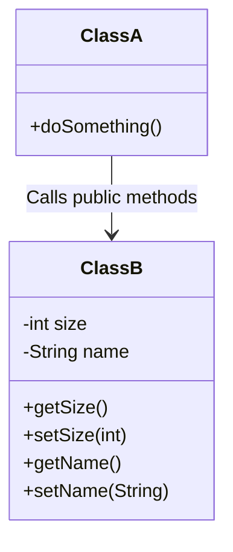
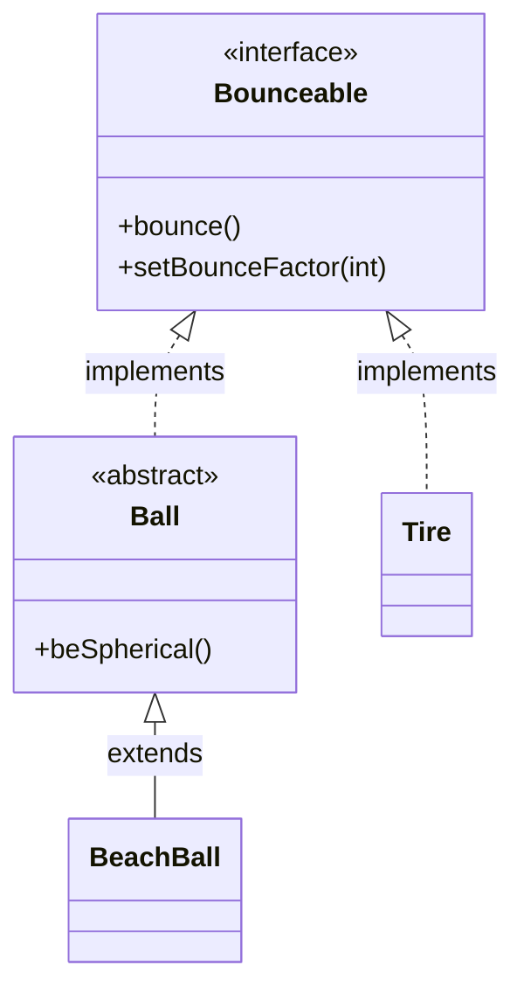
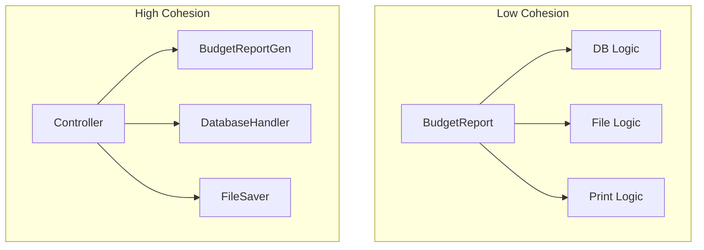

# OOP Recap (SCJP Chapter 2)


## 1. Encapsulation
**Concept:** Protecting data by hiding implementation details. Variables should be `private` and accessed via `public` getters and setters.

**Benefits:**
- Control over data integrity.
- Flexibility to change implementation without breaking external code.



> [!EXAMPLE] Code
> **Class A** cannot access `size` directly. It must use methods.
> ```java
> ClassB b = new ClassB();
> b.setSize(34);        // Correct
> // b.size = 34;       // Compilation Error: size has private access
> ```

---

## 2. Inheritance
**Keywords:** `extends`
**Primary Reasons for use:**
1. **Code Reuse:** Generic code belongs in the parent; specific code in the child.
2. **Polymorphism:** Treating different objects as a generic type.

### Example Hierarchy
```java
// Parent Class
class GameShape {
    public void displayShape() {
        System.out.println("displaying shape");
    }
}

// Child Class
class PlayerPiece extends GameShape {
    public void movePiece() {
        System.out.println("moving game piece");
    }
}

// Usage
PlayerPiece shape = new PlayerPiece();
shape.displayShape(); // Inherited method
shape.movePiece();    // Specific method
```

> [!TIP] Polymorphic Arguments
> You can pass a subclass (e.g., `PlayerPiece` or `TilePiece`) to a method expecting a parent class (`GameShape`).
> ```java
> public void doShapes(GameShape shape) {
>     shape.displayShape();
> }
> ```

---

## 3. Composition
**Concept:** The "Has-A" relationship. Instead of extending a class to get behavior, you hold a reference to an object that has that behavior.

**Delegation:** The main class "delegates" the work to the composed object.

```java
public class Horse extends Animal {
    // Composition: Horse HAS-A Halter
    private Halter myHalter = new Halter(); 
    
    public void tie(LeadRope rope) {
        // Delegation: Forwarding the request to the Halter object
        myHalter.tie(rope); 
    }
}
```

---

## 4. Polymorphism

### A. Overriding (Runtime Polymorphism)
Occurs when a subclass provides a specific implementation of a method already defined in its parent class.

*   **Rule:** The method signature must match exactly.
*   **Behavior:** The method invoked is determined by the **actual object type** at runtime, not the reference type.

```java
Animal a = new Horse(); // Animal reference, Horse object
a.eat(); 
// Output: "Horse eating hay..." (The overridden version)
```

> [!WARNING] The Private Method Trap
> You cannot override a `private` method. If you define a method in a child class with the same name as a private parent method, it is a **new method**, not an override.
>
> ```java
> Animal b = new Horse();
> // If eat() was private in Animal, b.eat() would likely cause
> // a compile error (not visible) or runtime meltdown depending on context.
> ```

### B. Overloading (Compile Time Polymorphism)
Occurs when methods have the same name but **different argument lists**.

*   **Rule:** Arguments must vary (type, order, or count).
*   **Behavior:** The method invoked is determined by the **reference type** at compile time.

> [!DANGER] Overloading Trap
> The compiler decides which overloaded method to call based on the **reference variable**, not the object holding it.
>
> ```java
> UseAnimals ua = new UseAnimals();
> Animal animalRefToHorse = new Horse(); // Reference is Animal
> 
> // Methods:
> // doStuff(Animal a)
> // doStuff(Horse h)
> 
> ua.doStuff(animalRefToHorse); 
> // Output: "In the Animal version"
> // Why? Because the reference type is Animal.
> ```

### Comparison Table

| Feature | Overloading | Overriding |
| :--- | :--- | :--- |
| **Occurrence** | Compile Time | Runtime |
| **Signature** | Name same, args different | Name & args identical |
| **Relationship** | Same class or subclass | Parent <-> Child |
| **Behavior** | Reference type decides | Object type decides |

---

## 5. Abstraction & Interfaces
*   **Abstract Class:** Can have mixed code (implemented and abstract). Cannot be instantiated.
*   **Interface:** Pure contract. Classes `implement` behaviors.

**Visualizing the Relationship:**

*Note: `BeachBall` must implement methods from `Bounceable` because its parent `Ball` did not implement them.*

---

## 6. Constructors
**Purpose:** Initialize objects.

1.  **No-Arg Constructor:** `Foo() {}`
2.  **Parameterized Constructor:** `Foo(String s) {}`

> [!NOTE] Compiler Rule
> If you **do not** write any constructor, the compiler creates a default no-arg constructor.
> If you **do** write a constructor (even one with arguments), the compiler **does not** create the default one.
>
> ```java
> class Foo {
>    Foo(String name) { ... }
> }
> Foo f = new Foo(); // COMPILER ERROR! No matching constructor.
> ```

---

## 7. Static Variables & Methods
**Concept:** Belongs to the class, not an instance.

*   **Variables:** Shared among all instances of the class (e.g., `frogCount`).
*   **Methods:** Can be called without creating an object (`Frog.doMore()`).

**Rules:**
1.  Static methods **cannot** access non-static (instance) variables or methods directly.
2.  **Redefinition (Hiding):** You cannot "override" a static method. If you define a static method in a child with the same signature, the **child's version hides the parent's version**.
    *   **Binding:** Unlike instance methods (which use late/runtime binding), static methods use **early/static binding**.
    *   **Decision:** The version executed depends on the **reference type** at compile time, not the actual object type at runtime.

> [!EXAMPLE] Static Hiding in Action
> If `doStuff()` is static:
> ```java
> Animal[] a = {new Animal(), new Dog(), new Animal()};
> for(int x=0; x < a.length; x++) {
>     // Reference type is Animal, so Animal.doStuff() is called 
>     // even if the actual object is a Dog.
>     a[x].doStuff(); 
> }
> ```
> *To call the Dog version, you would need a `Dog` reference or call it via `Dog.doStuff()`.*

---

## 8. Code Quality Guidelines

### Coupling (Aim for Loose)
*   **Tight Coupling (Bad):** Classes are heavily dependent on each other. If one changes, the other breaks.
    *   *Example:* Accessing a specific class implementation directly rather than an interface or doing logic inside arguments.
*   **Loose Coupling (Good):** Dependencies are minimized.

### Cohesion (Aim for High)
*   **Low Cohesion (Bad):** A class does too many unrelated things.
    *   *Example:* `BudgetReport` class connecting to DB, generating report, saving to file, and printing.
*   **High Cohesion (Good):** A class does one thing well (Single Responsibility Principle).
    *   *Example:* Separate classes for `ConnectToRDBMS`, `FileSaver`, `PrintStuff`.

