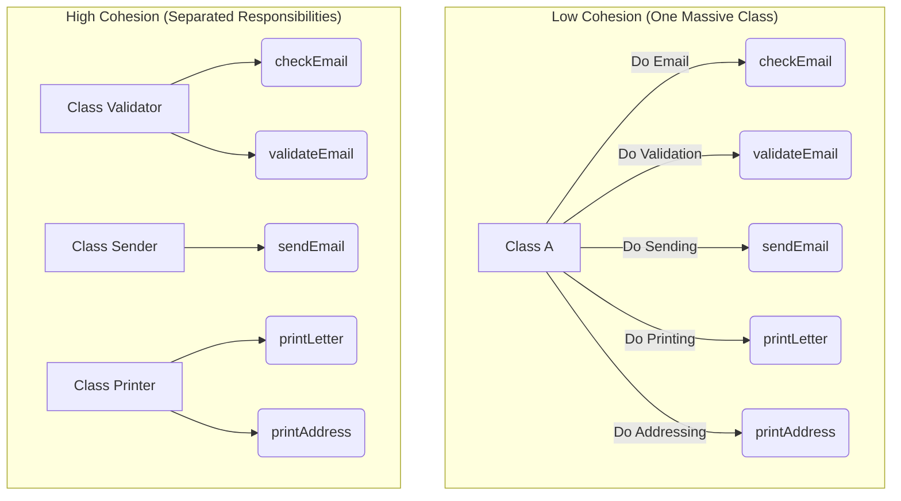
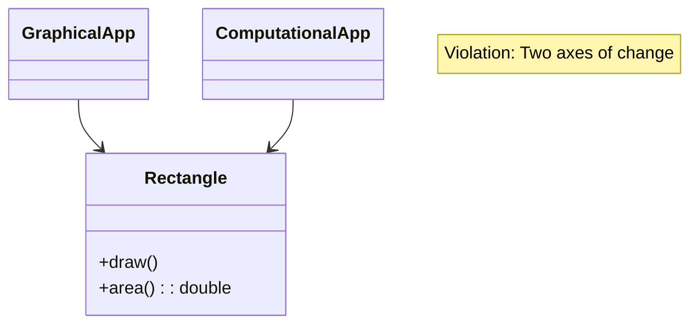
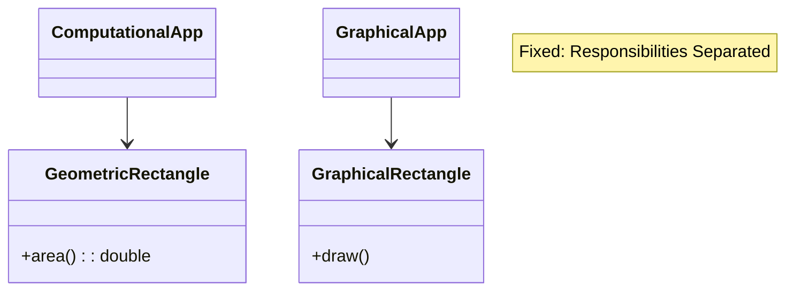
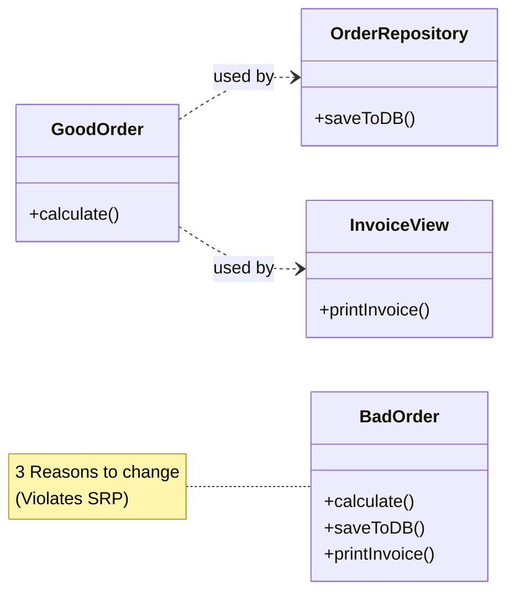

---
tags:
  - software-engineering/principles
  - solid
  - clean-code
  - architecture
  - java
  - oop
  - design-principles
aliases:
  - SRP
  - Separation of Concerns
course: SWE 4301 - Object Oriented Concepts II
topic: Single Responsibility Principle (SRP)
lecture: 8
date: 2025-12-05
instructor: Maliha Noushin Raida
---

---

# Lecture 8: Single Responsibility Principle (SRP)

## 1. Cohesion

> [!INFO] Definition
> **Cohesion** refers to the degree to which the elements inside a module belong together. 
> *   It measures the strength of the relationship between methods/data and the unifying purpose of the class.
> *   It represents the clarity of the responsibilities of a module.

### Relationship between Cohesion and Design
*   **High Cohesion:** The module performs **one task** and has a clear purpose. This indicates **good** OO design.
*   **Low Cohesion:** The module encapsulates more than one purpose or has an unclear purpose.
*   **Coupling vs. Cohesion:** High cohesion usually correlates with loose coupling (and vice versa).

**Cohesion is increased if:**
1.  Functionalities embedded in a class have much in common.
2.  Methods carry out a small number of related activities.

### Visualizing Cohesion



### Advantages of High Cohesion
*   **Reduced Module Complexity:** Simpler modules with fewer operations.
*   **Increased System Maintainability:** Logical domain changes affect fewer modules.
*   **Increased Module Reusability:** Developers can easily find specific cohesive operations.

---

## 2. SRP: Single Responsibility Principle

> [!quote] The Golden Rule
> **"A class should have only one reason to change."**

Every module, class, interface, or method should have **one job**.

### Why separate responsibilities?
*   Each responsibility is an **axis of change**.
*   If a class has multiple responsibilities, they become **coupled**.
*   Changes to one responsibility might break the others (Fragile Design).

### Example 1: The Rectangle Class (SRP Violation)
A `Rectangle` class has two methods: `draw()` and `area()`.
1.  **Computational Geometry App:** Uses `area()`. Doesn't care about drawing.
2.  **Graphical App:** Uses `draw()`.

**Problem:** If the Graphical App requires a change to `Rectangle`, it might force a recompile/deployment of the Computational App, even though the math didn't change.



**Solution:** Separate the responsibilities.


### Example 2: The Modem Interface
Consider a modem interface:
*   `dial(pno)` / `hangup()` -> **Connection Management**
*   `send(char)` / `recv()` -> **Data Communication**

> [!question] Should these be separated?
> **It depends.** 
> *   **Yes:** If the application changes in ways that affect connection signatures differently than data signatures (avoids **Rigidity**).
> *   **No:** If the application never changes in a way that separates these functions. Separating them unnecessarily leads to **Needless Complexity**.

---

## 3. Reasons to Follow SRP

| Reason | Impact |
| :--- | :--- |
| **Manageable Project** | "Cleaner brain." You only have to think about one responsibility at a time. |
| **Maintenance & Scalability** | Modifying one behavior is less likely to break unrelated behaviors. |
| **Testability** | Writing unit tests is easier because the class has fewer variables and paths to test. |
| **Reduced Coupling** | Methods do not depend on unrelated methods within the same class. |
| **Code Extension** | Easier to combine classes using Dependency Injection for modular code. |

---

## 4. How to Apply SRP

1.  **Identify Responsibilities:** Analyze methods/properties to see what the class is responsible for.
2.  **Separate into Classes:** Create new classes for each identified responsibility.
3.  **Delegate:** The original class (if it stays) delegates work to the new classes.
4.  **Review:** Ensure the resulting classes truly have only one responsibility.

---

## 5. Code Example: Refactoring a Car

### ❌ Before: SRP Violation
The `Car` class handles driving logic AND fuel management logic.

```java
public class Car {
    private double fuelLevel;

    public Car(double fuelLevel) {
        this.fuelLevel = fuelLevel;
    }

    public void drive(double distance) {
        if (this.fuelLevel >= distance) {
            this.fuelLevel -= distance;
            System.out.printf("Driving %.2f miles. Fuel level: %.2f%n", distance, this.fuelLevel);
        } else {
            System.out.println("Not enough fuel");
        }
    }

    public void fillGasTank(double amount) {
        this.fuelLevel += amount;
        System.out.printf("Adding %.2f gallons. Fuel level: %.2f%n", amount, this.fuelLevel);
    }
}
```

### ✅ After: Applying SRP
We separate the fuel logic into a `FuelTank` class. The `Car` is now only responsible for driving logic.

**Class 1: FuelTank**
```java
public class FuelTank {
    private double fuelLevel;

    public FuelTank(double fuelLevel) {
        this.fuelLevel = fuelLevel;
    }

    public boolean hasEnoughFuel(double distance) {
        return this.fuelLevel >= distance;
    }

    public void consumeFuel(double distance) {
        this.fuelLevel -= distance;
    }

    public double getFuelLevel() {
        return this.fuelLevel;
    }
}
```

**Class 2: Car**
```java
public class Car {
    private FuelTank fuelTank;

    public Car(FuelTank fuelTank) {
        this.fuelTank = fuelTank;
    }

    public void drive(double distance) {
        if (this.fuelTank.hasEnoughFuel(distance)) {
            this.fuelTank.consumeFuel(distance);
            System.out.printf("Driving %.2f miles. Fuel level: %.2f%n", 
                distance, this.fuelTank.getFuelLevel());
        } else {
            System.out.println("Not enough fuel");
        }
    }
}
```

### ✅ Improved Testability
Because `FuelTank` is separate, we can unit test the logic easily without instantiating a whole Car.

```java
import org.junit.jupiter.api.Test;
import static org.junit.jupiter.api.Assertions.*;

public class FuelTankTest {
    private FuelTank fuelTank;

    @Test
    void testInitialFuelLevel() {
        fuelTank = new FuelTank(50.0);
        assertEquals(50.0, fuelTank.getFuelLevel(), 0.001);
    }

    @Test
    void testHasEnoughFuelWhenInsufficient() {
        fuelTank = new FuelTank(50.0);
        assertFalse(fuelTank.hasEnoughFuel(70.0));
    }
    
    // ... other tests
}
```


> [!abstract] Summary?
> In Short 👇


# Single Responsibility Principle (SRP)

> [!quote] Definition
> **"A class should have one, and only one, reason to change."**
> — *Robert C. Martin (Uncle Bob)*

The **Single Responsibility Principle** is the **"S"** in [[1. SOLID]] design principles. It states that a module, class, or function should be responsible to one, and only one, actor (stakeholder).

## 🧠 Core Concept
Many developers mistake SRP for "doing only one thing." While related, SRP is specifically about **people and change**. 

If a class handles *Business Logic* (requested by the Product Owner) and *Database Persistence* (requested by the DBA/Ops), it has **two reasons to change**.
- **High Cohesion:** Things that change together stay together.
- **Low Coupling:** Things that change for different reasons should be separated.

---

## 🚫 The Violation (Anti-Pattern)
Here, the `Order` class handles calculation (Business rule) and printing (Presentation rule).

```typescript
class Order {
  lineItems: any[];

  // Reason to change: Marketing changes the tax calculation logic
  calculateTotalSum() {
    // ... logic ...
  }

  // Reason to change: Legal wants a different footer on the invoice PDF
  printInvoice() {
    // ... printing logic ...
  }
}
```

> [!failure] Problems
> 1. If we change the print format, we might accidentally break the calculation logic.
> 2. The class depends on both Business Logic libraries and UI/Printing libraries.
> 3. Difficult to test calculation without mocking the printing system.

---

## ✅ The Solution (Refactored)
We separate the concerns into different classes. The `Order` class is now a plain data object or handles only domain rules, while printing is delegated.

```typescript
// Responsibility: Domain / Business Rules
class Order {
  lineItems: any[];

  calculateTotalSum() {
    // ... logic ...
  }
}

// Responsibility: Presentation / Formatting
class InvoicePrinter {
  print(order: Order) {
    // ... printing logic ...
  }
}

// Responsibility: Persistence
class OrderRepository {
    save(order: Order) {
        // ... database logic ...
    }
}
```

### 📊 Visual Representation



---

## 🚩 Signs You Are Violating SRP
1. **The God Object:** A class named `Manager`, `Util`, or `Controller` that is thousands of lines long.
2. **Too Many Imports:** If your class imports UI libraries, SQL drivers, and Math parsers, it's doing too much.
3. **Generic Names:** If you can't name the class specifically (e.g., `UserManager` vs `UserAuthenticator`), it might have too many responsibilities.
4. **"And" in method descriptions:** If a method "Calculates pay **and** updates the database," it breaks SRP.

## 🔗 Related Notes
- [[Open-Closed Principle]] (The 'O' in SOLID)
- [[Separation of Concerns]]
- [[Coupling and Cohesion]]
- [[Don't Repeat Yourself (DRY)]]

---
## 📚 References
- *Clean Architecture* by Robert C. Martin
- [Refactoring.guru - SRP](https://refactoring.guru/design-patterns/principles)


