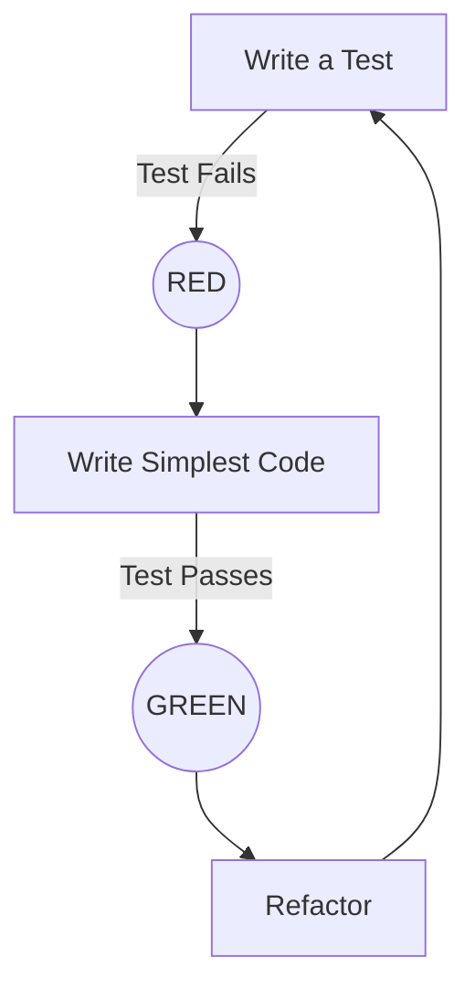

# Lecture 2: Introduction to Test Driven Development (TDD)

## 1. What is TDD?
**Test Driven Development (TDD)** is a framework for writing "clean, shamelessly green code."
*   **Readable Code:** Code that correctly reflects the problem it is solving.
*   **Concept:** Writing code is like drawing a picture; TDD ensures that picture is correct from the start.

> [!quote] History
> A generation ago, Extreme Programming (XP) practitioners introduced "Test First Development." Today, automated tests are the norm.

### The "Table" Metaphor
1.  **Expectation:** Table needs to be 4ft diameter. -> **Fail** (No table).
2.  **Action:** Cut wood 4ft diameter. -> **Pass**.
3.  **Expectation:** Table needs to be 3ft high. -> **Fail** ( Sits on ground).
4.  **Action:** Add a leg. -> **Pass**.
5.  **Expectation:** Hold 20lb object. -> **Fail** (Falls over with 1 leg).
6.  **Action:** Move leg, add two more (tripod). -> **Pass**.

---

## 2. The TDD Cycle (Red-Green-Refactor)

In TDD, you repeatedly decide which test to write next, how to pass it, and when to refactor.



1.  **Write a test:** The code doesn't exist yet, so the test **fails** (Red).
2.  **Make it run:** Write just enough code to make the test **pass** (Green).
3.  **Make it right:** **Refactor** the code into better shape while keeping the test green.

### The "Two Hats" Metaphor
When doing TDD, you toggle between two roles:
*   🎩 **Writing Tests Hat:** Focus on the big picture and overall plan. The code is incomplete.
*   🎩 **Writing Code Hat:** Pretend to know nothing other than the requirement of the specific failing test.

---

## 3. Unit Testing Basics

**Definition:** Automated tests run every time code changes to ensure new code doesn't break existing functionality. They validate the smallest possible unit of code (function/method) in **isolation**.

### Anatomy of a Test
Every test contains three parts:
1.  **Setup:** Create the specific environment required.
2.  **Do:** Perform the action to be tested.
3.  **Verify:** Confirm the result is as expected.

---

## 4. Practical Walkthrough: `StringSwap`

**Requirement:** Create a function that swaps the last two characters of a string.
*   `"AB"` -> `"BA"`
*   `"ABCD"` -> `"ABDC"`
*   `"SELENIUM"` -> `"SELENIMU"`
*   `"A"` -> `"A"`
*   `""` -> `""`

### Iteration 1: The First Test
**Goal:** Swap 2 characters ("AB" -> "BA").

> [!failure] RED: Compilation Error
> We write the test before the class exists.

```java
 @Test
public void stringSwap2charsOnly() {
    StringSwapHelper help = new StringSwapHelper();
    // Expected: "BA", Input: "AB"
    Assert.assertEquals("BA", help.swaplasttwochars("AB"));
}
```

### Iteration 2: Make it Compile
Create the class and method stub.

> [!failure] RED: Logic Error
> Method returns `null`, test expects "BA".

```java
public class StringSwapHelper {
    public String swaplasttwochars(String string) {
        return null; // TODO: Auto-generated stub
    }
}
```

### Iteration 3: Make it Green (Hardcoded/Simple)
Add logic specifically for the 2-char case.

> [!success] GREEN
> The test passes.

```java
public String swaplasttwochars(String string) {
    char firstChar = string.charAt(0);
    char secChar = string.charAt(1);
    return "" + secChar + firstChar; 
}
```

### Iteration 4: New Condition (Full String)
Add a test for `"ABCD"` -> `"ABDC"`.

> [!failure] RED
> The previous logic only handled the first 2 indices.

**Refactor Logic:**
```java
public String swaplasttwochars(String string) {
    int length = string.length();
    String strExceptLast2Chars = string.substring(0, length - 2);
    char secondLastChar = string.charAt(length - 2);
    char lastChar = string.charAt(length - 1);
    return strExceptLast2Chars + lastChar + secondLastChar;
}
```

### Iteration 5: Edge Cases (Single/Empty String)
Test for `"A"` and `""`.
*   **Result:** `StringIndexOutOfBoundsException` (because length - 2 is invalid).

**Final Refactor:**
```java
public String swaplasttwochars(String string) {
    int length = string.length();
    
    // Handle edge cases
    if (length <= 1) {
        return string;
    }
    
    String strExceptLast2Chars = string.substring(0, length - 2);
    char secondLastChar = string.charAt(length - 2);
    char lastChar = string.charAt(length - 1);
    return strExceptLast2Chars + lastChar + secondLastChar;
}
```

---

## 5. Green Bar Patterns (Kent Beck)

Strategies to make tests pass:

| Pattern | Description |
| :--- | :--- |
| **Fake It ("Til You Make It")** | Return a constant to pass the test, then gradually replace with variables. |
| **Obvious Implementation** | If the solution is simple, type the real implementation immediately. |
| **Triangulate** | Write multiple tests at once (driving abstraction). Use specific examples to force the creation of a generic abstraction. |

---

## 6. Best Practices for TDD

*   **Fail First:** Write small tests that fail to confirm the test is actually testing the functionality.
*   **Independence:** Each test should run in isolation. No dependencies between tests.
*   **Regular Execution:** Run tests before coding, after coding, and after refactoring.
*   **Scenario Coverage:** Test both **Positive** (happy path) and **Negative** (edge cases/errors) scenarios.

> [!abstract] Conclusion
> "TDD is a discipline for programmers like double-entry bookkeeping is for accountants or sterile procedure is for surgeons."
> — **Robert C. Martin**