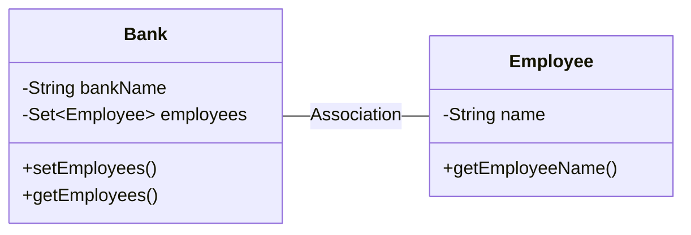
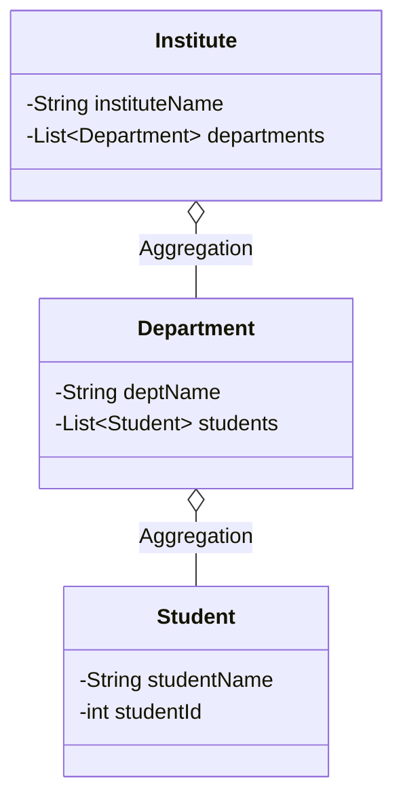
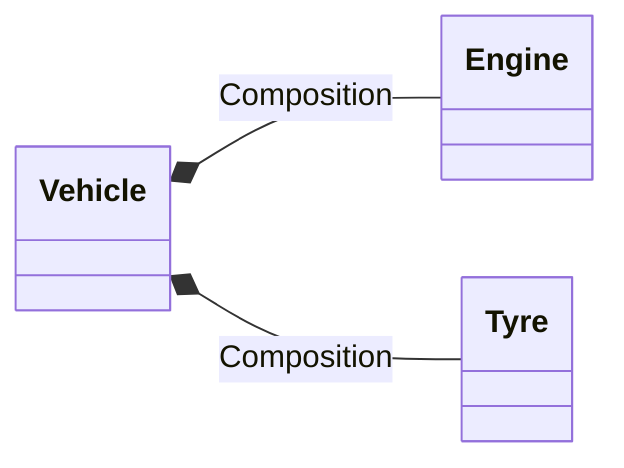
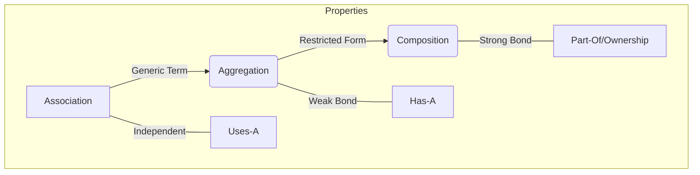

## 1. Association
**Definition:**
Association is a generic term representing a relationship between two independent classes. It establishes that one object "uses" or interacts with another.

> [!INFO] Key Characteristics
> *   **Nature:** Represents a "Uses-A" relationship.
> *   **Independence:** The classes are independent.
> *   **Ownership:** No concept of ownership required.
> *   **Multiplicity:** Can be One-to-One, One-to-Many, or Many-to-Many.

### Types of Association
1.  **Unidirectional:** One class is aware of the other, but the reverse is not true.
    *   *Example:* `Student` has a `LibraryCard`. The card doesn't need to know about the student.
2.  **Bidirectional:** Both classes are aware of each other and interact.
    *   *Example:* `Teacher` assigned to `Classroom`, and `Classroom` knows its `Teacher`.

### Visual Representation


### Code Example
**Scenario:** A Bank has multiple Employees.

```java
import java.util.*;

// Class 1: Bank
class Bank {
    private String bankName;
    private Set<Employee> employees;

    public Bank(String bankName) {
        this.bankName = bankName;
    }

    public String getBankName() {
        return this.bankName;
    }

    public void setEmployees(Set<Employee> employees) {
        this.employees = employees;
    }

    public Set<Employee> getEmployees() {
        return this.employees;
    }
}

// Class 2: Employee
class Employee {
    private String name;

    public Employee(String name) {
        this.name = name;
    }

    public String getEmployeeName() {
        return this.name;
    }
}

// Driver Class
class AssociationExample {
    public static void main(String[] args) {
        // Creating Employee objects
        Employee emp1 = new Employee("Ridhi");
        Employee emp2 = new Employee("Vijay");

        // Adding employees to a set
        Set<Employee> employees = new HashSet<>();
        employees.add(emp1);
        employees.add(emp2);

        // Creating Bank object
        Bank bank = new Bank("ICICI");
        
        // Establishing Association
        bank.setEmployees(employees);

        // Displaying output
        for (Employee emp : bank.getEmployees()) {
            System.out.println(emp.getEmployeeName() + " belongs to bank " + bank.getBankName());
        }
    }
}
```

---

## 2. Aggregation
**Definition:**
Aggregation is a specific, **special form of Association**. It represents a "Has-A" relationship where the "whole" contains the "parts," but the parts generally exist independently.

> [!NOTE] Key Characteristics (Weak Association)
> *   **Nature:** Represents a "Has-A" relationship.
> *   **Direction:** Unidirectional (One-way).
> *   **Lifecycle:** **Independent.** Ending the "Whole" entity does *not* destroy the "Part" entity.
> *   *Example:* A `Department` has `Students`. If the Department closes, the Students still exist.

### Visual Representation
In UML, Aggregation is represented by an **empty (unfilled) diamond** pointing to the container.



### Code Example
**Scenario:** Institute -> Departments -> Students. (Students are created outside and passed in).

```java
import java.util.*;

// Class 1: Student
class Student {
    private String studentName;
    private int studentId;

    public Student(String studentName, int studentId) {
        this.studentName = studentName;
        this.studentId = studentId;
    }
}

// Class 2: Department (Has a list of Students)
class Department {
    private String deptName;
    private List<Student> students;

    public Department(String deptName, List<Student> students) {
        this.deptName = deptName;
        this.students = students;
    }
    
    public List<Student> getStudents() {
        return students;
    }
}

// Class 3: Institute (Has a list of Departments)
class Institute {
    private String instituteName;
    private List<Department> departments;

    public Institute(String instituteName, List<Department> departments) {
        this.instituteName = instituteName;
        this.departments = departments;
    }

    // Method to count total students in institute
    public int getTotalStudentsInInstitute() {
        int noOfStudents = 0;
        List<Student> students;
        if (departments != null) {
            for (Department dept : departments) {
                students = dept.getStudents();
                for (Student s : students) {
                    noOfStudents++;
                }
            }
        }
        return noOfStudents;
    }
}

// Driver Class
class AggregationExample {
    public static void main(String[] args) {
        // 1. Create Independent Students (Lifecycle is independent)
        Student s1 = new Student("Parul", 1);
        Student s2 = new Student("Sachin", 2);
        Student s3 = new Student("Priya", 1);
        Student s4 = new Student("Rahul", 2);

        // 2. Aggregate students into lists
        List<Student> cse_students = new ArrayList<>();
        cse_students.add(s1);
        cse_students.add(s2);

        List<Student> ee_students = new ArrayList<>();
        ee_students.add(s3);
        ee_students.add(s4);

        // 3. Create Departments containing the lists
        Department CSE = new Department("CSE", cse_students);
        Department EE = new Department("EE", ee_students);

        // 4. Create Institute containing Departments
        List<Department> departments = new ArrayList<>();
        departments.add(CSE);
        departments.add(EE);

        Institute institute = new Institute("BITS", departments);

        System.out.print("Total students in institute: ");
        System.out.print(institute.getTotalStudentsInInstitute());
    }
}
```

---

## 3. Composition
**Definition:**
Composition is a **stronger form of Aggregation**. It implies strict ownership and lifecycle dependence.

> [!WARNING] Key Characteristics (Strong Association)
> *   **Nature:** Represents a "Part-of" relationship.
> *   **Lifecycle:** **Dependent.** If the "Whole" is destroyed, the "Parts" are also destroyed. The part cannot exist without the whole.
> *   *Example:* A `House` and `Rooms`. A room cannot conceptually exist without the house it belongs to.

### Visual Representation
In UML, Composition is represented by a **filled (solid) diamond** pointing to the container.



### Code Example
**Scenario:** A House creates and manages its Rooms.

```java
import java.util.*;

// Class 1: Room
class Room {
    private String roomName;

    public Room(String roomName) {
        this.roomName = roomName;
    }
    
    public String getRoomName() {
        return roomName;
    }
}

// Class 2: House (Owns the Rooms)
class House {
    private String houseName;
    private List<Room> rooms;

    public House(String houseName) {
        this.houseName = houseName;
        // The list is initialized inside the House
        this.rooms = new ArrayList<>();
    }

    public void addRoom(Room room) {
        rooms.add(room);
    }

    public List<Room> getRooms() {
        return new ArrayList<>(rooms); // Return copy to protect encapsulation
    }
    
    public int getTotalRooms() {
        return rooms.size();
    }
}

// Driver Class
class CompositionExample {
    public static void main(String[] args) {
        // Creating the Whole
        House house = new House("Dream House");

        // Adding parts to the whole
        house.addRoom(new Room("Living Room"));
        house.addRoom(new Room("Bedroom"));
        house.addRoom(new Room("Kitchen"));
        house.addRoom(new Room("Bathroom"));

        System.out.println("Total Rooms: " + house.getTotalRooms());
        System.out.println("Room names: ");
        for (Room room : house.getRooms()) {
            System.out.println("- " + room.getRoomName());
        }
    }
}
```

---

## 4. Overall Comparison

The relationship is hierarchical. Composition is a specific type of Aggregation, and Aggregation is a specific type of Association.

### Hierarchy Diagram



### Comparison Table

| Feature | Association | Aggregation | Composition |
| :--- | :--- | :--- | :--- |
| **Relationship** | "Uses-A" | "Has-A" | "Part-Of" |
| **Bond Strength** | Weakest | Weak | Strongest |
| **Dependency** | Independent | Independent Lifecycle | Dependent Lifecycle |
| **Example** | Teacher - Student | Library - Books | House - Rooms |
| **UML Symbol** | Solid Line `—` | Empty Diamond `◇` | Filled Diamond `◆` |

***
**Reference:** [GeeksForGeeks - Association, Composition, Aggregation in Java](https://www.geeksforgeeks.org/java/association-composition-aggregation-java/)