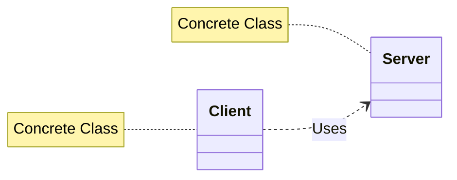
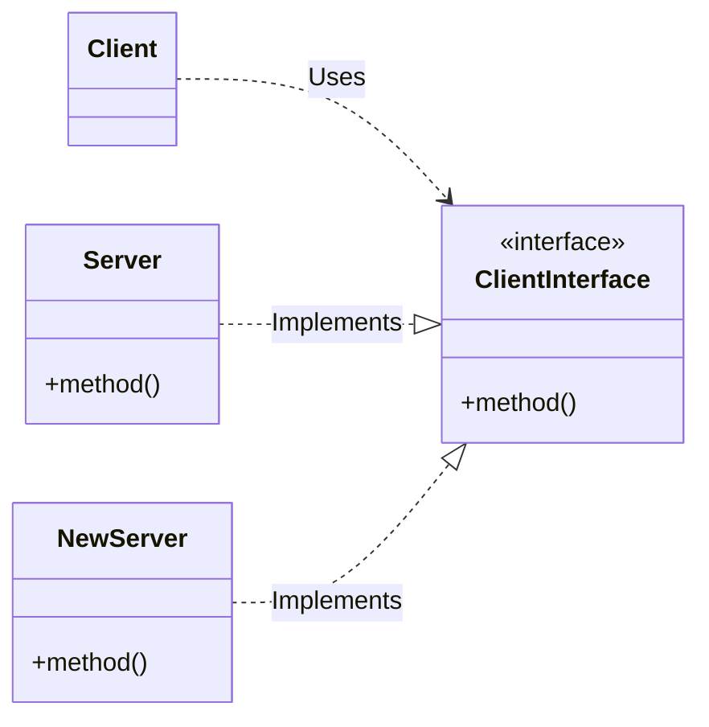

# SOLID Design Principles

**SOLID** is a set of five design principles intended to make software designs more understandable, flexible, and maintainable.

### Why are these principles important?
1.  **Order:** They keep the development team aligned.
2.  **Proven:** They are well-established industry standards.
3.  **Consistency:** Following them leads to a consistent codebase.

### The 5 Fundamental Principles
*   **S** - [[Single Responsibility Principle]]
*   **O** - Open/Closed Principle (OCP)
*   **L** - Liskov Substitution Principle (LSP)
*   **I** - Interface Segregation Principle (ISP)
*   **D** - Dependency Inversion Principle (DIP)

---

# Open-Closed Principle (OCP)

> **Definition:** "Software entities (classes, modules, functions, etc.) should be **open for extension**, but **closed for modification**." — *Bertrand Meyer (1988)*

### The Concept
*   **Open for Extension:** The behavior of the module can be extended. We can make the module behave in new ways as requirements change.
*   **Closed for Modification:** The source code of the module is inviolate. No one is allowed to make source code changes to it (except for bug fixes).

### The Motivation
When a single change results in a cascade of changes to dependent modules, the design is considered "bad" (fragile, rigid, unpredictable). OCP solves this by ensuring that when requirements change, you **add new code** rather than changing old code that already works.

---

# Achieving OCP: Abstraction

How can something be fixed (closed) yet flexible (open)? **Abstraction is the key.**

### 1. The Violation (Tight Coupling)
In a design violating OCP, the `Client` depends directly on a concrete `Server`. If the `Server` changes, the `Client` must change.



### 2. The Solution (Abstraction)
By introducing an interface (abstraction), the `Client` depends on the interface, not the concrete implementation.
*   The `Client` is **closed for modification** (it relies on a fixed interface).
*   The system is **open for extension** (we can create new implementations of the interface without touching the Client).



---

# Code Example: Employee Salary Calculator

## ❌ Violating OCP
This implementation violates OCP because every time a new `EmployeeType` is added, we must modify the `Employee` class to add `else if` logic to both `CalculateSalary` and `CalculateBonus`.

```java
enum EmployeeType {
    Permanent, Contractual, PartTime
}

class Employee {
    private readonly EmployeeType type;
    private int transportAllowance;

    public Employee(EmployeeType type, int transportAllowance) {
        this.type = type;
        this.transportAllowance = transportAllowance;
    }

    public int CalculateSalary(int basic, int phr, int hw) {
        // VIOLATION: Requires modification for every new type
        if (type == EmployeeType.Permanent) {
            return basic + basic / 4 + transportAllowance;
        } else if (type == EmployeeType.Contractual) {
            return basic + transportAllowance + phr * hw;
        } else {
            return basic + phr * hw;
        }
    }

    public int CalculateBonus(int basic) {
        // VIOLATION: Logic repeated here
        if (type == EmployeeType.Permanent) {
            return basic / 2;
        } else if (type == EmployeeType.PartTime) {
            return 0;
        } else {
            return 5000;
        }
    }
}
```

## ✅ Adhering to OCP (Refactored)
We solve the violation using **Inheritance** and **Polymorphism**. The base `Employee` class is abstract. New employee types are added by creating new classes, not by modifying existing code.

### Base Abstraction
```java
abstract class Employee {
    protected int transportAllowance;

    public Employee(int transportAllowance) {
        this.transportAllowance = transportAllowance;
    }

    public abstract int calculateSalary(int basic, int phr, int hw);
    public abstract int calculateBonus(int basic);
}
```

### Concrete Extensions
```java
// Extension 1
class PermanentEmployee extends Employee {
    public PermanentEmployee(int transportAllowance) {
        super(transportAllowance);
    }

    @Override
    public int calculateSalary(int basic, int phr, int hw) {
        return basic + basic / 4 + transportAllowance;
    }

    @Override
    public int calculateBonus(int basic) {
        return basic / 2;
    }
}

// Extension 2
class ContractualEmployee extends Employee {
    public ContractualEmployee(int transportAllowance) {
        super(transportAllowance);
    }

    @Override
    public int calculateSalary(int basic, int phr, int hw) {
        return basic + transportAllowance + phr * hw;
    }

    @Override
    public int calculateBonus(int basic) {
        return 5000;
    }
}

// Extension 3
class PartTimeEmployee extends Employee {
    public PartTimeEmployee(int transportAllowance) {
        super(transportAllowance);
    }

    @Override
    public int calculateSalary(int basic, int phr, int hw) {
        return basic + phr * hw;
    }

    @Override
    public int calculateBonus(int basic) {
        return 0;
    }
}
```

### Usage (Polymorphism)
The client code (Main) does not need to know the internal details of how salaries are calculated.

```java
public class Main {
    public static void main(String[] args) {
        Employee permanent = new PermanentEmployee(3000);
        Employee contractual = new ContractualEmployee(2000);
        
        // Polymorphic calls
        System.out.println(permanent.calculateSalary(50000, 200, 160));
        System.out.println(contractual.calculateSalary(30000, 150, 100));
    }
}
```

---

# Strategic Closure
> "No matter how 'closed' a module is, there will always be some kind of change against which it is not closed."

Closure cannot be complete. It must be **strategic**.
1.  The designer must guess the most likely kinds of changes (based on experience/industry knowledge).
2.  Construct abstractions to protect against *those specific* probable changes.
