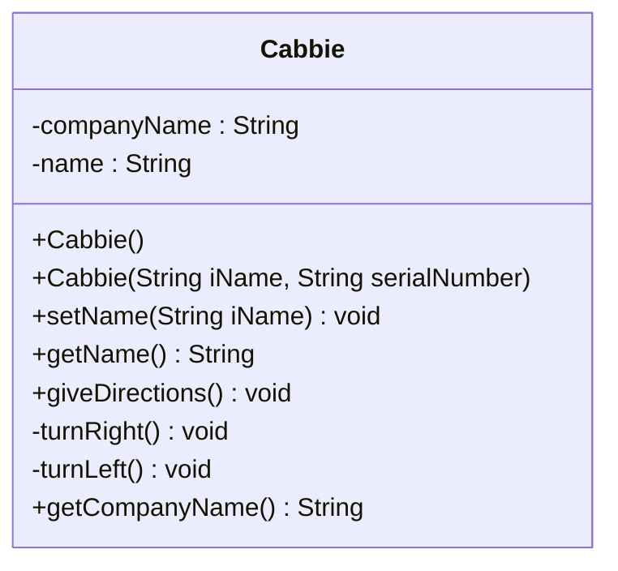
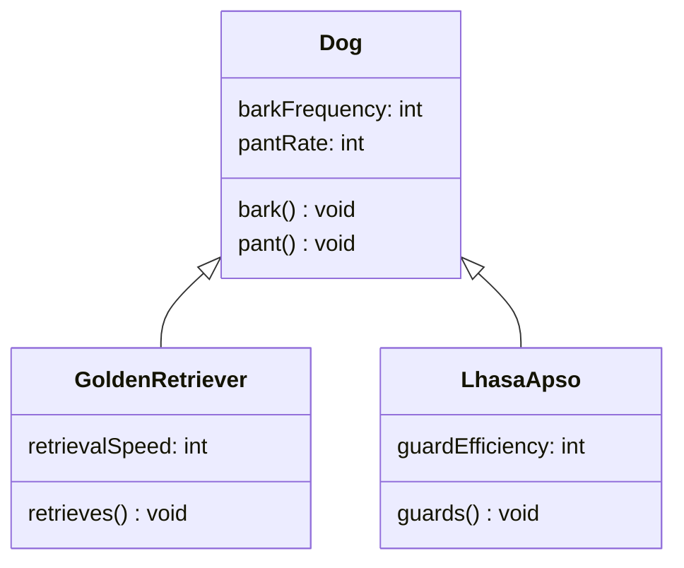
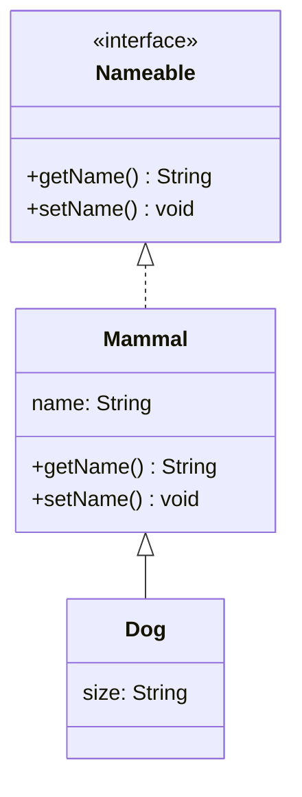
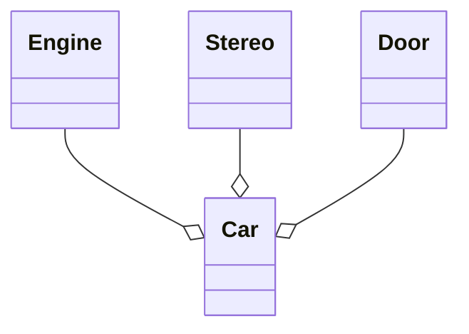
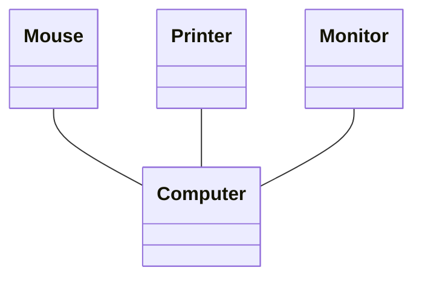
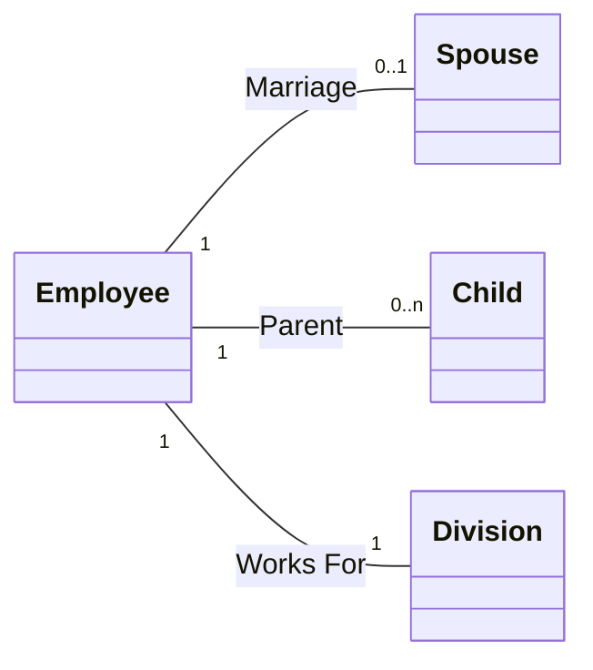

**Source:** *Chapter 10 - Creating Object Models with UML*
**Tags:** #UML #ObjectOrientedDesign #SoftwareEngineering #ClassDiagrams

---

## 1. Introduction to UML
> [!quote] Philosophy
> "Learning the fundamental OO concepts should come before learning any specific modeling tools."

*   **Goal:** This chapter focuses on **Object-Modeling** (specifically Class Diagrams). It avoids complex constructs like State Chart or Activity Diagrams to focus on fundamentals.
*   **Definition:** UML (Unified Modeling Language) is a "graphical language for visualizing, specifying, constructing and documenting the artifacts of a software-intensive system."
*   **Origin:** A synthesis of modeling languages by the "Three Amigos":
    *   Grady Booch
    *   James Rumbaugh
    *   Ivar Jacobson
*   **Warning:** Knowing UML notation $\neq$ Knowing Object-Oriented Analysis and Design (OOAD). UML is just the tool; OOAD is the skill (like reading an electrical diagram vs. understanding electricity).

---

## 2. The Class Diagram Structure
A class diagram is a rectangle divided into three horizontal sections:
1.  **Class Name**
2.  **Attributes** (Data)
3.  **Methods** (Behaviors/Constructors)

### Visual Example: The `Cabbie` Class
The following diagram represents the `Cabbie` class discussed in the text.



### Mapping Code to UML
The UML above corresponds directly to Java code.

> [!example] Java Code Snippet
> ```java
> public class Cabbie {
>     private static String companyName = "Blue Cab Company";
>     private String name;
>
>     public Cabbie() { ... }
>     
>     public void setName(String iName) {
>         name = iName;
>     }
>     
>     public String getName() {
>         return name;
>     }
> }
> ```

---

## 3. Anatomy of a Class Member

### Attributes
Format: `visibility attributeName : Type`
*   **Types:** Can be primitives (`int`, `float`) or Objects (`String`).
*   **Best Practice:** Attributes should almost always be **private** (`-`).

### Methods
Format: `visibility methodName(parameterList) : ReturnType`
*   **Parameters:** Separated by commas (e.g., `method(param1, param2)`).
*   **Return Type:** Placed after the colon.

### Access Designations (Visibility)
UML uses symbols to denote access modifiers:

| Symbol | Access Level | Description |
| :---: | :--- | :--- |
| **`+`** | **Public** | Any class can inspect or modify. |
| **`-`** | **Private** | Only methods within the same class can access. |
| *(None)* | **Default** | (Java) Package-private; (C#) Internal. |

> [!info] Language Specifics
> *   **Java:** Default is `protected` (package level).
> *   **.NET:** Distinguishes between `protected` (derived classes) and `internal` (same assembly).

---

## 4. Relationships

### A. Inheritance (Generalization)
*   **Concept:** "Is-a" relationship.
*   **Symbol:** Solid line with a **hollow arrowhead** pointing to the superclass.

**Example: The Dog Hierarchy**


### B. Interfaces
*   **Concept:** A contract of behavior. Special type of inheritance.
*   **Symbol:** **Dashed line** with a **hollow arrowhead**.

**Example: Implementing `Nameable`**


### C. Composition & Aggregation
Used when "Is-a" (Inheritance) is inappropriate. This is a "Has-a" relationship.

#### 1. Aggregation (Part of a Whole)
*   **Concept:** A class is logically built using other classes.
*   **Symbol:** Line with a **hollow diamond** at the container end.
*   **Example:** A Car has an Engine, Stereo, and Door.



#### 2. Association (Service Provider)
*   **Concept:** Client/Server relationship. Separate components interacting, or requesting a service.
*   **Symbol:** A **plain line** (no shapes on ends).
*   **Example:** A Computer interacts with a Mouse and Printer.



> [!note] Nuance: Aggregation vs Association
> Technically, a Monitor is "part of" a computer system (Aggregation), but it is a separate distinct component that interacts with the computer box (Association). However, the Motherboard is physically *inside* the computer, making it a stronger Aggregation.

---

## 5. Cardinality (Multiplicity)
Cardinality defines the range of objects corresponding to the class relationship.

| Notation | Meaning | Example |
| :---: | :--- | :--- |
| **`1`** | One and only one | A Computer has `1` Motherboard. |
| **`0...1`** | Zero or one | An Employee has `0...1` Spouse. |
| **`0...n`** | Zero to unlimited | An Employee has `0...n` Children. |
| **`1...n`** | At least one, unlimited max | An Employee has `1...n` Job Descriptions. |
| **`1...6`** | Specific Range | A Computer has `1...6` RAM slots. |

**Visualizing Cardinality:**



---

## 6. Conclusion
*   UML is a complex topic warranting its own books.
*   These notes cover the "Object-Modeling" subset (Class Diagrams) required for understanding fundamental OO design.
*   **Workflow:** Learn OO concepts $\to$ Learn UML $\to$ Use UML to visualize designs.

### References
*   *The UML Users Guide* (Booch, Jacobson, Rumbaugh)
*   *UML Distilled* (Martin Fowler)
*   *Practical Object-Oriented Development with UML and Java* (Lee & Tepfenhart)