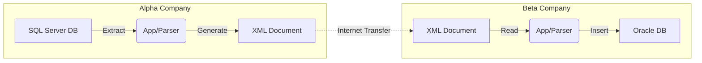

**Tags:** #XML #OOP #DataPortability #SoftwareArchitecture #Interoperability

## 1. Introduction: The Portability Equation
Object-Oriented (OO) technology has advanced not just in code portability, but in data portability.

*   **Code Portability:**
    *   **Java:** Uses bytecodes and the JVM to run on any platform.
    *   **.NET:** Uses assemblies to allow interoperability between languages (C#, VB.NET).
*   **Data Portability (The Missing Half):**
    *   Programs process data to create information.
    *   **XML (Extensible Markup Language)** provides the standard mechanism for defining and transporting data between potentially disparate systems.

---

## 2. The Business Problem: Incompatible Data
Historically, businesses struggle with diverse storage formats (e.g., Oracle vs. SQL Server).

### The Scenario
*   **Alpha Company:** Uses an **Oracle** database for Sales.
*   **Beta Company:** Uses a **SQL Server** database for Purchasing.
*   **Goal:** Electronic commerce (Alpha selling to Beta) without direct database connections.
*   **Solution:** Use XML as the intermediary "portable data" layer.

### XML Application Directions
Data moves in two primary directions within the enterprise and industry:

1.  **Vertical Applications (Vocabularies):**
    *   Data moves through specific industry groups.
    *   Specific industries create their own Markup Languages (standards).
    *   *Examples:*
        *   **FpML:** Financial Products Markup Language.
        *   **RecipeML:** For food, hotels, and publishing.
2.  **Horizontal Applications:**
    *   Broad applications specific to a function (like e-commerce) that span across industries (Retail, Transportation, etc.).

> [!INFO] Visualizing Data Movement
> **Figure 11.1 Representation:** Data flows horizontally across departments (Accounting, Management) and vertically through specific industries (Manufacturing, Transportation).

---

## 3. XML vs. HTML
Both are descendants of **SGML** (Standard Generalized Markup Language, standardized in the 1980s).

| Feature | HTML (Hypertext Markup Language) | XML (Extensible Markup Language) |
| :--- | :--- | :--- |
| **Primary Function** | **Present** and format data. | **Describe** and define data. |
| **Tags** | Predefined (e.g., `<body>`, `<font>`). | User-defined (e.g., `<supplier>`, `<price>`). |
| **Strictness** | Loose. Browsers "guess" if tags aren't closed. | Strict. Must be "Well-Formed." |
| **Ownership** | Open Standard. | Open Standard (W3C). |
| **Validation** | No inherent data verification. | Can be validated via DTD. |

### Advantages of XML
1.  **Well-Formed:** Strict syntax ensures reliability.
2.  **Validity:** Can use a DTD (Document Type Definition) to enforce rules.
3.  **Open Technology:** Embraced by Microsoft, IBM, Sun, etc.

---

## 4. Architecture: Sharing Data
To share data between Alpha and Beta companies, a "Parser" is used.

**The Workflow:**
1.  **Alpha Co:** Extracts data from SQL Server.
2.  **Alpha App:** Uses a parser/writer to convert data to **XML**.
3.  **Transport:** XML is sent over the Internet.
4.  **Beta Co:** Receives XML.
5.  **Beta App:** Uses a **Parser** to read XML and extract data.
6.  **Beta Co:** Inserts data into Oracle Database.

### Visual: Application-to-Application Data Transfer
(Based on Figure 11.2)



> **Definition: Parser**
> A program that reads a document, checks for syntax/grammar rules, and extracts specific information. Compilers also use parsers.

---

## 5. Validating XML: The DTD
XML documents can be checked for structural correctness using a **Document Type Definition (DTD)**.

> [!note] Document Validity
> An XML document that specifies a DTD is either valid or invalid based on the DTD. If a document does not specify a DTD, the XML document is not judged either valid or invalid. An XML document can specify a DTD internally or externally. Because external DTDs provide a very powerful mechanism, we will use an external DTD here. The DTD is where you define the tags that describe your data. When you create an XML document, you can only use tags that are predefined. All XML documents are checked for validity. The XML processor reads the DTD and determines whether the document is valid. If the document is not valid, a syntax error is produced.

*   **Well-Formed:** The XML follows basic syntax (tags nested correctly, root element exists).
*   **Valid:** The XML specifically conforms to the rules defined in a DTD.

### Data Specification Table
| Object Category | Fields / Elements |
| :--- | :--- |
| **Supplier** | name, address |
| **Name** | companyname |
| **Address** | street, city, state, zip |
| **Product** | type, price, count |

### Example: The Supplier DTD
We want to transfer a Supplier object containing a Name, Address, and Product info.

**The Data Structure (Tree):**
*   Supplier
    *   Name
        *   CompanyName
    *   Address
        *   Street, City, State, Zip
    *   Product
        *   Type, Price, Count

**Code: `supplier.dtd`**
```xml
<!-- DTD for supplier document -->
<!ELEMENT supplier ( name, address, product)>
<!ELEMENT name ( companyname)>
<!ELEMENT companyname ( #PCDATA)>
<!ELEMENT address ( street+, city, state, zip)>
<!ELEMENT street ( #PCDATA)>
<!ELEMENT city ( #PCDATA)>
<!ELEMENT state ( #PCDATA)>
<!ELEMENT zip ( #PCDATA)>
<!ELEMENT product ( type, price, count)>
<!ELEMENT type ( #PCDATA)>
<!ELEMENT price ( #PCDATA)>
<!ELEMENT count ( #PCDATA)>
```

> [!help] PCDATA
> PCDATA stands for Parsed Character Data and is simply standard character information parsed from the text file. Any numbers, such as integers, will need to be converted by the parser.

*   `#PCDATA`: Parsed Character Data (standard text/numbers).
*   `+`: Indicates the element can appear one or more times (used on `street` in the text example, though implied in the list).

---

## 6. The XML Document
The actual data file (`.xml`) must link to the DTD to be validated.

**Code: `beta.xml`**
```xml
<?xml version="1.0" standalone="no" ?>
<!DOCTYPE supplier SYSTEM "supplier.dtd">
<!-- The Beta Company -->
<supplier>
    <name>
        <companyname>The Beta Company</companyname>
    </name>
    <address>
        <street>12000 Ontario St</street>
        <city>Cleveland</city>
        <state>OH</state>
        <zip>24388</zip>
    </address>
    <product>
        <type>Vacuum Cleaner</type>
        <price>50.00</price>
        <count>20</count>
    </product>
</supplier>
```

### Abstraction in XML
*   **Abstract Tags:** Tags like `<address>` contain no data themselves; they only contain other tags.
*   **Concrete Tags:** Tags like `<street>` contain the actual data (PCDATA).

---

## 7. Tools and Error Handling

### XML Notepad
A tool (formerly from Microsoft) used to visualize XML structure and validate against DTDs.
*   **Visualizing:** Shows a tree view (Structure) and data view (Values).
*   **Validation:** If you remove a required tag (e.g., `<name>`) from the XML, XML Notepad throws a specific error:
    > *Element content is invalid according to the DTD/Schema. Expecting: address.*

### Browser Behavior
*   Browsers (like Internet Explorer) can display XML files.
*   **Crucial Difference:** Browsers generally check if a document is *well-formed*, but they may **not** strictly validate against the DTD by default. They will display an invalid file (missing tags) without error, whereas a validating parser (like XML Notepad) will stop the process.

---

## 8. Formatting XML with CSS
XML defines data, but offers no native presentation. To display it nicely to a user, **Cascading Style Sheets (CSS)** can be used.

### The Mechanism
Add a processing instruction to the top of the XML file:
```xml
<?xml-stylesheet href="supplier.css" type="text/css" ?>
```

### Example CSS (`supplier.css`)
This tells the browser how to render specific XML custom tags.

```css
companyname {
    font-family: Arial, sans-serif;
    font-size: 24pt;
    color: blue;
    display: block; /* Forces a new line */
}

street {
    font-family: "Times New Roman", serif;
    font-size: 12pt;
    color: red;
    display: block;
}

city {
    font-family: "Courier New", serif;
    font-size: 18pt;
    color: black;
    display: block;
}

zip {
    font-family: "Arial Black", sans-serif;
    font-size: 6pt;
    color: green;
    display: block;
}
```

### The Result
When `beta.xml` is opened in a browser with the CSS linked, instead of seeing the raw code tree, the user sees:
*   "The Beta Company" in large Blue Arial text.
*   "12000 Ontario St" in Red Times New Roman.
*   Etc.

---

## 9. Conclusion
*   **Object-Oriented Development** encompasses both Code and Data.
*   **Data** is the driver of business; moving it efficiently is paramount.
*   **XML** is the industry standard for independent applications to share data efficiently and securely.
*   Combining XML (Storage/Transport), DTDs (Validation), and CSS (Presentation) provides a robust portable data system.