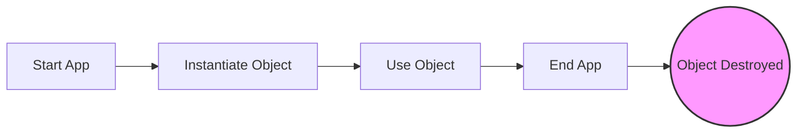
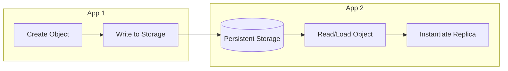
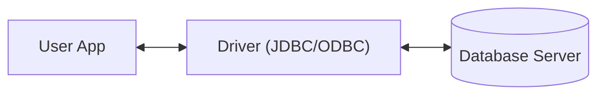
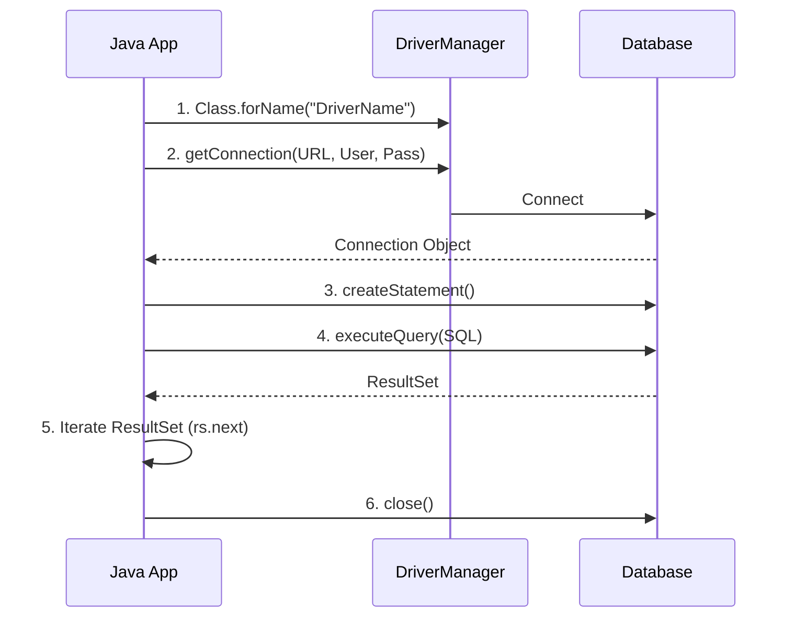

**Source Material:** Chapter 12 (Pages 225 - 246)
**Tags:** #Programming #Java #CSharp #Databases #Serialization #JDBC #XML #OOP

---

## 1. Persistent Objects Basics
### The Problem: Object Scope
In a traditional application, an object (e.g., `Employee`) lives only as long as the application is running. When the application terminates, the object and its state (attributes like `name`, `ss#`) are lost.

### The Solution: Persistence
**Persistence** is the concept of saving the state of an object so it can be restored and used later, independent of the single application instance that created it.

#### Object Life Cycle Comparison

**Traditional Life Cycle:**


**Persistent Life Cycle:**


### Storage Mechanisms
There are three main ways to save an object's state:
1.  **Flat File:** Simple file managed by the OS (Text/Binary).
2.  **Relational Database (RDBMS):** Tables and Rows (SQL Server, Oracle, Access).
3.  **Object Database:** Specialized DB designed to store objects directly.

---

## 2. Serialization: Saving to a Flat File

**Definition:** Serialization is the process of decomposing an object into a stream of bytes to store it in a file or memory.

### Challenges with Flat Files
1.  **Reconstitution:** An object isn't just a list of variables; it is a unit. Putting it back together requires knowing the exact order and types.
2.  **Composition:** Objects often contain *other* objects (e.g., a `Car` contains `Engine` and `Wheels`). Serialization must handle the entire object graph.

### Java Implementation (Binary Serialization)
Java uses a proprietary mechanism involving Streams.

*   **Interface:** Objects must implement `Serializable` (a marker interface with no methods).
*   **Classes Used:** `FileOutputStream`, `ObjectOutputStream`, `FileInputStream`, `ObjectInputStream`.

> [!INFO] What about Methods?
> Serialization saves **attributes** (data), not methods. The class definition (code) must exist on both the "saving" and "loading" ends of the application for the object to be restored.

#### Java Code Example: Writing
```java
// Step 1: Mark class as Serializable
public class Person implements Serializable {
    private String name;
    // ... constructor and getters
}

// Step 2: Write object to disk
Person p = new Person("Jack Jones");
try {
    FileOutputStream fos = new FileOutputStream("Name.txt");
    ObjectOutputStream oos = new ObjectOutputStream(fos);
    oos.writeObject(p); // The Magic Line
    oos.flush();       // Forces any buffered data to the file
    oos.close();       // Closes the stream and releases resources
} catch (Exception e) { e.printStackTrace(); }
```

> [!TIP] Why use `flush()`?
> Output streams often use a **buffer** (temporary memory) to store data before writing it to disk to improve performance. `flush()` ensures that all data currently in that buffer is immediately pushed out to the destination file. While `close()` usually calls `flush()` automatically, explicit flushing is a best practice to ensure data integrity.

#### Java Code Example: Reading
```java
// Step 3: Read object from disk
FileInputStream fis = new FileInputStream("Name.txt");
ObjectInputStream ois = new ObjectInputStream(fis);
// Must cast the object back to its class
Person p = (Person) ois.readObject(); 
```

### Handling Multiple Objects
When multiple objects are stored in a file, `readObject()` retrieves them one by one in the order they were written.

**Option A: Read until EOF (Loop)**
```java
try {
    while (true) {
        Person p = (Person) ois.readObject();
        // Process p
    }
} catch (EOFException e) {
    // End of file reached
}
```

**Option B: Store a Collection (Recommended)**
Write a single `List<Person>` object. Reading it back retrieves all data in one call.
```java
// Write: oos.writeObject(myListOfPeople);

// Read:
List<Person> people = (List<Person>) ois.readObject();
for (Person p : people) {
    // Process p
}
```

---

## 3. XML Serialization (Cross-Platform)

While binary serialization is efficient, it is proprietary. **XML** allows objects to be shared between different languages (e.g., Java writing a file that C# reads).

### Key Concepts
*   **Portability:** XML is text-based and standard.
*   **Encapsulation:** In C#/.NET, XML serialization works closely with Properties (Getters/Setters).
*   **Metadata:** Uses **Attributes** (decorators) to define how the XML should look.

### C# .NET Implementation
The framework uses the `System.Xml.Serialization` namespace.

**Attributes used:**
*   `[XmlRoot("person")]`: Defines the root element.
*   `[XmlAttribute("name")]`: Maps a property to an XML attribute.
*   `[XmlElement("age")]`: Maps a property to a nested XML element.

#### C# Code Structure
```csharp
[XmlRoot("person")]
public class Person {
    private String strName;
    private int intAge;

    // The XML Serializer uses these Properties to get/set data
    [XmlAttribute("name")]
    public String Name {
        get { return this.strName; }
        set { this.strName = value; }
    }

    [XmlElement("age")]
    public int Age {
        get { return this.intAge; }
        set { this.intAge = value; }
    }
}
```

### Java Implementation (JAXB)
In Java, XML serialization is standardly handled via **JAXB (Java Architecture for XML Binding)**. 

**Annotations used:**
*   `@XmlRootElement(name = "person")`: Defines the root element.
*   `@XmlAttribute(name = "name")`: Maps a field/property to an XML attribute.
*   `@XmlElement(name = "age")`: Maps a field/property to a nested XML element.

#### Java Code Structure
```java
import javax.xml.bind.annotation.*;

@XmlRootElement(name = "person")
public class Person {
    private String name;
    private int age;

    // Default constructor is required for JAXB
    public Person() {}

    @XmlAttribute(name = "name")
    public String getName() { return name; }
    public void setName(String name) { this.name = name; }

    @XmlElement(name = "age")
    public int getAge() { return age; }
    public void setAge(int age) { this.age = age; }
}
```

#### Serialization (Object to XML)
To actually convert the object into XML (often called "Marshalling" in JAXB), you use the `JAXBContext` and `Marshaller` classes:

```java
import javax.xml.bind.JAXBContext;
import javax.xml.bind.Marshaller;
import java.io.File;

public class SerializationDemo {
    public static void main(String[] args) throws Exception {
        // 1. Create the Object
        Person p = new Person();
        p.setName("John Q. Public");
        p.setAge(32);

        // 2. Initialize JAXB Context
        JAXBContext context = JAXBContext.newInstance(Person.class);

        // 3. Create Marshaller (Object -> XML)
        Marshaller marshaller = context.createMarshaller();
        
        // 4. (Optional) Format the output (newlines/indentation)
        marshaller.setProperty(Marshaller.JAXB_FORMATTED_OUTPUT, true);
        
        // 5. Output to Console or File
        marshaller.marshal(p, System.out);
        marshaller.marshal(p, new File("person.xml"));
    }
}
```

#### Generated XML Output
(Identical for both languages as XML acts as the bridge)
```xml
<?xml version="1.0" encoding="utf-8"?>
<person name="John Q. Public">
    <age>32</age>
</person>
```

#### Deserialization (XML to Object)
To convert the XML back into a Java object (often called "Unmarshalling" in JAXB), you use the `Unmarshaller`:

```java
import javax.xml.bind.JAXBContext;
import javax.xml.bind.Unmarshaller;
import java.io.File;

public class DeserializationDemo {
    public static void main(String[] args) throws Exception {
        // 1. Initialize JAXB Context
        JAXBContext context = JAXBContext.newInstance(Person.class);

        // 2. Create Unmarshaller (XML -> Object)
        Unmarshaller unmarshaller = context.createUnmarshaller();

        // 3. Unmarshal from File
        File file = new File("person.xml");
        Person p = (Person) unmarshaller.unmarshal(file);

        // 4. Verify data
        System.out.println("Name: " + p.getName());
        System.out.println("Age: " + p.getAge());
    }
}
```

#### Manual Implementation (DOM + Reflection)
Alternatively, you can manually parse XML and map it to objects using DOM parsing and Java Reflection. This gives you more control but requires more boilerplate code.

```java
package org.lab4;

import javax.xml.parsers.DocumentBuilderFactory;
import org.w3c.dom.Document;
import org.w3c.dom.Element;
import java.io.StringReader;
import java.lang.reflect.Field;
import org.xml.sax.InputSource;

public class XMLDeserializer {

    public static <T> void deserializeAndPrint(String xml, Class<T> clazz) throws Exception {
        
        // Parse XML (DOM)
        Document doc = DocumentBuilderFactory.newInstance().newDocumentBuilder()
                .parse(new InputSource(new StringReader(xml)));
        Element root = doc.getDocumentElement();
        
        System.out.println("Class: " + clazz.getName());

        for (Field field : clazz.getDeclaredFields()) {
            field.setAccessible(true);
            
            // TODO: Get the field name
            String fieldName = field.getName();
            String value = "Not found in XML";

            // Check if the root element contains a tag with the field name
            if (root.getElementsByTagName(fieldName).getLength() > 0) {
                // TODO: Get the value
                // We take the first occurrence (.item(0)) and get its text content
                value = root.getElementsByTagName(fieldName).item(0).getTextContent();
            }

            // TODO: print fieldName with value
            System.out.println("  " + fieldName + ": " + value);
        }
    }
}
```

#### Java Implementation (XMLEncoder)
Another way to perform XML serialization in Java without external libraries (like JAXB) is using the `java.beans.XMLEncoder` class. This is particularly useful for serializing JavaBeans.

**1. Student.java**
This is the data class. **Note:** For `XMLEncoder` to work, this class *must* follow JavaBean conventions (public class, public no-arg constructor, and public getters/setters).

```java
public class Student {
    
    private int rollno;
    private String name;

    // Default constructor is required for Serialization
    public Student() {}

    public int getRollno() {
        return rollno;
    }

    public void setRollno(int rollno) {
        this.rollno = rollno;
    }

    public String getName() {
        return name;
    }

    public void setName(String name) {
        this.name = name;
    }

    @Override
    public String toString() {
        return "Student [rollno=" + rollno + ", name=" + name + "]";
    }
}
```

**2. College.java**
This acts as a container (wrapper) for the list of students.

```java
import java.util.List;

public class College {
    
    private List<Student> students;

    public List<Student> getStudents() {
        return students;
    }

    public void setStudents(List<Student> students) {
        this.students = students;
    }
}
```

**3. XMLSerializer.java**
This is the main class that runs the serialization logic.

```java
import java.beans.XMLEncoder;
import java.io.BufferedOutputStream;
import java.io.FileNotFoundException;
import java.io.FileOutputStream;
import java.util.ArrayList;
import java.util.List;

public class XMLSerializer {
    
    public static void main(String[] args) {
        
        // 1. Create dummy data
        Student st1 = new Student();
        st1.setRollno(101);
        st1.setName("Alice");

        Student st2 = new Student();
        st2.setRollno(102);
        st2.setName("Bob");

        // 2. Add data to a List
        List<Student> studentList = new ArrayList<>();
        studentList.add(st1);
        studentList.add(st2);

        // 3. Set the list into the main object (College)
        College c = new College();
        c.setStudents(studentList);

        // 4. Perform XML Serialization
        try {
            // XMLEncoder is the standard class for writing JavaBeans to XML
            XMLEncoder encoder = new XMLEncoder(
                new BufferedOutputStream(
                    new FileOutputStream("myCollegeData.xml")
                )
            );
            
            // Write the top-level object
            encoder.writeObject(c);
            
            // Always close the encoder to ensure data is written properly
            encoder.close();
            
            System.out.println("Success! File saved as myCollegeData.xml");
            
        } catch (FileNotFoundException ex) {
            ex.printStackTrace();
        }
    }
}
```

---


> [!IMPORTANT]
> **NOT IN MID SYLLABUS?**
> (Skip for now, revisit after mid-term exams)


## 4. Relational Databases (RDBMS)


Relational databases are the industry standard (e.g., Microsoft Access, SQL Server, Oracle).

### The Challenge: Impedance Mismatch
*   **Databases** use Tables, Rows, and Columns (Relational Model).
*   **Applications** use Classes, Objects, and Inheritance (Object Model).
*   **Legacy Data:** Most companies have massive amounts of existing data in RDBMS. You cannot simply switch to Object Databases; you must write code to map objects to tables.

### Architecture: Client/Server
The application acts as the Client, communicating with the Database Server via a Driver.



### JDBC (Java Database Connectivity)
Java uses the `java.sql` package to interact with databases. It often bridges to **ODBC** (Open Database Connectivity), a Microsoft standard that abstracts specific vendor protocols.

#### The 4 Main JDBC Components
1.  **DriverManager:** Loads the specific driver for the DB (e.g., Access, Oracle).
2.  **Connection:** Establish the link to the DB.
3.  **Statement:** Container for SQL commands.
4.  **ResultSet:** Holds the data returned by a query.

#### The Connection Process


---

## 5. SQL Implementation Details

### SQL Statements
*   **Queries:** Use `executeQuery()`. Used for `SELECT`. Returns a `ResultSet`.
*   **Updates:** Use `executeUpdate()`. Used for `INSERT`, `UPDATE`, `DELETE`. Returns generic success/fail info.

### Important SQL Syntax Note
> [!WARNING] Strings in SQL
> SQL uses **single quotes** (`'`) to delineate strings, unlike Java/C# which use double quotes (`"`).
> *   **Incorrect:** `WHERE Product = "Bolts"`
> *   **Correct:** `WHERE Product = 'Bolts'`

### Iterating Results
The `ResultSet` acts like a cursor.
```java
// Iterate through all rows
while (rs.next()) {
    // Retrieve column by name
    String id = rs.getString("SUPPLIERID");
    System.out.println(id);
}
```

---

## 6. Comprehensive Code Examples

### Java: JDBC Complete Example
```java
public void findVendor(String vendorId) throws SQLException {
    // 1. Load Driver
    Class.forName("sun.jdbc.odbc.JdbcOdbcDriver");
    
    // 2. Connect
    String url = "jdbc:odbc:myDriver";
    Connection conn = DriverManager.getConnection(url, "user", "password");
    
    // 3. Create Statement
    Statement stmt = conn.createStatement();
    
    // 4. Build Query (Note single quotes for SQL string)
    String sql = "SELECT PRODUCT FROM SUPPLIERTABLE WHERE PRODUCT = 'Bolts'";
    
    // 5. Execute
    ResultSet rs = stmt.executeQuery(sql);
    
    // 6. Process Results
    while (rs.next()) {
        System.out.println(rs.getString("SUPPLIERID"));
    }
    
    // 7. Clean up
    stmt.close();
    conn.close();
}
```

### C# .NET: XML Serialization Example
```csharp
using System;
using System.IO;
using System.Xml.Serialization;

[XmlRoot("person")]
public class Person {
    [XmlAttribute("name")]
    public string Name { get; set; }
    
    [XmlElement("age")]
    public int Age { get; set; }
    
    // Constructor required for serialization
    public Person() {} 
}

public class Program {
    public static void Serialize() {
        Person[] people = new Person[2];
        people[0] = new Person { Name = "John", Age = 32 };
        people[1] = new Person { Name = "Jane", Age = 35 };

        XmlSerializer serializer = new XmlSerializer(typeof(Person[]));
        TextWriter writer = new StreamWriter("person.xml");
        
        serializer.Serialize(writer, people);
        writer.Close();
    }

    public static void Deserialize() {
        XmlSerializer serializer = new XmlSerializer(typeof(Person[]));
        TextReader reader = new StreamReader("person.xml");
        
        Person[] loadedPeople = (Person[])serializer.Deserialize(reader);
        
        foreach(Person p in loadedPeople) {
            Console.WriteLine(p.Name + " is " + p.Age);
        }
    }
}
```