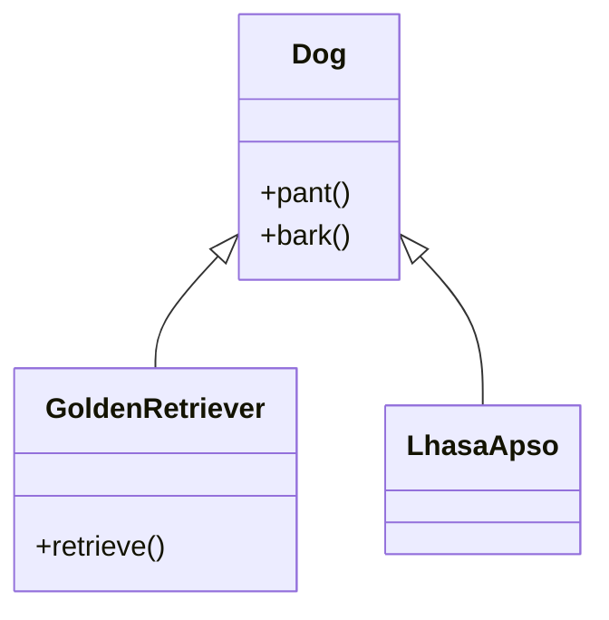
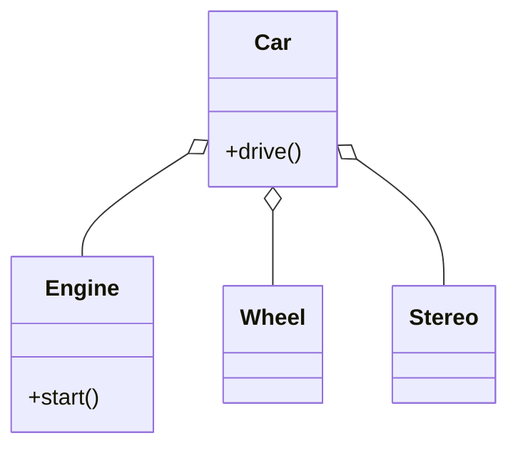

**Source:** Addison_Wesley_The_Object_Oriented_Thought_process_3rd ed
**Tags:** #OOD #Inheritance #Composition #Programming #DesignPatterns #Encapsulation
**Related:** [[Object-Oriented Concepts]], [[Polymorphism]], [[UML]]

---

## Overview
This chapter explores the two primary mechanisms for code reuse in Object-Oriented (OO) systems: **Inheritance** and **Composition**. It discusses when to use which, the trade-offs regarding system complexity, and how inheritance interacts with encapsulation and polymorphism.

## 1. Reuse Mechanisms

The fundamental goal of both inheritance and composition is **Object Reuse**—building new classes/objects by utilizing previously built ones.

| Feature | Inheritance | Composition |
| :--- | :--- | :--- |
| **Relationship** | **Is-a** (Parent/Child) | **Has-a** (Assembly) |
| **Structure** | Class Hierarchy | Object Assembly |
| **Coupling** | Tightly coupled (White-box) | Loosely coupled (Black-box) |
| **Example** | `Dog` is a `Mammal` | `Car` has an `Engine` |

### Historical Context
*   Early OO adoption saw Inheritance as the "ultimate" reuse tool.
*   Modern views (e.g., *Java Design* by Coad/Mayfield, *Effective C++* by Scott Meyers) often advocate for "Composition over Inheritance" due to the rigidity and encapsulation issues introduced by inheritance.
*   **Conclusion:** Both are valid; the key is understanding the proper context for each.

---

## 2. Inheritance ("Is-a")

Inheritance allows a child class (subclass) to inherit attributes and behaviors directly from a parent class (superclass).

### Criteria for Use
*   **The "Is-a" Rule:** Use inheritance only if Class B **is a** Class A.
*   **Generalization-Specialization:**
    *   **Root:** Most general (e.g., `Dog`).
    *   **Leaves:** Most specific (e.g., `GoldenRetriever`, `LhasaApso`).
    *   Process involves factoring out commonality into the parent class.

### The "Bird" Dilemma (Design Issues)
Designing inheritance hierarchies requires accounting for exceptions.
*   *Scenario:* A `Bird` class has a `fly()` method.
*   *Problem:* Penguins and Ostriches are birds but cannot fly.
*   *Consequence:* If `Penguin` inherits `fly()`, the model is flawed. Overriding it to do nothing or throw an error is a hack.
*   *Solution:* Refactor hierarchy to separate behaviors (e.g., `FlyingBird` vs. `NonFlyingBird`), though this increases complexity.

### The Dog Example (Evolution of Design)
1.  **Initial:** `Dog` class has `bark()` and `pant()`.
2.  **Problem:** The `Basenji` breed does not bark; it yodels.
3.  **Refactor:**
    *   Create intermediate classes: `BarkingDog` and `YodelingDog`.
    *   `GoldenRetriever` inherits from `BarkingDog`.
    *   `Basenji` inherits from `YodelingDog`.
4.  **Trade-off:** This makes the model more accurate but increases **Model Complexity**. Designers must balance accuracy with simplicity (e.g., if you never breed Basenjis, the extra complexity isn't worth it).

> [!INFO] **Cost of Complexity**
> "The primary goal is always to build a system that is flexible without adding so much complexity that the system collapses under its own weight."

---

## 3. Composition ("Has-a")

Composition involves building complex objects by assembling other objects.

### Characteristics
*   Objects are used as **fields** within another object.
*   Represents a **Has-a** relationship.
*   **UML Notation:** Represented by a line with a diamond on the container side.
    *   *Note:* The author treats **Aggregation** (weak ownership) and **Association** as types of Composition in this context.

### The Car Example
*   A `Car` is not a specialized `Engine`.
*   A `Car` **has an** `Engine`, **has a** `Stereo`, **has a** `Door`.
*   **Granularity:** Composition can have multiple levels.
    *   `Car` -> `Stereo` -> `Radio` -> `Tuner` -> `Dial`.
*   **Flexibility:** It is easier to swap out parts (e.g., changing the engine) in a composition model than replacing functionality deep in an inheritance tree.

---

## 4. Encapsulation vs. Inheritance

There is a fundamental paradox in OO design: **Inheritance weakens Encapsulation.**

*   **Encapsulation:** Hides implementation details (Black Box).
*   **Inheritance:** Exposes implementation details to subclasses (White Box).

### The Ripple Effect
*   **The Problem:** If a superclass implementation changes, the change ripples down to all subclasses.
*   **Example:** `Cabbie` class has a `giveDirections()` method. `PartTimeCabbie` inherits it. If `Cabbie` changes how it processes directions, `PartTimeCabbie` might break, even if its own code wasn't touched.
*   **Testing:** Changes in a parent class require re-testing of *all* subclasses.

### Misuse Example: GUI Window
*   *Bad Design:* `Window extends Rectangle`.
    *   A window isn't really a rectangle; it's a complex object that *contains* a rectangular shape.
    *   If `Rectangle` implementation changes, `Window` might break.
*   *Better Design:* `Window` **contains** (has-a) `Rectangle` for its border/UI.

---

## 5. Polymorphism

Polymorphism ("Many Shapes") is a cornerstone of OO, allowing objects to be responsible for their own behavior.

### Concept
*   Messages are sent to objects, and the object determines *how* to respond based on its specific type.
*   Decouples the *request* for an action from the *implementation* of the action.

### The Shape Example
*   **Abstract Class:** `Shape` (cannot be instantiated).
    *   Defines abstract method `draw()` or `getArea()`.
*   **Concrete Classes:** `Circle`, `Rectangle`, `Star`.
    *   Each overrides `draw()` with its own specific logic.
*   **Usage:**
    ```java
    // The method doesn't know it's drawing a Circle specifically
    public void drawMe(Shape s) {
        s.draw(); 
    }
    ```
*   **Benefit:** You can add a `Triangle` class later without changing the `drawMe` method or the `Shape` class. The system is extensible.

---

## 6. UML Visualization

### Inheritance (Generalization)


### Composition (Aggregation)


---

## 7. Summary & Key Takeaways

1.  **Reuse:** Use Inheritance for "is-a" and Composition for "has-a".
2.  **Encapsulation:** Be aware that inheritance exposes the parent's implementation to the child, creating a dependency. Composition generally preserves encapsulation better.
3.  **Complexity:** Don't over-engineer hierarchies (e.g., Yodeling dogs) unless the business case strictly requires it.
4.  **Polymorphism:** Use abstract base classes or interfaces to write code that interacts with the general type (e.g., `Shape`), allowing concrete implementations (`Circle`, `Square`) to handle their own behavior.
5.  **Modern Approach:** While inheritance is powerful, many designers lean toward composition to avoid the "fragile base class" problem and to maintain flexibility.

---

## 8. Common Confusion Points (FAQ)

> [!QUESTION] **If I have to write the method in the new class anyway (delegation), how is Composition "reusing" code?**
> **Answer:** You are reusing the *logic* (the 100 complex lines inside the helper object), not the *signature*.
> *   **Inheritance:** You inherit the method name and the code.
> *   **Composition:** You write a 1-line "wrapper" method that calls the complex method of the contained object.
> *   **Benefit:** You avoid inheriting "garbage" methods you don't need, and you can swap the helper object (e.g., switch `GasEngine` to `ElectricEngine`) without breaking your class.

> [!QUESTION] **Is Composition just about having `int` and `String` fields?**
> **Answer:** No, it is about having **Smart Objects** as fields.
> *   Instead of your class managing primitive data (e.g., `car.engineHorsepower`), your class manages other classes (e.g., `car.myEngine`).
> *   The contained object (`Engine`) knows how to handle itself. The container (`Car`) just tells it what to do.

---

## 9. Deep Dive Examples

> [!EXAMPLE] **Example 1: Delegation (The "1-Line Wrapper")**
> Instead of rewriting complex logic, you point to the expert.
>
> **The Expert (`Engine.java`):**
> ```java
> class Engine {
>     public void start() {
>         // ... 100 lines of complex spark/fuel logic ...
>         System.out.println("Engine started.");
>     }
> }
> ```
>
> **The Reuser (`Car.java`):**
> ```java
> class Car {
>     private Engine myEngine = new Engine();
>
>     public void startCar() {
>         myEngine.start(); // REUSE: 1 line of code reuses 100 lines of logic.
>     }
> }
> ```

> [!EXAMPLE] **Example 2: Primitives vs. Smart Objects (Composition)**
> Composition shifts the responsibility from the "Manager" to the "Part".
>
> **Bad: The "Primitive Trap" (Everything is just data)**
> ```java
> class Car {
>     int horsepower;     // Dumb data
>     boolean isStarted;  // Dumb data
>     
>     void start() {
>         // Car has to manage the HOW of starting an engine
>         this.isStarted = true; 
>         // ... more engine logic here ...
>     }
> }
> ```
>
> **Good: Composition (Everything is a Smart Object)**
> ```java
> class Car {
>     private Engine myEngine = new Engine(); // Smart Object: Engine knows how to start itself.
>     private Tire[] tires;    // Smart Object: Tire knows its own pressure.
>
>     void start() {
>         myEngine.start(); // Car just gives the order.
>     }
> }
> ```
