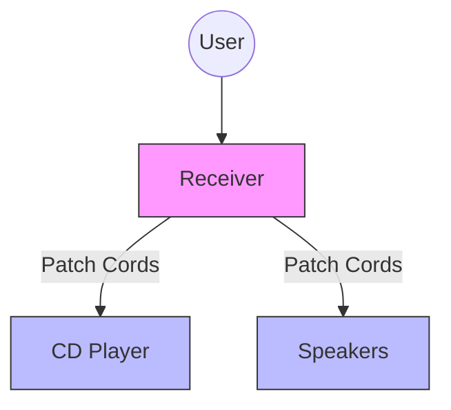
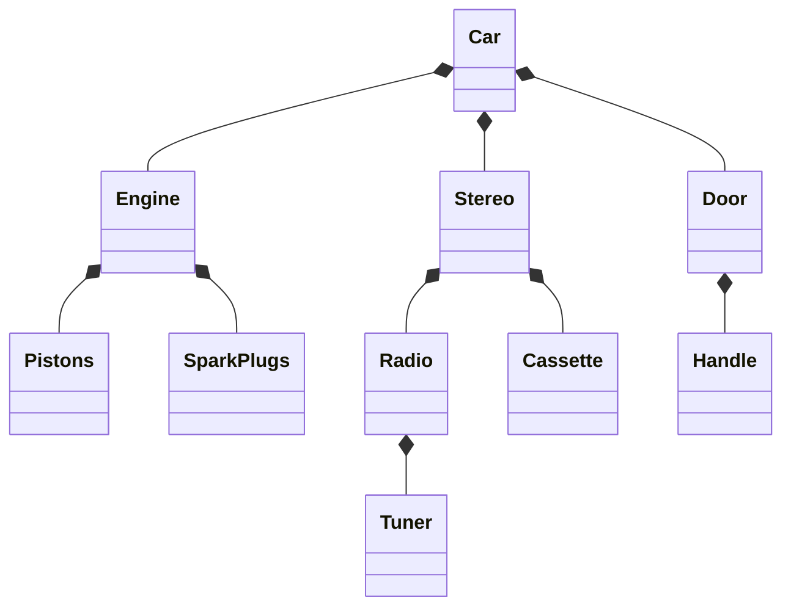
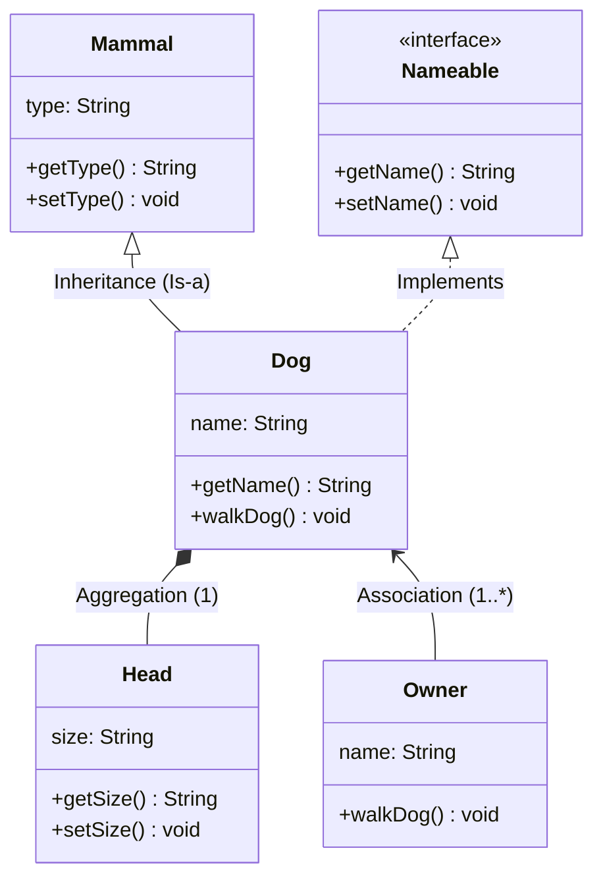

**Tags:** #OOD #ObjectOrientedDesign #Composition #Inheritance #UML #Java #Architecture

---

## 1. Introduction: Relationships Between Objects
In previous chapters, Inheritance and Composition were introduced as the primary ways to build objects. This chapter focuses on how objects relate to one another in an overall design and how to construct complex systems from simpler parts.

### Inheritance vs. Composition
While both represent object interaction, they construct objects differently:

| **Inheritance** ("Is-a") | **Composition** ("Has-a") |
| :--- | :--- |
| **Concept:** Creates a *single* class conceptually that incorporates behaviors/attributes of the hierarchy. | **Concept:** Distinct objects interacting. One or more classes are used to build another. |
| **Relationship:** Parent-Child. | **Relationship:** Part-Whole or Service-Client. |
| **Example:** An `Employee` *is a* `Person`. | **Example:** A `Car` *has a* `Steering Wheel`. |

> [!NOTE]
> In inheritance, an `Employee` object does not send a message to a `Person` object. The `Employee` **is** the `Person` object. In composition, distinct objects send messages to one another.

---

## 2. Composition Relationships ("Has-a")
Composition allows us to build systems by combining less complex parts.

### Why use Composition?
1.  **Complexity Management:** Humans can only hold ~7 chunks of data in short-term memory. Abstraction allows us to say "Car" rather than listing every bolt and wire.
2.  **Interchangeability:** If parts are modular (e.g., all steering wheels fit the mount), they can be swapped.
3.  **Repair/Maintenance:** You can fix a broken component without replacing the entire system.

### Code Example: Why Composition?

The following Java example demonstrates **Complexity Management**, **Interchangeability**, and **Repair/Maintenance**.

```java
// 1. COMPLEXITY MANAGEMENT (Abstraction)
// We define a simple interface. The driver (user) only needs to know
// "start", not how the fuel injects or how the battery discharges.
interface Engine {
    void start();
}

// 2. INTERCHANGEABILITY (Modular Parts)
// Different modules that fit the same "mount" (Interface).

class GasEngine implements Engine {
    public void start() {
        System.out.println("Vroom! Spark plugs firing. Burning gas.");
    }
}

class ElectricEngine implements Engine {
    public void start() {
        System.out.println("Hummm. Battery circuits open. Silent start.");
    }
}

// The "Whole" object composed of parts
class Car {
    private Engine myEngine; // The "Part"

    // Constructor: We assemble the car with a specific part
    public Car(Engine engine) {
        this.myEngine = engine;
    }

    public void drive() {
        // We delegate the work to the component.
        // We don't care *how* it starts, just that it does.
        myEngine.start(); 
        System.out.println("Car is moving...");
    }

    // 3. REPAIR/MAINTENANCE (Swapping Parts)
    // If the engine breaks or we want an upgrade, we don't buy a new car.
    // We just swap the component.
    public void setEngine(Engine newEngine) {
        System.out.println("--- Replacing Engine ---");
        this.myEngine = newEngine;
    }
}

/* 
 * WHY NOT INHERITANCE?
 * If we used inheritance:
 * class GasCar extends Car { ... }
 * class ElectricCar extends Car { ... }
 * 
 * We could NEVER turn a GasCar into an ElectricCar at runtime. 
 * We would have to destroy the GasCar object and create a new ElectricCar.
 * With Composition, the 'Car' object stays the same; only the 'Engine' changes.
 */

// MAIN EXECUTION
public class CompositionDemo {
    public static void main(String[] args) {
        // Assembly: Creating the parts first
        Engine v8 = new GasEngine();
        Engine teslaMotor = new ElectricEngine();

        // 1. Complexity Management: 
        // We say "drive()", hiding the engine's internal physics.
        Car myCar = new Car(v8); 
        myCar.drive(); 
        // Output: Vroom! Spark plugs firing... Car is moving...

        // 2. Interchangeability & 3. Repair/Maintenance:
        // We want to go green. We swap the part, not the car.
        myCar.setEngine(teslaMotor); 
        myCar.drive(); 
        // Output: Hummm. Battery circuits open... Car is moving...
    }
}
```

**Key Takeaways from Code:**
1.  **Complexity Management:** The `Car.drive()` method hides the complexity. It simply calls `myEngine.start()`, abstracting away the internal mechanics of *how* the engine starts (spark plugs vs. batteries).
2.  **Interchangeability:** Since `Car` depends on the `Engine` interface, not a specific class, we can plug in *any* implementation (`GasEngine`, `ElectricEngine`, `HybridEngine`) without changing the `Car` class.
3.  **Repair/Maintenance:** The `setEngine()` method allows us to modify the car's behavior at runtime. Unlike inheritance, where a `GasCar` is stuck as a `GasCar` forever, composition allows the object to evolve or be repaired by simply swapping its components.

### Herbert Simon’s "The Architecture of Complexity" (1962)
> [!ABSTRACT] 
> Simon proposed that stable complex systems (biological, social, or artificial) usually share specific properties. In the context of Object-Oriented Design, this is the theoretical foundation for **Composition**.
> 
> 1.  **Hierarchy:** 
>     *   *Theory:* Complex systems are composed of subsystems, which are composed of even simpler subsystems.
>     *   *OO Application:* A `CommerceSystem` contains a `Shop`, which contains a `CustomerList`, which contains `Customer` objects. You don't build the whole system as one giant block.
> 
> 2.  **Near Decomposability:** 
>     *   *Theory:* Interactions *within* a component (intra-component) are much stronger and more frequent than interactions *between* components (inter-component).
>     *   *OO Application:* **High Cohesion / Low Coupling**. The parts of an engine interact intensely (pistons, valves, explosions), but the engine interacts with the rest of the car only through a simple rotating shaft. If the AC breaks, the engine keeps running because they are nearly decomposable.
> 
> 3.  **Reuse:** 
>     *   *Theory:* Complex systems are often composed of only a few different kinds of subsystems arranged in different combinations.
>     *   *OO Application:* Nature reuses "Cells" to build everything. Programmers reuse `String`, `List`, and `Button` classes to build vastly different applications.
> 
> 4.  **Evolution:** 
>     *   *Theory:* Complex systems that work invariably evolved from simple systems that worked. Complex systems designed from scratch usually fail.
>     *   *OO Application:* **Iterative Development**. Start with a `Minimum Viable Product (MVP)`, ensure it works, then add complexity (features) incrementally.

### The Stereo System Example (Modular Design)
**Scenario:** You have a Receiver, CD Player, and Speakers connected by patch cords.
*   **Decoupled:** If the CD Player breaks, you can repair just that unit or buy a different brand.
*   **Integrated (Bad):** If it were one "Black Box" unit, a broken CD player would ruin the whole system.



---

## 3. Types of Composition
There is often debate on definitions, but this book treats **Association** as a form of **Composition**.

### A. Aggregation
*   **Concept:** A complex object composed of other objects.
*   **Visual Mental Model:** You see the **Whole**, not the parts.
*   **Example:** A TV. You see a "TV," not the transistors and tubes inside. A Car. You see a "Car," not the spark plugs.
*   **Relationship:** "Part-of."

**Car Aggregation Hierarchy:**


### B. Association
*   **Concept:** One object uses another to perform a service.
*   **Visual Mental Model:** You see **Both** the whole and the parts distinctly.
*   **Example:** A Computer System. You see the Box, Monitor, Keyboard, and Mouse as separate distinct items connected by cables.
*   **Relationship:** "Uses" or "Client-Service."

### Aggregation vs. Association
> [!TIP] Rule of Thumb
> **Aggregation:** The object is a *part* of the main object (e.g., A Head is part of a Dog).
> **Association:** The object is separate but provides a service (e.g., A Spouse is associated with an Employee).

> [!EXAMPLE] Code Comparison
> The key difference is often in the **Lifecycle** (creation and destruction).
> 
> ```java
> // 1. AGGREGATION (Strong Ownership)
> // The "Part" belongs exclusively to the "Whole".
> // If the Computer is destroyed, the CPU is destroyed with it.
> class Computer {
>     private CPU cpu;
>     
>     public Computer() {
>         // The Whole creates the Part
>         this.cpu = new CPU(); 
>     }
> }
> 
> // 2. ASSOCIATION (Weak Connection)
> // The objects are independent. 
> // If the Person ceases to exist, the Bank continues to exist.
> class Person {
>     private Bank bank; 
>     
>     // The Part is created outside and passed in
>     public Person(Bank bank) {
>         this.bank = bank; 
>     }
> }
> ```
> 
> **Why the difference? (Garbage Collection)**
> *   **Aggregation (Death Pact):** The `CPU` is created *inside* the `Computer`. No one else has a reference to it. When `Computer` is garbage collected, the `CPU` has zero references left, so it is destroyed too.
> *   **Association (Independent Lives):** The `Bank` is created *outside* and passed in. Even if `Person` is garbage collected, the code that created the `Bank` (e.g., `main()`) still holds a reference to it, so the `Bank` survives.


---

## 4. Dependencies and Mixing Domains
A major design goal is **Avoiding Dependencies**.
*   **Mixing Domains:** Coupling objects from different domains (e.g., combining a TV and VCR into one physical unit).
*   **Trade-off:**
    *   **Convenience:** Easier to set up (TV/VCR combo).
    *   **Stability:** If one breaks, you lose both (Higher risk).

**Guideline:** Keep domains separate (e.g., Business Logic vs. Database code) unless the convenience drastically outweighs the stability risk.

> [!EXAMPLE] Code: Mixing vs. Separating Domains
> 
> **The "TV/VCR Combo" (Bad - Mixed Domains)**
> Here, the `TaxCalculator` (Business Logic) is hardcoded to print to the console (Presentation Domain). You can't use this calculator in a Web App or Database script without rewriting it.
> ```java
> class TaxCalculator {
>     public void calculateAndPrint(double price) {
>         double tax = price * 0.08;
>         // MIXING DOMAINS: Business Logic + Presentation
>         System.out.println("The tax is: $" + tax); 
>     }
> }
> ```
> 
> **The "Separate Components" (Good - Decoupled)**
> Here, the Logic returns a value. It doesn't care who uses it (Console, Web, Database).
> ```java
> class TaxCalculator {
>     public double calculate(double price) {
>         return price * 0.08; // Pure Business Logic
>     }
> }
> 
> class ConsolePrinter {
>     public void show(double amount) {
>         System.out.println("The tax is: $" + amount); // Pure Presentation
>     }
> }
> ```

---

## 5. Cardinality
Cardinality describes the number of objects participating in a relationship and whether they are optional or mandatory.

**Notation:**
*   `1`: Mandatory, exactly one.
*   `0..1`: Optional, zero or one.
*   `1..n`: Mandatory, at least one, up to many.
*   `0..n`: Optional, zero to many.

### Example: Employee System
An `Employee` class has relationships with the following:

| Class | Relationship | Cardinality | Explanation |
| :--- | :--- | :--- | :--- |
| `Division` | Mandatory | `1` | An employee must work for one division. |
| `JobDescription` | Mandatory | `1..n` | Must have at least one job, can have history of many. |
| `Spouse` | Optional | `0..1` | Can be married or single. |
| `Child` | Optional | `0..n` | Can have zero or many children. |

### Handling Optional Associations in Code
> [!WARNING] Null Pointer Risk
> If an association is optional (e.g., `Spouse`), the code **must** check if the object is `null` before trying to access it. Failing to do so will crash the application.

**Java Implementation:**
```java
public class Employee extends Person {
    // Attributes
    private String companyID;
    private String title;
    
    // Associations
    private Spouse spouse;                  // 0..1 (Single Object)
    private Child[] children;               // 0..n (Array/Collection)
    private Division division;              // 1
    private JobDescription[] jobs;          // 1..n (Array/Collection)

    // Example of checking optional association
    public String getSpouseName() {
        if (this.spouse != null) {
            return this.spouse.getName();
        } else {
            return "Not Married";
        }
    }
}
```

---

## 6. Tying It All Together: The Dog Walker Example
This example demonstrates Inheritance, Interfaces, Aggregation, and Association in a single model.

*   **Inheritance:** `Dog` *is a* `Mammal`.
*   **Interface:** `Dog` implements `Nameable`.
*   **Aggregation:** `Dog` *has a* `Head` (The head is part of the dog).
*   **Association:** `Owner` *walks* the `Dog` (The owner is not part of the dog, but provides a service).

### Detailed UML Diagram



### Key Relationships explained:
1.  **Dog & Mammal:** Solid line with triangle (`<|--`). Inheritance.
2.  **Dog & Nameable:** Dashed line with triangle (`<|..`). Interface Implementation.
3.  **Dog & Head:** Line with diamond (`*--`). Aggregation. 
    *   *Note:* The diamond touches the "Whole" (Dog).
4.  **Dog & Owner:** Simple line (`<--`). Association.
    *   *Cardinality:* A dog can have `1..*` owners (e.g., husband and wife).

---

## 7. Conclusion
*   **Inheritance** creates new versions of existing objects.
*   **Composition** (Aggregation/Association) represents interactions between various distinct objects.
*   Good design involves balancing these relationships to create stable, maintainable systems using the "Is-a" and "Has-a" tests.
```