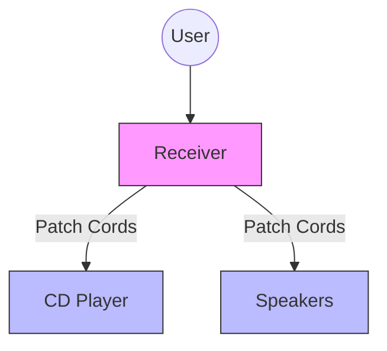
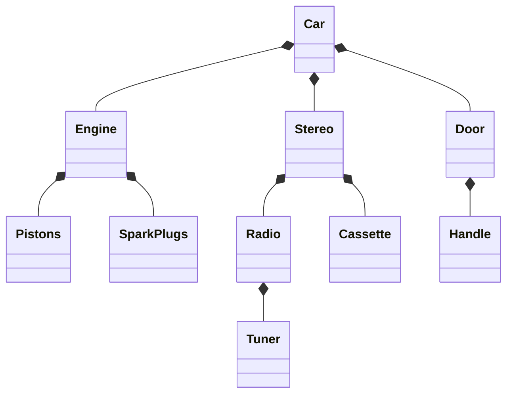
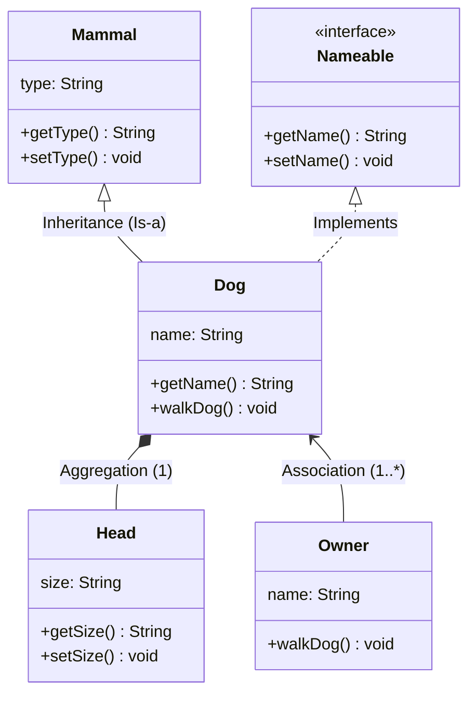

**Tags:** #OOD #ObjectOrientedDesign #Composition #Inheritance #UML #Java #Architecture

---

## 1. Introduction: Relationships Between Objects
In previous chapters, Inheritance and Composition were introduced as the primary ways to build objects. This chapter focuses on how objects relate to one another in an overall design and how to construct complex systems from simpler parts.

### Inheritance vs. Composition
While both represent object interaction, they construct objects differently:

| **Inheritance** ("Is-a") | **Composition** ("Has-a") |
| :--- | :--- |
| **Concept:** Creates a *single* class conceptually that incorporates behaviors/attributes of the hierarchy. | **Concept:** Distinct objects interacting. One or more classes are used to build another. |
| **Relationship:** Parent-Child. | **Relationship:** Part-Whole or Service-Client. |
| **Example:** An `Employee` *is a* `Person`. | **Example:** A `Car` *has a* `Steering Wheel`. |

> [!NOTE]
> In inheritance, an `Employee` object does not send a message to a `Person` object. The `Employee` **is** the `Person` object. In composition, distinct objects send messages to one another.

---

## 2. Composition Relationships ("Has-a")
Composition allows us to build systems by combining less complex parts.

### Why use Composition?
1.  **Complexity Management:** Humans can only hold ~7 chunks of data in short-term memory. Abstraction allows us to say "Car" rather than listing every bolt and wire.
2.  **Interchangeability:** If parts are modular (e.g., all steering wheels fit the mount), they can be swapped.
3.  **Repair/Maintenance:** You can fix a broken component without replacing the entire system.

### Herbert Simon’s "The Architecture of Complexity" (1962)
Stable complex systems usually follow these properties:
1.  **Hierarchy:** Systems built from simpler subsystems.
2.  **Near Decomposability:** Interactions *within* a component are stronger than interactions *between* components.
3.  **Reuse:** Systems are composed of only a few different kinds of subsystems arranged differently.
4.  **Evolution:** Complex systems evolve from simple systems that worked.

### The Stereo System Example (Modular Design)
**Scenario:** You have a Receiver, CD Player, and Speakers connected by patch cords.
*   **Decoupled:** If the CD Player breaks, you can repair just that unit or buy a different brand.
*   **Integrated (Bad):** If it were one "Black Box" unit, a broken CD player would ruin the whole system.



---

## 3. Types of Composition
There is often debate on definitions, but this book treats **Association** as a form of **Composition**.

### A. Aggregation
*   **Concept:** A complex object composed of other objects.
*   **Visual Mental Model:** You see the **Whole**, not the parts.
*   **Example:** A TV. You see a "TV," not the transistors and tubes inside. A Car. You see a "Car," not the spark plugs.
*   **Relationship:** "Part-of."

**Car Aggregation Hierarchy:**


### B. Association
*   **Concept:** One object uses another to perform a service.
*   **Visual Mental Model:** You see **Both** the whole and the parts distinctly.
*   **Example:** A Computer System. You see the Box, Monitor, Keyboard, and Mouse as separate distinct items connected by cables.
*   **Relationship:** "Uses" or "Client-Service."

### Aggregation vs. Association
> [!TIP] Rule of Thumb
> **Aggregation:** The object is a *part* of the main object (e.g., A Head is part of a Dog).
> **Association:** The object is separate but provides a service (e.g., A Spouse is associated with an Employee).

---

## 4. Dependencies and Mixing Domains
A major design goal is **Avoiding Dependencies**.
*   **Mixing Domains:** Coupling objects from different domains (e.g., combining a TV and VCR into one physical unit).
*   **Trade-off:**
    *   **Convenience:** Easier to set up (TV/VCR combo).
    *   **Stability:** If one breaks, you lose both (Higher risk).

**Guideline:** Keep domains separate (e.g., Business Logic vs. Database code) unless the convenience drastically outweighs the stability risk.

---

## 5. Cardinality
Cardinality describes the number of objects participating in a relationship and whether they are optional or mandatory.

**Notation:**
*   `1`: Mandatory, exactly one.
*   `0..1`: Optional, zero or one.
*   `1..n`: Mandatory, at least one, up to many.
*   `0..n`: Optional, zero to many.

### Example: Employee System
An `Employee` class has relationships with the following:

| Class | Relationship | Cardinality | Explanation |
| :--- | :--- | :--- | :--- |
| `Division` | Mandatory | `1` | An employee must work for one division. |
| `JobDescription` | Mandatory | `1..n` | Must have at least one job, can have history of many. |
| `Spouse` | Optional | `0..1` | Can be married or single. |
| `Child` | Optional | `0..n` | Can have zero or many children. |

### Handling Optional Associations in Code
> [!WARNING] Null Pointer Risk
> If an association is optional (e.g., `Spouse`), the code **must** check if the object is `null` before trying to access it. Failing to do so will crash the application.

**Java Implementation:**
```java
public class Employee extends Person {
    // Attributes
    private String companyID;
    private String title;
    
    // Associations
    private Spouse spouse;                  // 0..1 (Single Object)
    private Child[] children;               // 0..n (Array/Collection)
    private Division division;              // 1
    private JobDescription[] jobs;          // 1..n (Array/Collection)

    // Example of checking optional association
    public String getSpouseName() {
        if (this.spouse != null) {
            return this.spouse.getName();
        } else {
            return "Not Married";
        }
    }
}
```

---

## 6. Tying It All Together: The Dog Walker Example
This example demonstrates Inheritance, Interfaces, Aggregation, and Association in a single model.

*   **Inheritance:** `Dog` *is a* `Mammal`.
*   **Interface:** `Dog` implements `Nameable`.
*   **Aggregation:** `Dog` *has a* `Head` (The head is part of the dog).
*   **Association:** `Owner` *walks* the `Dog` (The owner is not part of the dog, but provides a service).

### Detailed UML Diagram



### Key Relationships explained:
1.  **Dog & Mammal:** Solid line with triangle (`<|--`). Inheritance.
2.  **Dog & Nameable:** Dashed line with triangle (`<|..`). Interface Implementation.
3.  **Dog & Head:** Line with diamond (`*--`). Aggregation. 
    *   *Note:* The diamond touches the "Whole" (Dog).
4.  **Dog & Owner:** Simple line (`<--`). Association.
    *   *Cardinality:* A dog can have `1..*` owners (e.g., husband and wife).

---

## 7. Conclusion
*   **Inheritance** creates new versions of existing objects.
*   **Composition** (Aggregation/Association) represents interactions between various distinct objects.
*   Good design involves balancing these relationships to create stable, maintainable systems using the "Is-a" and "Has-a" tests.
```