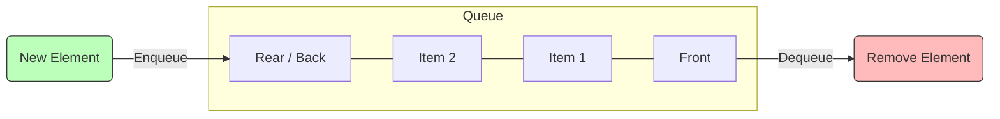

# Data Structures: Queues & Deques

**Tags:** #data-structures #algorithms #cpp #cs-theory
**Topic:** Queue (FIFO) and Deque (Double-ended Queue)

---

## 1. The Abstract Queue

A **Queue** is a linear data structure that follows the **First-In-First-Out (FIFO)** principle. It behaves exactly like a real-world line of people waiting for a ticket: the person who has been waiting the longest is the first one served.

### Key Characteristics
*   **Insertion (Enqueue):** Always happens at the **Rear** (Back).
*   **Deletion (Dequeue):** Always happens at the **Front**.
*   **Access:** You can typically only peek at the element at the **Front**.

> [!INFO] **FIFO Concept**
> The first item inserted into the queue is the first item to leave.
> *Graphically:*
> `[Front] A <- B <- C <- D [Back]`
> If we remove an item, `A` leaves. If we add `E`, it goes behind `D`.

### Conceptual Visualization



---

## 2. Queue Operations & Complexity

For an efficient queue implementation, all primary operations must run in constant time, **$\Theta(1)$**.

| Operation | Description | Time Complexity |
| :--- | :--- | :--- |
| **Enqueue (Push)** | Add an element to the back. | $\Theta(1)$ |
| **Dequeue (Pop)** | Remove the element from the front. | $\Theta(1)$ |
| **Front (Peek)** | Look at the element at the front. | $\Theta(1)$ |
| **Size** | Check number of elements. | $\Theta(1)$ |
| **Empty** | Check if the queue is empty. | $\Theta(1)$ |

---

## 3. Implementation Strategies

There are two primary ways to implement a Queue: **Linked Lists** and **Circular Arrays**.

### A. Singly Linked List Implementation
This is often the simplest dynamic implementation.
*   **Front Pointer:** Points to the head of the list (for $O(1)$ removal).
*   **Rear Pointer:** Points to the tail of the list (for $O(1)$ insertion).

> [!WARNING] Constraint
> Removal is only efficient at the *front* of a singly linked list. Removing from the tail would require traversing the list ($O(n)$), which violates queue performance requirements.

### B. Array Implementation (The "Circular" Problem)

#### The Problem with Linear Arrays
If you use a standard array and increment the `front` index when you pop, and increment the `back` index when you push, the queue "crawls" through memory.
*   Eventually, `back` hits the array capacity.
*   Even if there is empty space at the beginning (from previous pops), a standard linear logic says the array is full.

#### The Solution: Circular Array
To achieve $\Theta(1)$ operations without wasting space, we treat the array indices as **cyclic**.

**The Logic:**
When the back index reaches the end of the array, it wraps around to index 0 (if space is available).

**Modulo Arithmetic Formula:**
To advance an index (wrapping around):
$$index = (index + 1) \ \% \ capacity$$

**State Variables Needed:**
1.  `array`: The storage.
2.  `front`: Index of the first element.
3.  `back`: Index of the last element.
4.  `size`: Current number of items (helps distinguish full vs empty).
5.  `capacity`: Max size of the array.

> [!example] Circular Logic
> Capacity = 16.
> Current `back` = 15.
> Operation: `enqueue(x)`
> New `back` = `(15 + 1) % 16` = **0**.

#### Resizing a Circular Queue
If the array fills up, we must expand it. **Direct copying using `memcpy` fails** because the logical queue might be wrapped around (e.g., Back is at index 2, Front is at index 14).

**Correction Strategy (Normalization):**
1.  Create a new array with double capacity.
2.  Copy elements from the old array to the new one, "unrolling" them so the `Front` starts at index 0 in the new array.

---

## 4. Applications of Queues

### General Computing
1.  **Buffers:** Keyboard input buffers, Printer spooling (jobs print in order of arrival).
2.  **Scheduling:** CPU process scheduling, Disk scheduling.
3.  **Simulation:** Modeling traffic lights, grocery store lines, or call centers (simulating wait times).

### Cryptography: Repeating Key Cipher
Queues are excellent for rotating keys in encryption.
*   **Scenario:** You have a message and a numerical key `[3, 1, 7]`.
*   **Process:**
    1.  Shift 1st letter by 3. Move 3 to back of Queue.
    2.  Shift 2nd letter by 1. Move 1 to back of Queue.
    3.  Shift 3rd letter by 7. Move 7 to back of Queue.
    4.  Repeat.

### Breadth-First Search (BFS)
This is one of the most important applications. BFS traverses a Tree or Graph level-by-level (shallowest nodes first).

**Algorithm:**
1.  Push the **Root** node into the Queue.
2.  While the Queue is not empty:
    3.  **Pop** the node at the front ($Current$).
    4.  **Process** $Current$ (e.g., print it).
    5.  **Push** all children/neighbors of $Current$ into the Queue.

> [!example] BFS Walkthrough
> **Tree:** Root **A** has children **B, H**. **B** has **C, D, G**. **H** has **I**.
>
> 1.  **Q: [A]** -> Pop A. Output: `A`. Push children B, H.
> 2.  **Q: [B, H]** -> Pop B. Output: `B`. Push children C, D, G.
> 3.  **Q: [H, C, D, G]** -> Pop H. Output: `H`. Push child I.
> 4.  **Q: [C, D, G, I]** -> Pop C (leaf). Output: `C`.
> 5.  ...and so on.
>
> **Final Order:** A, B, H, C, D, G, I... (Level by level).

---

## 5. C++ STL Queue (`std::queue`)

C++ provides a standard container adapter for queues.

```cpp
#include <iostream>
#include <queue>

using namespace std;

int main() {
    // 1. Create a queue
    queue<int> myQueue;

    // 2. Enqueue (Push)
    myQueue.push(10);
    myQueue.push(20);
    myQueue.push(30);

    // 3. Peeking
    cout << "Front element: " << myQueue.front() << endl; // Output: 10
    cout << "Back element: " << myQueue.back() << endl;   // Output: 30

    // 4. Dequeue (Pop) - Returns void, just removes
    myQueue.pop(); 

    cout << "New Front: " << myQueue.front() << endl;     // Output: 20
    cout << "Size: " << myQueue.size() << endl;           // Output: 2

    // 5. Check Empty
    if (!myQueue.empty()) {
        cout << "Queue is not empty." << endl;
    }

    return 0;
}
```

---

## 6. Abstract Deque (Double-Ended Queue)

A **Deque** (pronounced "deck") stands for **D**ouble-**E**nded **Que**ue. It generalizes the queue by allowing insertion and removal at **both ends**.

### Operations
*   `push_front(x)`: Insert at the head.
*   `push_back(x)`: Insert at the tail (standard Queue push).
*   `pop_front()`: Remove from head (standard Queue pop).
*   `pop_back()`: Remove from tail (Stack pop).
*   `front()`, `back()`: Access ends.

### Applications of Deque
1.  **Palindrome Checker:** Read a string into a Deque. Compare `pop_front()` and `pop_back()` characters until empty. If they match all the way, it's a palindrome.
2.  **Undo/Redo Operations:** Storing software history.
3.  **Maze Solving:** Can function as both a Stack (Depth-First) or Queue (Breadth-First) depending on how you remove items.
4.  **Sliding Window Algorithms:** Finding max/min in a sliding window of an array.

---

## 7. C++ STL Deque (`std::deque`)

The STL `deque` is very powerful and often implemented as a set of linked arrays (not a simple circular array), allowing fast growth.

```cpp
#include <iostream>
#include <deque>

using namespace std;

int main() {
    deque<int> d;

    // Insertion at both ends
    d.push_back(10);  // [10]
    d.push_front(5);  // [5, 10]
    d.push_back(20);  // [5, 10, 20]
    d.push_front(1);  // [1, 5, 10, 20]

    // Access
    cout << "Front: " << d.front() << endl; // 1
    cout << "Back: " << d.back() << endl;   // 20

    // Removal from both ends
    d.pop_front();    // Removes 1
    d.pop_back();     // Removes 20

    // Iterating (Deques support random access iterators!)
    cout << "Deque contents: ";
    for(int n : d) {
        cout << n << " ";
    }
    // Output: 5 10

    return 0;
}
```