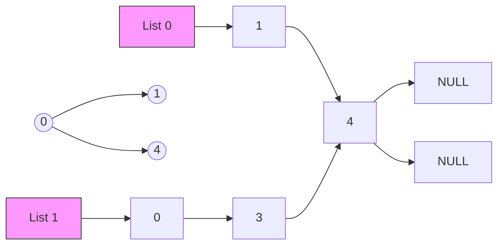
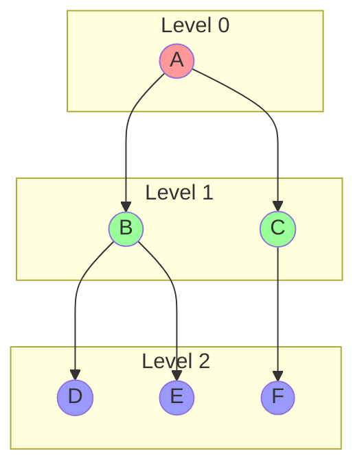

# Lecture 07: Introduction to Graphs

---

## 1. Motivation: From Trees to Graphs

### Limitations of Linear & Tree Structures
*   **Linear Structures (Arrays, Lists):** Represent sequential data (1:1 relationship).
*   **Tree Structures:** Represent hierarchical data (1:N parent-child relationship). **Constraint:** No cycles allowed; strictly top-down.

### Why Graphs?
Real-world relationships are often "Many-to-Many" and contain cycles.
*   **Maps:** A road from City A to B, and B back to A (Cycle).
*   **Social Networks:** A is friends with B, B is friends with C, C is friends with A.
*   **The Web:** Hyperlinks connecting pages in a complex web.

> [!ABSTRACT] Definition
> A **Graph** is a non-linear data structure consisting of:
> *   **$V$**: A finite set of **Vertices** (Nodes).
> *   **$E$**: A set of **Edges** (Pairs of vertices representing connections).
>
> Mathematically: $G = (V, E)$

---

## 2. Graph Terminology

### Basic Components
*   **Adjacent (Neighbors):** Two nodes $u, v$ are neighbors if an edge $(u, v)$ connects them.
*   **Degree:** The number of edges connected to a node.
    *   **Isolated Vertex:** Degree = 0.
    *   **Pendant (Leaf) Vertex:** Degree = 1.
*   **Path:** A sequence of vertices where each adjacent pair is connected by an edge.
*   **Cycle:** A path that starts and ends at the same vertex.

### Directed vs. Undirected
| Feature | **Undirected Graph** | **Directed Graph (Digraph)** |
| :--- | :--- | :--- |
| **Edge Definition** | Unordered pair {u, v} | Ordered pair (u, v) |
| **Direction** | $u \leftrightarrow v$ (Two-way) | $u \to v$ (One-way) |
| **Degree** | Total edges touching node | **In-Degree:** Edges entering<br>**Out-Degree:** Edges leaving |
| **Max Edges** | $n(n-1)/2$ | $n(n-1)$ |

### Connectivity
*   **Connected Graph:** There is a path between *every* pair of vertices.
*   **Complete Graph ($K_n$):** Every node is connected to every other node.
*   **Strongly Connected (Directed):** Path exists $u \to v$ AND $v \to u$ for all pairs.
*   **Weakly Connected (Directed):** Connected if edge directions are ignored.

---

## 3. Graph Representations

We primarily use two methods to store graphs in memory.

### A. Adjacency Matrix
A 2D array `A[V][V]` where `A[i][j] = 1` if an edge exists, else `0`.

*   **Pros:** $O(1)$ to check if edge $(u, v)$ exists.
*   **Cons:** Consumes $O(V^2)$ space (wasteful for sparse graphs).

```cpp
// Adjacency Matrix for 5 nodes
int adj[5][5] = {
    {0, 1, 1, 0, 0}, // 0 is connected to 1, 2
    {1, 0, 0, 1, 0}, // 1 is connected to 0, 3
    {1, 0, 0, 1, 0}, // ...
    {0, 1, 1, 0, 1},
    {0, 0, 0, 1, 0}
};
```

### B. Adjacency List
An array of Lists (or Vectors). `adj[i]` contains a list of all nodes connected to node `i`.

*   **Pros:** Saves space $O(V + E)$. Ideal for sparse graphs.
*   **Cons:** Checking specific edge existence takes $O(\text{degree of } u)$.



---

## 4. Graph Traversals

### A. Breadth-First Search (BFS)
Explores the graph **layer-by-layer** (like ripples in a pond).
*   **Data Structure:** **Queue** (FIFO).
*   **Usage:** Finding **Shortest Path** in unweighted graphs, Peer-to-Peer networks.
*   **Complexity:** $O(V + E)$.

**Visual Process:**


**C++ Implementation (BFS):**
```cpp
#include <iostream>
#include <vector>
#include <queue>

using namespace std;

void BFS(int startNode, int V, vector<vector<int>>& adj) {
    vector<bool> visited(V, false);
    queue<int> q;

    // 1. Start
    visited[startNode] = true;
    q.push(startNode);

    cout << "BFS: ";

    while (!q.empty()) {
        // 2. Dequeue
        int u = q.front();
        q.pop();
        cout << u << " ";

        // 3. Process Neighbors
        for (int v : adj[u]) {
            if (!visited[v]) {
                visited[v] = true;
                q.push(v);
            }
        }
    }
    cout << endl;
}
```

### B. Depth-First Search (DFS)
Explores as **deep** as possible along each branch before backtracking.
*   **Data Structure:** **Stack** (LIFO) or **Recursion**.
*   **Usage:** Maze solving, Cycle detection, Pathfinding.
*   **Complexity:** $O(V + E)$.

**C++ Implementation (DFS - Recursive):**
```cpp
#include <iostream>
#include <vector>

using namespace std;

void DFSUtil(int u, vector<vector<int>>& adj, vector<bool>& visited) {
    // 1. Mark and Process
    visited[u] = true;
    cout << u << " ";

    // 2. Recurse for all neighbors
    for (int v : adj[u]) {
        if (!visited[v]) {
            DFSUtil(v, adj, visited);
        }
    }
}

void DFS(int startNode, int V, vector<vector<int>>& adj) {
    vector<bool> visited(V, false);
    cout << "DFS: ";
    DFSUtil(startNode, adj, visited);
    cout << endl;
}
```

---

## 5. Topological Sorting

**Definition:** A linear ordering of vertices in a **Directed Acyclic Graph (DAG)** such that for every directed edge $u \to v$, vertex $u$ comes before $v$.
*   **Analogy:** Course prerequisites. You must take `Intro to C` ($u$) before `Data Structures` ($v$).
*   **Algorithm (Kahn's / Source Removal):** Uses **In-Degree**.

**Algorithm Steps:**
1.  Calculate **In-Degree** for all nodes.
2.  Add all nodes with `In-Degree == 0` to a Queue.
3.  While Queue is not empty:
    *   Dequeue $u$ and add to sorted list.
    *   For each neighbor $v$ of $u$: Decrement In-Degree of $v$.
    *   If In-Degree of $v$ becomes 0, Enqueue $v$.

**C++ Implementation:**
```cpp
#include <iostream>
#include <vector>
#include <queue>

using namespace std;

void TopologicalSort(int V, vector<vector<int>>& adj) {
    vector<int> inDegree(V, 0);
    
    // 1. Calculate In-Degrees
    for (int u = 0; u < V; u++) {
        for (int v : adj[u]) {
            inDegree[v]++;
        }
    }

    // 2. Enqueue 0-degree nodes
    queue<int> q;
    for (int i = 0; i < V; i++) {
        if (inDegree[i] == 0) q.push(i);
    }

    cout << "Topo Sort: ";
    vector<int> result;
    
    // 3. Process
    while (!q.empty()) {
        int u = q.front();
        q.pop();
        result.push_back(u);

        for (int v : adj[u]) {
            inDegree[v]--;
            if (inDegree[v] == 0) q.push(v);
        }
    }

    // Cycle Detection Check
    if (result.size() != V) {
        cout << "Cycle detected! Topological sort not possible." << endl;
    } else {
        for (int node : result) cout << node << " ";
        cout << endl;
    }
}
```

---

## 6. Advanced Concepts (Brief)

*   **Articulation Point (Cut Vertex):** A node whose removal disconnects the graph. Critical in network routing (Single Point of Failure).
*   **Bridge (Cut Edge):** An edge whose removal disconnects the graph.
*   **Bi-Connected Graph:** Contains no articulation points. Robust against single node failures.
*   **Transitive Closure:** A graph $G^*$ where an edge $(u, v)$ exists if there is a path from $u$ to $v$ in the original graph. Useful for $O(1)$ reachability queries.

---

## 7. Summary Comparison

| Algorithm | Data Structure | Time Complexity | Space Complexity | Primary Use Case |
| :--- | :--- | :--- | :--- | :--- |
| **BFS** | Queue | $O(V + E)$ | $O(V)$ | Shortest Path (Unweighted), Level Order |
| **DFS** | Stack / Recursion | $O(V + E)$ | $O(V)$ | Connectivity, Cycle Detection, Maze |
| **Topo Sort**| Queue + In-Degree| $O(V + E)$ | $O(V)$ | Dependency Resolution, Compilation Order |
