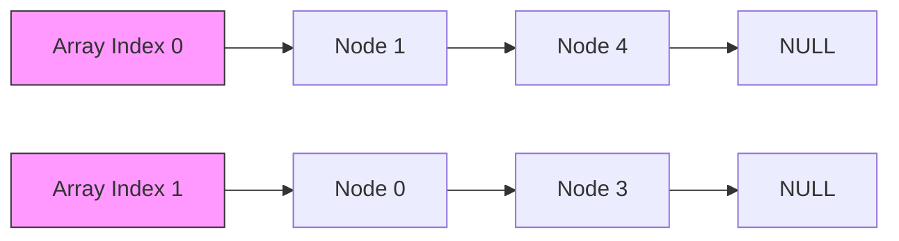
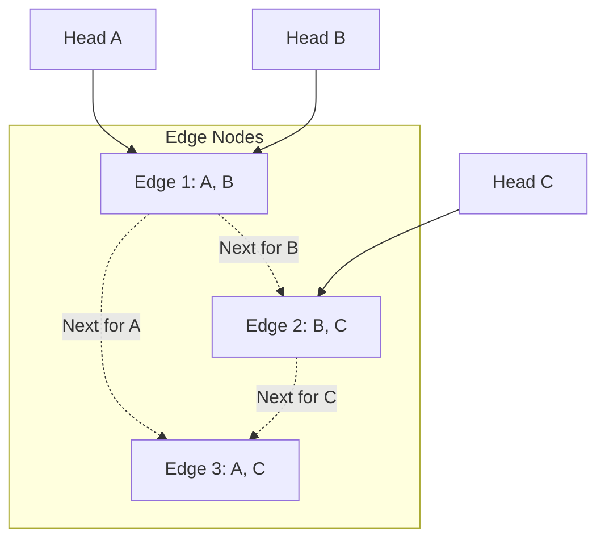
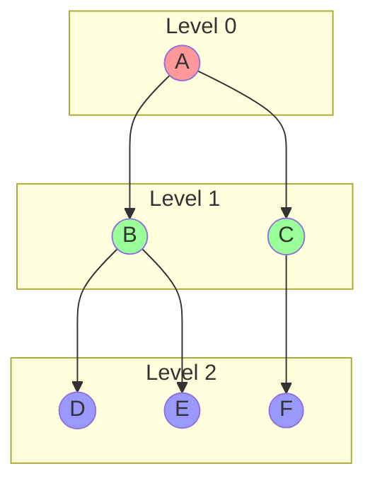
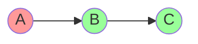
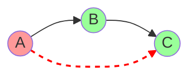

# Lecture 07: Introduction to Graphs

---

## 1. Motivation: From Trees to Graphs

### Limitations of Linear & Tree Structures
*   **Linear Structures (Arrays, Lists):** Represent sequential data (1:1 relationship).
*   **Tree Structures:** Represent hierarchical data (1:N parent-child relationship). **Constraint:** No cycles allowed; strictly top-down.

### Why Graphs?
Real-world relationships are often "Many-to-Many" and contain cycles.
*   **Maps:** A road from City A to B, and B back to A (Cycle).
*   **Social Networks:** A is friends with B, B is friends with C, C is friends with A.
*   **The Web:** Hyperlinks connecting pages in a complex web.

> [!ABSTRACT] Definition
> A **Graph** is a non-linear data structure consisting of:
> *   **$V$**: A finite set of **Vertices** (Nodes).
> *   **$E$**: A set of **Edges** (Pairs of vertices representing connections).
>
> Mathematically: $G = (V, E)$

---

## 2. Graph Terminology

### Basic Components
*   **Adjacent (Neighbors):** Two nodes $u, v$ are neighbors if an edge $(u, v)$ connects them.
*   **Degree:** The number of edges connected to a node.
    *   **Isolated Vertex:** Degree = 0.
    *   **Pendant (Leaf) Vertex:** Degree = 1.
*   **Path:** A sequence of vertices where each adjacent pair is connected by an edge.
*   **Cycle:** A path that starts and ends at the same vertex.

### Directed vs. Undirected
| Feature | **Undirected Graph** | **Directed Graph (Digraph)** |
| :--- | :--- | :--- |
| **Edge Definition** | Unordered pair {u, v} | Ordered pair (u, v) |
| **Direction** | $u \leftrightarrow v$ (Two-way) | $u \to v$ (One-way) |
| **Degree** | Total edges touching node | **In-Degree:** Edges entering<br>**Out-Degree:** Edges leaving |
| **Max Edges** | $n(n-1)/2$ | $n(n-1)$ |

### Connectivity
*   **Connected Graph:** There is a path between *every* pair of vertices.
*   **Complete Graph ($K_n$):** Every node is connected to every other node.
*   **Strongly Connected (Directed):** Path exists $u \to v$ AND $v \to u$ for all pairs.
*   **Weakly Connected (Directed):** Connected if edge directions are ignored.

---

## 3. Graph Representations

We primarily use two methods to store graphs in computer memory. The choice depends on the graph's density (number of edges vs. vertices).

### A. Adjacency Matrix (2D Array)
A 2D grid where rows and columns represent vertices. This is efficient for **dense graphs**.

*   **Structure:** A 2D array `adj[V][V]`.
*   **Value:** `adj[i][j] = 1` (or weight) if there is an edge from $i$ to $j$. Otherwise `0`.
*   **Symmetry (Undirected Graphs):** The matrix is a **mirror image** across the main diagonal (top-left to bottom-right). If connection $A \to B$ exists, then $B \to A$ automatically exists.

**Visual Example (Edge A—B):**

|   | A | B |
|---|---|---|
| **A** | 0 | **1** |
| **B** | **1** | 0 |

*(Notice how the 1s at [A][B] and [B][A] mirror each other)*

*   **Pros:** Instant lookups ($O(1)$) to check if an edge exists.
*   **Cons:** Consumes massive memory ($O(V^2)$), most of which is wasted on zeros if the graph is sparse.

```cpp
// Adjacency Matrix for 5 nodes
int adj[5][5] = {
    {0, 1, 1, 0, 0}, // 0 is connected to 1, 2
    {1, 0, 0, 1, 0}, // 1 is connected to 0, 3
    {1, 0, 0, 1, 0}, // ...
    {0, 1, 1, 0, 1},
    {0, 0, 0, 1, 0}
};
```

### B. Adjacency List (Array of Linked Lists)
An array where each element points to a linked list of neighbors. This is the industry standard for **sparse graphs**.

*   **Structure:** An array of size $V$ (Total Vertices).
*   **Mechanism:**
    *   Every index `i` in the array represents a Vertex.
    *   `Array[i]` acts as a **Head Pointer** to a Linked List (or Vector).
    *   The Linked List contains all the **neighbors** (adjacent nodes) of Vertex `i`.
*   **Visual Logic:**
    *   `List[0]`: Points to -> `1` -> `4` -> `NULL` (Node 0 is connected to 1 and 4).
    *   `List[1]`: Points to -> `0` -> `3` -> `NULL` (Node 1 is connected to 0 and 3).



*   **Pros:** Memory efficient ($O(V+E)$). Only stores existing connections.
*   **Cons:** Checking if a specific edge $(u, v)$ exists is slower ($O(\text{degree of } u)$) because you must traverse the list.

### C. Adjacency Multi-list
In standard Adjacency Lists, an undirected edge $(u, v)$ is duplicated in the lists of both $u$ and $v$. The **Adjacency Multi-list** avoids this by treating **Edges as Nodes**.

*   **Core Idea:** Each edge exists as a single unique node in memory, simultaneously linked into the lists of both vertices it connects.
*   **Structure:**
    1.  **Vertex Directory (`Heads`):** An array where `Heads[i]` points to the first edge connected to Vertex $i$.
    2.  **Edge Node:** A structure representing an edge $(u, v)$ with 5 fields:
        *   **M:** Mark bit (e.g., for visited status).
        *   **V1, V2:** The two vertices connected by this edge ($u$ and $v$).
        *   **Link1:** Pointer to the next edge connected to $V1$.
        *   **Link2:** Pointer to the next edge connected to $V2$.

**Visual Representation (Triangle Graph A-B-C):**
*Edges: (A,B), (B,C), (A,C)*



*   **Pros:**
    *   **Edge Identity:** Unique storage allows marking edges (e.g., "visited") without ambiguity.
    *   **Space Efficient:** No duplication for undirected edges.
*   **Cons:** More complex pointer manipulation.

[YT Video Link on Adjacency Multi-List](https://www.youtube.com/watch?v=f2z1n6atBsc)

---

## 4. Graph Traversals

### A. Breadth-First Search (BFS)
Explores the graph **layer-by-layer** (like ripples in a pond).
*   **Data Structure:** **Queue** (FIFO).
*   **Usage:** Finding **Shortest Path** in unweighted graphs, Peer-to-Peer networks.
*   **Complexity:** $O(V + E)$.

**Visual Process:**


**C++ Implementation (BFS):**
```cpp
#include <iostream>
#include <vector>
#include <queue>

using namespace std;

void BFS(int startNode, int V, vector<vector<int>>& adj) {
    vector<bool> visited(V, false);
    queue<int> q;

    // 1. Start
    visited[startNode] = true;
    q.push(startNode);

    cout << "BFS: ";

    while (!q.empty()) {
        // 2. Dequeue
        int u = q.front();
        q.pop();
        cout << u << " ";

        // 3. Process Neighbors
        for (int v : adj[u]) {
            if (!visited[v]) {
                visited[v] = true;
                q.push(v);
            }
        }
    }
    cout << endl;
}
```

### B. Depth-First Search (DFS)
Explores as **deep** as possible along each branch before backtracking.
*   **Data Structure:** **Stack** (LIFO) or **Recursion**.
*   **Usage:** Maze solving, Cycle detection, Pathfinding.
*   **Complexity:** $O(V + E)$.

**C++ Implementation (DFS - Recursive):**
```cpp
#include <iostream>
#include <vector>

using namespace std;

void DFSUtil(int u, vector<vector<int>>& adj, vector<bool>& visited) {
    // 1. Mark and Process
    visited[u] = true;
    cout << u << " ";

    // 2. Recurse for all neighbors
    for (int v : adj[u]) {
        if (!visited[v]) {
            DFSUtil(v, adj, visited);
        }
    }
}

void DFS(int startNode, int V, vector<vector<int>>& adj) {
    vector<bool> visited(V, false);
    cout << "DFS: ";
    DFSUtil(startNode, adj, visited);
    cout << endl;
}
```

---

## 5. Topological Sorting

**Definition:** A linear ordering of vertices in a **Directed Acyclic Graph (DAG)** such that for every directed edge $u \to v$, vertex $u$ comes before $v$.
*   **Analogy:** Course prerequisites. You must take `Intro to C` ($u$) before `Data Structures` ($v$).
*   **Algorithm (Kahn's / Source Removal):** Uses **In-Degree**.

**Algorithm Steps:**
1.  Calculate **In-Degree** for all nodes.
2.  Add all nodes with `In-Degree == 0` to a Queue.
3.  While Queue is not empty:
    *   Dequeue $u$ and add to sorted list.
    *   For each neighbor $v$ of $u$: Decrement In-Degree of $v$.
    *   If In-Degree of $v$ becomes 0, Enqueue $v$.

**C++ Implementation:**
```cpp
#include <iostream>
#include <vector>
#include <queue>

using namespace std;

void TopologicalSort(int V, vector<vector<int>>& adj) {
    vector<int> inDegree(V, 0);
    
    // 1. Calculate In-Degrees
    for (int u = 0; u < V; u++) {
        for (int v : adj[u]) {
            inDegree[v]++;
        }
    }

    // 2. Enqueue 0-degree nodes
    queue<int> q;
    for (int i = 0; i < V; i++) {
        if (inDegree[i] == 0) q.push(i);
    }

    cout << "Topo Sort: ";
    vector<int> result;
    
    // 3. Process
    while (!q.empty()) {
        int u = q.front();
        q.pop();
        result.push_back(u);

        for (int v : adj[u]) {
            inDegree[v]--;
            if (inDegree[v] == 0) q.push(v);
        }
    }

    // Cycle Detection Check
    if (result.size() != V) {
        cout << "Cycle detected! Topological sort not possible." << endl;
    } else {
        for (int node : result) cout << node << " ";
        cout << endl;
    }
}
```

---

## 6. Transitive Closure

In the context of graph theory, the **transitive closure** of a graph $G$ is another graph $G^*$ that represents **reachability** between all nodes.

### The Core Idea
If there is a path of any length (direct or indirect) from node $u$ to node $v$ in the original graph, then there is a **direct edge** $(u, v)$ in the transitive closure.

### Formal Definition
Given a graph $G = (V, E)$, the transitive closure $G^* = (V, E^*)$ is defined such that:
*   An edge $(u, v)$ exists in $E^*$ **if and only if** there is a valid path from $u$ to $v$ in $G$.

### Visual Example
Imagine a simple directed path: **A $\to$ B $\to$ C**

**Original Graph:**


**Transitive Closure (Reachability):**

*   **Original Edges:** $(A, B)$ and $(B, C)$.
*   **Transitive Closure Edges:** $(A, B)$, $(B, C)$, and the new edge **$(A, C)$** (because A can reach C through B).

### Calculation
The most famous method is **Warshall’s Algorithm**, which uses a dynamic programming approach to build the reachability matrix in $O(V^3)$ time. It is useful for $O(1)$ reachability queries (e.g., "Can A reach C?").

---

## 7. Other Advanced Concepts

*   **Articulation Point (Cut Vertex):** A node whose removal disconnects the graph. Critical in network routing (Single Point of Failure).
*   **Bridge (Cut Edge):** An edge whose removal disconnects the graph.
*   **Bi-Connected Graph:** Contains no articulation points. Robust against single node failures.

---

## 8. Summary Comparison

| Algorithm | Data Structure | Time Complexity | Space Complexity | Primary Use Case |
| :--- | :--- | :--- | :--- | :--- |
| **BFS** | Queue | $O(V + E)$ | $O(V)$ | Shortest Path (Unweighted), Level Order |
| **DFS** | Stack / Recursion | $O(V + E)$ | $O(V)$ | Connectivity, Cycle Detection, Maze |
| **Topo Sort**| Queue + In-Degree| $O(V + E)$ | $O(V)$ | Dependency Resolution, Compilation Order |
