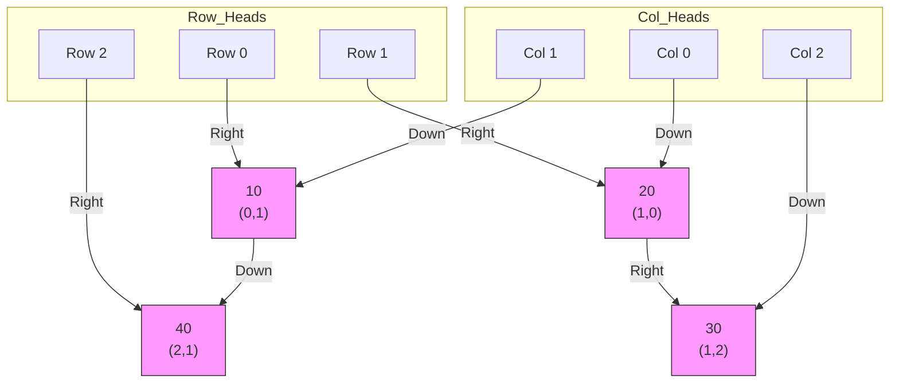

---

## 1. Limitation of Singly Linked Lists (SLL)
**The Problem:** SLL is a "one-way street."
*   **Scenario:** If you are at Node 50 and need to modify Node 40 (the previous node), you cannot go back.
*   **Consequence:** You must restart traversal from `HEAD`.
*   **Solution:** We need a two-way structure $\rightarrow$ **Doubly Linked List (DLL)**.

---

## 2. Doubly Linked List (DLL)

### Definition
A linked list where every node contains **three fields**:
1.  **PREV:** Pointer to the previous node.
2.  **DATA:** The value being stored.
3.  **NEXT:** Pointer to the next node.

**Visual Structure:**
`[ Prev | 10 | Next ] <---> [ Prev | 20 | Next ]`

### Real World Applications
1.  **Web Browser History:**
    *   *Current Page:* The node you are on.
    *   *Back Button:* Follows `PREV`.
    *   *Forward Button:* Follows `NEXT`.
2.  **Text Editor (Undo/Redo):**
    *   Each "state" of the document is a node.
    *   *Ctrl+Z (Undo):* Moves to `PREV`.
    *   *Ctrl+Y (Redo):* Moves to `NEXT`.

### Operations

#### Insertion
**Scenario:** Insert NewNode `N` between Node `A` and Node `B`.
**Time Complexity:** $O(1)$ (if pointer to A is known).
**Logic (Order Matters):**
1.  `N->NEXT = B`
2.  `N->PREV = A`
3.  `A->NEXT = N` (Break old link here)
4.  `B->PREV = N`

*Cons:* Requires updating 4 pointers instead of 2.

#### Deletion
**Scenario:** Delete Node `X`.
**Advantage:** Unlike SLL, we do **not** need a separate `PREPTR` variable because `X` knows who is before it.

**Pseudo Code:**
```c
Delete(X)
    IF X->NEXT != NULL
        X->NEXT->PREV = X->PREV
    IF X->PREV != NULL
        X->PREV->NEXT = X->NEXT
    FREE X
```

---

## 3. Circular Linked Lists (CLL)

### Definition
A list where the **Last Node** points back to the **First Node** instead of `NULL`.

### Use Cases
1.  **CPU Scheduling (Round Robin):** OS gives time to Process A $\to$ B $\to$ C, then goes back to A.
2.  **Music Playlist:** "Repeat All" functionality.

### Traversal Differences
*   **Danger Zone:** Risk of infinite loops.
*   **Loop Condition:** Stop when the pointer returns to `HEAD`.

| Singly Linked List | Circular Linked List |
| :--- | :--- |
| `While (PTR != NULL)` | `Repeat ... Until (PTR == HEAD)` |

---

## 4. Orthogonal Lists (Sparse Matrices)

### The Problem: Sparse Matrices
*   **Scenario:** A spreadsheet with 1,000 rows and 1,000 columns ($1,000,000$ cells).
*   **Issue:** If only 50 cells contain data, a standard 2D array `matrix[1000][1000]` wastes huge memory on empty/zero cells.
*   **Solution:** Orthogonal Lists.

### Structure
A grid-like structure where nodes are linked in two dimensions (Horizontally and Vertically).
**Node Structure (5 Fields):**
1.  **ROW:** Row index.
2.  **COL:** Column index.
3.  **VAL:** Actual data.
4.  **RIGHT:** Pointer to the next non-zero element in this **Row**.
5.  **DOWN:** Pointer to the next non-zero element in this **Col**.

### Visualizing the Connections
Imagine this $3 \times 3$ Matrix:
```text
      C0  C1  C2
R0  |  0  10   0 |
R1  | 20   0  30 |
R2  |  0  40   0 |
```

**Orthogonal List Representation:**
We only create nodes for **10, 20, 30, 40**.
*   **Rows** link nodes Left $\to$ Right.
*   **Cols** link nodes Top $\to$ Down.



*   **To find (2,1):** Go to `Row 2 Head`, follow `Right` $\to$ Found Node 40.
*   **To find (0,1):** Go to `Col 1 Head`, follow `Down` $\to$ Found Node 10.
*   **Why "Orthogonal"?** Because links are perpendicular. You can traverse Row 2 quickly without scanning the empty cells in Row 3.

---

## 5. Advanced: XOR Linked Lists

### Memory Optimization
*   **Challenge:** DLLs use 2 pointers per node (`Next` + `Prev`), doubling memory overhead.
*   **The Trick:** Store *both* directions in a **single pointer field** using Bitwise XOR.

### XOR Properties
1.  $A \oplus A = 0$
2.  $A \oplus 0 = A$
3.  If $C = A \oplus B$, then:
    *   $C \oplus A = B$
    *   $C \oplus B = A$

### Implementation
Instead of `Next` and `Prev`, store one field: **npx** (Next XOR Prev).

**Equation:**
$$ \text{Node B's npx} = \text{Address}(A) \oplus \text{Address}(C) $$
*(Where A is previous and C is next)*

### Traversal Logic
**Goal:** Move from A to B, then find C.
*   Current Node: **B**
*   Previous Node: **A** (Address known)
*   **Calculation:**
    $$ \text{addr}(C) = \text{B}\rightarrow\text{npx} \oplus \text{addr}(A) $$

---

## Summary Comparison

| Feature | Singly LL | Doubly LL | XOR List |
| :--- | :--- | :--- | :--- |
| **Memory** | 1 Pointer | 2 Pointers | 1 Pointer |
| **Direction** | Forward | Bi-Directional | Bi-Directional |
| **Complexity** | Simple | Simple | Complex (Bitwise) |
| **Usage** | Stacks | Browser History | Low-memory Systems |

---

## References
*   **Textbook:** *Data Structures Using C*, 2nd Edition by Reema Thareja.
*   **Relevant Sections:** Chapter 6 (6.3, 6.4, 6.5, 6.7 - Sparse Matrix).