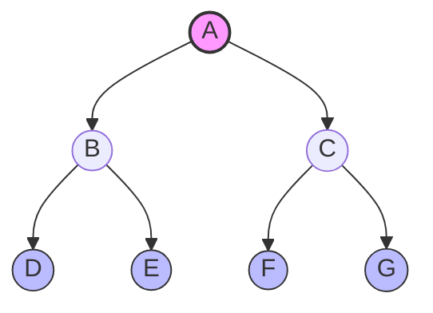

---
## 1. Introduction: Linear vs. Non-Linear

### The Limitation of Linear Structures
Linear structures (Arrays, Linked Lists, Stacks, Queues) organize data sequentially (1:1 relationship).
*   **Pros:** Excellent for sequential data stream processing.
*   **Cons:**
    *   **Hierarchy:** Cannot represent organizational charts or file systems naturally.
    *   **Branching:** Cannot represent decision-making paths (e.g., Game AI).
    *   **Efficiency:** Insertion/Deletion in arrays is slow; Search in Linked Lists is $O(N)$.

### The Tree Solution
A **Tree** is a non-linear, hierarchical data structure consisting of nodes connected by edges. It represents a **1:N** (one-to-many) relationship.

> [!INFO] Real World Analogies
> *   **File Systems:** Root Drive (C:) $\to$ Folders $\to$ Files.
> *   **HTML DOM:** `<html>` $\to$ `<body>` $\to$ `<div>`.
> *   **Taxonomy:** Kingdom $\to$ Phylum $\to$ Class.

---

## 2. Core Terminology

| Term | Definition | Visual Context |
| :--- | :--- | :--- |
| **Node** | The entity storing data. | The circles in a diagram. |
| **Root** | The topmost node. No parent. | Level 0. |
| **Edge** | The link connecting two nodes. | The lines. |
| **Parent** | A node with a successor. | Immediate predecessor. |
| **Child** | A node with a predecessor. | Immediate successor. |
| **Siblings** | Nodes sharing the same parent. | |
| **Leaf (External)**| A node with **no** children. | Bottom-most nodes. |
| **Internal Node** | A node with at least one child. | Non-leaf nodes. |
| **Subtree** | A node and all its descendants. | Recursive structure. |

### Metric Definitions
*   **Level:** Distance from root. **Root is Level 0**. (Children of Level $i$ are at $i+1$).
*   **Depth:** Number of edges from Root to Node (Top-down).
*   **Height:** Number of nodes on the longest path from Node to Leaf (Bottom-up). **Leaf Height = 1**.
*   **Degree of Node:** Number of children a node has.
*   **Degree of Tree:** Maximum degree of any node in the tree.


*In the graph above: A is Root. D, E, F, G are Leaves. Height of A is 3. Depth of D is 2.*

---

## 3. Types of Trees

### A. General Tree
*   No limit on the number of children (Degree $\ge 0$).
*   **Forest:** A collection of disjoint trees (created if the root is removed).

### B. Binary Tree (The Standard)
A tree where every node has **at most 2 children** (Left and Right).
*   **Degree:** $\le 2$.

#### Variations of Binary Trees

1.  **Strictly Binary Tree (Full / 2-Tree):**
    *   Every node has either **0** or **2** children.
    *   No node has degree 1.
    *   *Used in:* Huffman Coding, Expression Trees.
    *   **Theorem:** $E = I + 1$ (External nodes = Internal nodes + 1).

2.  **Complete Binary Tree:**
    *   All levels are completely filled, except possibly the last.
    *   Nodes in the last level are filled from **left to right**.
    *   *Used in:* Heaps (efficient Array representation).

3.  **Skewed Binary Tree:**
    *   Every node has only one child.
    *   Effectively a Linked List.
    *   **Left Skewed:** All children are left.
    *   **Right Skewed:** All children are right.
    *   *Search Cost:* $O(N)$ (Bad).

4.  **Binary Search Tree (BST):**
    *   Left Subtree values < Node.
    *   Right Subtree values > Node.
    *   *Search Cost:* $O(\log N)$ (Best/Average case).

---

## 4. Mathematical Properties

### Node Counts vs Height ($H$)
Assuming Root is at Height 1 for formulas below (standard academic convention, though slides use node count for height definition):

*   **Min Nodes:** $H$ (Skewed Tree).
*   **Max Nodes:** $2^H - 1$ (Perfect/Complete Tree).
*   **Min Height:** $\lfloor \log_2 N \rfloor + 1$.
*   **Max Height:** $N$.

### Strictly Binary Tree Properties
Let $n$ = Total Nodes, $I$ = Internal Nodes, $L$ = Leaf Nodes.
1.  $n$ is always **Odd**.
2.  $n = 2I + 1$.
3.  $L = I + 1$.
4.  $L = (n+1)/2$.

---

## 5. Representation in C++

We can represent trees using Arrays (Sequential) or Pointers (Linked).

### A. Sequential (Array) Representation
Best for **Complete Binary Trees** (Heaps).
*   **Formula (0-based index):**
    *   If Node is at `i`:
    *   **Left Child:** `2*i + 1`
    *   **Right Child:** `2*i + 2`
    *   **Parent:** $\lfloor(i - 1) / 2\rfloor$
*   *Pros:* Fast access, no pointer overhead.
*   *Cons:* Wasted space for skewed trees (sparse).

### B. Linked Representation
Best for General/Skewed Trees. Uses dynamic memory.

```cpp
#include <iostream>
using namespace std;

// Node Structure
struct Node {
    int data;
    Node* left;
    Node* right;

    Node(int val) {
        data = val;
        left = nullptr;
        right = nullptr;
    }
};
```

---

## 6. Tree Traversals (Algorithms)

Traversal is visiting every node exactly once.

### A. Depth First Search (DFS)
Uses Recursion (Stack).

1.  **Pre-order (N-L-R):** Node $\to$ Left $\to$ Right.
    *   *Use:* Copying trees, Prefix expressions.
2.  **In-order (L-N-R):** Left $\to$ Node $\to$ Right.
    *   *Use:* Getting sorted data from BST, Infix expressions.
    *   *Crucial:* In-order acts as a **separator** determining relative positions of nodes.
3.  **Post-order (L-R-N):** Left $\to$ Right $\to$ Node.
    *   *Use:* Deleting trees (delete children first), Postfix expressions.

### B. Breadth First Search (BFS)
4.  **Level Order:** Visit level-by-level (Top-down, Left-Right).
    *   *Data Structure:* **Queue** (FIFO).

### C++ Implementation of Traversals

```cpp
#include <iostream>
#include <queue>
using namespace std;

struct Node {
    int data;
    Node *left, *right;
    Node(int v) : data(v), left(NULL), right(NULL) {}
};

// 1. Pre-order (N L R)
void preOrder(Node* root) {
    if (root == NULL) return;
    cout << root->data << " ";
    preOrder(root->left);
    preOrder(root->right);
}

// 2. In-order (L N R)
void inOrder(Node* root) {
    if (root == NULL) return;
    inOrder(root->left);
    cout << root->data << " ";
    inOrder(root->right);
}

// 3. Post-order (L R N)
void postOrder(Node* root) {
    if (root == NULL) return;
    postOrder(root->left);
    postOrder(root->right);
    cout << root->data << " ";
}

// 4. Level Order (BFS using Queue)
void levelOrder(Node* root) {
    if (root == NULL) return;
    queue<Node*> q;
    q.push(root);

    while (!q.empty()) {
        Node* current = q.front();
        q.pop();
        cout << current->data << " ";

        if (current->left != NULL) q.push(current->left);
        if (current->right != NULL) q.push(current->right);
    }
}
```

---

## 7. Tree Reconstruction

Can we build a unique tree from a single traversal list? **No.**
We need **two** traversals, and one **MUST be In-order**.

*   **Pre-order + In-order:** ✅ Valid. (Pre gives Root, In separates Left/Right).
*   **Post-order + In-order:** ✅ Valid. (Post gives Root from end, In separates).
*   **Pre-order + Post-order:** ❌ Ambiguous. Cannot determine left vs right child implies skewed trees.

> [!TIP] Reconstruction Logic
> **Pre + In Example:**
> Pre: `[A, B, D, E, C, F]`
> In: `[D, B, E, A, F, C]`
> 1. `A` is Root (first in Pre).
> 2. In `In-order`, `A` splits list: `[D, B, E]` is Left, `[F, C]` is Right.
> 3. Recurse.

---

## 8. Application: Huffman Coding

A method for **lossless data compression** using a weighted, strictly binary tree.

### Key Concepts
1.  **Weighted:** Leaves carry frequency counts.
2.  **Optimality:** Frequent characters get shorter codes (closer to root); rare characters get longer codes.
3.  **Prefix Property:** No code is a prefix of another (ensured because characters are only at **Leaves**). This prevents ambiguity in decoding.

### Algorithm (Bottom-Up / Greedy)
1.  Create leaf nodes for all characters.
2.  Put them in a Priority Queue (sorted by weight).
3.  While Queue size > 1:
    *   Extract two smallest nodes ($min_1, min_2$).
    *   Create new internal parent with $Weight = min_1 + min_2$.
    *   Insert parent back into Queue.
4.  Remaining node is Root.

### Coding & Decoding
*   **Encoding:** Traverse Root to Leaf. Left = `0`, Right = `1`.
*   **Decoding:** Read bits. `0` go left, `1` go right. If Leaf reached $\to$ Output char $\to$ Reset to Root.

> [!EXAMPLE] Efficiency
> Standard ASCII: 8 bits/char.
> Huffman: Variable bits.
> **Savings:** $1 - \frac{\text{Compressed Size}}{\text{Original Size}} \times 100\%$


### Follow [[Huffman's Tree]] for more details on this topic (was discussed in class)

---

## 9. Summary Cheatsheet

| Concept | Key Takeaway | Complexity |
| :--- | :--- | :--- |
| **Search (BST)** | Binary Search logic applied to pointers. | $O(\log N)$ |
| **Search (Skewed)** | Degenerates to Linked List. | $O(N)$ |
| **Strictly Binary** | 0 or 2 children. $E = I + 1$. | - |
| **Complete Tree** | Packed array. Indices $2i+1, 2i+2$. | $O(1)$ access |
| **Traversals** | DFS (Stack/Recursion), BFS (Queue). | $O(N)$ |
| **Huffman** | Optimal prefix codes. Greedy algo. | $O(N \log N)$ |
