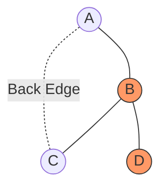
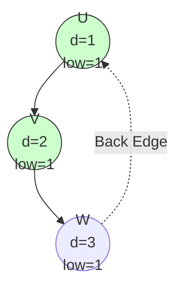
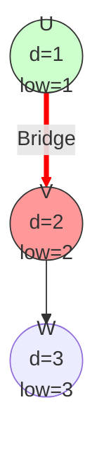
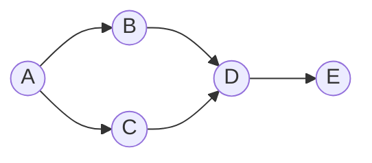

# Graph Applications: Structural Weaknesses & Ordering

The goal is to find "single points of failure" in a network efficiently ($O(V+E)$) using DFS, rather than the naïve $O(V(V+E))$ approach of removing each vertex one by one to check connectivity.

---

## 1. DFS Tree Properties
To understand Articulation Points and Bridges, we must understand the structure of a graph during a Depth First Search (DFS).

> [!INFO] Edge Categories
> *   **Tree Edges:** Edges traversed to discover *new* unvisited nodes.
> *   **Back Edges:** Edges connecting a node to an already visited **ancestor**.

**Key Insight:** Back edges form **cycles**. They provide "alternative paths." If a node's subtree has a back edge to an ancestor, removing that node will not disconnect the subtree from the rest of the graph.

---

## 2. Articulation Points (Cut Vertices)

### Definition
A vertex $v$ is an **Articulation Point (AP)** if removing $v$ (and its incident edges) increases the number of connected components.
*   *Implication:* These represent single points of failure in a network.

### Algorithm (Hopcroft & Tarjan)
We use DFS and maintain two arrays for every node $u$:
1.  **$d[u]$ (Discovery Time):** The time counter when we first enter the node.
2.  **$low[u]$ (Low-Link Value):** The lowest discovery time reachable from $u$ (including itself) via its subtree or a single **back-edge**.
    *   *Insight:* $low[u]$ indicates if a "secret path" exists connecting descendants back to ancestors.

#### Logic for Updating $low[u]$
When at node $u$ looking at neighbour $v$:

| Case  | Scenario                     | Action                                                   | Reasoning                                                                                                               |
| :---- | :--------------------------- | :------------------------------------------------------- | :---------------------------------------------------------------------------------------------------------------------- |
| **A** | $v$ is Parent of $u$         | **Ignore**                                               | Going back to parent doesn't count as a cycle.                                                                          |
| **B** | $v$ is Visited (Back Edge)   | `low[u] = min(low[u], d[v])`                             | $u$ connects to ancestor $v$. We take $d[v]$ directly because the back-edge is a "tunnel" to that exact discovery time. |
| **C** | $v$ is Unvisited (Tree Edge) | 1. Recurse DFS($v$)<br>2. `low[u] = min(low[u], low[v])` | Propagate the "highest reach" of the subtree up to $u$.                                                                 |

### Deep Dive: Why Ignore the Parent?
*   **The Question:** Since $u$ can technically reach its parent $v$ (it's connected), why don't we update `low[u]` using `d[parent]`?
*   **The Answer:** Because going back the way you came is a **Trivial Cycle**.
    *   **The Goal:** We want to find a *second*, independent path (a "back door") to an ancestor.
    *   **The Bridge Check:** If we included the parent, `low[child]` would always become $\le d[parent]$, making the bridge condition (`low > d`) impossible to satisfy. We essentially ask: *"If the path to my parent is cut, can I still reach the rest of the graph?"*

### The Critical Conditions
A node $u$ is an Articulation Point if:

1.  **If $u$ is the Root:**
    *   It has **more than 1 child** in the DFS tree.
    *   *Reasoning:* If the root has two children, there is no edge between the subtrees (otherwise DFS would have combined them). Removing the root disconnects them.

2.  **If $u$ is NOT the Root:**
    *   There is a child $v$ such that:
    $$low[v] >= d[u]$$
    *   *Reasoning:* The subtree rooted at $v$ has **no back-edge** to an ancestor of $u$. Every path from $v$ upwards must go through $u$. 

### Visual Representation


*In the graph above:*
*   **Cycle A-B-C:** $low$ values propagate up. Removing A, B, or C keeps the others connected via the cycle.
*   **Node D (Tail):** Connected only to B.
*   **Check for B:** D is a child of B. D cannot reach A (ancestor) without passing through B. Therefore, **B is an Articulation Point**.

### Pseudocode & Implementation

> [!notes]+ Pseudocode
> ```
> Initialize: 
> 			timer = 0 
> 			d[u] = 0, 
> 			low[u] = 0 for all u 
> 			visited[u] = false for all u 
> 			is_cutpoint[u] = false 
> Function DFS(u, p = -1): 
> 			visited[u] = true 
> 			d[u] = low[u] = ++timer 
> 			children = 0 
> 			
> 			For each neighbor v of u: 
> 				If v == p: 
> 					Continue (Ignore parent) 
> 				If v is visited: 
> 					low[u] = min(low[u], d[v]) (Back Edge) 
> 				Else: 
> 					DFS(v, u) 
> 					low[u] = min(low[u], low[v]) 
> 					if low[v] >= d[u] AND p != -1: 
> 						is_cutpoint[u] = true 
> 					children++ 
> 			If p == -1 AND children > 1: (Special Root Case) 
> 				is_cutpoint[u] = true
> ```


>[!hint]- C++ Implementations
```cpp

const int MAXN = 100005;
vector<int> adj[MAXN];
int tin[MAXN], low[MAXN]; // tin is 'd' in the slides
int timer;
bool is_cutpoint[MAXN]; // To store unique APs

void dfs_articulation_point(int u, int p = -1) {
    tin[u] = low[u] = ++timer;
    int children = 0;

    for (int v : adj[u]) {
        if (v == p) continue; // Case A: Parent [cite: 72]

        if (tin[v]) { 
            // Case B: Back Edge [cite: 75-76]
            low[u] = min(low[u], tin[v]);
        } else {
            // Case C: Tree Edge [cite: 88-90]
            dfs_articulation_point(v, u);
            low[u] = min(low[u], low[v]);
            
            // Check AP condition for non-root [cite: 95]
            if (low[v] >= tin[u] && p != -1)
                is_cutpoint[u] = true;
            
            children++;
        }
    }

    // Root Check [cite: 113]
    if (p == -1 && children > 1)
        is_cutpoint[u] = true;
}
```


---

## 3. Bridges (Cut Edges)

### Definition
An edge $(u, v)$ is a **Bridge** if removing it increases the number of connected components.
*   *Relation:* A bridge usually connects two Articulation Points (unless one end is a leaf).

### The Bridge Condition
In the DFS tree, an edge $(u, v)$ (where $v$ is a child of $u$) is a Bridge if:
> $$low[v] > d[u]$$

> [!TIP] Inequality Check
> *   **Articulation Point:** $low[v] >= d[u]$ (Back-edge to $u$ itself doesn't save $u$).
> *   **Bridge:** $low[v] > d[u]$ (Strict inequality).
> *   *Reasoning:* If $low[v] \le d[u]$, it means $v$ (or its subtree) has a back-edge to $u$ or an ancestor. This alternative path keeps $v$ connected even if the edge $(u, v)$ is removed. For $(u, v)$ to be a Bridge (a critical connection), $v$ must have *no* way back to $u$ or above, requiring the strict condition $low[v] > d[u]$.

### Visual Comparison: Bridge vs. Cycle

To understand the inequality, let's look at the numbers. Imagine we are at node **U** checking the edge to child **V**.

#### Scenario 1: The Safety Loop (Not a Bridge)
Here, the subtree at **V** has a back-edge to **U**.



1.  We discover **U** ($d=1$). We go to **V** ($d=2$).
2.  **V** goes to **W**. **W** finds a back-edge to **U**.
3.  **W** updates its low-link: $low[W] = d[U] = 1$.
4.  This propagates back up to **V**: $low[V] = 1$.
5.  **Check:** $low[V] (1) \le d[U] (1)$.
6.  **Result:** **NOT a Bridge**. If we cut $(U, V)$, $V$ can still reach $U$ via $W$.

#### Scenario 2: The Dead End (Bridge)
Here, **V** has nowhere to go but down.



1.  We discover **U** ($d=1$). We go to **V** ($d=2$).
2.  **V** goes to **W**. **W** has no back-edges. $low[W] = 3$.
3.  Propagates to **V**. **V** cannot reach anything higher than itself. $low[V] = 2$.
4.  **Check:** $low[V] (2) > d[U] (1)$.
5.  **Result:** **BRIDGE**. If we cut $(U, V)$, $V$ is completely cut off from $U$.

### Pseudocode & Implementation

>[!notes] Pseudocode!
```text
Initialize:
    timer = 0
    d[u] = 0, low[u] = 0 for all u
    visited[u] = false

Function DFS_Bridge(u, p = -1):
    visited[u] = true
    d[u] = low[u] = ++timer

    For each neighbor v of u:
        If v == p:
            Continue
        If v is visited:
            low[u] = min(low[u], d[v])
        Else:
            DFS_Bridge(v, u)
            low[u] = min(low[u], low[v])
            
            If low[v] > d[u]:
                Print "Bridge found: u - v"
```

>[! hint]- C++ Implementation
```cpp
// Re-using variables from AP section
vector<pair<int, int>> bridges; // Store result

void dfs_bridges(int u, int p = -1) {
    tin[u] = low[u] = ++timer;

    for (int v : adj[u]) {
        if (v == p) continue; // Ignore parent [cite: 312]

        if (tin[v]) {
            // Back Edge [cite: 315]
            low[u] = min(low[u], tin[v]);
        } else {
            // Tree Edge [cite: 327-329]
            dfs_bridges(v, u);
            low[u] = min(low[u], low[v]);

            // Bridge Condition [cite: 330]
            if (low[v] > tin[u]) {
                bridges.push_back({u, v});
            }
        }
    }
}
```
---

## 4. Topological Sorting

### Definition
A linear ordering of vertices in a directed graph such that for every directed edge $u \to v$, vertex $u$ comes before $v$ in the ordering.

> [!WARNING] Constraints
> *   Graph must be a **DAG** (Directed Acyclic Graph).
> *   If a cycle exists, Topological Sort is **impossible**.

### Real-World Analogies
*   **Prerequisites:** Course $u$ must be taken before Course $v$.
*   **Assembly:** Put on socks ($u$) before shoes ($v$).

### Algorithm: Source Removal (Kahn's Algorithm)
This method relies on **In-Degrees** (number of incoming edges).

1.  **Initialization:** Calculate In-Degree for all nodes.
2.  **Queue:** Add all nodes with `In-Degree == 0` to a Queue.
3.  **Process:**
    *   While Queue is not empty:
        *   Dequeue $u$, add to **Sorted List**.
        *   For every neighbor $v$ of $u$:
            *   Decrement `InDegree[v]`.
            *   If `InDegree[v] == 0`, Enqueue $v$.

### Cycle Detection
Topological Sort works as a cycle detection algorithm.
*   If the final Sorted List count $< V$, the graph has a cycle.
*   *Why?* Nodes in a cycle never reach In-Degree 0 because they are always waiting on each other.

### Visual Walkthrough


1.  **Start:** A has in-degree 0. Queue: `[A]`.
2.  **Process A:** Remove A. Decrement B and C. Queue: `[B, C]`. Output: `[A]`
3.  **Process B:** Remove B. Decrement D. Queue: `[C]`. Output: `[A, B]`
4.  **Process C:** Remove C. Decrement D (D becomes 0). Queue: `[D]`. Output: `[A, B, C]`
5.  **Process D:** Remove D. Decrement E (E becomes 0). Queue: `[E]`. Output: `[A, B, C, D]`
6.  **End:** Process E.

---

## 5. Quick Comparison

| Algorithm              | Condition / Key                         | Time     | Space  |
| :--------------------- | :-------------------------------------- | :------- | :----- |
| **Articulation Point** | $low[v] >= d[u]$ (Root needs >1 child) | $O(V+E)$ | $O(V)$ |
| **Bridge**             | $low[v] > d[u]$                         | $O(V+E)$ | $O(V)$ |
| **Topological Sort**   | In-Degree == 0 (DAG only)               | $O(V+E)$ | $O(V)$ |

---

## References
*   *Data Structures Using C, 2nd Edition*, Reema Thareja (Chapter 13).
*   CP-Algorithms: [Articulation Points](https://cp-algorithms.com/graph/cutpoints.html)
*   CP-Algorithms: [Bridges](https://cp-algorithms.com/graph/bridge-searching.html)
