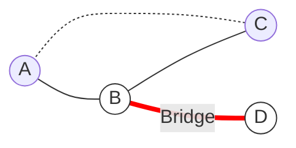

# Graph Applications: Structural Weaknesses & Ordering

The goal is to find "single points of failure" in a network efficiently ($O(V+E)$) using DFS, rather than the naive $O(V(V+E))$ approach of removing each vertex one by one to check connectivity.

---

## 1. DFS Tree Properties
To understand Articulation Points and Bridges, we must understand the structure of a graph during a Depth First Search (DFS).

> [!INFO] Edge Categories
> *   **Tree Edges:** Edges traversed to discover *new* unvisited nodes.
> *   **Back Edges:** Edges connecting a node to an already visited **ancestor**.

**Key Insight:** Back edges form **cycles**. They provide "alternative paths." If a node's subtree has a back edge to an ancestor, removing that node will not disconnect the subtree from the rest of the graph.

---

## 2. Articulation Points (Cut Vertices)

### Definition
A vertex $v$ is an **Articulation Point (AP)** if removing $v$ (and its incident edges) increases the number of connected components.
*   *Implication:* These represent single points of failure in a network.

### Algorithm (Hopcroft & Tarjan)
We use DFS and maintain two arrays for every node $u$:
1.  **$d[u]$ (Discovery Time):** The time counter when we first enter the node.
2.  **$low[u]$ (Low-Link Value):** The lowest discovery time reachable from $u$ (including itself) via its subtree or a single **back-edge**.
    *   *Insight:* $low[u]$ indicates if a "secret path" exists connecting descendants back to ancestors.

#### Logic for Updating $low[u]$
When at node $u$ looking at neighbor $v$:

| Case | Scenario | Action | Reasoning |
| :--- | :--- | :--- | :--- |
| **A** | $v$ is Parent of $u$ | **Ignore** | Going back to parent doesn't count as a cycle. |
| **B** | $v$ is Visited (Back Edge) | `low[u] = min(low[u], d[v])` | $u$ is part of a cycle connecting to ancestor $v$. |
| **C** | $v$ is Unvisited (Tree Edge) | 1. Recurse DFS($v$) 2. `low[u] = min(low[u], low[v])` | Propagate the "highest reach" of the subtree up to $u$. |

### The Critical Conditions
A node $u$ is an Articulation Point if:

1.  **If $u$ is the Root:**
    *   It has **more than 1 child** in the DFS tree.
    *   *Reasoning:* If the root has two children, there is no edge between the subtrees (otherwise DFS would have combined them). Removing the root disconnects them.

2.  **If $u$ is NOT the Root:**
    *   There is a child $v$ such that:
    $$low[v] >= d[u]$$
    *   *Reasoning:* The subtree rooted at $v$ has **no back-edge** to an ancestor of $u$. Every path from $v$ upwards must go through $u$. 

### Visual Representation

*In the graph above:*
*   **Cycle A-B-C:** $low$ values propagate up. Removing A, B, or C keeps the others connected via the cycle.
*   **Node D (Tail):** Connected only to B.
*   **Check for B:** D is a child of B. D cannot reach A (ancestor) without passing through B. Therefore, **B is an Articulation Point**.

---

## 3. Bridges (Cut Edges)

### Definition
An edge $(u, v)$ is a **Bridge** if removing it increases the number of connected components.
*   *Relation:* A bridge usually connects two Articulation Points (unless one end is a leaf).

### The Bridge Condition
In the DFS tree, an edge $(u, v)$ (where $v$ is a child of $u$) is a Bridge if:
> $$low[v] > d[u]$$

> [!TIP] Inequality Check
> *   **Articulation Point:** $low[v] >= d[u]$ (Back-edge to $u$ itself doesn't save $u$).
> *   **Bridge:** $low[v] > d[u]$ (Strict inequality).
> *   *Reasoning:* If $low[v] == d[u]$, there is a back-edge from the subtree to $u$. Removing the edge $(u, v)$ doesn't disconnect $v$ because it can still reach $u$ via the back-edge. We need $v$ to have *no* path to $u$ or above.

### Visual Representation

*   **Triangle (A, B, C):** No bridges. Removing any edge leaves a path.
*   **Edge (B, D):** If removed, D is isolated. $low[D] > d[B]$, so it is a Bridge.

---

## 4. Topological Sorting

### Definition
A linear ordering of vertices in a directed graph such that for every directed edge $u \to v$, vertex $u$ comes before $v$ in the ordering.

> [!WARNING] Constraints
> *   Graph must be a **DAG** (Directed Acyclic Graph).
> *   If a cycle exists, Topological Sort is **impossible**.

### Real-World Analogies
*   **Prerequisites:** Course $u$ must be taken before Course $v$.
*   **Assembly:** Put on socks ($u$) before shoes ($v$).

### Algorithm: Source Removal (Kahn's Algorithm)
This method relies on **In-Degrees** (number of incoming edges).

1.  **Initialization:** Calculate In-Degree for all nodes.
2.  **Queue:** Add all nodes with `In-Degree == 0` to a Queue.
3.  **Process:**
    *   While Queue is not empty:
        *   Dequeue $u$, add to **Sorted List**.
        *   For every neighbor $v$ of $u$:
            *   Decrement `InDegree[v]`.
            *   If `InDegree[v] == 0`, Enqueue $v$.

### Cycle Detection
Topological Sort works as a cycle detection algorithm.
*   If the final Sorted List count $< V$, the graph has a cycle.
*   *Why?* Nodes in a cycle never reach In-Degree 0 because they are always waiting on each other.

### Visual Walkthrough

1.  **Start:** A has in-degree 0. Queue: `[A]`.
2.  **Process A:** Remove A. Decrement B and C. Queue: `[B, C]`. Output: `[A]`
3.  **Process B:** Remove B. Decrement D. Queue: `[C]`. Output: `[A, B]`
4.  **Process C:** Remove C. Decrement D (D becomes 0). Queue: `[D]`. Output: `[A, B, C]`
5.  **Process D:** Remove D. Decrement E (E becomes 0). Queue: `[E]`. Output: `[A, B, C, D]`
6.  **End:** Process E.

---

## 5. Quick Comparison

| Algorithm              | Condition / Key                         | Time     | Space  |
| :--------------------- | :-------------------------------------- | :------- | :----- |
| **Articulation Point** | $low[v] >= d[u]$ (Root needs >1 child) | $O(V+E)$ | $O(V)$ |
| **Bridge**             | $low[v] > d[u]$                         | $O(V+E)$ | $O(V)$ |
| **Topological Sort**   | In-Degree == 0 (DAG only)               | $O(V+E)$ | $O(V)$ |

---

## References
*   *Data Structures Using C, 2nd Edition*, Reema Thareja (Chapter 13).
*   CP-Algorithms: [Articulation Points](https://cp-algorithms.com/graph/cutpoints.html)
*   CP-Algorithms: [Bridges](https://cp-algorithms.com/graph/bridge-searching.html)
