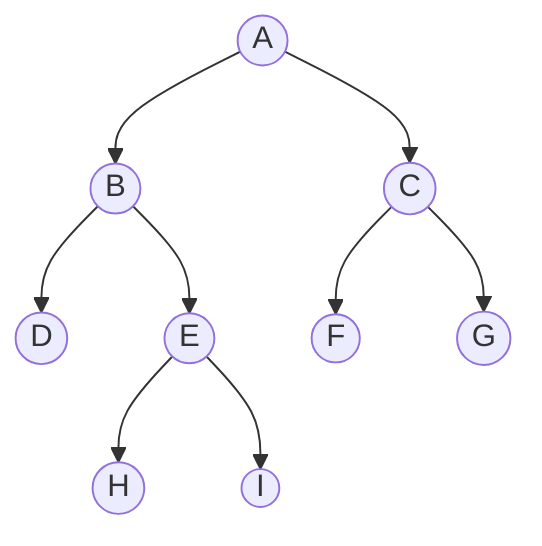

# Practice for Quiz 02: Data Structures

## Question Pattern
1.  **Algorithmic Simulation:** Step-by-step tracing of algorithms (like Quiz 01 Prefix evaluation).
2.  **Pseudo Code:** Logic for applying a specific Data Structure to solve a problem.

---

## Part 1: Algorithmic Simulations

### Topic: Stacks (Prefix/Postfix/Infix)

**Problem 1: Infix to Postfix Conversion**
Convert the following Infix expression to Postfix notation. Show the status of the **Stack** and the **Output String** at each step.
**Expression:** `K + L - M * N + (O ^ P) * W / U / V * T + Q`

*Tip: Remember the precedence: `^` (highest, R-L), `* /` (medium, L-R), `+ -` (lowest, L-R).*

**Problem 2: Prefix Evaluation**
Evaluate the following Prefix expression. Show the Stack status at each step.
**Expression:** `- + * 2 3 5 / ^ 2 3 4`

*Steps:*
1.  Scan from **Right to Left**.
2.  Push operands.
3.  When operator is found, Pop 2 operands, compute, Push result.

**Problem 3: Postfix Evaluation**
Evaluate the following Postfix expression. Show the Stack status.
**Expression:** `10 2 8 * + 3 -`

---

### Topic: Queues (Circular Queue & Deque)

**Problem 4: Circular Queue Tracing**
Consider a Circular Queue with a capacity (`MAX_SIZE`) of **5**.
Initial State: `FRONT = -1`, `REAR = -1`.
Trace the values of `FRONT`, `REAR`, and the **Queue Content** after the following operations:
1.  Enqueue(10)
2.  Enqueue(20)
3.  Enqueue(30)
4.  Dequeue()
5.  Enqueue(40)
6.  Enqueue(50)
7.  Enqueue(60) *(Check for Overflow)*
8.  Dequeue()
9.  Enqueue(70)

*Visual Aid:*
Remember `REAR = (REAR + 1) % SIZE`.

**Problem 5: Deque Operations**
Assume a Deque allows insertion and deletion at both ends. Trace the contents:
1.  `push_front(A)`
2.  `push_back(B)`
3.  `push_front(C)`
4.  `pop_back()`
5.  `push_back(D)`
6.  `pop_front()`

---

### Topic: Trees (Traversals & Construction)

**Problem 6: Tree Traversals**
Given the following Binary Tree:



Determine the output for:
1.  **Pre-order Traversal** (Root-Left-Right)
2.  **In-order Traversal** (Left-Root-Right)
3.  **Post-order Traversal** (Left-Right-Root)
4.  **Level-order Traversal** (BFS)

**Problem 7: Tree Reconstruction**
Construct the unique Binary Tree from the following two traversals. Draw the final tree.
*   **In-order:** `D B H E I A F C G`
*   **Pre-order:** `A B D E H I C F G`

*Strategy:* Use Pre-order to find the Root (`A`), then use In-order to split into Left Subtree (`D B H E I`) and Right Subtree (`F C G`). Repeat recursively.

**Problem 8: Huffman Coding**
Construct the Huffman Tree and determine the binary codes for the following characters and their frequencies:
*   **a:** 5
*   **b:** 9
*   **c:** 12
*   **d:** 13
*   **e:** 16
*   **f:** 45

---

### Topic: Binary Search Trees (BST)

**Problem 9: BST Construction & Deletion**
1.  Insert the following keys (in this order) into an initially empty BST:
    `50, 30, 20, 40, 70, 60, 80`
2.  Draw the resulting tree.
3.  **Delete Node 50** (Root). Show the tree after deletion.
    *(Hint: 50 has two children. You must replace it with its **In-order Predecessor** (Max of Left) or **Successor** (Min of Right).)*

---

## Part 2: Pseudo Code Applications

### Application 1: Parentheses Balancing (Stack)
**Scenario:** You are building a compiler. You need to verify if the braces in a source code file are balanced.
**Task:** Write pseudo code for a function `isBalanced(expression)` that returns `true` or `false`.
*   Supported pairs: `()`, `{}`, `[]`.
*   **Data Structure:** Stack.

```text
Function isBalanced(string exp):
    Create empty Stack S
    For each character C in exp:
        If C is '(', '{', or '[':
            Push C to S
        Else If C is ')', '}', or ']':
            If S is Empty -> Return False
            TopChar = Pop S
            If (C is ')' AND TopChar != '(') OR ... (check other pairs):
                Return False
    If S is Empty -> Return True
    Else -> Return False
```

### Application 2: Breadth-First Search (Queue)
**Scenario:** You need to print all nodes of a tree level-by-level (e.g., for analyzing network topology depth).
**Task:** Write pseudo code for Level Order Traversal.
*   **Data Structure:** Queue.

```text
Function LevelOrder(Node root):
    If root is NULL -> Return
    Create Queue Q
    Enqueue(Q, root)
    
    While Q is NOT Empty:
        Current = Dequeue(Q)
        Print Current.Data
        
        If Current.Left != NULL -> Enqueue(Q, Current.Left)
        If Current.Right != NULL -> Enqueue(Q, Current.Right)
```

### Application 3: Palindrome Checker (Deque)
**Scenario:** Check if a given string is a palindrome (reads same forwards and backwards).
**Task:** Write pseudo code using a Deque.

```text
Function isPalindrome(string s):
    Create Deque D
    For each char C in s:
        Push_Back(D, C)
        
    While Size(D) > 1:
        FrontChar = Pop_Front(D)
        BackChar = Pop_Back(D)
        If FrontChar != BackChar -> Return False
        
    Return True
```

### Application 4: BST Insertion (Iterative)
**Scenario:** Recursive functions can cause Stack Overflow on deep trees. You need an iterative version of BST insertion.
**Task:** Write pseudo code for `insertIterative(root, value)`.

```text
Function insertIterative(root, value):
    NewNode = CreateNode(value)
    If root is NULL:
        root = NewNode
        Return

    Current = root
    Parent = NULL

    While Current is NOT NULL:
        Parent = Current
        If value < Current.Data:
            Current = Current.Left
        Else:
            Current = Current.Right
            
    If value < Parent.Data:
        Parent.Left = NewNode
    Else:
        Parent.Right = NewNode

---

## Part 3: Advanced Concepts & Challenge Problems

### Topic: Complexity & Logic

**Problem 10: Asymptotic Analysis (Time Complexity)**
Calculate the tightest upper bound ($O$) for the following code snippet. Explain your derivation.
```cpp
void obscureFunction(int n) {
    for (int i = 1; i < n; i = i * 2) {      // Loop A
        for (int j = 0; j < i; j++) {        // Loop B
            cout << i << j;
        }
    }
}
```
*Hint: Analyze how many times Loop B runs relative to the growth of `i` (1, 2, 4, 8...). It is a geometric series.*

### Topic: Advanced Linked Lists

**Problem 11: XOR Linked List Traversal**
You are working with a memory-efficient **XOR Linked List**.
*   **Formula:** `Node->npx = Address(Prev) XOR Address(Next)`
*   **Memory Map:**
    *   **Node A (Addr 100):** `npx = 0 XOR 200`
    *   **Node B (Addr 200):** `npx = 100 XOR 300`
    *   **Node C (Addr 300):** `npx = 200 XOR 400`
    *   **Node D (Addr 400):** `npx = 300 XOR 0`

**Task:** You are currently at **Node C** (Address 300) and you arrived from **Node B** (Address 200).
1.  Calculate the address of the **Next Node** (D).
2.  Show the XOR calculation step-by-step.

### Topic: Advanced Queue/Deque Applications

**Problem 12: Sliding Window Maximum**
Given an array `arr = [1, 3, -1, -3, 5, 3, 6, 7]` and a window size $k=3$.
You need to find the maximum integer in each sliding window.
*   **Algorithm:** Use a **Deque** to store *indices* of useful elements.
*   **Task:** Trace the content of the Deque for every step.
    *   *Constraint:* The Deque must be maintained in **decreasing order** of values. Indices of elements that fall out of the window must be removed from the front.

**Problem 13: Queue using Stacks**
Design a Queue Data Structure using **only two Stacks** (`S1` and `S2`).
1.  Write Pseudo Code for `Enqueue(x)`.
2.  Write Pseudo Code for `Dequeue()`.
3.  What is the **Amortized Time Complexity** of the Dequeue operation?

### Topic: Advanced Graphs

**Problem 14: Warshall’s Algorithm (Transitive Closure)**
Given the Adjacency Matrix for a directed graph:
```text
  A B C
A 0 1 0
B 0 0 1
C 1 0 0
```
1.  Trace the construction of matrices $R^{(0)}$, $R^{(1)}$, $R^{(2)}$, and $R^{(3)}$.
2.  What does the final matrix tell you about the connectivity of A, B, and C?

**Problem 15: Adjacency Multi-list**
Draw the **Adjacency Multi-list** memory representation for the following undirected graph.
*   **Vertices:** A, B, C
*   **Edges:** (A, B), (A, C)
*   **Structure:** Show the `Head` array and the Edge Nodes with fields `[Mark | V1 | V2 | Link1 | Link2]`.

**Problem 16: Topological Sort & Cycles**
Attempt to perform a **Topological Sort** (using Kahn's In-Degree Algorithm) on the following graph:
*   $A \to B$
*   $B \to C$
*   $C \to A$
*   $C \to D$
*   **Task:** Trace the Queue and In-Degree array. Explain why the algorithm fails or succeeds.

### Topic: Binary Search Trees (Verification)

**Problem 17: Validate BST**
Write pseudo code for a function `isValidBST(Node root)` that returns `true` if a binary tree is a valid Binary Search Tree.
*   **Challenge:** Simply checking `root.left.val < root.val < root.right.val` recursively is **wrong**. (Example: A right child could have a left child that is smaller than the top Root).
*   **Hint:** Pass down a range `(min, max)` to each recursive call.
```
