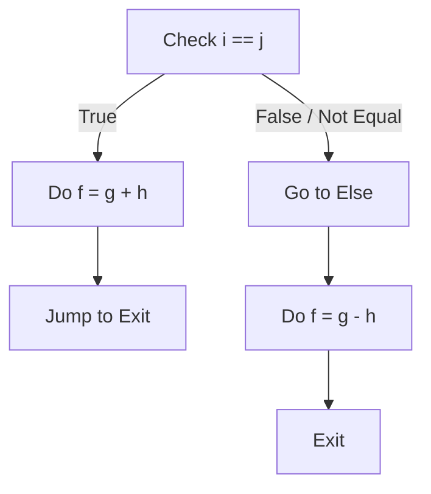

# Instruction Set Architecture (RISC-V)

**Course:** CSE 4305: Computer Organization and Architecture  
**Topic:** Instruction Set Architecture (ISA) & RISC-V  
**Tags:** #architecture #RISC-V #ISA #assembly #CS

---

## 1. What is an ISA?

The **Instruction Set Architecture (ISA)** is the abstract model of a computer. It serves as the critical boundary and interface between the hardware (processor) and the software (operating system/compiler).

### Key Roles of ISA:
*   **The "Contract":** It defines what the hardware is capable of doing and how software commands the hardware.
*   **Abstraction:** It hides the complexity of the underlying electronics (transistors, logic gates) from the programmer.
*   **Standardization:** Allows different hardware implementations (e.g., Intel Core i7 vs. AMD Ryzen) to run the same software if they share the same ISA (e.g., x86).

### Major ISA Examples
*   **x86:** Dominant in desktops/laptops/servers (Intel, AMD).
*   **ARM:** Dominant in mobile devices (Apple, Samsung, Embedded).
*   **RISC-V:** Open-source, rapidly growing in education and industry.
*   **MIPS, PowerPC:** Historical/Embedded importance.

> [!QUOTE] Design Principle
> "Good design demands good compromises."

---

## 2. CISC vs. RISC

Processor architectures are generally categorized into two types based on their instruction complexity.

| Feature | **CISC** (Complex Instruction Set Computer) | **RISC** (Reduced Instruction Set Computer) |
| :--- | :--- | :--- |
| **Philosophy** | Hardware should do the heavy lifting; compact code size. | Software (compiler) handles complexity; hardware should be simple and fast. |
| **Instruction Set** | Large, complex, specialized instructions. | Small, simple, general-purpose instructions. |
| **Instruction Length** | **Variable** (1 to 15 bytes). | **Fixed** (e.g., 32-bit standard). |
| **CPI (Cycles Per Instruction)** | Varies widely (multi-cycle). | Targets **1 cycle** per instruction. |
| **Memory Access** | Arithmetic operations can access memory directly (e.g., `ADD A, B` where A is in RAM). | **Load/Store Architecture** (Only `load` and `store` instructions access memory; arithmetic happens in registers). |
| **Examples** | x86 (Intel/AMD), VAX. | RISC-V, ARM, MIPS. |

---

## 3. Introduction to RISC-V

**RISC-V** (pronounced "Risk-Five") is the 5th generation of RISC architectures developed at UC Berkeley.

### Key Characteristics:
1.  **Open Source:** Unlike ARM or x86, the ISA is free to use (no royalty fees).
2.  **Simplicity:** Designed to be streamlined for efficient hardware implementation.
3.  **Modular:** Consists of a base integer ISA plus optional extensions (Floating point, Vector, etc.).
4.  **Variants:** Supports 32-bit (RV32), 64-bit (RV64), and 128-bit address spaces.

> [!NOTE] Design Principle
> **"Simplicity favors regularity."**
> Keeping instructions regular (fixed size, fixed fields) simplifies the hardware control logic.

---

## 4. RISC-V Operands

Computers operate on data. In RISC-V, data resides in two places: **Registers** (fast, limited) and **Memory** (slow, vast).

### A. Registers (The "Desks")
Registers are internal storage units within the CPU. They are the fastest storage available.
*   **Quantity:** 32 general-purpose registers (`x0` - `x31`).
*   **Size:** In RV64, each register is **64 bits** (called a doubleword). In RV32, they are 32 bits (word).
*   **Speed:** Accessing a register takes negligible time (sub-nanosecond).
*   **Constraints:** Arithmetic instructions *must* use registers.

**Register Convention (ABI Names):**
Although hardware calls them x0-x31, programmers use symbolic names:

| Register | ABI Name | Description | Preserved? |
| :--- | :--- | :--- | :--- |
| `x0` | `zero` | **Hardwired to 0**. Writes are ignored. | N/A |
| `x1` | `ra` | Return Address. | No |
| `x2` | `sp` | Stack Pointer. | Yes |
| `x3` | `gp` | Global Pointer. | - |
| `x4` | `tp` | Thread Pointer. | - |
| `x5` - `x7` | `t0` - `t2` | Temporary registers. | No |
| `x8` - `x9` | `s0` - `s1` | Saved registers (s0 is frame pointer). | Yes |
| `x10` - `x17` | `a0` - `a7` | Function arguments/return values. | No |
| `x18` - `x27` | `s2` - `s11` | Saved registers. | Yes |
| `x28` - `x31` | `t3` - `t6` | Temporary registers. | No |

> [!TIP] Design Principle
> **"Smaller is faster."**
> Having a huge number of registers (e.g., 1000) would increase the electrical signal distance and decoding time, slowing down the clock cycle. 32 is the "sweet spot."

### B. Memory (The "Library")
Used for composite data (arrays, structs) and spilling registers.
*   **Addressing:** Byte-addressable. Each address identifies a single 8-bit byte.
*   **Data Transfer:** To process memory data, you must **Load** it into a register, process it, then **Store** it back.
*   **Endianness:** RISC-V is **Little Endian**.
    *   *Little Endian:* Least Significant Byte (LSB) at the lowest address. (Used by x86, RISC-V).
    *   *Big Endian:* Most Significant Byte (MSB) at the lowest address. (Used by Network protocols, PowerPC).

---

## 5. Instruction Formats (The "Machine Code")

In RISC-V, every instruction is exactly **32 bits** long. To tell the processor what to do, these 32 bits are divided into "fields." There are 6 core formats.

### 1. R-Format (Register)
Used for arithmetic and logical operations using *only* registers.

| 7 bits | 5 bits | 5 bits | 3 bits | 5 bits | 7 bits |
| :---: | :---: | :---: | :---: | :---: | :---: |
| **funct7** | **rs2** | **rs1** | **funct3** | **rd** | **opcode** |

*   **opcode:** Operation code (what type of instruction).
*   **rd:** Destination register.
*   **rs1:** Source register 1.
*   **rs2:** Source register 2.
*   **funct3/funct7:** Additional variants of the operation (e.g., distinguishes ADD from SUB).

**Example:** `add x9, x20, x22`
*   `x9` gets `x20 + x22`.

### 2. I-Format (Immediate)
Used for operations with a constant (immediate) and Load instructions.

| 12 bits | 5 bits | 3 bits | 5 bits | 7 bits |
| :---: | :---: | :---: | :---: | :---: |
| **imm[11:0]** | **rs1** | **funct3** | **rd** | **opcode** |

*   **imm:** A 12-bit signed integer (Range: -2048 to +2047).
*   **rs2** field is gone; replaced by the immediate.

**Example 1 (Constant):** `addi x22, x22, 4` (x22 = x22 + 4).
**Example 2 (Load):** `lw x14, 8(x2)` (Load word into x14 from address in x2 + 8).

### 3. S-Format (Store)
Used for Store instructions.
*   *Problem:* We need `rs1` (base address) and `rs2` (data to store). We don't need `rd`. We also need an immediate (offset).
*   *Solution:* Split the immediate to keep `rs1` and `rs2` in the same bit positions as R-Format (Regularity!).

| 7 bits | 5 bits | 5 bits | 3 bits | 5 bits | 7 bits |
| :---: | :---: | :---: | :---: | :---: | :---: |
| **imm[11:5]** | **rs2** | **rs1** | **funct3** | **imm[4:0]** | **opcode** |

**Example:** `sw x14, 8(x2)`
*   Store value in `x14` into memory at address `x2 + 8`.

### 4. B-Format (Branch / SB-Format)
Used for conditional branches (if/else).
*   Similar to S-Format, but the immediate represents a PC-relative offset.
*   **Crucial Detail:** The immediate encodes an **even number** (multiples of 2 bytes). The LSB (bit 0) is always 0 and is *not stored* to save space.
*   **Scrambling:** The immediate bits are scrambled in the machine code to maximize overlap with other formats.

| 1 bit | 6 bits | 5 bits | 5 bits | 3 bits | 4 bits | 1 bit | 7 bits |
| :---: | :---: | :---: | :---: | :---: | :---: | :---: | :---: |
| **imm[12]** | **imm[10:5]** | **rs2** | **rs1** | **funct3** | **imm[4:1]** | **imm[11]** | **opcode** |

**Example:** `bne x22, x23, Else`

### 5. U-Format & J-Format
*   **U-Type:** Upper Immediate (20 bits). Used for `LUI` (Load Upper Immediate).
*   **J-Type:** Jump (20-bit offset). Used for `JAL` (Jump And Link).

---

## 6. Operations Summary

### A. Arithmetic
*   `add rd, rs1, rs2` -> `rd = rs1 + rs2`
*   `sub rd, rs1, rs2` -> `rd = rs1 - rs2`
*   `addi rd, rs1, imm` -> `rd = rs1 + immediate` (Note: No `subi`, just add negative immediate).

### B. Data Transfer (Load/Store)
Memory Access Formula: **Address = Base_Register + Sign_Extended_Offset**

*   `ld / lw`: Load Doubleword / Load Word.
*   `sd / sw`: Store Doubleword / Store Word.
*   `lb / lbu`: Load Byte (signed/unsigned).

### C. Logical
Operate on bits directly.
*   **Shift:** `sll` (Shift Left Logical), `srl` (Shift Right Logical), `sra` (Shift Right Arithmetic - preserves sign bit).
*   **Bitwise:**
    *   `and`: Masking (force 0s).
    *   `or`: Combining (force 1s).
    *   `xor`: Difference (invert bits).

### D. Control Flow (Decisions)
1.  **Conditional Branch:**
    *   `beq rs1, rs2, Label` (Branch if Equal).
    *   `bne rs1, rs2, Label` (Branch if Not Equal).
    *   `blt / bge`: Branch Less Than / Greater or Equal (Signed).
    *   `bltu / bgeu`: Unsigned versions.
2.  **Unconditional Jump:**
    *   `jal rd, Label`: Jump to Label, save return address in `rd` (usually `ra`).
    *   `jalr rd, offset(rs1)`: Jump to address in register.

---

## 7. Translating C to RISC-V: Examples

### Example 1: Simple Arithmetic
**C Code:**
```c
f = (g + h) - (i + j);
```
*Assume f..j are in x19..x23*

**RISC-V:**
```assembly
add x5, x20, x21    // t0 = g + h
add x6, x22, x23    // t1 = i + j
sub x19, x5, x6     // f = t0 - t1
```

### Example 2: If/Else Statement
**C Code:**
```c
if (i == j)
    f = g + h;
else
    f = g - h;
```

**RISC-V Logic:**


**RISC-V Assembly:**
```assembly
    bne x22, x23, Else    // If i != j, skip to Else
    add x19, x20, x21     // f = g + h
    beq x0, x0, Exit      // Unconditional jump to Exit (pseudo-instruction for JAL)
Else:
    sub x19, x20, x21     // f = g - h
Exit:
    // Continue
```

> [!TIP] Deep Dive: Why use `bne` for `if (i == j)`?
> You might wonder why we use **Branch if Not Equal (`bne`)** when the C code checks if they **are** equal (`==`).
>
> **The Logic of "Fall-Through":**
> Processors execute instructions sequentially (from top to bottom). To "enter" the `if` block, we simply let the processor **fall through** to the next line.
>
> 1.  **C Logic:** "If True, go inside. If False, go to Else."
> 2.  **Assembly Logic:** "If **False** (i != j), **SKIP** the 'If' block and jump to Else."
>
> Therefore, we **invert the condition**:
> *   C: `if (i == j)`
> *   ASM: `bne x22, x23, Else` (Skip if they are NOT equal).
>
> If we used `beq`, we would be jumping *away* to the code meant to run when they are equal, which would force us to rearrange the memory order of the blocks (placing the 'Else' code first physically). Using the inverted logic preserves the visual flow of the C program.

### Example 3: While Loop
**C Code:**
```c
while (i != j) {
    i = i + 1;
}
```

**RISC-V Assembly:**
```assembly
Loop:
    beq x22, x23, Exit    // If i == j, exit loop (Inverse logic of while)
    addi x22, x22, 1      // i = i + 1
    beq x0, x0, Loop      // Jump back to start
Exit:
```

---

## 8. Addressing Modes Details

How does the processor know where the data is?

1.  **Immediate Addressing:** The data is inside the instruction.
    *   Ex: `addi x1, x2, 10`
2.  **Register Addressing:** The data is in a register.
    *   Ex: `add x1, x2, x3`
3.  **Base (Displacement) Addressing:** Memory address = Register + Immediate.
    *   Ex: `lw x1, 100(x2)`
4.  **PC-Relative Addressing:** Branch Target = PC + (Immediate * 2).
    *   Ex: `bne x1, x2, Label`
    *   The "Label" is converted by the assembler into an offset.
    *   Since instructions are 32-bits (4 bytes) aligned in memory, the bottom bits are always 00, allowing the immediate to store a larger range by implicit shifting.

### Summary: RISC-V Addressing Modes

| Mode | Description | Formula / Logic | Used By |
| :--- | :--- | :--- | :--- |
| **1. Immediate** | Operand is a constant inside the instruction. | `Value = imm` | `addi`, `andi`, `slli` |
| **2. Register** | Operand is inside a register. | `Value = Register[rs]` | `add`, `sub`, `xor` |
| **3. Base** | Data is in memory; address is Register + Constant. | `MemAddr = Register[rs1] + imm` | `ld`, `sd`, `lw`, `sw` |
| **4. PC-Relative** | Jump target is relative to current PC. | `Target = PC + imm` | `beq`, `bne`, `jal` |

---

## 9. Common Fallacies

1.  **"More powerful instructions = Higher Performance"**
    *   *Reality:* Complex instructions (CISC) are hard to implement in hardware. They can slow down the clock frequency. It is often faster to execute 3 simple instructions at high speed than 1 complex instruction slowly.
2.  **"Writing in Assembly yields the highest performance"**
    *   *Reality:* Modern compilers (gcc, clang) are incredibly smart at optimization and register allocation. Hand-written assembly often introduces bugs and is harder to maintain, with marginal or negative performance gains compared to optimized C++.

---

## 10. Summary of Numerical Representations
*   **Unsigned Integers:** 0 to $2^n - 1$.
*   **Signed Integers (2's Complement):** $-2^{n-1}$ to $2^{n-1} - 1$.
    *   To make a number negative: Invert bits and add 1.
    *   MSB is the sign bit (1 = negative).
*   **Sign Extension:** When loading a standard 32-bit integer into a 64-bit register, the sign bit is copied to fill the upper bits to preserve the value.

---

## 11. Deep Dive: I-Format & Immediates

### Why use Immediates?
The **I-Format** (Immediate) is designed to handle constants and offsets efficiently.
1.  **Speed:** Avoids slow memory accesses by embedding constants directly in the instruction.
2.  **Common Case:** Most operations use small constants (e.g., `i++`, `i = i + 4`).
3.  **Offsets:** Essential for base-displacement addressing (e.g., accessing struct fields `lw x1, 8(x2)`).

### Visualizing the I-Format
**Instruction:** `addi x22, x22, 4`
*(Add immediate 4 to register x22)*

| Bits | 31–20 | 19–15 | 14–12 | 11–7 | 6–0 |
| :--- | :---: | :---: | :---: | :---: | :---: |
| **Field** | **imm[11:0]** | **rs1** | **funct3** | **rd** | **opcode** |
| **Binary** | `0000 0000 0100` | `10110` | `000` | `10110` | `0010011` |
| **Decimal** | 4 | 22 | 0 | 22 | 19 |
| **Meaning** | Constant (4) | Source (x22) | Add | Dest (x22) | OP-IMM |

> [!NOTE] Endianness Clarification
> **Logical vs. Physical:**
> *   **Logical View (Above):** We write MSB (Bit 31) on the left. The value `4` reads naturally as `...0100`.
> *   **Physical Storage (Little Endian):** In RAM, the **Least Significant Byte** (the opcode `0010011` part) is stored at the *lowest* memory address. The CPU handles reassembling this, so programmers usually focus on the Logical View.

### Handling Negative Immediates
**Instruction:** `addi x15, x1, -50`
*(Add immediate -50 to register x1)*

To store **-50**, the processor uses **12-bit Two's Complement**:

1.  **Positive 50:** `0000 0011 0010` (32 + 16 + 2)
2.  **Invert (1s Comp):** `1111 1100 1101`
3.  **Add 1 (2s Comp):** `1111 1100 1110`

**The Resulting Machine Code:**
| **Binary** | `111111001110` | `00001` | `000` | `01111` | `0010011` |
| **Meaning** | -50 | x1 | Add | x15 | OP-IMM |

---

### Detail: The "Width" Field (funct3)

In many hardware diagrams, the 3-bit field for Load instructions is often labeled **"width"**. It is technically the **`funct3`** field. 

> [!INFO] Role of Width vs. Opcode
> *   **The Opcode:** Tells the CPU *that* it is performing a memory load.
> *   **The Width (funct3):** Tells the CPU *how much* data to fetch and how to handle the remaining bits in the register (Sign Extension).

| funct3 (Binary) | Instruction | Data Size | Sign Extension? |
| :--- | :--- | :--- | :--- |
| `000` | **lb** (Load Byte) | 8-bit | Yes (Sign-extend) |
| `001` | **lh** (Load Halfword) | 16-bit | Yes (Sign-extend) |
| `010` | **lw** (Load Word) | 32-bit | Yes (Sign-extend) |
| `011` | **ld** (Load Double) | 64-bit | - |
| `100` | **lbu** (Load Byte Unsigned) | 8-bit | No (Zero-extend) |
| `101` | **lhu** (Load Halfword Unsigned)| 16-bit | No (Zero-extend) |

---

## 12. Deep Dive: SB-Format (Branch Encoding)

The SB-Format is used for **Conditional Branches** (like `beq`, `bne`).
It requires two registers (to compare) and an immediate (to know where to jump).

**The Challenge:** We need to keep `rs1` and `rs2` in the same place as other formats to keep the hardware simple, but we also need a long immediate value for the jump offset.

### 1. The Bit Layout (The "Scramble")
In the 32-bit instruction, the immediate bits are split and rearranged. This looks confusing, but it allows the **Sign Bit (bit 31)** to stay in the same place as every other instruction format, which speeds up hardware processing.

| Bit 31 | 30 - 25 | 24 - 20 | 19 - 15 | 14 - 12 | 11 - 8 | Bit 7 | 6 - 0 |
| :---: | :---: | :---: | :---: | :---: | :---: | :---: | :---: |
| **imm[12]** | **imm[10:5]** | **rs2** | **rs1** | **funct3** | **imm[4:1]** | **imm[11]** | **opcode** |

*   **imm[12]:** The sign bit (Most Significant Bit).
*   **imm[11]:** Placed low in the instruction (bit 7).
*   **imm[10:5] & imm[4:1]:** The rest of the bits.

### 2. The "Implicit 0" (Why 12 bits becomes 13)
RISC-V instructions are always aligned to 2 bytes (16 bits). This means every valid memory address for an instruction must end in `0` (binary).
*   Since the **Least Significant Bit (LSB)** of the offset is *always* 0, we don't need to waste space storing it in the instruction!
*   We store bits **1 through 12** in the instruction.
*   The hardware automatically appends a **0** at bit position 0 when executing.

**The Result:**
*   We store **12 bits** of space.
*   We get **13 bits** of effective range.
*   **Range:** $-2^{12}$ to $+2^{12}-2$ bytes ($\pm 4096$ bytes or $\pm 4$KB).

### 3. Visualizing the Reconstruction
When the CPU reads the instruction, it reconstructs the 13-bit offset like this:

| 12 | 11 | 10 | 9 | 8 | 7 | 6 | 5 | 4 | 3 | 2 | 1 | **0** |
| :---: | :---: | :---: | :---: | :---: | :---: | :---: | :---: | :---: | :---: | :---: | :---: | :---: |
| Inst[31] | Inst[7] | Inst[30] | Inst[29] | Inst[28] | Inst[27] | Inst[26] | Inst[25] | Inst[11] | Inst[10] | Inst[9] | Inst[8] | **0 (Implicit)** |

> [!EXAMPLE] Concrete Example: `bne x22, x23, 12`
> We want to jump forward **12 bytes**.
> *   **Target Offset (Decimal):** 12
> *   **Target Offset (Binary):** `0000 0000 01100`
>
> **Step 1: Identify bits to store**
> We drop the last bit (bit 0). We keep bits 1-12.
> Value to encode: `0000 0000 0110`
>
> **Step 2: Map to Instruction Fields**
> *   **imm[12]** (Sign): `0` (goes to bit 31)
> *   **imm[11]**: `0` (goes to bit 7)
> *   **imm[10:5]**: `000000` (goes to bits 30-25)
> *   **imm[4:1]**: `0110` (goes to bits 11-8)
>
> **Final Machine Code Fields:**
> `0` | `000000` | `rs2` | `rs1` | `funct3` | `0110` | `0` | `opcode`