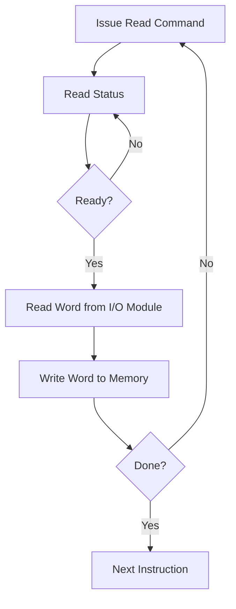

---
tags:
  - computer-architecture
  - IO
  - cse-4305
  - hardware
source: Lecture 7 - Input/Output
reference: Computer Organization and Architecture, William Stallings (10th Ed)
---

# Input/Output Organization

## 1. Introduction to External Devices
External devices (peripherals) connect the computer to the outside world. They are classified into three broad categories:

1.  **Human Readable:** Suitable for communicating with computer users.
    *   *Examples:* Video display terminals (Monitors), Printers.
2.  **Machine Readable:** Suitable for communicating with equipment.
    *   *Examples:* Magnetic disks, Tape systems, Sensors, Actuators.
3.  **Communication:** Suitable for communicating with remote devices.
    *   *Examples:* Modems, Network Interface Cards (WiFi/Ethernet).

### Structure of an External Device
An external device is not just the physical mechanism; it connects to the I/O module via a digital interface.
*   **Control Signals:** Determine the function (e.g., READ, WRITE, REPORT STATUS).
*   **Data Signals:** Bits sent to or received from the I/O module.
*   **Status Signals:** Indicate state (e.g., READY, BUSY, ERROR).
*   **Control Logic:** Controls the device operations based on commands from the I/O module.
*   **Transducer:** Converts data from electrical to other forms of energy (output) or vice versa (input).
*   **Buffer:** Temporarily holds data being transferred to cope with speed mismatches.

---

## 2. The I/O Module
### Why not connect peripherals directly to the System Bus?
Direct connection is impractical for several reasons:
1.  **Variety:** Peripherals have diverse methods of operation. It is impossible to incorporate the logic for every device into the [[CPU]].
2.  **Data Transfer Rates:**
    *   Most peripherals are much **slower** than the CPU/RAM (e.g., keyboard).
    *   Some are **faster** (e.g., high-speed network, GPU).
    *   Using the high-speed system bus for slow devices lowers overall system performance.
3.  **Data Formats:** Peripherals often use different word lengths and protocols than the computer architecture.

**Solution:** The **I/O Module**.
The I/O module (or I/O Controller) acts as a specialized interface responsible for managing I/O sources, error detection, and communication.

### Major Functions of an I/O Module
1.  **Control and Timing:** Coordinates the flow of traffic between internal resources (CPU/RAM) and external devices.
2.  **Processor Communication:**
    *   *Command Decoding:* Accepts commands (READ, WRITE, SEEK, TEST).
    *   *Data:* Exchanges data via the data bus.
    *   *Status Reporting:* Reports BUSY or READY states.
    *   *Address Recognition:* Recognizes unique addresses for each peripheral it controls.
3.  **Device Communication:** Handles commands, status info, and data with the peripheral.
4.  **Data Buffering:**
    *   Essential for smoothing out speed differences.
    *   Data flows from Main Memory $\to$ I/O Module (Rapid) $\to$ Peripheral (Slow).
5.  **Error Correction:** Detects transmission errors (bit flips) or mechanical errors (paper jam).

---

## 3. I/O Transfer Modes
There are three main techniques for I/O operations:

### A. Programmed I/O
The CPU directly controls the I/O operation including sensing status, sending read/write commands, and transferring data.

*   **Mechanism:**
    1.  CPU issues a command to the I/O module.
    2.  CPU enters a **busy-wait** loop (polling).
    3.  CPU periodically checks the I/O module's status register.
    4.  Once the module is ready, the CPU transfers the data word.
*   **Disadvantages:**
    *   **Wasteful:** The CPU stays idle (looping) while waiting for the slow peripheral.
    *   Severely degrades system performance.



### B. Interrupt-Driven I/O
The CPU issues an I/O command and then continues executing other instructions. The I/O module interrupts the CPU when it is ready.

*   **Mechanism:**
    1.  CPU issues READ command.
    2.  CPU performs other work.
    3.  I/O module gathers data. When ready, it sends an **Interrupt Signal** via a control line.
    4.  CPU finishes the current instruction cycle, saves its context (Push to stack), and processes the interrupt (reads data).
    5.  CPU restores context and resumes previous work.
*   **Advantage:** Eliminates busy waiting.
*   **Disadvantage:** Still requires active CPU intervention for *every single word* transferred. High overhead for large data blocks (e.g., disk transfers).

#### Interrupt Design Issues
**Issue 1: Identification (Who interrupted?)**
1.  **Multiple Interrupt Lines:** Impractical to have a line for every device.
2.  **Software Poll:** CPU jumps to a generic ISR (Interrupt Service Routine) and polls every device to ask "Did you interrupt?". *Slow.*
3.  **Daisy Chain (Hardware Poll):**
    *   A common `Interrupt Request` line is shared.
    *   CPU sends an `Interrupt Acknowledge` (ACK).
    *   The ACK signal propagates down a chain of I/O modules.
    *   The first module that requested the interrupt grabs the ACK and places its **Vector Address** on the data bus.

**Issue 2: Priority (Who goes first?)**
*   **Multiple Lines:** Assign priorities to specific lines.
*   **Daisy Chain:** The module physically closer to the CPU has higher priority.

### C. Direct Memory Access (DMA)
Used for high-speed, high-volume data transfers (e.g., Disk to Memory). The CPU delegates the transfer to a dedicated DMA Module.

*   **Mechanism:**
    1.  CPU sends a block descriptor to the DMA module:
        *   Read/Write command.
        *   Device Address.
        *   Starting Memory Address.
        *   Amount of data (Count).
    2.  CPU continues other work.
    3.  **DMA Module takes over the system bus** and transfers the *entire block* directly to/from memory, word by word.
    4.  DMA interrupts the CPU only when the *entire block* is finished.
*   **Efficiency:** CPU is only involved at the beginning and end of the transfer.

#### Comparison of CPU Efficiency

| Mode | CPU Involvement | Efficiency |
| :--- | :--- | :--- |
| **Programmed I/O** | 100% (Waiting + Transfer) | Very Low |
| **Interrupt I/O** | High (Transfer per word) | Medium |
| **DMA** | Low (Setup + Cleanup only) | High |

---

## 4. Key Concepts & Terminology

> [!INFO] Cycle Stealing
> In DMA, the DMA controller and the CPU contend for the System Bus. The DMA module may force the CPU to pause for one bus cycle to transfer a word. This is called "Cycle Stealing". It slows the CPU slightly but is much more efficient than Programmed I/O.

> [!INFO] Vector Interrupt
> In the Daisy Chain method, when a device identifies itself, it sends a unique "Vector" (address or ID) to the CPU. The CPU uses this vector to jump directly to the specific software routine needed to handle that device, avoiding the need to poll.

```