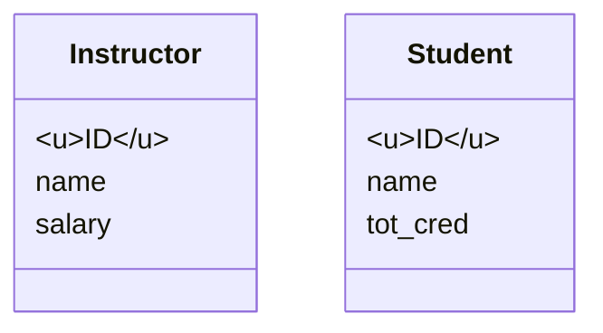

***

# Database Design using ERD (Lecture 5)

**Course:** CSE 4307: Database Management Systems
**Source:** Md. Tariquzzaman, IUT

---

## 1. Overview of the Design Process

Database design is not a single step; it is a sequence of phases aimed at creating a system that avoids **Redundancy** (wasted space/inconsistency risk) and **Incompleteness** (bad business logic).

### The Three Main Phases
1.  **Initial Phase:**
    *   Goal: Characterize data needs.
    *   Action: Interaction with domain experts.
    *   *Outcome:* Specification of user requirements.
2.  **Conceptual-Design Phase:**
    *   Goal: Translate requirements into a schema.
    *   Tool: **ER Model** (Entity-Relationship).
    *   *Nature:* Abstract design; independent of specific software (DBMS).
3.  **Implementation Phase:**
    *   **Logical Design:** Mapping conceptual schema to a data model (e.g., Relational Model/Tables).
    *   **Physical Design:** Handling storage, file organization, and indexing.

> [!INFO] Design Goals
> A good design must avoid:
> 1.  **Redundancy:** Repeating information.
> 2.  **Incompleteness:** Making it impossible to model certain business aspects.

---

## 2. The Entity-Relationship (ER) Model

The ER model is used to visually represent data requirements.

### A. Entities
*   **Definition:** An object in the real world that is **distinguishable** from all other objects.
*   **Types:**
    *   *Concrete:* Tangible (e.g., Employee, Machine).
    *   *Abstract:* Intangible concepts (e.g., Course, Flight Booking).
*   **Entity Set:** A collection of entities of the same type (analogous to a **Table** in a database, where an Entity is a **Row**).

### B. Attributes
Attributes are descriptive properties possessed by all members of an entity set.

| Attribute Type | Definition | Example | ER Notation |
| :--- | :--- | :--- | :--- |
| **Simple** | Atomic; no sub-parts. | `Salary` | Listed in box |
| **Composite** | Divided into sub-parts. | `Name` (First, Last) | Hierarchy tree |
| **Single-valued** | Holds one value. | `Student_ID` | Standard |
| **Multi-valued** | Zero, one, or more values. | `Phone_Number` | Double Ellipse / `[]` |
| **Derived** | Computed, not stored. | `Age` (from DOB) | Dashed Ellipse |

#### Visual Notation Example
In the slides, Entity Sets are represented by **Rectangles** with attributes listed inside. The **Primary Key (PK)** is underlined.



### C. Advanced Attribute Implementation (PostgreSQL)

**1. Composite Attributes in SQL:**
PostgreSQL allows defining a `COMPOSITE TYPE`.

```sql
-- Step 1: Create the type
CREATE TYPE nametype AS (
    fname VARCHAR(10),
    middlename VARCHAR(10),
    lastname VARCHAR(10)
);

-- Step 2: Use in table
CREATE TABLE emp (
    id INT PRIMARY KEY,
    name nametype,
    address VARCHAR(20)
);

-- Accessing data
SELECT id, (name).fname FROM emp;
```

**2. Multi-valued Attributes in SQL:**
Implemented using **Arrays**.

```sql
CREATE TABLE students_multiple (
    id INT,
    name VARCHAR(20),
    phone VARCHAR(20)[] -- The [] denotes an array
);

INSERT INTO students_multiple VALUES 
(1, 'Alice', ARRAY['01711...', '01911...']);
```

---

## 3. Relationships

A **Relationship** is an association among several entities. A **Relationship Set** is a mathematical relation among $n \ge 2$ entity sets.

### Degrees of Relationship
1.  **Binary:** Involves two entity sets (Most common).
    *   *Example:* Student --- *Enrolled* --- Course.
2.  **Ternary:** Involves three entity sets simultaneously.
    *   *Example:* Supplier --- *Supply* --- Part --- Project (A supplier supplies a specific part to a specific project).

### Roles and Recursion
Entities in a relationship do not need to be distinct. The same entity set can participate in different **roles**.
*   **Recursive Relationship Example:** `Course` references itself via `Prereq`.
    *   Role 1: `course_id` (Main course)
    *   Role 2: `prereq_id` (Required course)

### Attributes on Relationships
Attributes can belong to the relationship itself, usually describing the *nature* of the association.
*   *Example:* `Advisor` relationship between `Student` and `Instructor` might have a `date` attribute (when the advising started).
*   *Implementation Rule:* This attribute moves to wherever the **Foreign Key** goes.

---

## 4. Mapping Cardinality

Cardinality expresses the number of entities to which another entity can be associated.

### A. The Four Types

| Type | Description | Real-world Example | Visual (Arrows) |
| :--- | :--- | :--- | :--- |
| **One-to-One (1:1)** | An entity in A is associated with at most one in B, and vice versa. | Person $\leftrightarrow$ Driving License | Arrow on **both** sides ($\rightarrow \Diamond \leftarrow$) |
| **One-to-Many (1:N)** | A associated with many B; B associated with one A. | Department $\rightarrow$ Student | Arrow on "One" side; Line on "Many" side |
| **Many-to-One (N:1)** | Reverse of 1:N. | Student $\rightarrow$ Department | Line on "Many"; Arrow on "One" |
| **Many-to-Many (M:N)** | A associated with many B; B associated with many A. | Student --- Course | Simple lines on **both** sides |

### B. Min..Max Notation
Alternative notation `l..h` on the line.
*   $l$ = Minimum cardinality ($1$ implies total participation).
*   $h$ = Maximum cardinality ($*$ means many).

> [!WARNING] Precaution
> Reading Min..Max notation can be counter-intuitive.
> *   Label `0..*` on Instructor side means: An instructor can have 0 to many students.
> *   Label `1..1` on Student side means: A student must have exactly one instructor.
> *   **Result:** This describes a **One-to-Many** relationship from Instructor to Student.

---

## 5. Participation Constraints

*   **Total Participation (Double Line):** Every entity *must* participate in the relationship.
    *   *Example:* Every `Student` must have an `Advisor`.
    *   *SQL:* Implemented using `NOT NULL` Foreign Keys.
*   **Partial Participation (Single Line):** Some entities may not participate.
    *   *Example:* An `Instructor` might not advise any students.

---

## 6. Weak vs. Strong Entity Sets

| Feature | Strong Entity | Weak Entity |
| :--- | :--- | :--- |
| **Definition** | Independent; exists on its own. | Existence depends on a Strong Entity. |
| **Key** | Has a Primary Key (PK). | No PK; has a **Partial Key** (discriminator). |
| **Visual** | Single Rectangle. | Double Rectangle. |
| **Relationship** | Single Diamond. | Double Diamond (identifying relationship). |
| **Identification** | Unique by its own attributes. | Unique by (Strong Entity PK + Partial Key). |

*Example:* A `Loan` (Strong) has `Payments` (Weak). You cannot identify "Payment #1" without knowing which Loan it belongs to.

---

## 7. Generalization and Specialization

*   **Specialization (Top-down):** Dividing an entity into subgroups (e.g., Person $\to$ Employee, Student).
*   **Generalization (Bottom-up):** Combining entities with shared features.
*   **Notation:** Hollow arrow-head pointing to the higher-level entity (ISA relationship).

### Membership Constraints
1.  **Condition-defined:** Membership based on an attribute (e.g., `age > 65`).
2.  **User-defined:** Manual assignment.
3.  **Disjoint:** Entity belongs to max one subgroup (Student OR Employee).
4.  **Overlapping:** Entity can belong to multiple (Student AND Employee).

---

## 8. ER Diagram Implementation (Conversion to Tables)

This is the process of converting the conceptual diagram into SQL DDL.

### Golden Rule of Foreign Keys
> A standard database cell can hold only **one atomic value**.

### A. Converting Relationships

#### 1. One-to-Many (1:N)
*   **Rule:** Identify the "Many" side. Place the PK of the "One" side entity inside the "Many" side table as a **Foreign Key (FK)**.
*   *Example:* `Dept (1) -> Student (N)`. `Student` table gets `Dept_ID` column.

#### 2. One-to-One (1:1)
*   **Rule:** Place the FK in either table (preferably the one with total participation).
*   **Constraint:** You must apply a `UNIQUE` constraint to the Foreign Key to ensure strictly 1:1.

#### 3. Many-to-Many (M:N)
*   **Problem:** Neither table can hold the FK without violating First Normal Form (atomicity).
*   **Solution:** Create a **Junction Table** (also called Bridge/Association table).
*   **Structure:**
    *   Column 1: FK from Entity A.
    *   Column 2: FK from Entity B.
    *   Columns 3+: Relationship attributes (e.g., `Grade`).
    *   **Primary Key:** Composite Key `(FK_A, FK_B)`.

```sql
-- Example M:N Implementation
CREATE TABLE Enrollment (
    S_ID INT REFERENCES Student(ID),
    C_ID INT REFERENCES Course(ID),
    Grade VARCHAR(2),
    PRIMARY KEY (S_ID, C_ID)
);
```

### B. Converting Generalization (Method 2)
Create distinct tables for higher-level and lower-level sets.

```sql
-- 1. Higher Level
CREATE TABLE Person (
    ID INT PRIMARY KEY,
    Name VARCHAR(100)
);

-- 2. Lower Level
CREATE TABLE Employee (
    ID INT PRIMARY KEY REFERENCES Person(ID), -- Acts as PK and FK
    Salary DECIMAL(10,2)
);
```

### C. Handling Redundant Attributes
If an ER diagram has an attribute that replicates a relationship (e.g., `dept_name` inside `Student` when a relationship `stud_dept` exists), remove the attribute from the conceptual model. It will naturally reappear as a Foreign Key during implementation.