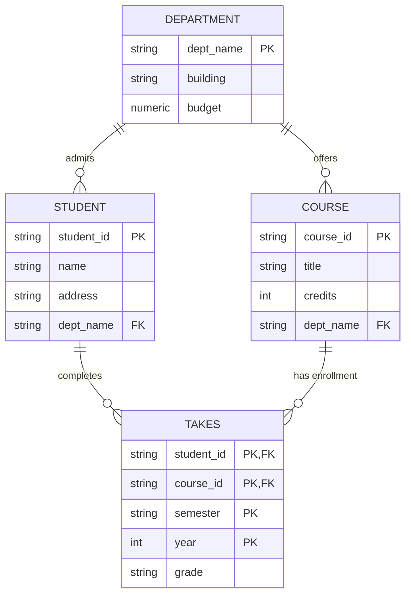

When approaching a complex query problem—especially one involving "ALL" (Relational Division) or "NONE" (Set Difference)—it helps to follow a structured mental process. You shouldn't try to write the final code immediately.

Here is a 4-step framework to break down any database problem.

---

### Step 1: The "Plain English" Breakdown

Before thinking about code, rewrite the problem statement into distinct logical parts. Identify **The Target**, **The Source**, and **The Condition**.

- **Example Problem:** _"Find the names of students who have taken ALL Biology courses."_    
- **Target (Output):** Student Names.    
- **Source (Tables):** `Student`, `Takes`, `Course`.    
- **Condition:** They must not have missed any Biology course.


### Step 2: Determine the "Logic Pattern"

Most database problems fall into one of three patterns. Identifying this early saves you time.

|**Pattern**|**Keyword Clues**|**Strategy**|
|---|---|---|
|**1. Basic Match**|"Find students who took...", "Find instructors in..."|Standard **Join** ($\bowtie$) + Filter ($\sigma$).|
|**2. Negation**|"Who have **never**...", "Who did **not**..."|**Set Difference** (`EXCEPT`) or `NOT EXISTS`.|
|**3. "The All" (Division)**|"Who took **every**...", "Who taught **all**..."|**Double Negation** ("There is no course they didn't take") or **Counting** ("Count of taken = Count of total").|

---

### Step 3: Constructing the Solution (Layer by Layer)

If you are writing Relational Algebra, build from the inside out.

If you are writing SQL, build from the FROM clause up.

Let's apply this to the "Find students who took ALL Biology courses" problem.

#### Approach A: The "Double Negative" Logic (RA Style)

- **Logic:** _Find students where there is NO Biology course that they have NOT taken._
    
- **Layer 1 (The "Bad" Case):** Construct the set of "Missing Courses" for a specific student.
    
    - _Concept:_ (All Biology Courses) $-$ (Courses Student X took).
        
- **Layer 2 (The Check):** Select students where Layer 1 is **Empty** ($\emptyset$).
    

**Writing the SQL for this (The `NOT EXISTS` pattern):**

1. **Outer Loop:** Look at a student (`SELECT * FROM Student S`).    
2. **The Test:** Check if the "Missing List" exists.    
    SQL
    
    ```sql
    SELECT S.ID, S.name
	FROM student AS S
	WHERE NOT EXISTS (
	    SELECT C.course_id
	    FROM course AS C
	    WHERE C.dept_name = 'Biology'
	    AND NOT EXISTS (
	        SELECT T.course_id
	        FROM takes AS T
	        WHERE T.ID = S.ID 
	        AND T.course_id = C.course_id
	    )
	);
    ```
    

#### Approach B: The "Counting" Logic (SQL Style)

- **Logic:** _Does the number of Biology courses the student took equal the total number of Biology courses?_    
- **Layer 1 (The Denominator):** Calculate total Biology courses.
    
    - `SELECT COUNT(*) FROM Course WHERE dept='Biology'` -> (e.g., Returns 5).
        
- **Layer 2 (The Numerator):** Group students and count their Biology courses.    
    - `SELECT ID, COUNT(course_id) FROM Takes ... GROUP BY ID`.
        
- **Layer 3 (The Comparison):** Keep groups where Numerator = Denominator.    

---

### Step 4: The Translation Cheat Sheet

Once you have the logic, simply swap the concepts for the syntax.

|**Concept**|**Relational Algebra**|**SQL Syntax**|
|---|---|---|
|**"Keep specific columns"**|Project ($\Pi$)|`SELECT DISTINCT col1, col2`|
|**"Filter specific rows"**|Select ($\sigma$)|`WHERE condition`|
|**"Combine tables"**|Join ($\bowtie$)|`JOIN ... ON ...`|
|**"Remove duplicates"**|(Implicit in Sets)|`DISTINCT`|
|**"Items in A but not B"**|Minus ($-$)|`EXCEPT` (or `NOT IN` / `NOT EXISTS`)|
|**"Grouping / Math"**|Script G ($\mathcal{G}$)|`GROUP BY` ... `HAVING`|

Step 1: Find all possible combinations (Cartesian Product)

Combine every student with every Biology course. This is what the student should have done.
$$AllCombos \leftarrow \Pi_{ID}(student) \times \Pi_{course\_id}(\sigma_{dept\_name="Biology"}(course))$$

Step 2: Find what is "Missing"

Subtract what they actually took from the "All Combinations" list.
$$Missing \leftarrow AllCombos - \Pi_{ID, course\_id}(takes)$$

Step 3: Find the "Bad" Students

If a student appears in the "Missing" list, they failed the requirement.
$$BadStudents \leftarrow \Pi_{ID}(Missing)$$

Step 4: The Final Answer (Good Students)

Subtract the "Bad Students" from the total list of students.
$$Result \leftarrow \Pi_{ID}(student) - BadStudents$$

### Summary as a Single Expression

If you need to write it in one giant line:

$$\Pi_{ID}(student) - \Pi_{ID}( (\Pi_{ID}(student) \times \Pi_{course\_id}(\sigma_{dept\_name="Biology"}(course))) - \Pi_{ID, course\_id}(takes) )$$

**How to read this:** "All Students **minus** the students who have at least one **missing** assignment (where 'missing' = 'All Possible Bio Pairs' **minus** 'Actual Taken Pairs')."
### Summary Checklist for Your Exam

When you see a new problem, ask yourself:
1. **Do I need a JOIN?** (Do I need data from two tables?)    
2. **Is there a specific condition?** (Where clause).    
3. **Is it a "Negation" or "ALL" problem?**    
    - If **"ALL"**, immediately think: _"Count valid items vs Count total items"_ (Easiest for SQL) OR _"Double Not Exists"_ (Easiest for Algebra theory).

# ## IUT Scenario 

• IUT has a number of departments.
• In each department, students are admitted.
• Each student must have an ID, Name, and Address.
• In each semester, a number of courses are offered.
• A student can take a number of courses.

Task: Draw the ER-D for this scenario and implement it using SQL DDLs.

### The Logic Behind the Diagram

- **Entities:**    
    - **Department:** implied as the administrative unit.        
    - **Student:** explicitly listed with attributes **ID**, **Name**, and **Address**.        
    - **Course:** explicitly listed as being offered and taken.
        
- **Relationships:**    
    - **Admits (1:N):** A Department admits many Students, but a Student belongs to one Department.        
    - **Offers (1:N):** A Department offers many courses (standard university schema assumption).        
    - **Takes (M:N):** A Student can take a "number of courses", and a course is taken by multiple students. This relationship usually holds the `semester` and `grade` information.
        
### Mermaid Diagram




### Key Diagram Features

- **The Junction:** The direct Many-to-Many line is gone. Instead, `STUDENT` connects to `TAKES` (1-to-Many) and `COURSE` connects to `TAKES` (1-to-Many).    
- **Composite Keys:** In `TAKES`, I marked `student_id`, `course_id`, `semester`, and `year` as **PK** (Primary Key) because together they uniquely identify one specific enrollment record.    
- **Foreign Keys:** `student_id` and `course_id` in the `TAKES` table are marked as **FK**, showing they link back to the main tables.

```sql
-- 1. Create Department Table First (since others depend on it)
CREATE TABLE Department (
    dept_name VARCHAR(50) PRIMARY KEY,
    building VARCHAR(50),
    budget NUMERIC(12, 2)
);

-- 2. Create Student Table
-- "Each student must have an ID, Name, and Address"
-- "In each department, students are admitted"
CREATE TABLE Student (
    student_id VARCHAR(20) PRIMARY KEY,
    name VARCHAR(100) NOT NULL,
    address VARCHAR(200),
    dept_name VARCHAR(50),
    FOREIGN KEY (dept_name) REFERENCES Department(dept_name)
);

-- 3. Create Course Table
-- "In each semester, a number of courses are offered"
CREATE TABLE Course (
    course_id VARCHAR(20) PRIMARY KEY,
    title VARCHAR(100),
    credits INT,
    dept_name VARCHAR(50),
    FOREIGN KEY (dept_name) REFERENCES Department(dept_name)
);

-- 4. Create the Junction Table (The "Takes" Relationship)
-- "A student can take a number of courses"
CREATE TABLE Takes (
    student_id VARCHAR(20),
    course_id VARCHAR(20),
    semester VARCHAR(20), -- Captures "In each semester" context
    year INT,
    grade VARCHAR(2),
    
    -- Composite Primary Key: A student takes a specific course once per term
    PRIMARY KEY (student_id, course_id, semester, year),
    
    -- Foreign Keys linking back to the main entities
    FOREIGN KEY (student_id) REFERENCES Student(student_id),
    FOREIGN KEY (course_id) REFERENCES Course(course_id)
);
```


### Key Implementation Details:

- **The Junction Table (`Takes`):** This table solves the problem that a single cell in the `Student` table cannot hold multiple courses. Instead, every single class registration gets its own row in this table.
    
- **Composite Primary Key:** In `Takes`, I combined `(student_id, course_id, semester, year)` as the Primary Key. This ensures a student cannot register for the exact same course twice in the same semester, but _can_ retake it in a different semester.
    
- **Foreign Keys:** The `FOREIGN KEY` constraints ensure that you cannot add a student to a non-existent department or register a student for a course that doesn't exist.