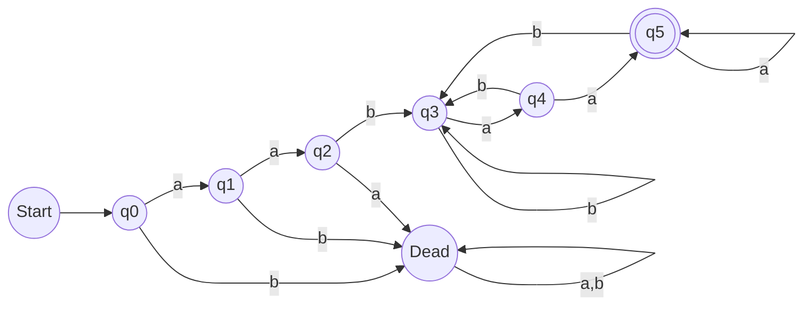
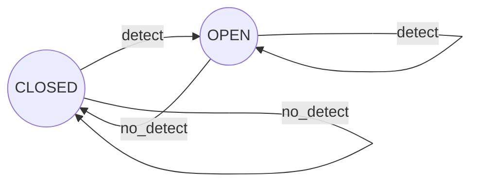
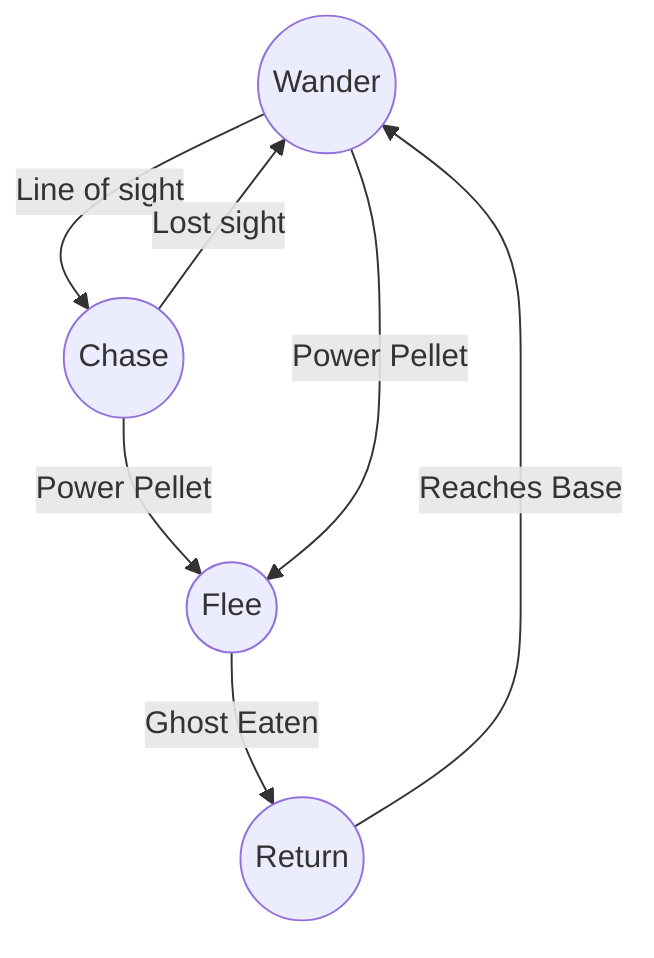
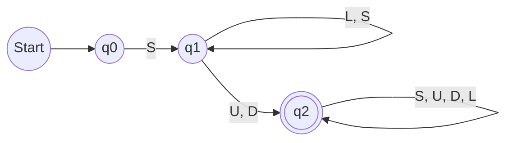
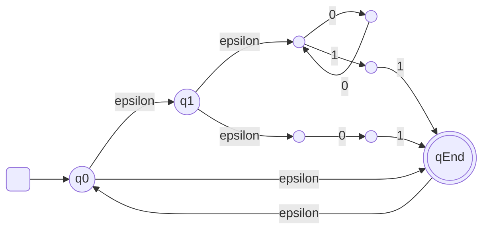
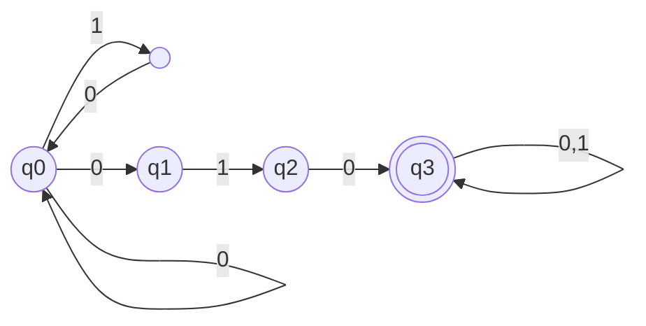
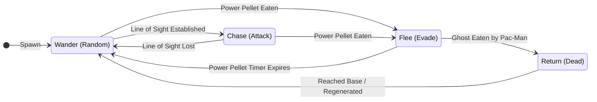
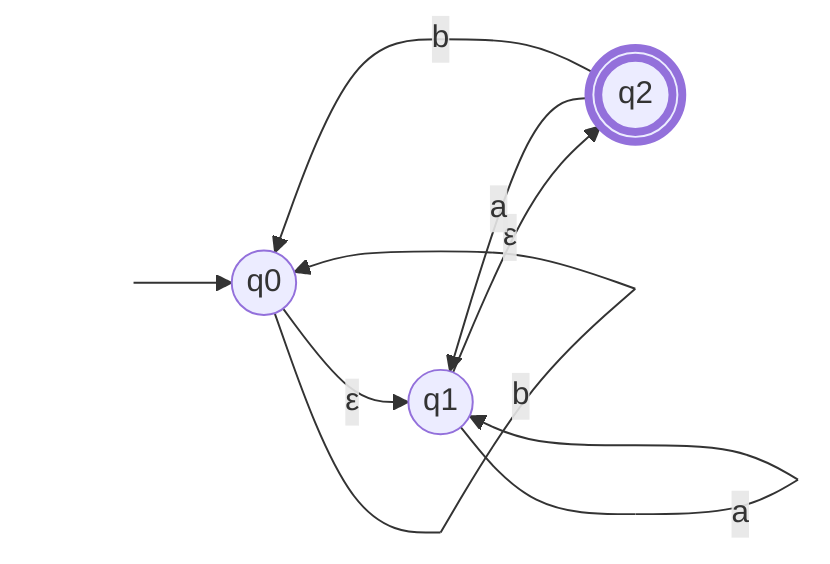
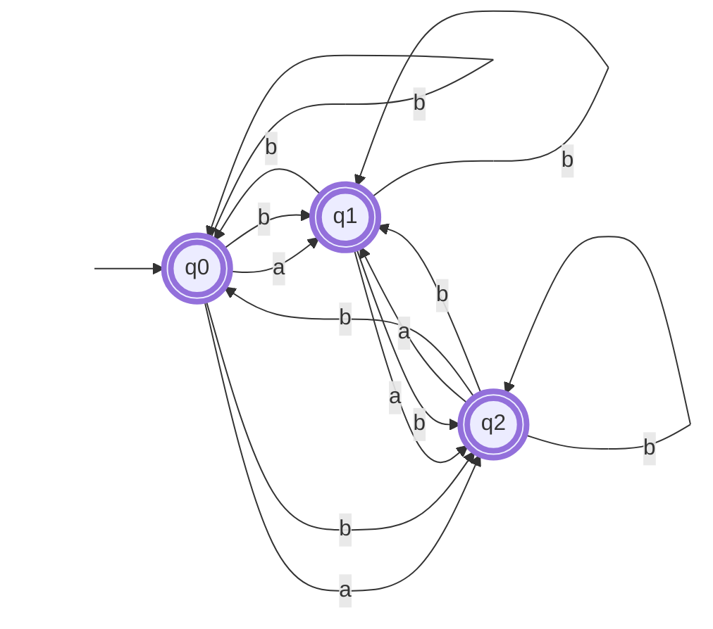

---
tags:
  - computer-science
  - automata-theory
  - game-design
  - state-machines
  - algorithms
course: CSE 4309 Theory of Computing
---

# Mid Semester Examination Solutions

---

### **Question 1**

#### **1(a) Differences between DFA and NFA & Explanation of $\delta$**

**Differences between DFA and NFA:**

| Feature | Deterministic Finite Automaton (DFA) | Nondeterministic Finite Automaton (NFA) |
| :--- | :--- | :--- |
| **Transitions** | For every state and input symbol, there is exactly one transition to a next state. | For a state and input symbol, there can be zero, one, or multiple transitions. |
| **Empty Moves** | Does not allow $\epsilon$-transitions (moves without input). | Allows $\epsilon$-transitions (in $\epsilon$-NFA) or implicit non-determinism. |
| **Backtracking** | Not required; path is determined. | May require backtracking or parallel processing to find an accepting path. |
| **Implementation** | Easier to implement (linear time). | More complex (requires converting to DFA or backtracking). |
| **Next State** | $\delta(q, a)$ results in a single state. | $\delta(q, a)$ results in a set of states. |

**Explanation of $\delta$ (Transition Function):**

1.  **DFA:**
    The transition function maps a state and an input symbol to exactly one next state.
    $$ \delta: Q \times \Sigma \rightarrow Q $$
    *(Where $Q$ is the set of states and $\Sigma$ is the alphabet)*

2.  **NFA:**
    The transition function maps a state and an input symbol to a **set** of possible next states (subset of $Q$).
    $$ \delta: Q \times \Sigma \rightarrow P(Q) $$
    *(Where $P(Q)$ is the power set of $Q$)*

3.  **$\epsilon$-NFA:**
    The transition function maps a state and an input symbol **or** the empty string ($\epsilon$) to a set of next states.
    $$ \delta: Q \times (\Sigma \cup \{\epsilon\}) \rightarrow P(Q) $$

---

#### **1(b) DFA for $L = \{a^2 b w a^2 \mid w \in \{a, b\}^*\}$**

**Analysis:**
The language requires strings to start with the prefix `aab` (since $a^2b$) and end with the suffix `aa` (since $a^2$). The middle part $w$ can be any combination of $a$'s and $b$'s.

**State Logic:**
*   **Prefix Phase ($q_0 \to q_3$):** We must match `a`, `a`, `b` exactly. If we get the wrong input here, we go to a Dead State ($q_{dead}$).
*   **Body & Suffix Phase ($q_3 \to q_5$):** Once `aab` is read, we are in the "body". We stay in the body until we detect the suffix `aa`.
    *   $q_3$: Accepted prefix `aab`. waiting for `a`.
    *   $q_4$: Saw `...a`.
    *   $q_5$: Saw `...aa` (Accepting State).

**DFA Diagram:**



**Description:**
*   $q_0, q_1, q_2$: Process the mandatory prefix `aab`.
*   $q_3$: Represents having processed `aab` (or `...b`).
*   $q_4$: Represents ending in `a`.
*   $q_5$: Represents ending in `aa` (Accept state). If another `a` comes, it still ends in `aa` (stay at $q_5$). If `b` comes, the suffix is broken, go back to $q_3$ (last seen `b`).

---

#### **1(c) Finite Automata for Automatic Door**

**States:** `CLOSED`, `OPEN`
**Input Conditions:**
*   `detect`: Sensor detects a person (Front or Rear).
*   `no_detect`: Sensor detects nothing.

**State Diagram:**



*(Note: In a more complex model described in standard textbooks like Sipser, inputs might be combinations like FRONT, REAR, BOTH, NEITHER, but the logic remains: Detect $\to$ Open, Neither $\to$ Closed).*

---

#### **1(d) Pac-Man Ghost Finite Automata**

**Behaviors (States):**
1.  **Wander:** Randomly wander (Default/Start).
2.  **Chase:** Chase Pac-Man (Trigger: In line of sight).
3.  **Flee:** Avoid Pac-Man (Trigger: Pac-Man eats Power Pellet).
4.  **Return:** Return to base (Trigger: Ghost is eaten).

**Transitions:**
*   **Wander $\to$ Chase:** Input "Line of sight".
*   **Chase $\to$ Wander:** Input "Lost line of sight".
*   **Chase/Wander $\to$ Flee:** Input "Power Pellet eaten".
*   **Flee $\to$ Return:** Input "Ghost Eaten".
*   **Flee $\to$ Wander/Chase:** Input "Timer Expire" (Implicit reset).
*   **Return $\to$ Wander:** Input "Reaches Base" (Regenerate).

**State Diagram:**



---

### **Question 2**

#### **2(a) Applications of Regular Expressions and Finite Automata**

1.  **Lexical Analysis (Compilers):** Tokenizing source code into keywords, operators, and identifiers.
2.  **Text Editors & Search:** Pattern matching (e.g., `grep` in Unix, Find/Replace features) using regex.
3.  **Network Protocols:** Verifying state transitions in communication protocols (e.g., TCP connection states).
4.  **Hardware Design:** Designing sequential logic circuits and controllers (e.g., vending machines, traffic lights).
5.  **Natural Language Processing:** Simple morphology analysis and keyword spotting.

---

#### **2(b) Password Policy Regex & FA**

**Policy:**
1.  Start with a symbol $S$ (e.g., `!`, `#`, `$`).
2.  Contain substring of at least one Upper ($U$) OR one Digit ($D$).
3.  Can contain zero or more Lower ($L$). (Assuming $S, U, D$ are also allowed in the body to make the substring requirement valid in a real-world context, but strictly following the prompt usually implies these are the building blocks).

**Assumption:** The alphabet is $\Sigma = \{S, U, D, L\}$.
**Regex:**
$$ S \cdot (L \cup S \cup U \cup D)^* \cdot (U \cup D) \cdot (L \cup S \cup U \cup D)^* $$
*(Strict interpretation of the bullets: Starts with S, followed by anything, as long as an Upper or Digit appears eventually).*

**Finite Automata Design:**
*   $q_0$: Start.
*   $q_1$: Has seen starting Symbol $S$. Waiting for $U$ or $D$.
*   $q_2$: Has seen $U$ or $D$ (Accepting).



---

#### **2(c) NFA for Concatenation $A \circ B$**

**Given:**
*   $N_1 = (Q_1, \Sigma, \delta_1, q_1, F_1)$ accepts $A$.
*   $N_2 = (Q_2, \Sigma, \delta_2, q_2, F_2)$ accepts $B$.

**Construction of $N$ for $A \circ B$:**
1.  **States:** $Q = Q_1 \cup Q_2$.
2.  **Start State:** $q_1$ (Start state of $N_1$).
3.  **Accept States:** $F_2$ (Accept states of $N_2$).
4.  **Transitions:**
    *   Keep all internal transitions of $N_1$ and $N_2$.
    *   Add **$\epsilon$-transitions** from every state in $F_1$ (accept states of $N_1$) to $q_2$ (start state of $N_2$).

**Visual Proof Concept:**
$$ \text{Start} \rightarrow [ N_1 ] \xrightarrow{\epsilon} [ N_2 ] \rightarrow \text{Accept} $$
This allows the machine to process a string from $A$, jump non-deterministically to $N_2$ when a valid string is formed, and process the remaining part for $B$.

---

#### **2(d) Convert Regular Expressions to NFAs**

**i. $((00)^*(11)) \cup 01)^*$**

This is a loop (outer star) of a union of two paths:
Path A: Zero or more `00`, followed by `11`.
Path B: `01`.



**ii. $(0 \cup 10)^* 010 (0 \cup 1)^*$**

*   Part 1: Loop of `0` or `10`.
*   Part 2: Specific sequence `010`.
*   Part 3: Loop of `0` or `1`.



---

### **Question 3**

#### **3(a) Pumping Lemma Proof for $L = \{ww \mid w \in \{0, 1\}^*\}$**

**Claim:** $L$ is not regular.
**Proof by Contradiction:**
1.  Assume $L$ is regular. Let $p$ be the pumping length given by the Pumping Lemma.
2.  Choose a string $s \in L$ such that $|s| \ge p$.
    Let $s = 0^p 1 0^p 1$.
    Here, $w = 0^p 1$. Since $s = ww$, $s \in L$.
3.  According to the lemma, $s$ can be split into $xyz$ such that:
    *   $|xy| \le p$
    *   $|y| > 0$
    *   $xy^i z \in L$ for all $i \ge 0$.
4.  Since $|xy| \le p$ and $s$ starts with $0^p...$, both $x$ and $y$ must consist entirely of $0$'s from the first segment.
    Let $y = 0^k$ where $k > 0$.
5.  Pump $y$ (let $i=2$). New string $s' = xy^2z$.
    $s' = 0^{p+k} 1 0^p 1$.
6.  For $s'$ to be in $L$, it must be of the form $w'w'$.
    The total length of $s'$ is $2p + 2 + k$. The midpoint is at index $p + 1 + k/2$.
    The first half of the string contains the first '1' at position $p+k+1$. However, the second half (the original $0^p 1$) remains unchanged. The pattern of 0s and 1s is no longer symmetric around the center to form a repeat.
    Specifically, the first half is $0^{p+k}1...$ and the second half starts with $0$... The counts of zeros do not match.
7.  Contradiction. Therefore, $L$ is not regular.

---

#### **3(b) Minimize DFA (Equivalence Theorem)**

**Initial States:**
*   Accepting ($F$): $\{q_3, q_4\}$
*   Non-Accepting ($N$): $\{q_0, q_1, q_2, q_6\}$ (Assuming rightmost is $q_6$)

**Partition 0:** $P_0 = \{ \{q_3, q_4\}, \{q_0, q_1, q_2, q_6\} \}$

**Iteration 1:**
*   **Analyze Group $\{q_3, q_4\}$:**
    *   $q_3$: $\delta(q_3, 0)=q_3 (F)$, $\delta(q_3, 1)=q_3 (F)$
    *   $q_4$: $\delta(q_4, 0)=q_4 (F)$, $\delta(q_4, 1)=q_6 (N)$
    *   **Result:** $q_3$ and $q_4$ behave differently on input 1. **Split them.**
*   **Analyze Group $\{q_0, q_1, q_2, q_6\}$:**
    *   Target check (0, 1):
    *   $q_0 \to \{q_1 (N), q_2 (N)\}$
    *   $q_1 \to \{q_6 (N), q_3 (F)\}$
    *   $q_2 \to \{q_2 (N), q_4 (F)\}$
    *   $q_6 \to \{q_6 (N), q_4 (F)\}$
    *   **Differentiation:** $q_0$ goes to Non-Accepting on input 1. $q_1, q_2, q_6$ go to Accepting on input 1.
    *   **Split:** $\{q_0\}$ vs $\{q_1, q_2, q_6\}$.

**Partition 1:** $P_1 = \{ \{q_3\}, \{q_4\}, \{q_0\}, \{q_1, q_2, q_6\} \}$

**Iteration 2:**
*   **Analyze Group $\{q_1, q_2, q_6\}$:**
    *   $q_1$: $\xrightarrow{1} q_3$. ($q_3$ is in class $\{q_3\}$)
    *   $q_2$: $\xrightarrow{1} q_4$. ($q_4$ is in class $\{q_4\}$)
    *   $q_6$: $\xrightarrow{1} q_4$. ($q_4$ is in class $\{q_4\}$)
    *   **Result:** $q_1$ goes to class $\{q_3\}$, while $q_2, q_6$ go to class $\{q_4\}$. **Split $q_1$ from $\{q_2, q_6\}$.**

**Partition 2:** $P_2 = \{ \{q_3\}, \{q_4\}, \{q_0\}, \{q_1\}, \{q_2, q_6\} \}$

**Iteration 3:**
*   **Analyze Group $\{q_2, q_6\}$:**
    *   $q_2$: $\xrightarrow{0} q_2$ (Group $\{q_2, q_6\}$), $\xrightarrow{1} q_4$.
    *   $q_6$: $\xrightarrow{0} q_6$ (Group $\{q_2, q_6\}$), $\xrightarrow{1} q_4$.
    *   **Result:** Behave identically. Keep together.

**Final Minimized States:**
1.  $q_0$
2.  $q_1$
3.  $\{q_2, q_6\}$ (Merged)
4.  $q_3$
5.  $q_4$

---

#### **3(c) Convert $\epsilon$-NFA to NFA**

**Step 1: Compute $\epsilon$-closure for each state.**
*   **$\epsilon$-closure($q_0$):** $\{q_0\} \cup \{q_1\} (\text{via } \epsilon) \cup \{q_2\} (\text{via } \epsilon \text{ from } q_1) = \{q_0, q_1, q_2\}$
*   **$\epsilon$-closure($q_1$):** $\{q_1\} \cup \{q_2\} = \{q_1, q_2\}$
*   **$\epsilon$-closure($q_2$):** $\{q_2\}$

**Step 2: Compute Transitions for new NFA ($\delta'$).**
Formula: $\delta'(q, x) = \epsilon\text{-closure}(\delta(\epsilon\text{-closure}(q), x))$

**Transitions for $q_0$:**
*   **Input $a$:**
    *   $\epsilon$-closure($q_0$) = $\{q_0, q_1, q_2\}$
    *   $\delta(\{q_0, q_1, q_2\}, a) = \emptyset \cup \{q_1\} \cup \{q_1\} = \{q_1\}$
    *   $\epsilon$-closure($\{q_1\}$) = $\{q_1, q_2\}$
    *   **$\delta'(q_0, a) = \{q_1, q_2\}$**
*   **Input $b$:**
    *   $\delta(\{q_0, q_1, q_2\}, b) = \{q_0\} \cup \emptyset \cup \{q_0\} = \{q_0\}$
    *   $\epsilon$-closure($\{q_0\}$) = $\{q_0, q_1, q_2\}$
    *   **$\delta'(q_0, b) = \{q_0, q_1, q_2\}$**

**Transitions for $q_1$:**
*   **Input $a$:**
    *   $\epsilon$-closure($q_1$) = $\{q_1, q_2\}$
    *   $\delta(\{q_1, q_2\}, a) = \{q_1\} \cup \{q_1\} = \{q_1\}$
    *   $\epsilon$-closure($\{q_1\}$) = $\{q_1, q_2\}$
    *   **$\delta'(q_1, a) = \{q_1, q_2\}$**
*   **Input $b$:**
    *   $\delta(\{q_1, q_2\}, b) = \emptyset \cup \{q_0\} = \{q_0\}$
    *   $\epsilon$-closure($\{q_0\}$) = $\{q_0, q_1, q_2\}$
    *   **$\delta'(q_1, b) = \{q_0, q_1, q_2\}$**

**Transitions for $q_2$:**
*   **Input $a$:**
    *   $\epsilon$-closure($q_2$) = $\{q_2\}$
    *   $\delta(\{q_2\}, a) = \{q_1\}$
    *   $\epsilon$-closure($\{q_1\}$) = $\{q_1, q_2\}$
    *   **$\delta'(q_2, a) = \{q_1, q_2\}$**
*   **Input $b$:**
    *   $\delta(\{q_2\}, b) = \{q_0\}$
    *   $\epsilon$-closure($\{q_0\}$) = $\{q_0, q_1, q_2\}$
    *   **$\delta'(q_2, b) = \{q_0, q_1, q_2\}$**

**Final NFA Table:**

| State | a | b |
| :--- | :--- | :--- |
| $\rightarrow q_0$ (Start) | $\{q_1, q_2\}$ | $\{q_0, q_1, q_2\}$ |
| $q_1$ | $\{q_1, q_2\}$ | $\{q_0, q_1, q_2\}$ |
| $* q_2$ (Accept) | $\{q_1, q_2\}$ | $\{q_0, q_1, q_2\}$ |

*(Note: Since $\epsilon$-closure($q_0$) contains the original accepting state $q_2$, $q_0$ becomes an accepting state in the new NFA. Similarly for $q_1$. All states are accepting in the resulting NFA).*

---

# Detailed Topics

# Finite Automata: Pac-Man Ghost Behaviour

## 1. Problem Overview
The classic game **Pac-Man** utilizes a Finite State Machine (FSM) to control the artificial intelligence of the ghosts. Instead of complex learning algorithms, the ghosts switch between distinct behaviors (States) based on specific game events (Inputs).

This model describes a **Moore Machine** (or Mealy Machine depending on implementation), where the output (behavior) depends on the current state and inputs.

---

## 2. Defined States
Based on the problem text, the ghost AI operates in four distinct states:

| State | Name | Behavior Description |
| :--- | :--- | :--- |
| **$q_0$** | **Wander** | The default state. The ghost moves randomly through the maze looking for the player. |
| **$q_1$** | **Chase** | Aggressive state. The ghost actively pursues Pac-Man. |
| **$q_2$** | **Flee** | Defensive state (Blue Ghost). The ghost moves away from Pac-Man to avoid being eaten. |
| **$q_3$** | **Return** | Recovery state (Eyes). The ghost has been eaten and must travel to the central base to regenerate. |

---

## 3. Transition Logic (Inputs)
Transitions occur when specific conditions (inputs) are met.

*   **Input $a$ (Line of Sight):** Pac-Man enters the ghost's direct line of sight.
*   **Input $b$ (Lost Sight):** Pac-Man leaves the line of sight (implied return to wandering).
*   **Input $c$ (Power Pellet):** Pac-Man eats a Power Pellet. This is a global interrupt that usually forces ghosts from *Wander* or *Chase* into *Flee*.
*   **Input $d$ (Timer Expire):** The Power Pellet effect wears off.
*   **Input $e$ (Eaten):** Pac-Man catches the ghost while it is Fleeing.
*   **Input $f$ (Regenerated):** The ghost reaches the central base.

---

## 4. State Diagram (Visual)
*(Note: Obsidian renders the code block below as a diagram using the Mermaid plugin)*



> [!NOTE] Design Observation
> The **Return** state acts as a reset mechanism. Once the ghost reaches the center, it usually transitions back to **Wander** (or the game's specific "Scatter" mode) to restart the loop.

---

## 5. Detailed Transition Table

| Current State | Input / Event | Next State | Logic Explanation |
| :--- | :--- | :--- | :--- |
| **Wander** | Pac-Man in Line of Sight | **Chase** | Ghost spots player and engages. |
| **Wander** | Power Pellet Active | **Flee** | Player becomes dangerous; ghost must hide. |
| **Chase** | Line of Sight Lost | **Wander** | Ghost loses track of player, reverts to random search. |
| **Chase** | Power Pellet Active | **Flee** | Aggressor becomes the prey immediately. |
| **Flee** | Timer Expires | **Wander/Chase** | Ghost becomes dangerous again. |
| **Flee** | Eaten by Pac-Man | **Return** | Ghost "dies" and becomes floating eyes. |
| **Return** | Reached Base | **Wander** | Ghost respawns and re-enters the maze. |

---

## 6. Example Gameplay Scenario
To illustrate the Automata in action:

1.  **Start ($q_0$):** Blinky (Red Ghost) is in the **Wander** state, moving randomly.
2.  **Transition ($q_0 \to q_1$):** Blinky turns a corner and sees Pac-Man down a long corridor. The input "Line of Sight" triggers a switch to **Chase**. Blinky accelerates toward Pac-Man.
3.  **Transition ($q_1 \to q_2$):** Just before Blinky catches him, Pac-Man eats a large dot (Power Pellet). The state immediately switches to **Flee**. Blinky turns blue and moves in the opposite direction.
4.  **Transition ($q_2 \to q_3$):** Pac-Man is faster; he catches Blinky. Blinky enters the **Return** state (appearing as just eyes). He ignores walls and flies directly to the center box.
5.  **Transition ($q_3 \to q_0$):** Blinky touches the center base. He regenerates his body and switches back to **Wander** to leave the box.

---

## 7. Pseudocode Implementation
For a game developer implementing this FSM:

```python
class Ghost:
    state = "WANDER"
    
    def update(self, pacman, maze):
        if self.state == "WANDER":
            self.move_randomly()
            if self.can_see(pacman):
                self.state = "CHASE"
            if pacman.ate_power_pellet:
                self.state = "FLEE"
                
        elif self.state == "CHASE":
            self.move_towards(pacman)
            if not self.can_see(pacman):
                self.state = "WANDER"
            if pacman.ate_power_pellet:
                self.state = "FLEE"
                
        elif self.state == "FLEE":
            self.move_away_from(pacman)
            if self.touching(pacman):
                self.state = "RETURN"
            if pacman.power_pellet_timer <= 0:
                self.state = "WANDER"
                
        elif self.state == "RETURN":
            self.move_to_base()
            if self.at_base():
                self.state = "WANDER"
```


# Conversion: $\epsilon$-NFA to NFA

## 1. Problem Statement
**Input:** The following Transition Table for an $\epsilon$-NFA.

| State | $a$ | $b$ | $\epsilon$ |
| :---: | :---: | :---: | :---: |
| $\rightarrow q_0$ | $\emptyset$ | $\{q_0\}$ | $\{q_1\}$ |
| $q_1$ | $\{q_1\}$ | $\emptyset$ | $\{q_2\}$ |
| $*q_2$ | $\{q_1\}$ | $\{q_0\}$ | $\emptyset$ |

### Visual Representation (Original $\epsilon$-NFA)


---

## 2. Step-by-Step Conversion

To convert to an NFA without $\epsilon$-transitions, we use the algorithm:
$$ \delta'(q, x) = \epsilon\text{-closure}(\delta(\epsilon\text{-closure}(q), x)) $$

### Step 1: Compute $\epsilon$-closure
> [!INFO] Definition
> The $\epsilon$-closure, $E(q)$, is the set of states reachable from state $q$ following only $\epsilon$ transitions.

*   **$E(q_0)$:** $q_0 \xrightarrow{\epsilon} q_1 \xrightarrow{\epsilon} q_2 \implies \{q_0, q_1, q_2\}$
*   **$E(q_1)$:** $q_1 \xrightarrow{\epsilon} q_2 \implies \{q_1, q_2\}$
*   **$E(q_2)$:** No outgoing $\epsilon$ transitions $\implies \{q_2\}$

### Step 2: Compute New Transitions
We calculate transitions for inputs $a$ and $b$ for every state using the closure sets derived above.

#### For State $q_0$:
**Input $a$:**
1.  $E(q_0) = \{q_0, q_1, q_2\}$
2.  Transitions on $a$: $\emptyset \cup \{q_1\} \cup \{q_1\} = \{q_1\}$
3.  $E(\{q_1\}) = \{q_1, q_2\}$
    $\rightarrow \delta'(q_0, a) = \{q_1, q_2\}$

**Input $b$:**
1.  $E(q_0) = \{q_0, q_1, q_2\}$
2.  Transitions on $b$: $\{q_0\} \cup \emptyset \cup \{q_0\} = \{q_0\}$
3.  $E(\{q_0\}) = \{q_0, q_1, q_2\}$
    $\rightarrow \delta'(q_0, b) = \{q_0, q_1, q_2\}$

#### For State $q_1$:
**Input $a$:**
1.  $E(q_1) = \{q_1, q_2\}$
2.  Transitions on $a$: $\{q_1\} \cup \{q_1\} = \{q_1\}$
3.  $E(\{q_1\}) = \{q_1, q_2\}$
    $\rightarrow \delta'(q_1, a) = \{q_1, q_2\}$

**Input $b$:**
1.  $E(q_1) = \{q_1, q_2\}$
2.  Transitions on $b$: $\emptyset \cup \{q_0\} = \{q_0\}$
3.  $E(\{q_0\}) = \{q_0, q_1, q_2\}$
    $\rightarrow \delta'(q_1, b) = \{q_0, q_1, q_2\}$

#### For State $q_2$:
**Input $a$:**
1.  $E(q_2) = \{q_2\}$
2.  Transitions on $a$: $\{q_1\}$
3.  $E(\{q_1\}) = \{q_1, q_2\}$
    $\rightarrow \delta'(q_2, a) = \{q_1, q_2\}$

**Input $b$:**
1.  $E(q_2) = \{q_2\}$
2.  Transitions on $b$: $\{q_0\}$
3.  $E(\{q_0\}) = \{q_0, q_1, q_2\}$
    $\rightarrow \delta'(q_2, b) = \{q_0, q_1, q_2\}$

### Step 3: Determine Final States
A state $q$ is final in the new NFA if $E(q)$ contains a final state from the original NFA ($q_2$).

*   $E(q_0) = \{q_0, q_1, \mathbf{q_2}\}$ $\rightarrow$ **Final**
*   $E(q_1) = \{q_1, \mathbf{q_2}\}$ $\rightarrow$ **Final**
*   $E(q_2) = \{\mathbf{q_2}\}$ $\rightarrow$ **Final**

---

## 3. Final Result

### Equivalent NFA Transition Table

| State | $a$ | $b$ |
| :---: | :---: | :---: |
| $\rightarrow *q_0$ | $\{q_1, q_2\}$ | $\{q_0, q_1, q_2\}$ |
| $*q_1$ | $\{q_1, q_2\}$ | $\{q_0, q_1, q_2\}$ |
| $*q_2$ | $\{q_1, q_2\}$ | $\{q_0, q_1, q_2\}$ |

> [!NOTE] Observation
> In the resulting NFA, all states ($q_0, q_1, q_2$) have identical transitions and are all final states. They are equivalent.

### Visual Representation (Resulting NFA)

