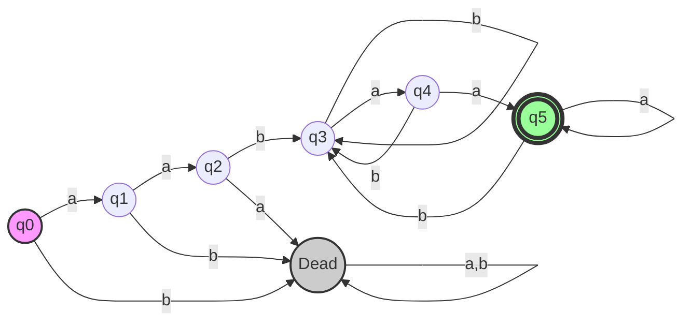
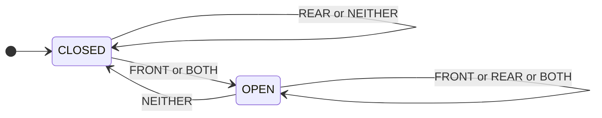
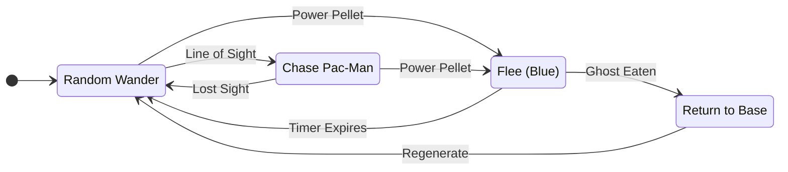
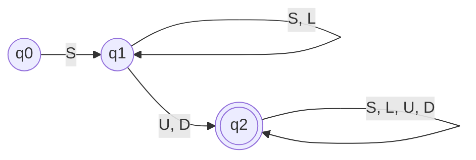

# 1. a)differences-dfa-nfa-transition-functions

## 1. Differences between DFA and NFA

| Feature | Deterministic Finite Automaton (DFA) | Nondeterministic Finite Automaton (NFA) |
| :--- | :--- | :--- |
| **Determinism** | For every state and input symbol, there is exactly **one** distinct next state. | For a state and input symbol, there can be **zero, one, or multiple** next states. |
| **Empty Transitions** | $\epsilon$-moves (transitions without input) are **not allowed**. | $\epsilon$-moves are allowed (specifically in $\epsilon$-NFA). |
| **Backtracking** | No backtracking is required. It follows a single path. | Requires backtracking or parallel processing to check all possible paths. |
| **Implementation** | Easier to implement in code (simple state machine), but harder to design the diagram for complex languages. | Easier to design conceptually (allows guessing), but harder to implement in code. |
| **State Count** | Generally requires more states than an equivalent NFA. | Can be much more concise; often has fewer states than the equivalent DFA. |
| **Transition Function** | Returns a single state ($Q$). | Returns a set of states ($2^Q$ or $\mathcal{P}(Q)$). |

---

## 2. Explanation of the Transition Function ($\delta$)

The transition function, denoted by $\delta$ (delta), dictates how the automaton moves from one state to another based on the input.

Let:
* $Q$ be the set of states.
* $\Sigma$ be the alphabet (set of input symbols).
* $2^Q$ (or $\mathcal{P}(Q)$) be the **Power Set** of $Q$ (the set of all possible subsets of states).

### a) $\delta$ for DFA
In a DFA, for a specific state and a specific input symbol, the machine **must** transition to exactly one valid state.
$$\delta: Q \times \Sigma \to Q$$
* **Input:** One current state ($q \in Q$) and one input symbol ($a \in \Sigma$).
* **Output:** Exactly one next state.

### b) $\delta$ for NFA (Standard NFA without $\epsilon$)
In an NFA, for a specific state and input symbol, the machine can move to **multiple** states, or **no** state (empty set).
$$\delta: Q \times \Sigma \to 2^Q$$
* **Input:** One current state and one input symbol.
* **Output:** A subset of states (can be $\emptyset$, $\{q_1\}$, or $\{q_1, q_2, \dots\}$).

### c) $\delta$ for $\epsilon$-NFA
An $\epsilon$-NFA allows transitions on input symbols **OR** on the empty string ($\epsilon$).
$$\delta: Q \times (\Sigma \cup \{\epsilon\}) \to 2^Q$$
* **Input:** One current state and either an input symbol ($a \in \Sigma$) OR the empty string ($\epsilon$).
* **Output:** A subset of states.

## b) DFA for $L = \{ a^2 b w a^2 \mid w \in \{a, b\}^* \}$

**Analysis:**
The language consists of strings that must start with the prefix **$aab$** ($a^2b$) and must end with the suffix **$aa$** ($a^2$). The middle part $w$ can be any sequence of $a$'s and $b$'s.

**DFA Design:**
1.  **Prefix Check:** We first verify the string starts with `a`, `a`, `b`. If this sequence is broken, we go to a **Dead State**.
2.  **Suffix Tracking:** Once the prefix is satisfied (reaching state $q_3$), we essentially run a pattern matcher for "ends with $aa$".

**Transitions:**
* $q_0 \xrightarrow{a} q_1 \xrightarrow{a} q_2 \xrightarrow{b} q_3$ (Matches Prefix)
* From $q_3$ (Prefix Matched):
    * If we see `b`, we have made no progress towards the suffix `aa`. Stay in $q_3$.
    * If we see `a`, we have the first char of the suffix. Move to $q_4$.
    * From $q_4$: if `a`, we have `aa` (Accept state $q_5$). If `b`, sequence breaks, back to $q_3$.
    * From $q_5$ (Accept): if `a`, we still end in `aa` (stay in $q_5$). If `b`, sequence breaks, back to $q_3$.

### 1.c) 

### 1.d)

### 2a) Applications of Regular Expressions and Finite Automata

1. **Lexical Analysis (Compilers):** Breaking source code (strings) into tokens (keywords, identifiers, literals) using regex.
2. **Text Editors & Search:** Find and replace features (e.g., `grep`) use regex for pattern matching.
3. **Protocol Verification:** Modeling communication protocols (like TCP) to ensure they don't enter invalid states.
4. **Natural Language Processing (NLP):** Simple parsing and morphological analysis.
5. **Hardware Design:** Designing sequential logic circuits and controllers (like the door example above).

### 2b) Password Policy Automata

**Policy:**

1. Start with a symbol ($S = \{!, \#, \$, @, \dots\}$).
2. Contain at least one Uppercase ($U$) **OR** one Digit ($D$).
3. Can contain Lowercase ($L$).
**Alphabet:** $\Sigma = S \cup U \cup D \cup L$

Regular Expression:

$$ S (S \cup L \cup U \cup D)^* (U \cup D) (S \cup L \cup U \cup D)^* $$

(Breakdown: Starts with S, then any characters, then eventually a U or D, then any characters.)

**NFA Design:**
- **q0:** Start state.    
- **q1:** State after seeing the required initial Symbol.
- **q2:** Accepting state (reached after seeing a U or D).

