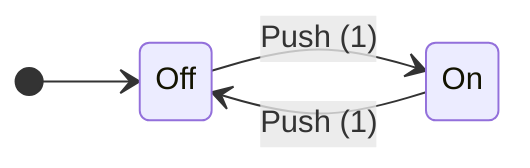
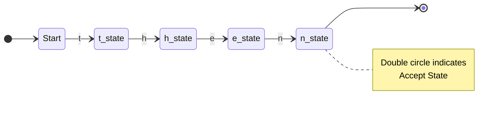
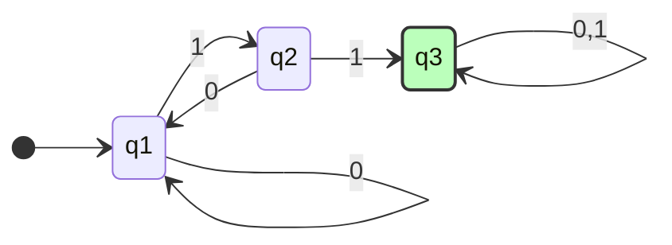
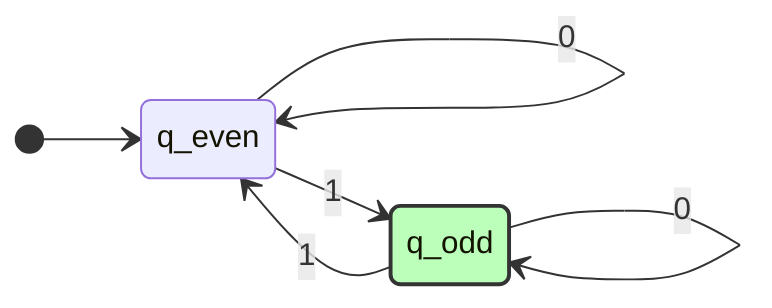
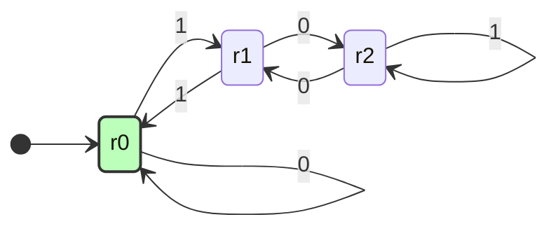

**Tags:** #ComputerScience #TheoryOfComputation #Automata #Sipser #Obsidian
**Course:** CSE 4309 / MIT 18.404
**Lecturer:** Syed Rifat Raiyan / Michael Sipser

---

## 1. Introduction: What is Theory of Computing?

Theory of computing is the mathematical study of the **capabilities and limits** of computation. It is not just about writing code, but understanding the fundamental laws that govern what computers can and cannot do.

It is divided into three main branches:

### A. Automata Theory
*   **Focus:** Models of computation.
*   **Key Question:** How can we define mathematical models (machines) to solve problems?
*   **Examples:** Finite Automata, Context-Free Grammars, Turing Machines.

### B. Computability Theory
*   **Focus:** What can be computed *in principle*?
*   **Key Question:** Can *every* mathematical problem be solved methodically?
*   **The Answer:** Gödel and Turing proved **NO**. There are problems (like the Halting Problem) that are impossible to solve algorithmically.

### C. Complexity Theory
*   **Focus:** What can be computed *efficiently* (in practice)?
*   **Key Question:** How much time and memory (space) does a problem require?
*   **Examples:** Cryptography relies on problems being "hard" (e.g., factoring large numbers). The **P vs NP** problem lies here.

---

## 2. Finite Automata (DFA)

A **Finite Automaton** (plural: Automata) is the simplest computational model. It represents a machine with a **finite amount of memory**. It reads an input string one symbol at a time and changes its state accordingly.

> [!INFO] Metaphor
> Think of an automatic door controller or a light switch. It doesn't remember "how many times" you pressed the button, only the current state (Open/Closed or On/Off).

### Visualizing Finite Automata

We represent Finite Automata using **State Diagrams**.

#### Example 1: A Simple Switch
A machine that toggles between `Off` and `On` when input `1` is pushed.

#### Example 2: Lexical Analysis ("then")
A machine designed to recognize the specific word "then".

---

### Formal Definition of a Finite Automaton

A Deterministic Finite Automaton (DFA) is a **5-tuple** $(Q, \Sigma, \delta, q_0, F)$:

1.  **$Q$**: A finite set of **states**.
2.  **$\Sigma$**: A finite set of **alphabet symbols** (e.g., $\{0, 1\}$).
3.  **$\delta$**: The **transition function** $\delta: Q \times \Sigma \rightarrow Q$.
    *   Takes a current state and an input symbol $\to$ outputs the next state.
4.  **$q_0$**: The **start state** ($q_0 \in Q$).
5.  **$F$**: The set of **accept states** ($F \subseteq Q$).

---

## 3. Computation Terminology

### Strings and Languages
*   **String:** A finite sequence of symbols from $\Sigma$.
*   **Empty String ($\epsilon$):** A string of length 0.
*   **Language ($L$):** A set of strings.
    *   $L(M)$: The language of machine $M$. The set of all strings that $M$ accepts.

### Acceptance Condition
A machine $M$ **accepts** a string $w = w_1w_2...w_n$ if there exists a sequence of states $r_0, r_1, ..., r_n$ such that:
1.  $r_0 = q_0$ (Start at the start state).
2.  $\delta(r_i, w_{i+1}) = r_{i+1}$ (Each step follows the transition rules).
3.  $r_n \in F$ (The final state is an accept state).

> [!Definition] Regular Language
> A language is called **Regular** if there exists *some* finite automaton that recognizes it.

---

## 4. Detailed Examples & Mini-Quizzes

### Example A: Substring "11"
Construct a DFA that accepts any string containing the substring `11`.
*   $\Sigma = \{0, 1\}$

*   **Logic:**
    *   $q_1$: Haven't seen a 1 recently.
    *   $q_2$: Just saw a single 1. (If we see another 1, we win. If we see 0, back to start).
    *   $q_3$: Have seen `11`. Stay here forever (trap state).

### Example B: Odd Number of 1s
Construct a DFA that accepts strings with an odd number of 1s.

*   **Logic:** 0s don't change the count parity. 1s toggle between Even and Odd states.

### Example C: Modulo 3 Counter
Language: $L = \{w \mid \text{binary value of } w \text{ is a multiple of } 3\}$.
*   *Note:* Reading binary from left to right corresponds to: `New_Value = (Old_Value * 2) + Input_Bit`.
*   **Logic:**
    *   $(0 \times 2) + 0 = 0 \pmod 3$
    *   $(0 \times 2) + 1 = 1 \pmod 3$
    *   $(1 \times 2) + 0 = 2 \pmod 3$
    *   ...and so on.

*   **States:**
    *   $r_0$: Remainder 0
    *   $r_1$: Remainder 1
    *   $r_2$: Remainder 2

---

## 5. Regular Operations

To build complex languages from simple ones, we use regular operations. Let $A$ and $B$ be languages.

1.  **Union:** $A \cup B = \{x \mid x \in A \text{ or } x \in B\}$
2.  **Concatenation:** $A \circ B = \{xy \mid x \in A \text{ and } y \in B\}$
3.  **Star ($*$):** $A^* = \{x_1x_2...x_k \mid k \geq 0 \text{ and each } x_i \in A\}$
    *   *Note:* $\epsilon$ is always in $A^*$.

### Regular Expressions (Regex)
A compact way to describe regular languages using the operations above.
*   **Examples:**
    *   $(0 \cup 1)^* = \Sigma^*$ (All possible strings).
    *   $\Sigma^* 1$ (All strings ending in 1).
    *   $\Sigma^* 11 \Sigma^*$ (All strings containing the substring 11).

---

## 6. Closure Properties

### Theorem: Closure under Union
**Theorem:** If $A_1$ and $A_2$ are regular languages, then $A_1 \cup A_2$ is also regular.

**Proof Strategy (The Product Construction):**
We need to simulate running two machines ($M_1$ for $A_1$ and $M_2$ for $A_2$) **in parallel**. Since a single DFA can't physically run two processes, we construct a new state space that represents *every possible pair* of states the two machines could be in simultaneously.

#### The Construction
Let $M_1 = (Q_1, \Sigma, \delta_1, q_1, F_1)$ and $M_2 = (Q_2, \Sigma, \delta_2, q_2, F_2)$.
We build $M = (Q, \Sigma, \delta, q_0, F)$ where:

1.  **States ($Q$):** The Cartesian product $Q_1 \times Q_2$.
    *   A state in $M$ looks like $(r_1, r_2)$.
    *   *Number of states:* $|Q_1| \times |Q_2|$.
2.  **Start State ($q_0$):** $(q_1, q_2)$.
3.  **Transition ($\delta$):** $\delta((r_1, r_2), a) = (\delta_1(r_1, a), \delta_2(r_2, a))$.
    *   We move both internal machine states forward simultaneously.
4.  **Accept States ($F$):**
    *   For Union ($A_1 \cup A_2$), we accept if *either* $M_1$ accepts *or* $M_2$ accepts.
    *   $F = \{(r_1, r_2) \mid r_1 \in F_1 \text{ or } r_2 \in F_2\}$.

> [!WARNING] Common Pitfall
> If you set $F = F_1 \times F_2$, you are requiring **both** machines to accept. This creates the machine for **Intersection** ($A_1 \cap A_2$), not Union.

### Closure under Concatenation?
Is the class of regular languages closed under concatenation ($A \circ B$)?
*   **Yes**, but the proof is much harder with DFAs because we don't know *where* to split the input string $w$ into parts $x$ and $y$.
*   *Solution:* We usually need **Nondeterminism (NFA)** to prove this easily (Topic for next lecture).