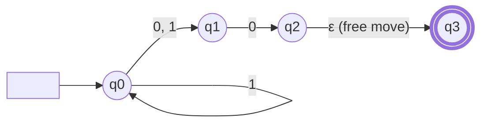
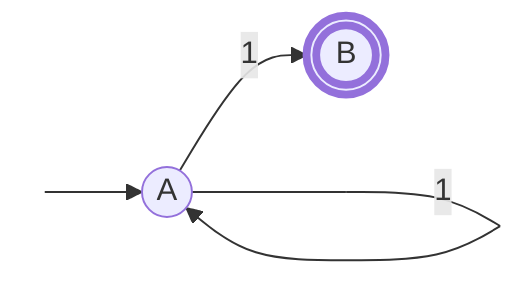
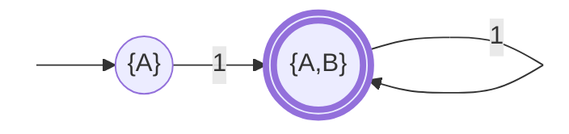
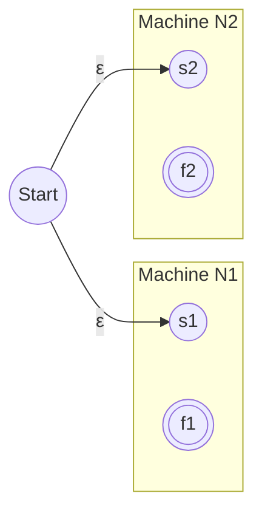
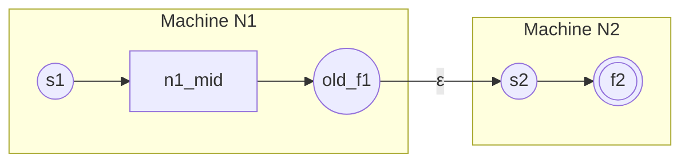
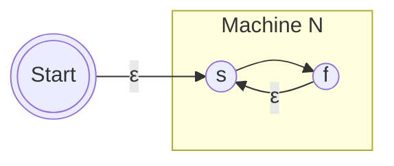
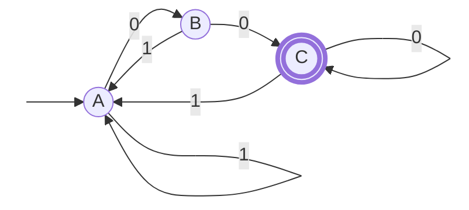

---
tags:
  - theory-of-computing
  - automata
  - NFA
  - regular-expressions
date: 2025-12-27
course: CSE 4309 Theory of Computing
lecture: 2
---

# Lecture 2: Nondeterministic Finite Automata (NFA) & Regular Expressions

## 1. Nondeterministic Finite Automata (NFA)

### 1.1 The Concept of Nondeterminism
In a **Deterministic** Finite Automaton (DFA), the next state is determined uniquely by the current state and the input symbol. In a **Nondeterministic** machine (NFA), several things change:
1.  **Multiple Paths:** For a given state and input symbol, the machine may transition to **zero, one, or multiple** next states.
2.  **$\varepsilon$-transitions:** The machine can move between states *without* reading any input (represented by the empty string $\varepsilon$).

### 1.2 Three Perspectives on NFA Execution
Sipser (and the lecture slides) describes three ways to visualize how an NFA processes a string:

| Perspective | Description |
| :--- | :--- |
| **1. Computational (Parallelism)** | When the machine has multiple choices, it "forks" new parallel threads (like processes in an OS). If *any* one of these threads reaches an Accept state, the input is accepted. All threads that die (reach a state with no moves) simply vanish. |
| **2. Mathematical (Tree)** | The computation computation traces a tree. The root is the start state. Each branch represents a nondeterministic choice. If *at least one* leaf node is an Accept state, the tree represents an acceptance. |
| **3. Magical (The Oracle)** | Imagine the machine is a psychic. At every choice point, it magically "guesses" the correct path that will lead to acceptance. If such a path exists, the machine finds it. |

### 1.3 Visualizing Nondeterminism

> [!NOTE] In the graph above:
> - From $q_0$, reading a `1` puts the machine in **both** $\{q_0, q_1\}$ simultaneously (Computational view).
> - Moving from $q_2$ to $q_3$ requires **no input** ($\varepsilon$).

### 1.4 Formal Definition
An NFA is a 5-tuple $N = (Q, \Sigma, \delta, q_0, F)$. The definition is identical to a DFA *except* for the transition function $\delta$.

$$ \delta : Q \times \Sigma_{\varepsilon} \rightarrow \mathcal{P}(Q) $$

*   **$\Sigma_{\varepsilon}$**: The alphabet plus the empty string ($\Sigma \cup \{\varepsilon\}$).
*   **$\mathcal{P}(Q)$**: The **Power Set** of $Q$ (the set of all possible subsets of states).
    *   *Implication:* The output of the transition function is a *set* of states, not a single state.

---

## 2. Equivalence of NFA and DFA

> [!Abstract] Theorem
> Every NFA has an equivalent DFA. Therefore, a language is Regular if and only if some NFA recognizes it.

### 2.1 Proof Idea: The Subset Construction
To convert an NFA to a DFA, we build a DFA where **each state represents a set of active states** in the NFA.

1.  **States:** If the NFA has $n$ states, the DFA has $2^n$ states (the power set).
2.  **Start State:** The $\varepsilon$-closure of the NFA's start state (start state + anywhere you can reach via $\varepsilon$).
3.  **Transitions:** If the DFA is in state $\{q_1, q_2\}$ and reads input 'a', the new state is the union of where $q_1$ goes on 'a' and where $q_2$ goes on 'a'.

### 2.2 Visualizing Subset Construction
**NFA (Input):**

**Equivalent DFA (Output):**
The DFA tracks all possible combinations.

> [!Failure] Mini Quiz Answer
> If an NFA has $n$ states, the equivalent DFA can have up to **$2^n$ states**.
> *Example:* NFA with 3 states $\to$ DFA could have $2^3 = 8$ states.

---

## 3. Closure Properties of Regular Languages
NFAs are essentially a tool to make proving closure properties easier. It is very hard to concatenate two DFAs, but very easy to concatenate two NFAs.

### 3.1 Closure under Union ($A \cup B$)
**Logic:** Run both machines in parallel.
**Construction:**
1. Create a new Start State.
2. Add $\varepsilon$-transitions to the start states of both Machine $N_1$ and Machine $N_2$.

### 3.2 Closure under Concatenation ($A \circ B$)
**Logic:** Run $N_1$, and when it finishes, nondeterministically switch to $N_2$.
**Construction:**
1. Keep start state of $N_1$.
2. Draw $\varepsilon$-transitions from *every* accept state of $N_1$ to the start state of $N_2$.
3. Turn $N_1$ accept states into non-accept states.

### 3.3 Closure under Kleene Star ($A^*$)
**Logic:** Repeat the machine zero or more times.
**Construction:**
1. Create a new Accept Start State (to handle empty string $\varepsilon$).
2. $\varepsilon$-transition from New Start to Old Start.
3. $\varepsilon$-transition from Old Accept states back to Old Start (to loop).

---

## 4. Regular Expressions (Regex)

Regular expressions are a declarative way to represent Regular Languages.

### 4.1 Identities & Precedence
**Precedence (Order of Operations):**
1.  Star ($*$) - *Tightest binding*
2.  Concatenation ($\circ$)
3.  Union ($\cup$ or $+$)

**Common Identities:**
*   $R + \emptyset = R$
*   $R \cdot \varepsilon = R$
*   $(R^*)^* = R^*$
*   $R(S+T) = RS + RT$ (Distributive law)

### 4.2 Arden's Theorem
This theorem is used to solve algebraic equations of regex, often for converting FA to Regex.

> **Theorem:** If $P$ and $Q$ are regular expressions over $\Sigma$, and $P$ does not contain $\varepsilon$, then the equation $R = Q + RP$ has a **unique** solution:
> $$ R = QP^* $$

**Proof concept:** Recursive substitution.
$R = Q + (Q+RP)P = Q + QP + RP^2 \dots \implies Q(\varepsilon + P + P^2 \dots) = QP^*$

### 4.3 Converting Regex to NFA
We build the NFA recursively using the Closure Properties defined in Section 3.

**Example: $(a \cup ab)^*$**

1.  **Atomic:** Build NFA for `a` and `b`.
2.  **Concat:** Link `a` to `b` to make `ab`.
3.  **Union:** Parallel link `a` and `ab`.
4.  **Star:** Loop back the accept states to the start state.

---

## 5. Summary Workflow
The lecture establishes the full equivalence cycle:

$$ \text{DFA} \iff \text{NFA} \iff \text{Regular Expression} $$

### Example Pipeline (Slide 17)
**Goal:** Recognize language $L = \{ w \mid w \text{ ends with } 00 \}$

1.  **Regex:** $(0+1)^*00$
2.  **NFA:**
    *   Part A: $(0+1)$ is a single state loop.
    *   Part B: Transition to the `00` sequence.
    *   The NFA "guesses" when the string is ending and jumps to the `00` check.
3.  **DFA:**
    *   Must deterministically track if we have seen a `0`, or `00` recently.
    *   States: `[No 0]`, `[Saw one 0]`, `[Saw 00 (Accept)]`.

| State | Description |
| :--- | :--- |
| **A** | No '0' seen recently |
| **B** | Saw one '0' |
| **C** | Saw '00' (Accepting State) |

