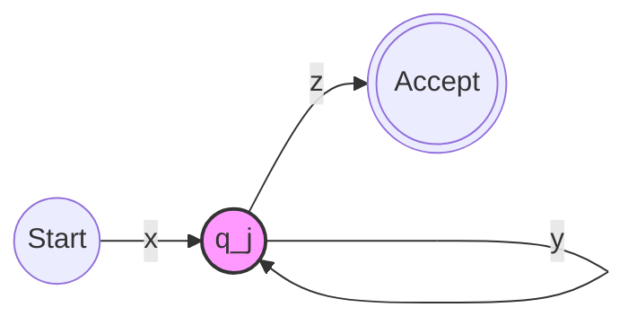

---
course: CSE 4309 Theory of Computing
lecture: 3
topic: Non-Regular Languages & The Pumping Lemma
instructor: Syed Rifat Raiyan
tags: #theory-of-computing #automata #pumping-lemma #proofs
date: 2026-01-04
---

# Non-Regular Languages & The Pumping Lemma

## 1. Non-Regular Languages
### What are they?
**Non-regular languages** are formal languages that:
1.  **Cannot** be described by a regular expression.
2.  **Cannot** be recognized by a Finite Automaton (FA or DFA).

**Why?**
They usually require **infinite memory** to count or match patterns beyond a fixed limit. A DFA only has a finite number of states, so it cannot "remember" an arbitrary number of previous inputs (e.g., counting matching parentheses or equal numbers of 0s and 1s).

### Intuition vs. Proof
To show a language is **Regular**:
*   Construct a DFA, NFA, or Regular Expression for it.

To show a language is **Not Regular**:
*   **Intuition is not enough.** You cannot simply say "I couldn't find a DFA."
*   **Proof Required:** You must provide a formal proof (usually by contradiction).

#### Examples of Intuition
| Language | Description | Regular? | Reason |
| :--- | :--- | :--- | :--- |
| $B = \{w \mid w \text{ has equal 0s and 1s}\}$ | Balanced count | **NO** | DFAs cannot count unboundedly. |
| $C = \{w \mid w \text{ has equal 01 and 10 substrings}\}$ | Substring balance | **YES** | **Warning:** Intuition can be wrong! $C$ is actually regular. |

> **Moral:** Always provide a formal proof.

---

## 2. The Pumping Lemma

The **Pumping Lemma** is a mathematical tool used primarily to prove that a language is **non-regular**.

### Formal Definition
For every **regular language** $A$, there exists a number $p$ (the "pumping length") such that if $s \in A$ and $|s| \ge p$, then $s$ can be divided into three pieces, $s = xyz$, satisfying three conditions:

1.  **Pumpability:** $xy^i z \in A$ for all $i \ge 0$ (i.e., $xy^0z, xyz, xy^2z, \dots$ are all in $A$).
2.  **Non-empty loop:** $y \neq \epsilon$ (The part being pumped is not empty).
3.  **Length constraint:** $|xy| \le p$ (The loop occurs within the first $p$ characters).

> [!INFO] Informal Explanation
> If a language is regular, a DFA exists for it with $p$ states. If a string is longer than the number of states ($p$), the path through the automaton must revisit at least one state (Pigeonhole Principle). This loop can be repeated ("pumped") indefinitely, and the resulting string must still be accepted.

### Visualizing the Loop

Let $M$ be a DFA with $p$ states.
Input string $s = xyz$:
*   $x$: Path from Start to the beginning of the loop.
*   $y$: The loop itself (traverses from state $q_j$ back to $q_j$).
*   $z$: Path from the end of the loop to an Accept state.

---

## 3. Proving Non-Regularity (Methodology)

We generally use **Proof by Contradiction**.

### The "Game" Strategy
1.  **Assume** the language $L$ is Regular.
2.  By the Pumping Lemma, there exists a pumping length $p$.
3.  **Choose** a specific string $s \in L$ such that $|s| \ge p$.
    *   *Tip: Choose a string that depends on $p$ (e.g., $0^p1^p$) to force the contradiction.*
4.  The Pumping Lemma asserts $s$ can be split into $xyz$ subject to constraints ($|xy| \le p$, $y \neq \epsilon$).
5.  **Show** that for *any* valid split of $xyz$, there exists an $i$ such that $xy^iz \notin L$.
6.  **Contradiction:** The pumped string is not in $L$, so the assumption was false. $L$ is not regular.

---

## 4. Example Proofs

### Example 1: $D = \{ 0^k 1^k \mid k \ge 0 \}$

**Theorem:** $D$ is not regular.

**Proof:**
1.  **Assume** $D$ is regular. Let $p$ be the pumping length.
2.  **Choose string:** $s = 0^p 1^p$.
    *   $s \in D$ because it has equal 0s and 1s.
    *   $|s| = 2p \ge p$.
3.  **Split:** $s = xyz$ such that $|xy| \le p$ and $y \neq \epsilon$.
    *   Since $|xy| \le p$, and the string starts with $p$ zeros, both $x$ and $y$ must consist entirely of **0s**.
    *   $y = 0^k$ where $k > 0$.
4.  **Pump:** Consider $xy^2z$ (pumping up, $i=2$).
    *   Original $s$: $\underbrace{00\dots0}_{p} \underbrace{11\dots1}_{p}$
    *   Since $y$ is only 0s, adding an extra $y$ adds more 0s without adding 1s.
    *   New string: $0^{p+k} 1^p$.
5.  **Contradiction:** The new string has more 0s than 1s, so $xy^2z \notin D$.
6.  Therefore, $D$ is **not regular**.

---

### Example 2: $F = \{ ww \mid w \in \{0,1\}^* \}$

**Theorem:** $F$ is not regular.

**Proof:**
1.  **Assume** $F$ is regular. Let $p$ be the pumping length.
2.  **Choose string:** $s = 0^p 1 0^p 1$.
    *   Here $w = 0^p 1$, so $s = ww$.
    *   $|s| \ge p$.
    *   *(Note: Choosing $s = 0^p 0^p$ is a bad choice because it can sometimes be pumped while staying in the language).*
3.  **Split:** $s = xyz$ with $|xy| \le p$ and $y \neq \epsilon$.
    *   The first $p$ characters of $s$ are all **0s**.
    *   Therefore, $y$ must consist entirely of 0s from the first block of $0^p$.
4.  **Pump:** Consider $xy^2z$.
    *   This increases the length of the *first* block of zeros.
    *   Resulting string: $0^{p+|y|} 1 0^p 1$.
5.  **Contradiction:** The string is no longer in the form $ww$ (the first half does not match the second half).
6.  Therefore, $F$ is **not regular**.

---

## 5. Alternative Proof: Using Closure Properties

Sometimes, it is easier to prove non-regularity by combining the Pumping Lemma with **Closure Properties** (Union, Intersection, Concatenation, etc.).

### Example Variant
**Language:** $B = \{ w \mid w \text{ has equal numbers of 0s and 1s} \}$.

**Proof:**
1.  **Assume** $B$ is regular.
2.  We know that $0^*1^*$ is a regular language (defined by regex).
3.  **Closure Property:** The intersection of two regular languages must be regular.
    *   Consider $L' = B \cap 0^*1^*$.
4.  **Result of Intersection:**
    *   $B$ contains all balanced strings (e.g., 01, 10, 0011, 0101).
    *   $0^*1^*$ forces all 0s to come before all 1s.
    *   Therefore, $L' = \{ 0^k 1^k \mid k \ge 0 \}$.
5.  **Contradiction:** We already proved (in Example 1) that $\{ 0^k 1^k \}$ is **not regular**.
    *   If $B$ were regular, $L'$ would have to be regular. Since $L'$ is not, $B$ cannot be regular.
6.  Therefore, $B$ is **not regular**.