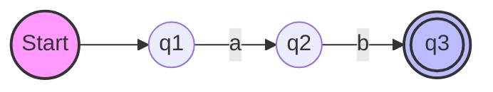
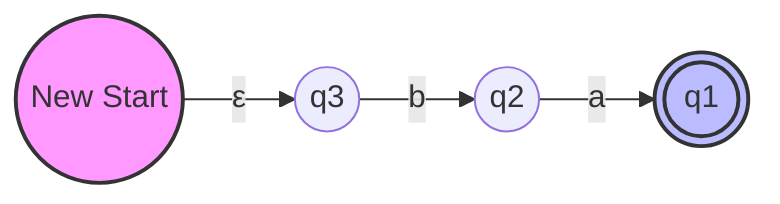
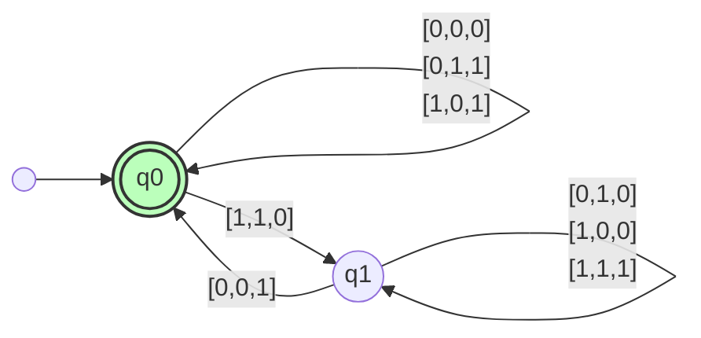
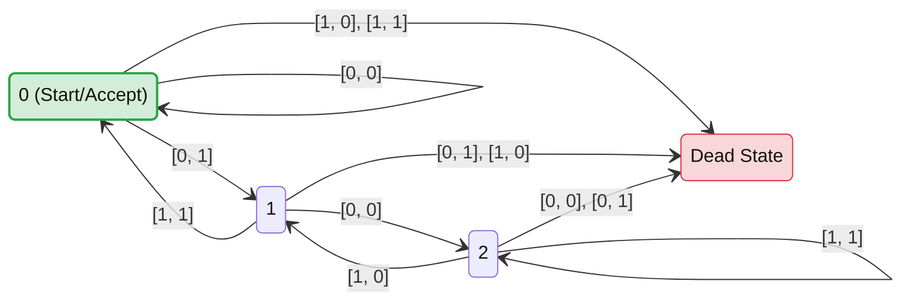

# Problem 1.31: Reverse of a Regular Language

**Tags:** #automata #theory-of-computation #proof #regular-languages #sipser

## Problem Statement
For any string $w = w_1w_2 \dots w_n$, the **reverse** of $w$, written $w^\mathcal{R}$, is the string $w$ in reverse order, $w_n \dots w_2w_1$. 

For any language $A$, let $A^\mathcal{R} = \{ w^\mathcal{R} \mid w \in A \}$. 
**Show that if $A$ is regular, so is $A^\mathcal{R}$.**

---

## Proof: Construction by NFA

### 1. The Intuition
If a language $A$ is regular, it is recognized by some Deterministic Finite Automaton (DFA). To accept the reverse of the strings, we essentially want to run the machine **backwards**.

However, simply reversing the arrows of a DFA creates two issues:
1. **Multiple Accept States:** The original DFA might have many accept states. If we run it backwards, where do we start?
2. **Determinism breaks:** In a DFA, one state has exactly one outgoing arrow for a symbol 'a'. If we reverse the arrows, a state might have multiple incoming arrows on 'a' (which become multiple outgoing arrows in reverse), or none.

**Solution:** We construct an **NFA** (Nondeterministic Finite Automaton). NFAs allow multiple start options (via $\varepsilon$-transitions) and multiple outgoing edges. Since every NFA has an equivalent regular language, proving we can build this NFA proves $A^\mathcal{R}$ is regular.

### 2. Visualization

> [!example] Visualizing the Transformation
> We transform the DFA $M$ into NFA $M^\mathcal{R}$ by reversing arrows and swapping start/accept roles.

#### Original DFA ($M$)
Processing string $w = ab$: Start $\to q_1 \xrightarrow{a} q_2 \xrightarrow{b} q_3$ (Accept)

#### Reversed NFA ($M^\mathcal{R}$)
Processing string $w^\mathcal{R} = ba$: NewStart $\xrightarrow{\varepsilon} q_3 \xrightarrow{b} q_2 \xrightarrow{a} q_1$ (Accept)

---

### 3. Formal Construction

Let $A$ be a regular language. Then there exists a DFA $M = (Q, \Sigma, \delta, q_0, F)$ that recognizes $A$.

We construct an NFA $N = (Q', \Sigma, \delta', q_{start}, F')$ that recognizes $A^\mathcal{R}$.

#### The Components:
1.  **States ($Q'$):** $Q \cup \{q_{start}\}$
    *   We keep all original states and add one new start state.
2.  **Start State:** $q_{start}$
    *   The newly created state.
3.  **Accept States ($F'$):** $\{q_0\}$
    *   The original start state becomes the unique accept state.
4.  **Transition Function ($\delta'$):**
    
    *   **Case 1: Reversing internal edges**
        For any $q \in Q$ and $a \in \Sigma$:
        $$ \delta'(q, a) = \{ p \in Q \mid \delta(p, a) = q \} $$
        *(If the original machine went $p \xrightarrow{a} q$, the new machine goes $q \xrightarrow{a} p$)*.
        
    *   **Case 2: Connecting the new start state**
        $$ \delta'(q_{start}, \varepsilon) = F $$
        *(We add $\varepsilon$-transitions from the new start state to all original accept states).*

### 4. Conclusion
The NFA $N$ accepts a string $w$ if and only if there is a path from $q_{start}$ to $q_0$ labeled $w$.
*   The first step is an $\varepsilon$-transition to some state $q_f \in F$.
*   The subsequent steps trace a path from $q_f$ to $q_0$ using the reversed edges.
*   In the original DFA $M$, this corresponds to a path from $q_0$ to $q_f$ labeled with $w$ in reverse order ($w^\mathcal{R}$).

Since $M$ accepts $w^\mathcal{R}$, $N$ accepts $w$. 
Since we have constructed an NFA for $A^\mathcal{R}$, **$A^\mathcal{R}$ is regular.**

***
***
***
# Problem 1.32: Regularity of Binary Addition

## Problem Statement

Let 
$$ \Sigma_3 = \left\{ \begin{bmatrix} 0 \\ 0 \\ 0 \end{bmatrix}, \begin{bmatrix} 0 \\ 0 \\ 1 \end{bmatrix}, \begin{bmatrix} 0 \\ 1 \\ 0 \end{bmatrix}, \dots, \begin{bmatrix} 1 \\ 1 \\ 1 \end{bmatrix} \right\} $$
$\Sigma_3$ contains all size 3 columns of 0s and 1s. A string of symbols in $\Sigma_3$ gives three rows of 0s and 1s. Consider each row to be a binary number and let:

$$ B = \{ w \in \Sigma_3^* \mid \text{the bottom row of } w \text{ is the sum of the top two rows} \} $$

**Show that $B$ is regular.**

> [!TIP] Hint
> Working with $B^{\mathcal{R}}$ (the reverse of the language) is easier. You may assume the result that if a language is regular, its reverse is also regular.

---

## Solution

### Strategy
To prove that $B$ is regular, we will prove that its reverse, $B^{\mathcal{R}}$, is regular. 
1. Since the class of regular languages is **closed under reversal**, if $B^{\mathcal{R}}$ is regular, then $B$ is regular.
2. In standard binary arithmetic, we process numbers from **Least Significant Bit (LSB)** to **Most Significant Bit (MSB)** (usually right-to-left).
3. The string $w \in B$ has the MSB on the left. Therefore, $w^{\mathcal{R}}$ places the LSB on the left.
4. We will construct a Deterministic Finite Automaton (DFA) that reads $w^{\mathcal{R}}$ from left to right (LSB to MSB) and verifies the addition.

### The Logic of the DFA

When adding two bits ($a$ and $b$) along with a carry-in ($c_{in}$), we produce a sum bit ($s$) and a carry-out ($c_{out}$).

**The Equation:** 
$$ a + b + c_{in} = 2 \times c_{out} + s $$

Where:
*   The input symbol is the column $\begin{bmatrix} a \\ b \\ s \end{bmatrix}$.
*   The **state** represents the **carry-in** ($c_{in}$).
*   We need two states:
    *   $q_0$: Carry is $0$.
    *   $q_1$: Carry is $1$.
*   **Start State:** $q_0$ (Addition starts with a carry of 0).
*   **Accept State:** $q_0$ (A valid addition must end with a carry of 0. If the carry is 1, it's an overflow, and the equation $top + bottom = sum$ doesn't hold for the given bit length).

### Transition Table

Let the current state be $c_{in}$. We read input $\begin{bmatrix} a \\ b \\ s_{input} \end{bmatrix}$.
1. Calculate expected sum: $S_{calc} = a + b + c_{in}$.
2. The transitions are valid **only if** $S_{calc} \pmod 2 = s_{input}$.
3. The next state is determined by the new carry: $c_{out} = \lfloor S_{calc} / 2 \rfloor$.

| Current State ($c_{in}$) |                  Input $\begin{bmatrix}a\\b\\s\end{bmatrix}$                   | Calc ($a+b+c_{in}$) | Valid? ($s = \text{sum} \% 2$) | Next State ($c_{out}$) |
| :----------------------: | :----------------------------------------------------------------------------: | :-----------------: | :----------------------------: | :--------------------: |
|      **$q_0$** (0)       |                     $\begin{bmatrix}0\\0\\0\end{bmatrix}$                      |          0          |               ✅                |         $q_0$          |
|      **$q_0$** (0)       | $\begin{bmatrix}1\\0\\1\end{bmatrix}$ or $\begin{bmatrix}0\\1\\1\end{bmatrix}$ |          1          |               ✅                |         $q_0$          |
|      **$q_0$** (0)       |                     $\begin{bmatrix}1\\1\\0\end{bmatrix}$                      |          2          |               ✅                |         $q_1$          |
|      **$q_1$** (1)       |                     $\begin{bmatrix}0\\0\\1\end{bmatrix}$                      |          1          |               ✅                |         $q_0$          |
|      **$q_1$** (1)       | $\begin{bmatrix}1\\0\\0\end{bmatrix}$ or $\begin{bmatrix}0\\1\\0\end{bmatrix}$ |          2          |               ✅                |         $q_1$          |
|      **$q_1$** (1)       |                     $\begin{bmatrix}1\\1\\1\end{bmatrix}$                      |          3          |               ✅                |         $q_1$          |

*(Note: Any input not listed above leads to an implicit reject state).*

### Finite Automaton Visualization

***
***
***

# Problem 1.33: Regularity of $y = 3x$

## 1. Problem Statement

Let $\Sigma_2 = \left\{ \begin{bmatrix} 0 \\ 0 \end{bmatrix}, \begin{bmatrix} 0 \\ 1 \end{bmatrix}, \begin{bmatrix} 1 \\ 0 \end{bmatrix}, \begin{bmatrix} 1 \\ 1 \end{bmatrix} \right\}$.
A string $w \in \Sigma_2^*$ represents two rows of binary numbers. Let the top row be $x$ and the bottom row be $y$.
Define the language:
$$ C = \{ w \in \Sigma_2^* \mid \text{the bottom row of } w \text{ is three times the top row} \} $$
$$ y = 3x \iff y - 3x = 0 $$

**Goal:** Show that $C$ is regular.

---

## 2. Proof Strategy: MSB-to-LSB Processing

To prove $C$ is regular, we construct a **Deterministic Finite Automaton (DFA)**.
We process the string from left to right (Most Significant Bit first).

> [!INFO] Concept
> We track the value of the difference $k = y - 3x$ as we read the bits.
> Because the binary value doubles with every new bit read, we update the difference state using the formula:
> $$ k_{new} = 2 \cdot k_{old} + (b - 3a) $$
> Where $a$ is the top bit and $b$ is the bottom bit of the current column.

### State Bounds
We need to determine which values of $k$ allow the system to return to 0.
The input contribution $(b-3a)$ ranges from $-3$ (if $\begin{bmatrix}1\\0\end{bmatrix}$) to $+1$ (if $\begin{bmatrix}0\\1\end{bmatrix}$).

1.  **Lower Bound:** If $k < 0$ (e.g., $-1$), the max next state is $2(-1) + 1 = -1$. The value can never return to 0. All negative integers are "Dead" states.
2.  **Upper Bound:** If $k \ge 3$, the min next state is $2(3) - 3 = 3$. The value can never return to 0. All integers $\ge 3$ are "Dead" states.

**Valid States:** The only recoverable states are $Q = \{0, 1, 2\}$.
**Dead State:** A sink state $D$ for all other values.

---

## 3. Transition Logic

The transition function $\delta(k, \begin{bmatrix}a\\b\end{bmatrix})$ is calculated by $2k + b - 3a$.

| Current State $k$ | Input $\begin{bmatrix}0\\0\end{bmatrix}$   ($+0$) | Input $\begin{bmatrix}0\\1\end{bmatrix}$   ($+1$) | Input $\begin{bmatrix}1\\0\end{bmatrix}$   ($-3$) | Input $\begin{bmatrix}1\\1\end{bmatrix}$   ($-2$) |
| :---: | :---: | :---: | :---: | :---: |
| **0** | $0$ | $1$ | $D$ | $D$ |
| **1** | $2$ | $D$ | $D$ | $0$ |
| **2** | $D$ | $D$ | $1$ | $2$ |
| **D** | $D$ | $D$ | $D$ | $D$ |

*   **Start State:** $0$ (Initial difference is 0).
*   **Accept State:** $0$ (Final difference must be 0).

---

## 4. Visual Representation (DFA)

Here is the state diagram for the language $C$.
*(Inputs are formatted as `[top, bottom]`)*

## 5. Example Walkthrough

Test with the valid string provided in the problem: $\begin{bmatrix}0\\0\end{bmatrix}\begin{bmatrix}0\\1\end{bmatrix}\begin{bmatrix}1\\1\end{bmatrix}\begin{bmatrix}0\\0\end{bmatrix}$
*(Corresponds to $x=010_2 = 2, y=0110_2 = 6$)*

1.  **Start at $0$**.
2.  Read $\begin{bmatrix}0\\0\end{bmatrix}$: Calculate $2(0) + 0 - 3(0) = 0$. **State $\to 0$**.
3.  Read $\begin{bmatrix}0\\1\end{bmatrix}$: Calculate $2(0) + 1 - 3(0) = 1$. **State $\to 1$**.
4.  Read $\begin{bmatrix}1\\1\end{bmatrix}$: Calculate $2(1) + 1 - 3(1) = 0$. **State $\to 0$**.
5.  Read $\begin{bmatrix}0\\0\end{bmatrix}$: Calculate $2(0) + 0 - 3(0) = 0$. **State $\to 0$**.

**Result:** The machine ends in state $0$ (Accept). The string is in $C$.