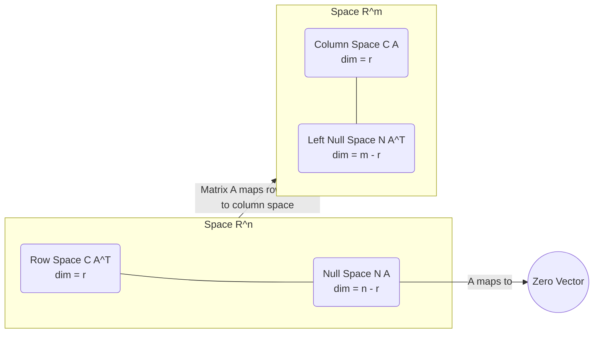

**Lecturer:** [[Gilbert Strang]]
**Source:** MIT OpenCourseWare
**Date:** Lecture 10
**Tags:** #LinearAlgebra #Mathematics #Matrices #VectorSpaces #Basis #Dimension

---
## 1. The Four Fundamental Subspaces
This is the core concept of the course. For any $m \times n$ matrix $A$, there are four fundamental subspaces that dictate its behaviour.

### The Big Picture
Where do these spaces live?
*   $A$ is an $m \times n$ matrix.
*   **Domain:** $\mathbb{R}^n$ (The space of inputs $x$).
*   **Codomain:** $\mathbb{R}^m$ (The space of outputs $b$).

| Subspace | Symbol | Definition | Lives In |
| :--- | :---: | :--- | :---: |
| **1. Column Space** | $C(A)$ | All linear combinations of columns of $A$. | $\mathbb{R}^m$ |
| **2. Null Space** | $N(A)$ | All vectors $x$ such that $Ax = 0$. | $\mathbb{R}^n$ |
| **3. Row Space** | $C(A^T)$ | All linear combinations of rows of $A$. | $\mathbb{R}^n$ |
| **4. Left Null Space** | $N(A^T)$ | All vectors $y$ such that $A^T y = 0$ (or $y^T A = 0$). | $\mathbb{R}^m$ |

---

## 3. Dimensions and Bases of the Subspaces

We analyze these using the dimensions $m$ (rows), $n$ (columns), and $r$ (rank).

### A. Column Space $C(A)$
*   **Definition:** The space spanned by the columns of $A$.
*   **Dimension:** $\dim(C(A)) = r$ (The Rank).
*   **Basis:** The **Pivot Columns** of the original matrix $A$.

### B. Null Space $N(A)$
*   **Definition:** Solutions to $Ax=0$.
*   **Dimension:** $\dim(N(A)) = n - r$.
    *   This corresponds to the number of **Free Variables**.
*   **Basis:** The **Special Solutions** calculated by setting free variables to 1 and 0 alternatingly.

### C. Row Space $C(A^T)$
*   **Definition:** The space spanned by the rows of $A$. To treat them as column vectors, we transpose $A$.
*   **Dimension:** $\dim(C(A^T)) = r$.
    > [!IMPORTANT] Fundamental Theorem
    > **Row Rank = Column Rank**. The dimension of the row space is exactly the same as the dimension of the column space.
*   **Basis:**
    *   We perform row reduction $A \to R$ (Reduced Row Echelon Form).
    *   Row operations **do not change the row space**.
    *   Therefore, the **first $r$ rows (non-zero rows) of $R$** form a basis for the row space.
    *   *Note:* The rows of $A$ span the space, but might be dependent. The rows of $R$ are the cleanest basis.

### D. Left Null Space $N(A^T)$
*   **Definition:** The Null Space of $A^T$. It contains vectors $y$ such that $A^T y = 0$.
    *   Transposing this equation: $y^T A = 0^T$.
    *   This looks like a row vector $y^T$ multiplying $A$ from the left to produce the zero row. Hence: "Left Null Space".
*   **Dimension:**
    *   The matrix $A^T$ is $n \times m$ with rank $r$.
    *   Using the Null Space dimension formula ($variables - rank$):
    *   $\dim(N(A^T)) = m - r$.

> [!INFO] Summary of Dimensions
> *   **Inside $\mathbb{R}^n$:** Row Space ($r$) + Null Space ($n-r$) = $n$.
> *   **Inside $\mathbb{R}^m$:** Column Space ($r$) + Left Null Space ($m-r$) = $m$.

---

## 4. Finding a Basis for the Left Null Space
How do we find the basis for $N(A^T)$ systematically? We use the **Gauss-Jordan** method on the augmented matrix $[A \ | \ I]$.

### The Method
We look for the combination of rows that produces the zero row.
We perform elimination on the augmented matrix to track the row operations:
$$ [A_{m \times n} \ | \ I_{m \times m}] \xrightarrow{\text{row reduction}} [R_{m \times n} \ | \ E_{m \times m}] $$

Here, $E$ is the elimination matrix that records all operations such that:
$$ E A = R $$

### Interpreting $E$
If the matrix $A$ is not invertible (rectangular or singular), $R$ will have zero-rows at the bottom.
$$ R = \begin{bmatrix} \text{pivot rows} \\ 0 \ 0 \ \dots \ 0 \end{bmatrix} $$

Since $EA = R$, the bottom rows of $E$ are the vectors that multiply $A$ to produce those zero rows in $R$.

**Basis for $N(A^T)$:** The bottom $m-r$ rows of the matrix $E$.

### Example
Let $A = \begin{bmatrix} 1 & 2 & 3 & 1 \\ 1 & 1 & 2 & 1 \\ 1 & 2 & 3 & 1 \end{bmatrix}$.
*   $m=3, n=4$.
*   We can see row 1 = row 3. Rank $r=2$.
*   We augment $A$ with $I$:
    $$ \left[ \begin{array}{c|c} A & I \end{array} \right] = \left[ \begin{array}{cccc|ccc} 1 & 2 & 3 & 1 & 1 & 0 & 0 \\ 1 & 1 & 2 & 1 & 0 & 1 & 0 \\ 1 & 2 & 3 & 1 & 0 & 0 & 1 \end{array} \right] $$

*   **Row Reduction:**
    1.  $R_2 = R_2 - R_1$
    2.  $R_3 = R_3 - R_1$
    $$ \to \left[ \begin{array}{cccc|ccc} 1 & 2 & 3 & 1 & 1 & 0 & 0 \\ 0 & -1 & -1 & 0 & -1 & 1 & 0 \\ 0 & 0 & 0 & 0 & -1 & 0 & 1 \end{array} \right] $$

*   **Analysis:**
    *   The last row of the reduced matrix is zeroes.
    *   Look at the last row of the augmentation (the $E$ part): $\begin{bmatrix} -1 & 0 & 1 \end{bmatrix}$.
    *   This vector is the basis for the Left Null Space.
    *   Check: $-1(\text{Row } 1) + 0(\text{Row } 2) + 1(\text{Row } 3) = \mathbf{0}$. Correct.

---

## 5. Visualizing the Subspaces (The "Strang Diagram")

This diagram illustrates how the subspaces partition the input and output spaces.

---

## 6. New Concept: Matrices as a Vector Space
Strang extends the concept of vector spaces beyond just column vectors. He considers the space $M$ of all $3 \times 3$ matrices.

*   **Vector Space $M$:** All $3 \times 3$ matrices.
    *   You can add them ($A+B$).
    *   You can multiply by scalars ($cA$).
    *   There is a zero "vector" (the zero matrix).
*   **Dimension of $M$:** 9 (It behaves like $\mathbb{R}^9$).

### Subspaces of Matrix Space $M$
1.  **Upper Triangular Matrices:**
    *   Entries below diagonal are zero.
    *   Basis involves entries on and above diagonal.
    *   **Dimension:** $3 + 2 + 1 = 6$.
2.  **Symmetric Matrices:**
    *   $A^T = A$.
    *   The choice of the 3 diagonal and 3 upper terms determines the lower terms.
    *   **Dimension:** 6.
3.  **Diagonal Matrices:**
    *   Intersection of Upper Triangular and Symmetric matrices.
    *   Only diagonal terms are non-zero.
    *   **Dimension:** 3.

> [!NOTE] Dimension Addition
> $\dim(U) + \dim(S) \neq \dim(M)$
> $6 + 6 \neq 9$
> However, we look at the union and intersection:
> $\dim(U) + \dim(S) = \dim(U \cup S) + \dim(U \cap S)$
> $6 + 6 = 9 + 3$
> (Where $U \cup S$ spans the whole space 9, and intersection is diagonal 3).
