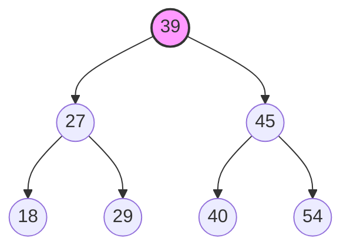

# Lecture 06: Binary Search Trees (BST)

## 1. Introduction

### Definition
A **Binary Search Tree (BST)**, also known as an **Ordered Binary Tree**, is a node-based binary tree data structure which has the following properties:
1.  The **Left Subtree** of a node contains only nodes with keys **less than** the node's key.
2.  The **Right Subtree** of a node contains only nodes with keys **greater than** (or equal to, depending on handling of duplicates) the node's key.
3.  The left and right subtrees must also be binary search trees.

> [!NOTE] Handling Duplicates
> Some definitions strictly allow no duplicates ($Left < Root < Right$). Others allow duplicates on the right ($Left < Root \le Right$) or left. 
> *Standard Convention:* Operations often assume distinct keys for simplicity, but real-world implementations must handle duplicates.

### Visual Representation

*   **Root:** 39
*   **Left Validity:** $27, 18, 29$ are all $< 39$.
*   **Right Validity:** $45, 40, 54$ are all $> 39$.
*   **Subtree Validity:** Node 27 is root of left subtree; $18 < 27$ and $29 > 27$.

---

## 2. Why use a BST?

### Performance
The primary motivation is efficient **Searching**.
*   **Average Case:** $O(\log n)$. At every step, we eliminate half the search space (Divide and Conquer).
*   **Comparison:** 
    *   **Sorted Array:** $O(\log n)$ search, but expensive $O(n)$ insertion/deletion.
    *   **Linked List:** Cheap insertion/deletion, but slow $O(n)$ search.
    *   **BST:** Balances both with $O(\log n)$ average for search, insert, and delete.

### The Problem: Skewed Trees
If data is inserted in sorted order (e.g., 10, 20, 30, 40), the BST degrades into a **Skewed Tree** (essentially a Linked List).
*   **Worst Case Complexity:** $O(n)$ for all operations.
*   **Solution:** Self-balancing trees (AVL, Red-Black Trees) which are covered in advanced topics.

---

## 3. Operations

### A. Searching
**Logic:**
1.  Start at **Root**.
2.  If `Root == NULL` or `Root->Data == Key`, return Root.
3.  If `Key < Root->Data`, recurse **Left**.
4.  If `Key > Root->Data`, recurse **Right**.

**Iterative vs Recursive:**
*   **Recursive:** Cleaner code, uses stack space $O(h)$.
*   **Iterative:** More memory efficient $O(1)$ space, no stack overflow risk.

### B. Insertion
**Logic:**
1.  Perform a search for the `Key`.
2.  If found, handle duplicate (ignore or increment count).
3.  If not found, the search terminates at a `NULL` pointer.
4.  Insert the new node at that location.
*   *Note:* New nodes are always inserted as **Leaf Nodes**.

### C. Deletion
Deleting a node is the most complex operation because we must maintain the BST property.

#### Case 1: Node is a Leaf
Simply remove the node from the tree.
*   *Action:* Set parent's pointer to `NULL`, delete node.

#### Case 2: Node has One Child
The child "jumps up" to take the parent's place.
*   *Action:* Link parent of the deleted node directly to the single child of the deleted node.

#### Case 3: Node has Two Children
We cannot simply delete the node. We must find a replacement that preserves the order.
1.  **Find Predecessor:** Largest value in the **Left Subtree**.
    *   *Alternatively:* Find **Successor** (Smallest value in Right Subtree).
2.  **Swap:** Copy the Predecessor's data to the target node.
3.  **Delete Predecessor:** Recursively delete the Predecessor node (which will now be a Case 1 or Case 2 deletion).

---

## 4. Utility Operations

### Finding Min / Max
*   **Min:** Keep going **Left** until `Node->Left == NULL`.
*   **Max:** Keep going **Right** until `Node->Right == NULL`.

### Height & Counting
*   **Height:** `max(height(left), height(right)) + 1`
*   **Size (Total Nodes):** `size(left) + size(right) + 1`

---

## 5. Complexity Analysis

| Operation | Average Case (Balanced) | Worst Case (Skewed) |
| :--- | :---: | :---: |
| **Search** | $O(\log n)$ | $O(n)$ |
| **Insert** | $O(\log n)$ | $O(n)$ |
| **Delete** | $O(\log n)$ | $O(n)$ |
| **Space** | $O(n)$ | $O(n)$ |

> **Height ($h$):** In a balanced tree $h \approx \log_2 n$. In a skewed tree $h = n$. The complexity is technically $O(h)$.

---

## 6. Comprehensive Implementation (C++)

This code includes a `BinarySearchTree` class with Recursive and Iterative implementations for key operations, plus traversals.

```cpp
#include <iostream>
#include <queue>
#include <algorithm>

using namespace std;

struct Node {
    int data;
    Node* left;
    Node* right;
    
    Node(int val) : data(val), left(nullptr), right(nullptr) {}
};

class BinarySearchTree {
private:
    Node* root;

    // --- Internal Recursive Helpers ---

    Node* insertRecursive(Node* node, int val) {
        if (node == nullptr) {
            return new Node(val);
        }
        if (val < node->data) {
            node->left = insertRecursive(node->left, val);
        } else if (val > node->data) {
            node->right = insertRecursive(node->right, val);
        }
        return node;
    }

    Node* searchRecursive(Node* node, int val) {
        if (node == nullptr || node->data == val) {
            return node;
        }
        if (val < node->data) {
            return searchRecursive(node->left, val);
        }
        return searchRecursive(node->right, val);
    }

    Node* findMin(Node* node) {
        while (node && node->left != nullptr) {
            node = node->left;
        }
        return node;
    }

    Node* deleteRecursive(Node* node, int val) {
        if (node == nullptr) return node;

        if (val < node->data) {
            node->left = deleteRecursive(node->left, val);
        } else if (val > node->data) {
            node->right = deleteRecursive(node->right, val);
        } else {
            // Node found
            
            // Case 1: No child (Leaf)
            if (node->left == nullptr && node->right == nullptr) {
                delete node;
                return nullptr;
            }
            // Case 2: One child
            else if (node->left == nullptr) {
                Node* temp = node->right;
                delete node;
                return temp;
            } else if (node->right == nullptr) {
                Node* temp = node->left;
                delete node;
                return temp;
            }
            // Case 3: Two children
            else {
                // Find successor (smallest in right subtree)
                Node* temp = findMin(node->right);
                // Copy successor content to this node
                node->data = temp->data;
                // Delete the successor
                node->right = deleteRecursive(node->right, temp->data);
            }
        }
        return node;
    }

    void inorderRecursive(Node* node) {
        if (node == nullptr) return;
        inorderRecursive(node->left);
        cout << node->data << " ";
        inorderRecursive(node->right);
    }

public:
    BinarySearchTree() : root(nullptr) {}

    // --- Public Interfaces ---

    // 1. Insertion (Iterative Approach for variety)
    void insertIterative(int val) {
        Node* newNode = new Node(val);
        if (root == nullptr) {
            root = newNode;
            return;
        }

        Node* current = root;
        Node* parent = nullptr;

        while (current != nullptr) {
            parent = current;
            if (val < current->data) {
                current = current->left;
            } else if (val > current->data) {
                current = current->right;
            } else {
                // Duplicate found, do nothing or handle accordingly
                delete newNode;
                return;
            }
        }

        if (val < parent->data) {
            parent->left = newNode;
        } else {
            parent->right = newNode;
        }
    }

    // Wrapper for Recursive Insert
    void insert(int val) {
        root = insertRecursive(root, val);
    }

    // 2. Search (Iterative Approach)
    bool searchIterative(int val) {
        Node* current = root;
        while (current != nullptr) {
            if (val == current->data) return true;
            else if (val < current->data) current = current->left;
            else current = current->right;
        }
        return false;
    }

    // Wrapper for Recursive Search
    Node* search(int val) {
        return searchRecursive(root, val);
    }

    // 3. Deletion
    void remove(int val) {
        root = deleteRecursive(root, val);
    }

    // 4. Traversals
    void displayInorder() {
        inorderRecursive(root);
        cout << endl;
    }

    void displayLevelOrder() {
        if (root == nullptr) return;
        queue<Node*> q;
        q.push(root);

        while (!q.empty()) {
            Node* current = q.front();
            q.pop();
            cout << current->data << " ";

            if (current->left) q.push(current->left);
            if (current->right) q.push(current->right);
        }
        cout << endl;
    }
};

int main() {
    BinarySearchTree bst;
    
    // Constructing Tree
    bst.insert(39);
    bst.insert(27);
    bst.insert(45);
    bst.insert(18);
    bst.insert(29);
    bst.insert(40);
    bst.insert(54);

    cout << "Inorder Traversal (Sorted): ";
    bst.displayInorder(); // Expected: 18 27 29 39 40 45 54

    cout << "Search for 29: " << (bst.searchIterative(29) ? "Found" : "Not Found") << endl;
    cout << "Search for 99: " << (bst.searchIterative(99) ? "Found" : "Not Found") << endl;

    cout << "Deleting 27 (Node with 2 children 18, 29):" << endl;
    bst.remove(27);
    bst.displayInorder(); // Expected: 18 29 39 40 45 54

    return 0;
}
```

## 7. Beyond Basic BSTs
Basic BSTs are great but vulnerable to skewing. Real-world systems use variations:
*   **AVL Trees:** Strictly balanced (Height difference $\le 1$).
*   **Red-Black Trees:** Loosely balanced (Used in C++ `std::map`, Java `TreeMap`).
*   **B-Trees:** Multi-way search trees, optimized for Disk I/O (Databases).
