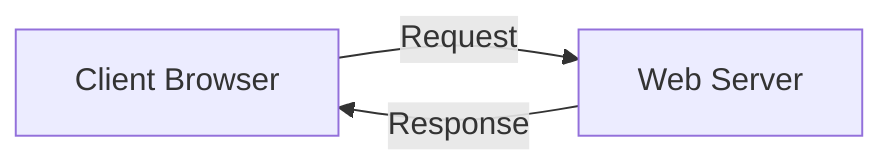
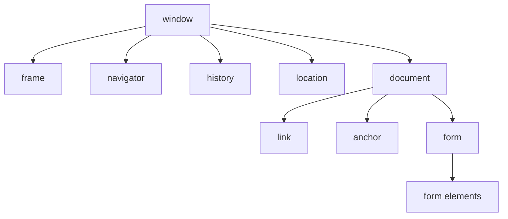
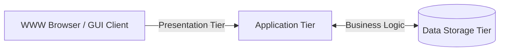
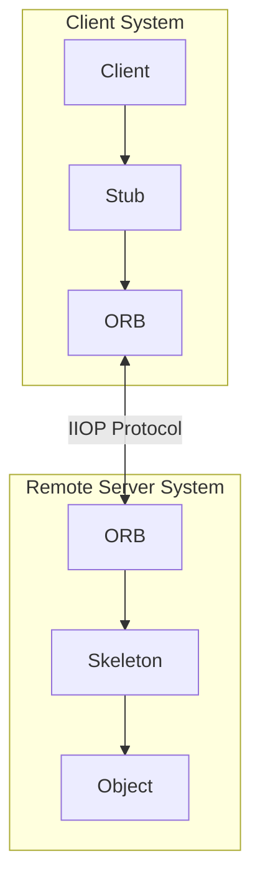
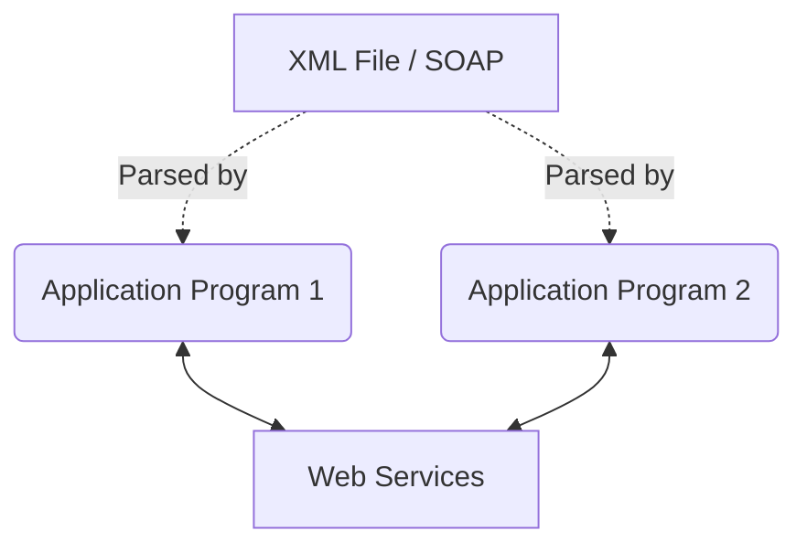

***

# Chapter 13: Objects and the Internet

**Tags:** #OOP #Networking #DistributedComputing #JavaScript #CORBA #SOAP #XML #WebServices

## Overview
While object-oriented languages (like Smalltalk) have been around as long as structured languages, they gained massive mainstream acceptance with the emergence of the Internet. Languages like Java were specifically targeted for networks, and .NET brought objects fully into the mainstream. This chapter explores how objects exist and interact over the Internet.

---

## 1. Evolution of Distributed Computing
Distributed computing involves sending objects between applications residing on distributed physical platforms. The evolution includes several key technologies:
*   **HTML** (Hypertext Markup Language)
*   **EDI** (Electronic Data Interchange)
*   **RPC** (Remote Procedure Calls)
*   **CORBA** (Common Object Request Broker Architecture)
*   **DCOM** (Distributed Component Object Model)
*   **XML** (eXtensible Markup Language)
*   **SOAP** (Simple Object Access Protocol)
*   **Web Services**

---

## 2. Object-Based Scripting Languages and the Client-Server Model

Programming languages (Java, C#) are only part of the web development puzzle; scripting and markup languages also play major roles. 

### The Client-Server Model
Web interactions fundamentally operate on a two-sided model: the **Client** (usually the web browser) and the **Server** (the physical web server).



### Data Validation: Client vs. Server
When collecting user data (e.g., a form requesting Date, First Name, Age), validation is crucial. 

> [!warning] Client Security
> Because anyone can use a web browser, clients should *never* access a database directly. When a client needs to inspect/update a database, it must request the operation from the server. This aligns perfectly with the OOP **Interface/Implementation paradigm**.

**Why Validate on the Client Side?**
While the server must ultimately process data safely, validating data on the client side (using scripting languages) is preferred because sending unvalidated data to the server:
1.  Takes more time.
2.  Increases network traffic.
3.  Takes up server resources.
4.  Increases the potential for errors.

### JavaScript as an Object-Based Language
JavaScript is considered an **object-based** language (like C++). It does not enforce pure OOP rules, but it provides object-oriented capabilities that bridge traditional programming and OOP models. 

**HTML limitation:** HTML provides functionality but lacks programming logic (no `IF` statements or loops). JavaScript fills this gap.

#### JavaScript Validation Example
```html
<html>
<head>
<title>Validation Program</title>
<script type="text/javascript">
function validateNumber(tForm) {
    if (tForm.result.value != 5 ) {
        this.alert ("not 5!");
    } else {
        this.alert ("Correct. Good Job!");
    }
}
</script>
</head>
<body>
    <h1>Validate</h1>
    <form name="form">
        <input type="text" name="result" value="0" SIZE="2">
        <input type="button" value="Validate" name="calcButton" onClick="validateNumber(this.form)">
    </form>
</body>
</html>
```

> [!info] The `this` Pointer
> In the code `this.alert`, the `this` pointer refers to the current object, which in this context is the form.

### JavaScript Object Hierarchy
JavaScript interacts with HTML elements as objects (Text boxes, buttons, forms). These objects have *properties* (color, text) and *methods*.



#### Built-in JavaScript Objects (Date Example)
```html
<script language="JavaScript" type="text/javascript">
    days = new Array ("Sunday", "Monday", "Tuesday", "Wednesday", "Thursday", "Friday", "Saturday", "Sunday");
    today = new Date();
    document.write("Today is " + days[today.getDay()]);
</script>
```

---

## 3. Objects Embedded in a Web Page
Web pages can include external, pre-built objects using the HTML `<object>` tag.

**Slider Control Example:**
```html
<object classid="clsid:F08DF954-8592-11D1-B16A-00C0F0283628" id="Slider1" width="100" height="50">
    <param name="BorderStyle" value="1" />
    <param name="MousePointer" value="0" />
    <param name="Enabled" value="1" />
    <param name="Min" value="0" />
    <param name="Max" value="10" />
</object>
```
*(Notice how attributes/properties of the object are set using `<param>` tags).*

This can also be used for **Sound Players**, **Movie Players**, and **Flash** animations by changing the `classid` and `FileName`/`SRC` parameters.

---

## 4. Distributed Objects and the Enterprise
**Enterprise Computing** essentially means **Distributed Computing**: a group of computers working together over a network (proprietary or the Internet).
*   **Benefits:** Load balancing, fault tolerance (if one machine crashes, others take over), and localization for faster downloads.
*   **Objects' Role:** Because objects are totally self-contained units, they are perfect for traveling over networks.

### Multi-Tiered Systems
Middleware provides services allowing application processes to interact over a network.



### CORBA (Common Object Request Broker Architecture)
Managed by the **OMG** (Object Management Group), CORBA is a standard protocol allowing programs from different vendors (varying hardware, OS, and languages like C++, Java, COBOL) to communicate.

> [!quote] OMG Definition
> "CORBA applications are composed of objects... individual units of running software that combine functionality and data, and that frequently represent something in the real world."

*   **Wrappers:** CORBA is often used to create object wrappers around legacy applications, allowing old systems to connect to new distributed systems.
*   **IDL (Interface Definition Language):** A contract that both client and server must adhere to. It allows objects to be *marshaled* (decomposed, sent over network, reconstituted) regardless of language.
*   **ORB (Object Request Broker):** The routing mechanism. It routes client requests to objects and sends responses back. 

#### CORBA Routing Architecture

*(**IIOP**: Internet Inter-ORB Protocol, the standard protocol for distributed objects).*

> [!info]- Location Transparency & ORB Routing
> One of the most powerful features of a distributed system is **Location Transparency**. 
> 
> **How it works:**
> 1. **Local Appearance**: To the client, the object invocation appears strictly local—as if the object is living on the client's own machine.
> 2. **ORB Interception**: When the client invokes a service, the request is passed through the **ORB**.
> 3. **Routing**: The ORB determines where the object actually resides. If it's remote, the ORB transparently routes the request across the network.
> 4. **Invisible Service**: If the system is configured correctly, the client never knows (and never needs to know) where the actual object servicing the request is located.
> 
> **Summary Analogy (Vending Machine):**
> Think of a vending machine. You press a button on the front (the Interface) to get a soda. You don't need to know where the soda is stored inside, how the mechanical arm retrieves it, or which specific shelf it's on. You "invoked" the service, and the result appeared locally.

---

## 5. Web Services and SOAP
**Web Service:** A client and a server that communicate using XML messages via the SOAP standard.

**SOAP (Simple Object Access Protocol):**
*   XML-based and text-based (unlike proprietary, binary formats of CORBA/DCOM).
*   Platform and language independent.
*   Uses HTTP protocol (extends HTTP functionality to perform Remote Procedure Calls - RPC).
*   Acts as a "wrapper" over the Internet, allowing disparate technologies inside a company to standardize network communications.
*   It is a *stateless, one-way messaging system*.

### XML Schema and Data (Invoice Example)
SOAP relies on XML. Applications use Schemas (like an XSD file) as a "contract" to know how data is structured.

#### The Schema (`Invoice.xsd`) - *Defines HOW data is structured*
A visual representation of the XML schema:
*   📦 **Invoice** (Object)
    *   🏷️ `name` (string)
    *   🏠 **Address** (Object)
        *   `Street` (string)
        *   `City` (string), etc.
    *   📦 **Package** (Object)
        *   `Description` (string)
        *   `Weight` (short), etc.

#### The Data (`mwsoap.xml`) - *Contains the ACTUAL data*
```xml
<?xml version="1.0" encoding="utf-8"?>
<soap:envelope xmlns:soap="http://www.w3.org/2001/06/soap-envelope">
    <soap:Header>
        <!-- Transaction Info -->
    </soap:Header>
    <soap:Body>
        <mySOAPBody xmlns="http://ootp.org/Invoice.xsd">
            <invoice name="Jenny Smith">
                <address street="475 Oak Lane" city="Somewheresville" state="Nebraska" zip="23654" country="USA"/>
                <package description="22 inch Plasma Monitor" weight="22" priority="false" insured="true" />
            </invoice>
        </mySOAPBody>
    </soap:Body>
</soap:envelope>
```

### Parsing the SOAP/XML File
Regardless of the programming language, any application can extract the data as long as it can parse XML.



---

## 6. Web Services Code Implementation
Once the XML is received, backend OOP languages parse it into native objects. Here is how the `Invoice` class is represented in C# and VB.NET.

### C# .NET Implementation (`Invoice.cs`)
```csharp
using System;
using System.Xml.Serialization;

namespace WebServices
{
    [XmlRoot("invoice")]
    public class Invoice
    {
        public Invoice(String name, Address address, ShippingPackage package)
        {
            this.Name = name;
            this.Address = address;
            this.Package = package;
        }

        private String strName;
        [XmlAttribute("name")]
        public String Name
        {
            get { return strName; }
            set { strName = value; }
        }

        private Address objAddress;
        [XmlElement("address")]
        public Address Address
        {
            get { return objAddress; }
            set { objAddress = value; }
        }

        private ShippingPackage objPackage;
        [XmlElement("package")]
        public ShippingPackage Package
        {
            get { return objPackage; }
            set { objPackage = value; }
        }
    }
}
```

### VB .NET Implementation (`Invoice.vb`)
```vb
Imports System.Xml.Serialization

<XmlRoot("invoice")> _
Public Class Invoice
    Public Sub New(ByVal name As String, ByVal itemAddress As Address, ByVal itemPackage As Package)
        Me.Name = name
        Me.Address = itemAddress
        Me.Package = itemPackage
    End Sub

    Private strName As String
    <XmlAttribute("name")> _
    Public Property Name() As String
        Get
            Return strName
        End Get
        Set(ByVal value As String)
            strName = value
        End Set
    End Property

    Private objAddress As Address
    <XmlElement("address")> _
    Public Property Address() As Address
        Get
            Return objAddress
        End Get
        Set(ByVal value As Address) 
            objAddress = value
        End Set
    End Property

    Private objPackage As Package
    <XmlElement("package")> _
    Public Property Package() As Package
        Get
            Return objPackage
        End Get
        Set(ByVal value As Package)
            objPackage = value
        End Set
    End Property
    End Class
```

### Java Implementation (`Invoice.java`)

> [!example]- Click to see Java JAXB Implementation
> In Java, we use the **JAXB (Java Architecture for XML Binding)** library. Like .NET, it uses **Annotations** to tell the code how to map the class to XML.
> 
> ```java
> import javax.xml.bind.annotation.XmlAttribute;
> import javax.xml.bind.annotation.XmlElement;
> import javax.xml.bind.annotation.XmlRootElement;
> 
> @XmlRootElement(name = "invoice")
> public class Invoice {
>     private String name;
>     private Address address;
>     private ShippingPackage packageObj;
> 
>     // No-arg constructor required by JAXB
>     public Invoice() {}
> 
>     public Invoice(String name, Address address, ShippingPackage packageObj) {
>         this.name = name;
>         this.address = address;
>         this.packageObj = packageObj;
>     }
> 
>     @XmlAttribute(name = "name")
>     public String getName() { return name; }
>     public void setName(String name) { this.name = name; }
> 
>     @XmlElement(name = "address")
>     public Address getAddress() { return address; }
>     public void setAddress(Address address) { this.address = address; }
> 
>     @XmlElement(name = "package")
>     public ShippingPackage getPackage() { return packageObj; }
>     public void setPackage(ShippingPackage packageObj) { this.packageObj = packageObj; }
> }
> 
> // Helper Classes (Address & Package)
> class Address {
>     @XmlAttribute public String street;
>     @XmlAttribute public String city;
>     @XmlAttribute public String state;
>     @XmlAttribute public String zip;
>     @XmlAttribute public String country;
> }
> 
> class ShippingPackage {
>     @XmlAttribute public String description;
>     @XmlAttribute public int weight;
>     @XmlAttribute public boolean priority;
>     @XmlAttribute public boolean insured;
> }
> ```

---

## 7. WSDL (Web Services Description Language)
WSDL is an XML document that acts as the **instruction manual** or **contract** for a web service. It tells a client exactly what operations are available, what data they need, and how to communicate with the service.

### WSDL Document Structure

| WSDL Element | Purpose |
|--------------|---------|
| `<types>` | Data type definitions (using XSD) |
| `<message>` | Data elements for each operation (parameters & return types) |
| `<portType>` | Set of operations (abstract interface) |
| `<binding>` | Protocol and message format for each portType |
| `<service>` | Endpoint (URL) where the service is hosted |

### WSDL Example (`StudentService.wsdl`)
```xml
<definitions name="StudentService"
 targetNamespace="http://example.com/student"
 xmlns:soap="http://schemas.xmlsoap.org/wsdl/soap/">
 
 <!-- 1. TYPES: Data Dictionary -->
 <types>
   <xs:schema>
     <xs:element name="studentId" type="xs:int"/>
     <xs:element name="studentName" type="xs:string"/>
   </xs:schema>
 </types>
 
 <!-- 2. MESSAGES: The Envelopes -->
 <message name="GetStudentRequest">
   <part name="id" element="tns:studentId"/>
 </message>
 <message name="GetStudentResponse">
   <part name="name" element="tns:studentName"/>
 </message>
 
 <!-- 3. PORTTYPE: The Interface -->
 <portType name="StudentPortType">
   <operation name="GetStudent">
     <input message="tns:GetStudentRequest"/>
     <output message="tns:GetStudentResponse"/>
   </operation>
 </portType>
 
 <!-- 4. BINDING: The Protocol -->
 <binding name="StudentBinding" type="tns:StudentPortType">
   <soap:binding style="document"
     transport="http://schemas.xmlsoap.org/soap/http"/>
   <operation name="GetStudent">
     <soap:operation soapAction="GetStudent"/>
     <input><soap:body use="literal"/></input>
     <output><soap:body use="literal"/></output>
   </operation>
 </binding>
 
 <!-- 5. SERVICE: The Address -->
 <service name="StudentService">
   <port name="StudentPort" binding="tns:StudentBinding">
     <soap:address location="http://example.com/student"/>
   </port>
 </service>
</definitions>
```

### How a Client Reads WSDL
1.  **Look at `<service>`:** "The server is at `http://example.com/student`."
2.  **Look at `<binding>`:** "I need to send a SOAP message over HTTP."
3.  **Look at `<portType>`:** "I want to call the `GetStudent` operation."
4.  **Look at `<message>`:** "To call it, I need to send a `GetStudentRequest`."
5.  **Look at `<types>`:** "The request requires a `studentId`, which is an `int`."

> [!info] Code Generation
> Because WSDL is a strict contract, tools like **`wsimport`** (Java) or **`svcutil`** (.NET) can auto-generate client code. Instead of writing XML manually, you get Java classes that let you call the service like a normal method.

---

## 8. REST (Representational State Transfer)
REST is an **architectural style** (not a protocol) for building web services. Unlike SOAP, which uses XML and a strict standard, REST uses standard HTTP methods and is more flexible.

### REST vs SOAP

| Feature | SOAP | REST |
|---------|------|------|
| **Type** | Protocol | Architectural Style |
| **Format** | XML only | JSON, XML, HTML, Plain Text |
| **Transport** | HTTP, SMTP, TCP | HTTP only |
| **State** | Stateless by default, but supports state (WS-*) | **Strictly Stateless** |
| **Performance** | Heavier (more overhead) | Lighter and faster |
| **Security** | WS-Security built-in | Relies on HTTPS/OAuth |
| **Use Case** | Enterprise, banking, transactions | Mobile apps, public APIs, microservices |

### REST Constraints
REST must follow these 6 constraints to be considered "RESTful":

1.  **Client-Server:** Separation of concerns. Client handles UI; server handles data.
2.  **Stateless:** Every request must contain all the information the server needs. The server never stores client context between requests.
3.  **Cacheable:** Responses must define themselves as cacheable or not to improve performance.
4.  **Uniform Interface:** Standardized way of communicating (using HTTP verbs and URLs).
5.  **Layered System:** Client shouldn't know if it's connected to the end server or a proxy/load balancer.
6.  **Code on Demand (Optional):** Server can send executable code (like JavaScript) to the client.

### HTTP Methods in REST

| Method | Action | Example |
|--------|--------|---------|
| `GET` | Retrieve data | `GET /students/123` |
| `POST` | Create new resource | `POST /students` |
| `PUT` | Update/Replace resource | `PUT /students/123` |
| `PATCH` | Partially update resource | `PATCH /students/123` |
| `DELETE` | Remove resource | `DELETE /students/123` |

### RESTful URL Structure
REST uses **resources** (nouns) in URLs, not actions (verbs).

*   ❌ Bad: `/getStudent`, `/createStudent`
*   ✅ Good: `/students`, `/students/123`

### REST Example
```http
GET /api/students/123 HTTP/1.1
Host: example.com
Accept: application/json
```

**Response (JSON):**
```json
{
  "id": 123,
  "name": "John Doe",
  "email": "john@example.com",
  "courses": ["Math", "Science"]
}
```
