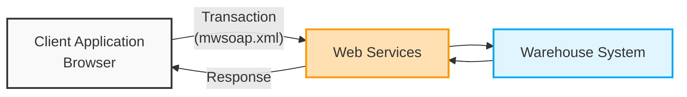
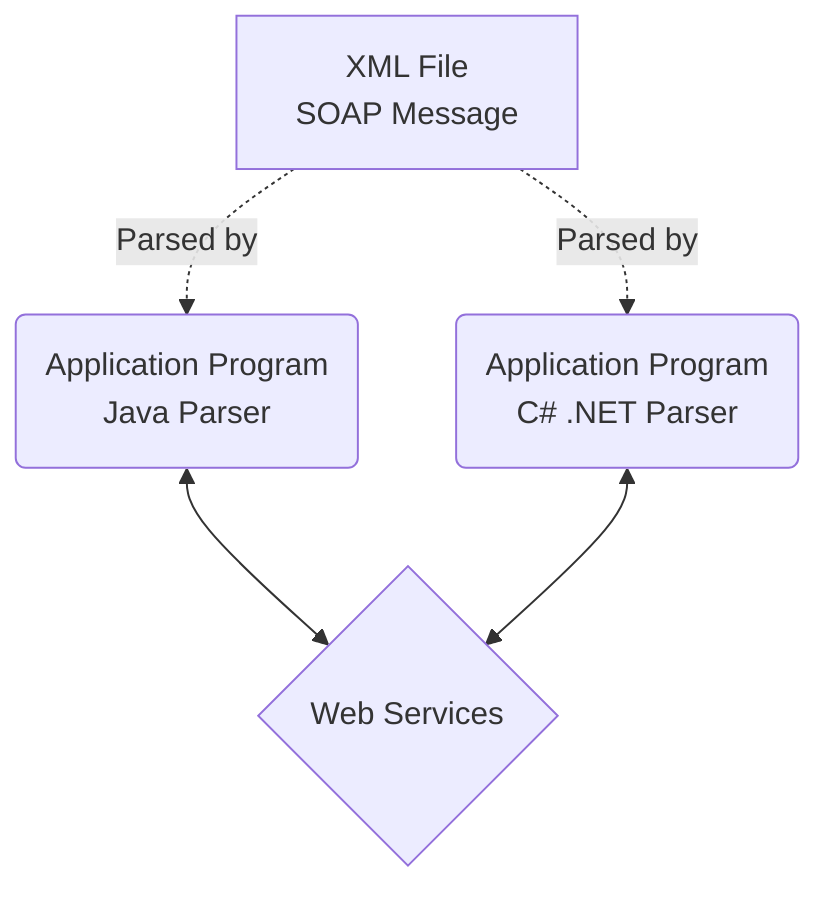

***

# Deep Dive: SOAP and Web Services 

**Tags:** #SOAP #WebServices #XML #DistributedComputing #OOP #EnterpriseArchitecture

## 1. The Need for Web Services and SOAP
Before SOAP, distributed computing (sending objects between applications over a network) relied heavily on technologies like **CORBA** and **DCOM**. 

While powerful, these older technologies had a major drawback: **they were proprietary and used binary formats.** To work seamlessly, both sides of the network had to be using similar systems. In the unpredictable environment of the Internet, you rarely know what technology is running on the other side of the wire.

### Enter SOAP
To solve this interoperability problem, the industry moved toward Web Services. The W3C defines a web service as **"a client and a server that communicate using XML messages using the SOAP standard."**

> [!info] What is SOAP?
> **SOAP (Simple Object Access Protocol)** is a communication protocol for sending messages over the Internet. 
> *   It is **XML-based** (text-based), making it much simpler and universally readable compared to binary CORBA/DCOM formats.
> *   It operates over **HTTP**, extending standard web protocols to provide functional web services.
> *   Its primary motivation is to perform **Remote Procedure Calls (RPC)** over HTTP using XML.
> *   It is a **stateless, one-way messaging system** (similar to basic HTML).

### The "Wrapper" Advantage
One of the biggest advantages of SOAP is that almost all major software companies adopted it as a standard. 

In OOP, objects are often used as "wrappers" around legacy code. **SOAP acts as a network wrapper.** While it doesn't entirely replace technologies like DCOM, CORBA, or Java RMI, it "wraps" them. This allows companies with disparate, proprietary internal technologies to communicate efficiently and uniformly over the Internet.

---

## 2. SOAP Architecture Example: The Warehouse
To understand how SOAP objects flow through a distributed system, the chapter provides a Warehouse Web Service example. 

In this model, a client (a web browser) uses Web Services to transact business with a remote Warehouse application.



---

## 3. The Contract: XML Schema (XSD)
For disparate applications to communicate, they need an agreed-upon structure for the objects being passed. In SOAP, this is handled via an **XML Schema Definition (XSD)**.

You can think of the XSD file as a **Contract** (similar to OOP Interfaces and Abstract classes). It defines exactly *how* an invoice is structured and what data types it uses. 

### Visual Representation of the Schema (`Invoice.xsd`)
Based on Figure 13.12, the data contract defines an `Invoice` object composed of smaller objects (`Address` and `Package`), which in turn contain specific primitive data types:

*   📦 **Invoice** (Object)
    *   🏷️ `name` *(string)*
    *   🏠 **Address** (Object)
        *   `Street` *(string)*
        *   `City` *(string)*
        *   `State` *(string)*
        *   `Zip` *(int)*
        *   `Country` *(string)*
    *   📦 **Package** (Object)
        *   `Description` *(string)*
        *   `Weight` *(short)*
        *   `Priority` *(boolean)*
        *   `Insured` *(boolean)*

#### The XSD File (`Invoice.xsd`)
Here is how the schema actually looks in code:
```xml
<?xml version="1.0" encoding="utf-8"?>
<xs:schema xmlns:xs="http://www.w3.org/2001/XMLSchema">

  <!-- Root Element: Invoice -->
  <xs:element name="invoice">
    <xs:complexType>
      <xs:sequence>
        <xs:element name="address" type="AddressType"/>
        <xs:element name="package" type="PackageType"/>
      </xs:sequence>
      <xs:attribute name="name" type="xs:string"/>
    </xs:complexType>
  </xs:element>

  <!-- Address Object -->
  <xs:complexType name="AddressType">
    <xs:attribute name="street" type="xs:string"/>
    <xs:attribute name="city" type="xs:string"/>
    <xs:attribute name="state" type="xs:string"/>
    <xs:attribute name="zip" type="xs:int"/>
    <xs:attribute name="country" type="xs:string"/>
  </xs:complexType>

  <!-- Package Object -->
  <xs:complexType name="PackageType">
    <xs:attribute name="description" type="xs:string"/>
    <xs:attribute name="weight" type="xs:short"/>
    <xs:attribute name="priority" type="xs:boolean"/>
    <xs:attribute name="insured" type="xs:boolean"/>
  </xs:complexType>

</xs:schema>
```

---

## 4. The SOAP Message Structure
While the XSD defines *how* the data is structured, the actual XML file (e.g., `mwsoap.xml`) represents *what* the data is. 

A standard SOAP message consists of an **Envelope**, which contains an optional **Header** (for metadata like transaction IDs), and a mandatory **Body** (the actual object payload).

```xml
<?xml version="1.0" encoding="utf-8"?>
<!-- THE SOAP ENVELOPE -->
<soap:envelope xmlns:soap="http://www.w3.org/2001/06/soap-envelope">
    
    <!-- THE SOAP HEADER (Metadata / Transaction routing) -->
    <soap:Header>
        <mySOAPHeader:transaction xmlns:mySOAPHeader="soap-transaction" soap:mustUnderstand="true">
            <headerId>8675309</headerId>
        </mySOAPHeader:transaction>
    </soap:Header>
    
    <!-- THE SOAP BODY (The actual Object Data) -->
    <soap:Body>
        <mySOAPBody xmlns="http://ootp.org/Invoice.xsd">
            <!-- The Data matching the XSD Contract -->
            <invoice name="Jenny Smith">
                <address street="475 Oak Lane"
                         city="Somewheresville"
                         state="Nebraska"
                         zip="23654"
                         country="USA"/>
                <package description="22 inch Plasma Monitor"
                         weight="22"
                         priority="false"
                         insured="true" />
            </invoice>
        </mySOAPBody>
    </soap:Body>
</soap:envelope>
```

---

## 5. Implementation: Parsing XML into Native Objects
The beauty of the SOAP/XML approach is **language independence**. An application written in C#, VB.NET, or Java simply uses the `.xsd` file to deconstruct (parse) the `.xml` file into native objects. 


*Note: The specific language or platform is irrelevant. Any language that can perform a parsing operation can participate in this SOAP architecture.*

### Code Translation: Reconstituting the Object
Once the application receives the SOAP message, it uses serialization attributes to map the XML directly into Object-Oriented classes. 

#### C# .NET Example
Notice how `[XmlRoot]`, `[XmlAttribute]`, and `[XmlElement]` are used to map the XML nodes directly to the properties of the `Invoice` class.

```csharp
using System;
using System.Xml.Serialization;

namespace WebServices
{
    // Maps to the <invoice> tag in the XML
    [XmlRoot("invoice")] 
    public class Invoice
    {
        public Invoice(String name, Address address, ShippingPackage package)
        {
            this.Name = name;
            this.Address = address;
            this.Package = package;
        }

        private String strName;
        
        // Maps to the name="Jenny Smith" attribute
        [XmlAttribute("name")] 
        public String Name
        {
            get { return strName; }
            set { strName = value; }
        }

        private Address objAddress;
        
        // Maps to the nested <address> object in the XML
        [XmlElement("address")] 
        public Address Address
        {
            get { return objAddress; }
            set { objAddress = value; }
        }

        private ShippingPackage objPackage;
        
        // Maps to the nested <package> object in the XML
        [XmlElement("package")] 
        public ShippingPackage Package
        {
            get { return objPackage; }
            set { objPackage = value; }
        }
    }
}
```

#### VB .NET Example
The exact same mapping logic applies in VB .NET, proving the platform independence of the SOAP model.

```vb
Imports System.Xml.Serialization

<XmlRoot("invoice")> _
Public Class Invoice
    Public Sub New(ByVal name As String, ByVal itemAddress As Address, ByVal itemPackage As Package)
        Me.Name = name
        Me.Address = itemAddress
        Me.Package = itemPackage
    End Sub

    Private strName As String
    
    <XmlAttribute("name")> _
    Public Property Name() As String
        Get
            Return strName
        End Get
        Set(ByVal value As String)
            strName = value
        End Set
    End Property

    Private objAddress As Address
    
    <XmlElement("address")> _
    Public Property Address() As Address
        Get
            Return objAddress
        End Get
        Set(ByVal value As Address) 
            objAddress = value
        End Set
    End Property

    Private objPackage As Package
    
    <XmlElement("package")> _
    Public Property Package() As Package
        Get
            Return objPackage
        End Get
        Set(ByVal value As Package)
            objPackage = value
        End Set
    End Property
End Class
```

#### Java Example
In Java, we use the **JAXB (Java Architecture for XML Binding)** library. Like .NET, it uses annotations to map the class to XML.

```java
import javax.xml.bind.annotation.XmlAttribute;
import javax.xml.bind.annotation.XmlElement;
import javax.xml.bind.annotation.XmlRootElement;

@XmlRootElement(name = "invoice")
public class Invoice {
    private String name;
    private Address address;
    private ShippingPackage packageObj;

    // No-arg constructor required by JAXB
    public Invoice() {}

    public Invoice(String name, Address address, ShippingPackage packageObj) {
        this.name = name;
        this.address = address;
        this.packageObj = packageObj;
    }

    // Maps to the name="Jenny Smith" attribute
    @XmlAttribute(name = "name")
    public String getName() { return name; }
    public void setName(String name) { this.name = name; }

    // Maps to the nested <address> object in the XML
    @XmlElement(name = "address")
    public Address getAddress() { return address; }
    public void setAddress(Address address) { this.address = address; }

    // Maps to the nested <package> object in the XML
    @XmlElement(name = "package")
    public ShippingPackage getPackage() { return packageObj; }
    public void setPackage(ShippingPackage packageObj) { this.packageObj = packageObj; }
}

// Helper Classes (Address & Package)
class Address {
    @XmlAttribute public String street;
    @XmlAttribute public String city;
    @XmlAttribute public String state;
    @XmlAttribute public int zip;
    @XmlAttribute public String country;
}

class ShippingPackage {
    @XmlAttribute public String description;
    @XmlAttribute public int weight;
    @XmlAttribute public boolean priority;
    @XmlAttribute public boolean insured;
}
```

> [!info]- Why use @XmlAttribute on getters?
> It's not an argument; it's an **annotation** (metadata) for the **JAXB parser**.
> *   **Discovery:** JAXB looks at public getters to find properties, ignoring private fields.
> *   **Instruction:** It tells the parser: *"When converting to XML, take this value and put it into an XML attribute named `name`."*
> *   **Naming Control:** The `(name = "name")` part ensures the XML attribute is named exactly `name`, regardless of the Java method name.
> *   **Attribute vs Element:** Without this annotation, JAXB might create a child element (`<name>...</name>`) instead of an attribute (`name="..."`).