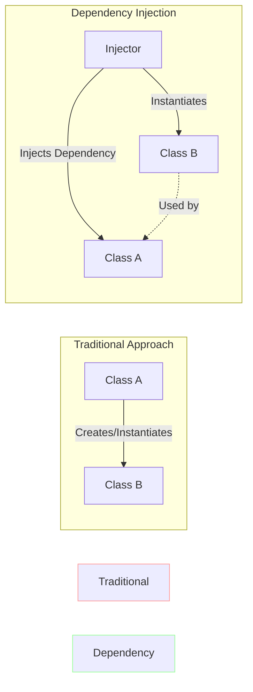

***

> [!abstract] Course Metadata
> **Course:** SWE 4301 - Object Orientated Concepts II
> **Lecture:** 11
> **Topic:** Dependency Injection
> **Tags:** #software-engineering #design-patterns #java #oop #clean-code

---

## 1. Introduction to Dependency Injection

Creating robust and maintainable software requires a flexible and scalable architecture. **Dependency Injection (DI)** is a core design pattern (often associated with Java, but applicable to all object-oriented languages) that addresses how to manage dependencies between components in a software system.

### The Problem: Tight Coupling
In a traditional setup, an object creates or obtains its dependencies internally. 

```java
// BAD PRACTICE: Tightly Coupled Code
class ClassA {
    // ClassA is tightly coupled to ClassB. 
    // It creates the dependency itself.
    ClassB classB = new ClassB(); 

    int tenPercent() {
        return classB.calculate() * 0.1d;
    }
}
```
**Why is this bad?**
* If we want to replace `ClassB` with an optimized `ClassC`, we have to modify and recompile `ClassA`.
* It is impossible to test `ClassA` in isolation without also running the real `ClassB` (which might connect to a database or network).

### The Solution: Dependency Injection
DI flips this paradigm by **externalizing and injecting the dependencies into the object**. Instead of the class creating its dependencies, they are handed to it (injected) from the outside.



---

## 2. Inversion of Control (IoC)

> [!info] Principle vs. Pattern
> **IoC is the principle**, while **Dependency Injection is the design pattern** used to implement that principle.

**Inversion of Control (IoC)** states that a class should not configure its dependencies statically, but should be configured by some other class from the outside. 

In DI, IoC means that a higher-level component (or a framework like Spring, Guice, or Dagger) controls the flow and manages the dependencies of lower-level components. The control of instantiation is *inverted*.

---

## 3. Dependency Inversion Principle (DIP)

While DI and IoC handle the *mechanics* of dependency management, **DIP is the underlying architectural principle**. 

> [!tip] The Goal of DIP
> High-level modules (business logic) should not depend on low-level modules (utilities/details). Both should depend on **abstractions** (interfaces).

### DIP Example: Notification System

#### ❌ Violating DIP (Tight Coupling)
The high-level `NotificationManager` depends directly on the concrete `EmailService`. If we want to add SMS support, we must modify the manager.

```java
class EmailService {
    void sendEmail(String message) { //send email logic }
}

class NotificationManager {
    private EmailService email = new EmailService(); //Direct dependency on detail

    void send(String msg) {
        email.sendEmail(msg);
    }
}
```

#### ✅ Adhering to DIP (Loose Coupling)
We introduce an interface (`MessageService`). Both the manager and the services now depend on this abstraction.

```java
// 1. The Abstraction
interface MessageService {
    void sendMessage(String message);
}

// 2. Low-level Details (Implementing the Abstraction)
class EmailService implements MessageService {
    public void sendMessage(String msg) { //send email }
}

class SMSService implements MessageService {
    public void sendMessage(String msg) { //send SMS }
}

// 3. High-level Module (Dependent on Abstraction)
class NotificationManager {
    private final MessageService service;

    // Dependency is Injected (DI) to fulfill DIP
    public NotificationManager(MessageService service) {
        this.service = service;
    }

    void send(String msg) {
        service.sendMessage(msg);
    }
}
```

---

## 4. The 3 Core Roles in Dependency Injection

DI generally involves three distinct classes/roles to function properly:

### 1. The Service Class
Service classes encapsulate business logic and provide functionalities. This is the actual "dependency" that will be used.
```java
public interface ProductService {
    Product getProductById(int productId);
}

// Implementation of the service
public class ProductServiceImpl implements ProductService {
    private ProductRepository productRepository;
    
    public ProductServiceImpl() {
        this.productRepository = new ProductRepositoryImpl();
    }
    
    @Override
    public Product getProductById(int productId) {
        return productRepository.findById(productId);
    }
}
```

### 2. The Client Class
This is the consumer. Its primary purpose is to consume services without worrying about how they are instantiated or configured. 
```java
public class ProductClient {
    private ProductService productService;
    
    // Dependency is externalized via Constructor
    public ProductClient(ProductService productService) {
        this.productService = productService;
    }
    
    public void displayProductDetails() {
        Product product = productService.getProductById(123);
        System.out.println("Product Details: " + product);
    }
}
```

### 3. The Injector Class
The injector acts as a bridge. It creates the Service, creates the Client, and injects the Service *into* the Client.
```java
public class ProductInjector {
    public static void main(String[] args) {
        // 1. Create the service (Dependency)
        ProductService productService = new ProductServiceImpl();
        
        // 2. Inject the service into the client
        ProductClient productClient = new ProductClient(productService);
        
        // 3. Run the client
        productClient.displayProductDetails();
    }
}
```

---

## 5. Types of Dependency Injection

There are three primary ways to inject a dependency into a class.

### 1. Constructor Injection
Dependencies are provided as parameters to the class's constructor. This ensures that the object cannot be instantiated without its required dependencies.

> [!tip] Best Practice
> Constructor injection is widely considered the best practice for **mandatory dependencies**. It allows you to mark the dependency fields as `final`, making the class immutable and thread-safe.

```java
public class ProductServiceClient {
    private final ProductService productService; // Marked as final!

    // Constructor Injection
    public ProductServiceClient(ProductService productService) {
        this.productService = productService;
    }
}
```

### 2. Property-Based / Setter Injection
Dependencies are provided through public setter methods. 

> [!example] When to use Setter Injection
> Use this for **optional dependencies** or when dependencies might need to be swapped out dynamically during the object's lifecycle. 

**Important:** When using setter injection, the class should provide a valid default implementation (a "do-nothing" or placeholder object) to avoid `NullPointerExceptions` if the setter is never called.

```java
public class ProductServiceClient {
    // Has a safe, working default
    private ProductService productService = new DefaultProductService(); 

    // Setter Injection
    public void setProductService(ProductService productService) {
        this.productService = productService;
    }
}
```

### 3. Method Injection
The dependency is injected directly into the specific method that uses it, rather than being stored as a class-level property.

> [!warning] Temporal Coupling
> Setting properties before calling a method can lead to **Temporal Coupling** — the idea that methods/execution must occur in a very specific order for the code to work. Method injection solves this.

**When to use:** When the dependency changes with almost every use, or when you are implementing the Strategy Pattern.

```typescript
// Typescript/JS Example
interface IFoodPreparer {
    prepareFood(aRecipe: Recipe): void;
}

class Baker implements IFoodPreparer {
    prepareFood(aRecipe: Recipe) {
        console.log('Use baking skills: ' + aRecipe.Text);
    }
}

class Restaurant {
    private _name: string;
    constructor(aName: string) { this._name = aName; }

    // Method Injection: Dependency is passed exactly when needed
    makeFood(aRecipe: Recipe, aPreparer: IFoodPreparer) {
        aPreparer.prepareFood(aRecipe);
    }
}
```

---

## 6. Summary: Pros and Cons of DI

*(Note: Cons section augmented from general software engineering principles to provide a balanced view).*

### ✅ Critical Advantages
*   **Decoupling Components:** Classes don't rely on specific implementations, only interfaces/abstractions.
*   **Modular and Maintainable Code:** Changes in one component (like upgrading a database driver) do not affect the client classes.
*   **Testability:** Because dependencies are injected, they can be easily replaced with **Mock Objects** during Unit Testing. (e.g., passing a `MockDatabaseService` instead of a `RealDatabaseService`).
*   **Reusability:** Classes can be reused in different contexts by simply injecting different dependencies.

### ❌ Potential Drawbacks
*   **Complexity:** Can make the code slightly more difficult to trace, as you have to look outside the class to see exactly which implementation is being used.
*   **Boilerplate:** Without a DI Framework (like Spring Boot), wiring all dependencies manually in Injector classes can result in a lot of boilerplate code.
*   **Learning Curve:** Concepts like IoC and interfaces require a deeper understanding of OOP.

---

## 7. References
* [Stackify: Dependency Injection](https://stackify.com/dependency-injection/)
* [BuiltIn: Dependency Injection](https://builtin.com/articles/dependency-injection)
* [Mend.io: Java DI Tutorial](https://www.mend.io/blog/how-to-use-dependency-injection-in-java-tutorial-with-examples/)
* [Objc.io: DI in Java/Android](https://www.objc.io/issues/11-android/dependency-injection-in-java/)