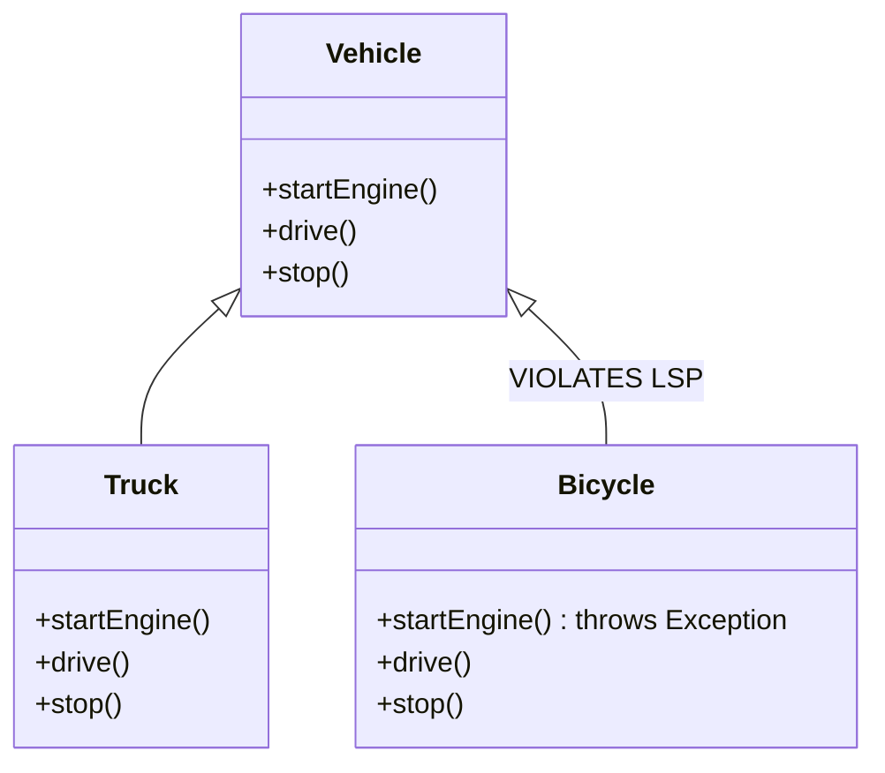
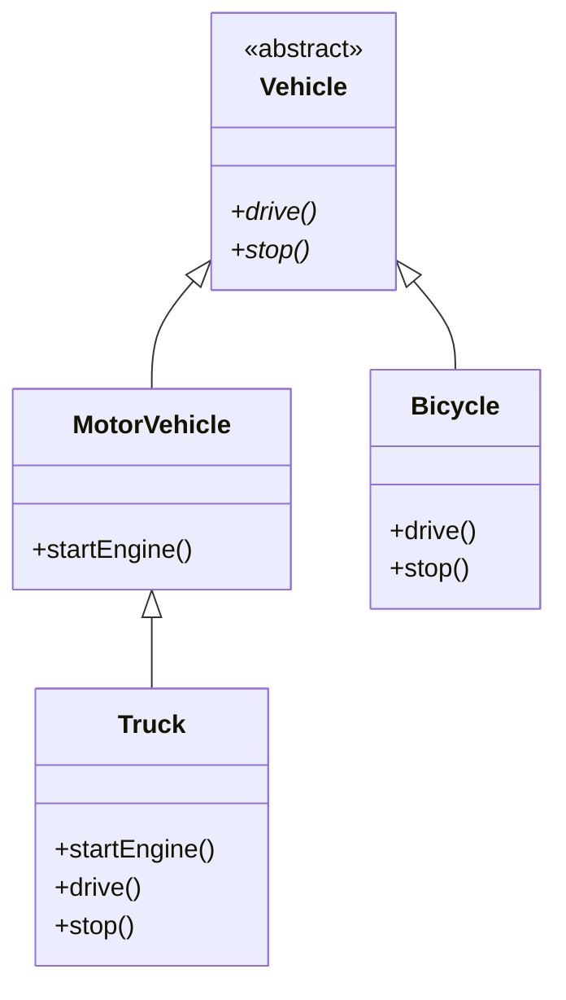

***

**Tags:** #OOP #SOLID #SoftwareDesign #Java #Architecture
**Course:** SWE 4301 - Object Orientated Concepts II
**Topic:** Liskov Substitution Principle (The "L" in SOLID)

---

## 1. Foundational Concepts

Before diving into LSP, it is crucial to understand the building blocks of Object-Oriented Programming that make substitution possible: Abstraction and Polymorphism.

### Key Terminologies
* **Base Class:** A general class acting as a foundation. It defines common properties and methods.
* **Derived Class:** A specialized version of a base class. It inherits properties/methods and can override or extend them.
* **Method Overriding:** The process where a derived class provides a specific implementation for a method already declared in its base class. This allows customization without altering the base code.

### 1.1 Inheritance (Syntactic Relationship)
> [!info] Definition
> Inheritance is a mechanism for **code reuse**. It establishes an **"is-a"** relationship between classes (e.g., a Dog *is an* Animal).

* **How it works:** A subclass inherits all fields and methods of the superclass.
* **Purpose:** Allows a derived class to utilize or override inherited functionality.

```java
class Animal {
    Animal() { System.out.println("Animal constructor"); }
}

class Dog extends Animal {
    Dog() { System.out.println("Dog constructor"); }
}
```

### 1.2 Subtyping (Semantic Relationship)
> [!info] Definition
> Subtyping is a **type-based relationship**. It establishes a **"can-be-used-as"** relationship. 

* **How it works:** A subtype adheres to the interface/behavior of its supertype, but it *doesn't necessarily have to inherit code*. 
* **Purpose:** Enables **polymorphism**—allowing objects of different types to be treated as instances of the same type.

```java
interface Animal {
    void makeSound();
}

class Dog implements Animal {
    @Override
    public void makeSound() { System.out.println("Bark"); }
}

class Cat implements Animal {
    @Override
    public void makeSound() { System.out.println("Meow"); }
}
```

---

## 2. The Liskov Substitution Principle (LSP)

> [!quote] Formal Definition (Barbara Liskov, 1988)
> *"Objects of a superclass should be replaceable with objects of a subclass without affecting the correctness of the program."*

If class `B` is a subclass of class `A`, then wherever `A` is expected, `B` should be able to fit in without causing errors or unexpected behavior. The client code should not need to know the difference.

### Why is LSP Important?
1. **Behavioral Consistency:** Ensures subclasses behave consistently with client expectations established by the parent.
2. **Code Reusability:** Subclasses can be used interchangeably, making extensions safe.
3. **Robustness:** Violating LSP introduces subtle, hard-to-track bugs.

---

## 3. Formal Rules of LSP (Supplemented)

While the PDF gives the conceptual overview, computer science defines specific rules a subclass must follow to adhere to LSP. *These are known as Behavioral Subtyping rules.*

### Signature Rules (Method Signatures)
1. **Contravariance of Arguments:** Subclass methods can accept broader parameter types than the parent, but never stricter.
2. **Covariance of Return Types:** Subclass methods can return stricter types than the parent, but never broader.
3. **Exception Rule:** Subclasses cannot throw new, broader exceptions. They can only throw exceptions that are the same as, or subclasses of, the exceptions thrown by the parent. *(See the Bicycle example below where this rule is broken).*

### Behavioral Rules (Contracts)
1. **Preconditions cannot be strengthened:** A subclass cannot require more strict conditions before executing a method than the parent class did.
2. **Postconditions cannot be weakened:** A subclass must guarantee at least what the parent guaranteed upon method completion.
3. **Invariants must be preserved:** The fundamental state constraints of the base class must be maintained by the subclass.

---

## 4. Examples of LSP Violations and Refactoring

### Example 1: The Vehicle and the Bicycle (From PDF)
**Scenario:** Bob manages a delivery fleet. Vehicles can `startEngine()`, `drive()`, and `stop()`. 

#### ❌ The Violation
A `Bicycle` is added to the fleet. It extends `Vehicle` but throws an exception on `startEngine()` because bicycles don't have engines.



```java
class Bicycle extends Vehicle {
    @Override
    public void startEngine() {
        // Violates the Exception Rule of LSP!
        throw new UnsupportedOperationException("Bicycles don't have engines!");
    }
}
```
*Problem:* The client code expects all `Vehicle` objects to start an engine. Passing a `Bicycle` breaks the program.

#### ✅ The Fix (Refactoring for LSP)
Separate the hierarchy based on actual behavioral capabilities.



```java
abstract class Vehicle {
    public abstract void drive();
    public abstract void stop();
}

class MotorVehicle extends Vehicle {
    public void startEngine() { /* Logic */ }
    @Override public void drive() { /* Logic */ }
    @Override public void stop() { /* Logic */ }
}

class Bicycle extends Vehicle {
    @Override public void drive() { /* Pedal logic */ }
    @Override public void stop() { /* Brake logic */ }
}
```

### Example 2: The Classic Square-Rectangle Problem (Supplemented)
> [!warning] The Most Famous LSP Trap
> In mathematics, a Square **is a** Rectangle. But in object-oriented programming, a `Square` subclassing a `Rectangle` almost always violates LSP.

If `Rectangle` has `setWidth()` and `setHeight()`, a `Square` overriding these methods to keep sides equal will break the postconditions expected by a client dealing with a `Rectangle`.

```java
// Client code expecting a Rectangle
public void testArea(Rectangle r) {
    r.setWidth(5);
    r.setHeight(4);
    // Expecting area to be 20. 
    // If 'r' is a Square, changing height also changed width to 4. Area = 16!
    assert(r.getArea() == 20); // Fails for Square!
}
```
*Fix:* Do not use inheritance here. `Square` and `Rectangle` should likely both implement a common `Shape` interface with a `getArea()` method.

---

## 5. Balancing LSP with the Open/Closed Principle (OCP)

LSP and OCP work hand-in-hand. OCP states code should be open for extension but closed for modification. However, **code can follow OCP syntactically, but fail it behaviorally if LSP is violated.**

### ❌ Following OCP but Violating LSP (Type Checking Code Smell)
Look for `instanceof` or `typeof` checks in your client code. This is a massive red flag that LSP is being violated.

```java
// Interface is closed for modification, open for extension (OCP satisfied)
public interface IPerson {}
public class Boss implements IPerson { public void doBossStuff() { ... } }
public class Peon implements IPerson { public void doPeonStuff() { ... } }

// Client Code (LSP VIOLATED)
Collection<IPerson> persons = context.getPersons();
for (IPerson person : persons) {
    // VIOLATION: The client has to know the concrete types!
    if (person instanceof Boss) {
        ((Boss) person).doBossStuff();
    } else if (person instanceof Peon) {
        ((Peon) person).doPeonStuff();
    }
}
```

### ✅ Refactoring to follow BOTH Principles
To fix this, push the specific behaviors behind a unified, polymorphic interface contract.

```java
public interface IPerson {
    void doStuff(); // General method pulled up
}

public class Boss implements IPerson {
    public void doStuff() { this.doBossStuff(); }
    private void doBossStuff() { ... }
}

public class Peon implements IPerson {
    public void doStuff() { this.doPeonStuff(); }
    private void doPeonStuff() { ... }
}

// Clean Client Code (OCP + LSP fully satisfied)
Collection<IPerson> persons = context.getPersons();
for (IPerson person : persons) {
    // Yay, no type checking! Pure polymorphism.
    person.doStuff(); 
}
```

---
### Summary Checklist for Validating LSP
- [ ] Can I pass a subclass to a method expecting the base class without changing the method's behavior?
- [ ] Does the subclass throw any new, unhandled exceptions?
- [ ] Does the subclass override a method and leave it blank (or throw `NotImplementedException`)? *(If yes, LSP is violated).*
- [ ] Does my client code use `instanceof` or `getClass()` checks? *(If yes, LSP is violated).*