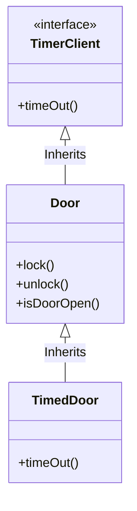
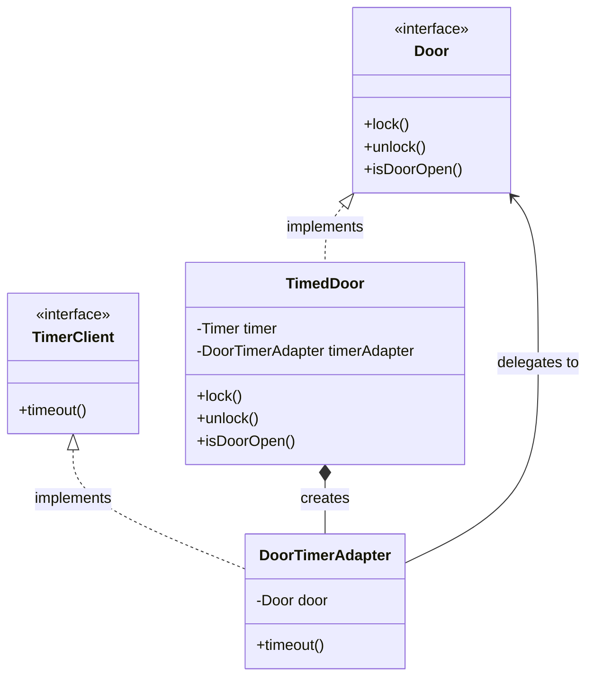
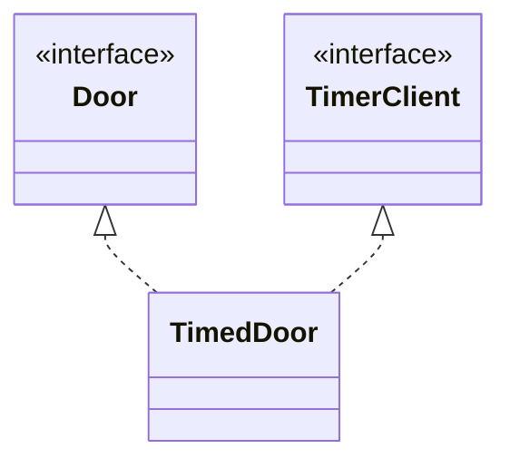

***
**Course:** SWE 4301 Object Orientated Concepts II
**Topic:** Interface Segregation Principle
**Tags:** #software-engineering #SOLID #design-patterns #OOP #java 

---

## 1. Introduction to ISP

The **Interface Segregation Principle (ISP)** is the "I" in the **SOLID** acronym of object-oriented design principles (introduced by Robert C. Martin, aka "Uncle Bob"). 

> [!quote] The Core Principle
> **"Clients should not be forced to depend upon interfaces that they do not use."**

ISP deals with the disadvantages of **"bulky"** or **"fat"** interfaces. 
* A bulky interface is one that is not highly cohesive; it contains too many methods that serve entirely different types of clients.
* When an interface is broken up into groups of highly cohesive member functions, each group serves a different set of clients. 
* **Goal:** Instead of one massive class/interface, clients should interact with smaller, abstract base classes (or "interfaces", "protocols", "signatures") tailored specifically to their needs.

---

## 2. The Core Problem: Interface Pollution

**Interface Pollution** occurs when an interface is forced to incorporate methods solely for the benefit of *one* of its subclasses, polluting the base class for all other subclasses.

### 2.1 The Syndrome of Interface Pollution
If a base class is polluted with unnecessary methods, subclasses that *do not* need those methods are forced to provide **"nil" or "dummy" implementations** (e.g., throwing an `UnsupportedOperationException` or returning `null`). 

> [!warning] Code Smell: Refused Bequest
> The PDF lists **Refused Bequest** as a primary problem of large interfaces. This is a classic OOP code smell. It happens when a subclass inherits methods or properties from a parent class or interface but doesn't actually need or use them. It "refuses the bequest (gift)" of its parent. This violates both ISP and the Liskov Substitution Principle (LSP).

### 2.2 The "Backwards Force" Applied by Clients
When clients are forced to depend on interfaces they don't use, they become subject to changes in those interfaces. This creates **unintentional coupling**.
* If Client A forces a change to a bulky interface, Client B (which doesn't even use the changed method) might need to be recompiled, redeployed, or updated.

---

## 3. Case Study: The Security System (Door & Timer)

Let's look at the classic example provided in the lecture. We have `Door` objects and a `Timer` object.

### The Initial Components

```java
public abstract class Door {
    abstract void lock();
    abstract void unlock();
    abstract boolean isDoorOpen();
}

public interface TimerClient {
    void timeOut(int timeOutId);
}

public class Timer {
    public void register(int timeout, int timeOutId, TimerClient client) {
        // Implementation to register a timer with the given timeout and client
    }
}
```

### The Flawed Design (Interface Pollution)
We want to create a `TimedDoor` that sounds an alarm if left open too long. The `TimedDoor` needs to communicate with the `Timer`. A naive solution is to force the `Door` base class to inherit from `TimerClient`.



> [!danger] Why is this bad?
> Not all varieties of `Door` need timing. A simple wooden door doesn't need a timeout. But because `Door` now implements `TimerClient`, **every** derivative of `Door` (like `SimpleDoor`) must implement the `timeOut()` method, even if it just leaves it blank (Refused Bequest). Furthermore, if `TimerClient` changes its signature (e.g., adding `timeOutId`), `SimpleDoor` is forced to change too!

---

## 4. Solutions to Implement ISP

Because `Door` and `TimerClient` represent interfaces used by completely different clients, they should remain separate. There are two primary ways to fix this design: **Delegation** and **Multiple Inheritance**.

### Solution A: Implementation of ISP Using Delegation (Object Adapter)

In this approach, we leave the `Door` hierarchy clean. Instead, we create a separate adapter class (`DoorTimerAdapter`) that implements `TimerClient` and translates the timeout event back to the `TimedDoor`.



**Java Implementation:**

```java
// 1. Base Door interface remains pure
public interface Door {
    void lock();
    void unlock();
    boolean isDoorOpen();
}

// 2. Timer-related interface
public interface TimerClient {
    void timeout();
}

// 3. Separate class to handle timing behavior (The Adapter)
public class DoorTimerAdapter implements TimerClient {
    private final Door door;

    public DoorTimerAdapter(Door door) {
        this.door = door;
    }

    @Override
    public void timeout() {
        door.lock(); // Delegates the timeout action to the door
    }
}

// 4. TimedDoor implements ONLY Door, but uses the Adapter for timing
public class TimedDoor implements Door {
    private Timer timer;
    private DoorTimerAdapter timerAdapter;
    private boolean isLocked;

    public TimedDoor(Timer timer) {
        this.timer = timer;
        // Passes itself (Door) to the adapter
        this.timerAdapter = new DoorTimerAdapter(this); 
    }

    @Override
    public void lock() { isLocked = true; }

    @Override
    public void unlock() {
        isLocked = false;
        // Uses the adapter to register with the timer
        timer.register(300, timerAdapter); 
    }

    @Override
    public boolean isDoorOpen() { return !isLocked; }
}
```

### Solution B: Implementation of ISP Using Multiple Inheritance

*Note: While Java does not support multiple inheritance of **classes**, it strictly allows multiple inheritance of **interfaces**.* 

In this approach, the `TimedDoor` explicitly implements both the `Door` interface and the `TimerClient` interface. Other doors (like `SimpleDoor`) will only implement `Door`.



**Java Implementation:**

```java
public class TimedDoor implements Door, TimerClient {
    private Timer timer;
    private boolean isLocked;

    public TimedDoor(Timer timer) {
        this.timer = timer;
    }

    // --- Door Interface Methods ---
    @Override
    public void lock() { isLocked = true; }

    @Override
    public void unlock() {
        isLocked = false;
        startTimer();
    }

    @Override
    public boolean isDoorOpen() { return !isLocked; }

    // --- Custom Method ---
    private void startTimer() {
        timer.register(300, this); // Passes 'this' because it IS a TimerClient
    }

    // --- TimerClient Interface Method ---
    @Override
    public void timeOut() {
        lock();
    }
}
```

---

## 5. Supplementary Internet Example (For broader understanding)

To reinforce the concept, here is the most common real-world example used to explain ISP: **The Worker Interface**.

**❌ Bad Design (Violates ISP):**
```java
interface Worker {
    void work();
    void eat();
}

class HumanWorker implements Worker {
    public void work() { /* working */ }
    public void eat() { /* eating */ }
}

class RobotWorker implements Worker {
    public void work() { /* working */ }
    public void eat() { 
        // 🚨 Refused Bequest! Robots don't eat.
        throw new UnsupportedOperationException("Robots don't eat!"); 
    }
}
```

**✅ Good Design (Follows ISP):**
```java
interface Workable {
    void work();
}

interface Eatable {
    void eat();
}

class HumanWorker implements Workable, Eatable {
    public void work() { /* working */ }
    public void eat() { /* eating */ }
}

class RobotWorker implements Workable {
    public void work() { /* working */ }
    // No eat() method forced upon the Robot!
}
```

---

## 6. Summary & Key Takeaways

1. **Keep Interfaces Small:** Interfaces should be highly cohesive. They should only contain methods that a specific type of client needs.
2. **Avoid "Fat" Interfaces:** If adding a method to an interface means some implementing classes have to write dummy code (Refused Bequest), you need to segregate the interface.
3. **Separate Clients = Separate Interfaces:** If Class A and Class B interact with Class C for entirely different reasons, Class C should provide two separate interfaces for A and B.
4. **Implementation Strategies:** 
    * **Multiple Interface Inheritance:** A class can implement multiple granular interfaces.
    * **Delegation/Adapter:** A class can delegate specific interface responsibilities to a nested or external adapter object.