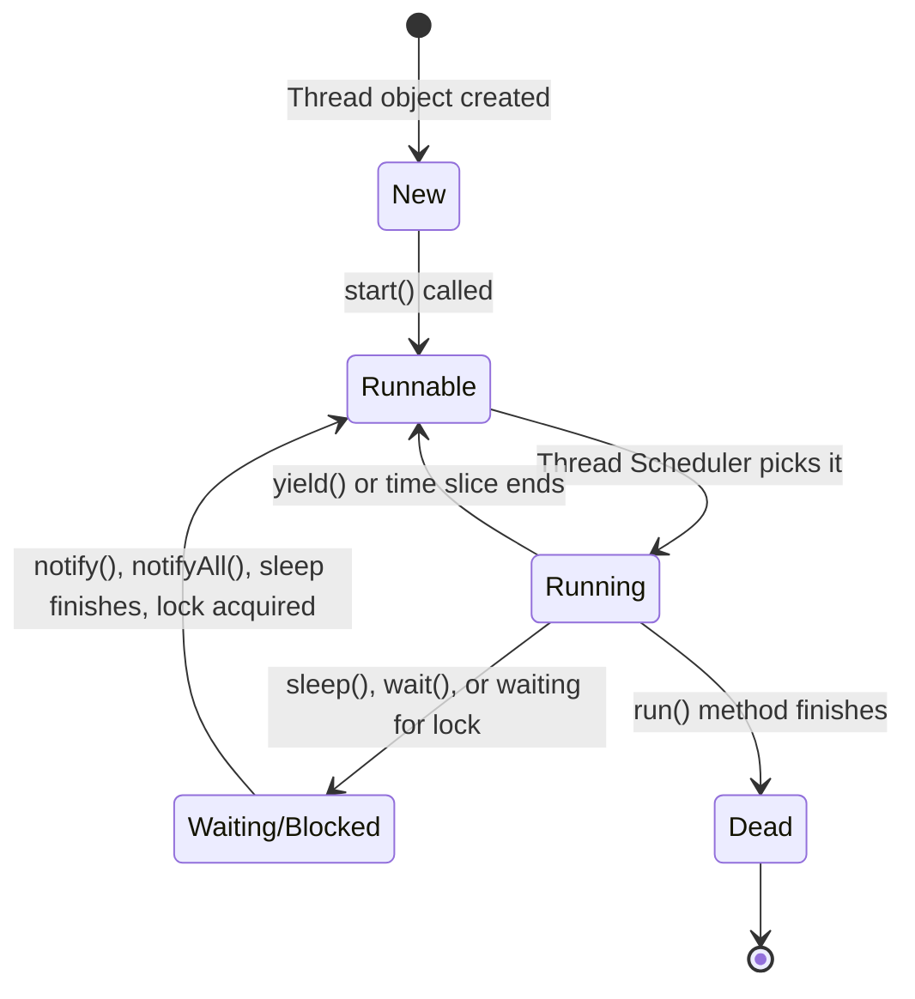
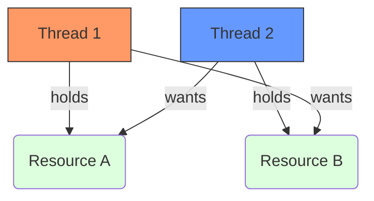

---
topics:
  - Multithreading
  - Concurrency
  - Synchronization
  - Locks
  - Inter-Thread Communication
language: Java
tags:
  - java/multithreading
---

# Java Multithreading & Concurrency

## 1. Introduction to Threads
**[[Multithreading]]** allows a program to perform **multiple tasks concurrently** within a single process. 

* A **[[Process]]** is a program in execution (heavyweight, independent memory).
* A **[[Thread]]** is a single sequential flow of control within a process (a "lightweight process").
* **Memory Sharing**: Unlike processes, multiple threads belonging to the same process share the same memory space (heap), but each thread has its own execution call stack.

### Why do we need threads?
1. **Better CPU Utilization**: Keeps the CPU busy while other threads are waiting for I/O operations.
2. **Faster Execution**: Tasks can run in parallel on multi-core processors.
3. **Improved Responsiveness**: In user interfaces, a background thread handles heavy computing so the UI thread doesn't freeze.
4. **Resource Sharing**: Threads naturally share the same memory space.
5. **Scalability**: Allows systems to handle thousands of concurrent operations.

**Example Scenario (Web Server):**
If a web server is single-threaded, requests form a queue. If one request takes too long or hangs (bad request), the whole server hangs, and response time skyrockets. By implementing multithreading, the web server assigns a new thread to each incoming request, serving multiple requests simultaneously.

---

## 2. Creating and Running Threads

In Java, there are two ways to create a thread:
1. Implementing the `Runnable` interface. *(Preferred)*
2. Extending the `Thread` class.

> [!tip] Why `Runnable` is preferred
> Java does not support multiple inheritance. If you extend `Thread`, your class cannot extend any other class. By implementing `Runnable`, you are free to extend another class while still utilizing threading.

### Method 1: Implementing `Runnable`
You must implement the `run()` method, which serves as the entry point for the thread's execution.

```java
class MyRunnable implements Runnable {
    @Override
    public void run() {
        System.out.println("Thread started: " + Thread.currentThread().getName());
    }
}

public class MainClass {
    public static void main(String[] args) {
        // Instantiate the runnable
        MyRunnable myRunnable = new MyRunnable();
        
        // Pass the runnable to a new Thread object
        Thread t = new Thread(myRunnable);
        
        // Use start(), NOT run()
        t.start(); 
    }
}
```

### Method 2: Extending `Thread`
```java
class MyThread extends Thread {
    @Override
    public void run() {
        System.out.println("Thread started: " + Thread.currentThread().getName());
    }
}

public class MainClass {
    public static void main(String[] args) {
        MyThread t = new MyThread();
        t.start();
    }
}
```

> [!warning] `start()` vs `run()`
> Calling `t.run()` **does not start a new thread**. It simply executes the `run()` method in the current main thread like a standard method call. Calling `t.start()` instructs the JVM to allocate a new call stack and begin thread execution.

---

## 3. Thread States & Lifecycle

A thread in Java goes through several states, managed by the JVM.



1. **New**: A `Thread` object has been created, but `start()` has not been called yet.
2. **Runnable**: `start()` has been called. The thread is eligible to run but is waiting for CPU time from the Thread Scheduler.
3. **Running**: The Thread Scheduler has selected the thread, and the CPU is actively executing its `run()` method.
4. **Waiting/Blocked/Sleeping**: The thread is temporarily inactive. It might be sleeping, waiting for an object lock, or waiting for another thread to notify it.
5. **Dead/Terminated**: The `run()` method has completed execution. A dead thread cannot be restarted.

---

## 4. The Thread Scheduler & Priorities

The **Thread Scheduler** is a part of the JVM (or mapped directly to the underlying OS) that decides which `Runnable` thread should run at any given moment. 
* On a single-processor machine, only **one thread** can execute at a time.
* The scheduler controls time-slicing and takes threads out of the running state to let others run.

### Thread Priorities
You can suggest to the scheduler which threads are more important using priorities ranging from `1` to `10`.

```java
Thread.MIN_PRIORITY    // = 1
Thread.NORM_PRIORITY   // = 5 (Default)
Thread.MAX_PRIORITY    // = 10
```

```java
Thread t = new Thread(new MyRunnable());
t.setPriority(Thread.MAX_PRIORITY); // Set priority to 10
t.start();
```

> [!info] Note on Priority
> Setting priority is **not a guarantee**. The underlying OS thread scheduler ultimately decides the execution order. It is just a hint.

---

## 5. Controlling Thread Execution

You can influence thread execution using three primary methods: `sleep()`, `yield()`, and `join()`.

### 1. `Thread.sleep(milliseconds)`
Pauses the current thread for a specified amount of time. It throws an `InterruptedException` which must be handled.

```java
class NameRunnable implements Runnable {
    public void run() {
        for (int x = 1; x <= 3; x++) {
            System.out.println("Run by " + Thread.currentThread().getName());
            try {
                Thread.sleep(1000); // Sleep for 1 second
            } catch (InterruptedException ex) {
                ex.printStackTrace();
            }
        }
    }
}
```

### 2. Thread.yield()
A hint to the scheduler that the current thread is willing to yield its current use of a processor. It moves the thread from **Running** back to **Runnable** to allow other threads of the *same priority* to get their turn.

> [!example]- Click to see Example & Explanation: Thread.yield()
> ```java
> class MyThread extends Thread {
>     public void run() {
>         for (int i = 0; i < 5; i++) {
>             System.out.println(Thread.currentThread().getName() + " in control");
>             // Give a chance to other threads
>             Thread.yield();
>         }
>     }
> }
> 
> public class YieldExample {
>     public static void main(String[] args) {
>         MyThread t1 = new MyThread();
>         MyThread t2 = new MyThread();
>         t1.start();
>         t2.start();
>     }
> }
> ```
> 
> **What happens here?**
> - When `t1` calls `yield()`, it tells the JVM: *"I've done a bit of work, I'm okay with stepping back to the 'Ready' line to let `t2` have a go."*
> - **Important**: This is just a **hint**. The scheduler might ignore it and let `t1` keep running immediately. It does **not** make the thread sleep or block; it just moves it back to the "Runnable" pool.

### 3. `join()`
Lets one thread "join onto the end" of another thread. If thread `A` calls `B.join()`, thread `A` will pause execution and wait until thread `B` is completely dead before resuming.

```java
Thread t1 = new Thread(new MyRunnable());
t1.start();

// The main thread will pause here until t1 is completely finished.
t1.join(); 
System.out.println("t1 has finished. Main thread resuming.");
```

---

## 6. Synchronization (Thread Safety)

When multiple threads share access to the same memory/objects, we run into **[[Race Conditions]]**. 

### The Race Condition Problem
Imagine a `Counter` class being accessed by two threads at the same time.
```java
public class Counter {
    private int count = 0;

    public int getCount() { return count; }
    public void setCount(int count) { this.count = count; }
}
```
If Thread A reads `count` (0), adds 1, but gets swapped out before saving... and Thread B reads `count` (still 0), adds 1, and saves (1). When Thread A resumes, it saves (1). Two additions happened, but the count is only 1! This is a **data inconsistency**.

### Fixing it with `synchronized`
In Java, **every object has an intrinsic lock (monitor lock)**. 
To obtain the lock, you synchronize on the object. When a thread enters a `synchronized` method, it grabs the object's lock. No other thread can enter *any* synchronized method on that same object until the lock is released.

```java
public class Counter {
    private int count = 0;

    // Both methods are now synchronized.
    public synchronized int getCount() { return count; }
    
    public synchronized void setCount(int count) { this.count = count; }
}
```

### Object Locking (Synchronized Blocks)
Instead of locking the entire method, you can lock a specific block of code to improve performance.

```java
public void doWork() {
    System.out.println("This is not synchronized, multiple threads can be here");
    
    synchronized(this) { 
        // Critical Section
        // Only one thread can execute this block at a time for this instance
        this.count++;
    }
}
```

### Static Synchronization
What happens if the method is `static`? 
Instance variables belong to objects, but `static` variables belong to the class. 

```java
public class Counter {
    private static int count = 0;

    // Locks the Counter.class object, NOT the instance!
    public static synchronized void increment() {
        count++;
    }
}
```

> [!danger] Common Synchronization Mistake
> If you have one `static synchronized` method and one non-static `synchronized` method, **they do not block each other**.
> * The static method places a lock on the `Class` object (`Counter.class`).
> * The non-static method places a lock on the `Instance` object (`this`).
> Because they lock on *different objects*, two threads can execute them simultaneously, potentially causing a [[Race Conditions|race condition]] on shared static data.

---

## 7. Inter-Thread Communication (`wait`, `notify`, `notifyAll`)

Sometimes threads need to communicate. For example, Thread B can't do its calculations until Thread A finishes downloading the data. 

To achieve this without race conditions, we use `wait()` and `notify()`.

> [!important] The "Why???" from the slides: Why are `wait/notify` in `Object` and not `Thread`?
> Because these methods operate on **Locks**. Since *every object* in Java has a lock, the methods to manipulate those locks must reside in the base `Object` class. 
> 
> *Note: You can ONLY call `wait()`, `notify()`, or `notifyAll()` from inside a `synchronized` block/method.*

* **`wait()`**: Causes the current thread to release the lock it holds and go to sleep until another thread wakes it up.
* **`notify()`**: Wakes up *one* single thread that is waiting on this object's lock.
* **`notifyAll()`**: Wakes up *all* threads waiting on this object's lock (The thread with the highest priority generally gets the lock next). **Always prefer `notifyAll()` over `notify()` to prevent threads from being orphaned.**

### Example: Calculator and Reader

> [!example]- Click to see Example Code & Explanation: wait/notify
> **The Calculator Thread (Does the work and notifies):**
> ```java
> class Calculator extends Thread {
>     int total;
> 
>     @Override
>     public void run() {
>         synchronized(this) { // Obtain lock on itself
>             for(int i = 0; i < 100; i++) {
>                 total += i;
>             }
>             // Work is done, wake up any threads waiting on this Calculator object
>             notifyAll(); 
>         }
>     }
> }
> ```
> 
> **The Reader Thread (Waits for the calculation):**
> ```java
> class Reader extends Thread {
>     Calculator c;
> 
>     public Reader(Calculator calc) {
>         this.c = calc;
>     }
> 
>     @Override
>     public void run() {
>         // Must obtain the lock on the Calculator object to wait on it
>         synchronized(c) { 
>             try {
>                 System.out.println("Waiting for calculation...");
>                 c.wait(); // Releases the lock on 'c' and pauses execution
>             } catch (InterruptedException e) {
>                 e.printStackTrace();
>             }
>             System.out.println("Total is: " + c.total);
>         }
>     }
> }
> 
> // Main class to run it
> public class Main {
>     public static void main(String[] args) {
>         Calculator calculator = new Calculator();
> 
>         // Start 3 readers waiting on the same calculator
>         new Reader(calculator).start();
>         new Reader(calculator).start();
>         new Reader(calculator).start();
> 
>         // Start the calculator
>         calculator.start();
>     }
> }
> ```

> [!info] `sleep()` vs `wait()`
> * `Thread.sleep(ms)`: Thread goes to sleep but **KEEPS the lock**.
> * `object.wait()`: Thread goes to sleep and **RELEASES the lock** so other threads can use the object.

---

## 8. Thread Deadlock

**[[Deadlock]]** occurs when two or more threads are blocked forever, each waiting for a lock held by the other. It is a "timing trap" that causes your program to hang indefinitely.

### The Deadlock Scenario (The "Circle of Waiting")



1. **Thread 1** acquires the lock for `Resource A`.
2. **Thread 2** acquires the lock for `Resource B`.
3. **Thread 1** needs `Resource B` to finish, so it waits for Thread 2 to release it.
4. **Thread 2** needs `Resource A` to finish, so it waits for Thread 1 to release it.
5. **Result**: Neither thread will ever release the lock they already hold because they are waiting for the other.

### Code Example: The Deadlock Risk

> [!bug]- Click to see Example Code: DeadlockRisk
> ```java
> public class DeadlockRisk {
>     private static class Resource {
>         public int value;
>     }
> 
>     private Resource resourceA = new Resource();
>     private Resource resourceB = new Resource();
> 
>     // Thread 1 calls this
>     public int read() {
>         synchronized(resourceA) { // Locks A
>             System.out.println(Thread.currentThread().getName() + " locked A, waiting for B...");
>             synchronized(resourceB) { // Tries to lock B (Blocked if T2 holds it)
>                 return resourceB.value + resourceA.value;
>             }
>         }
>     }
> 
>     // Thread 2 calls this
>     public void write(int a, int b) {
>         synchronized(resourceB) { // Locks B
>             System.out.println(Thread.currentThread().getName() + " locked B, waiting for A...");
>             synchronized(resourceA) { // Tries to lock A (Blocked if T1 holds it)
>                 resourceA.value = a;
>                 resourceB.value = b;
>             }
>         }
>     }
> 
>     public static void main(String[] args) {
>         DeadlockRisk risk = new DeadlockRisk();
> 
>         // Thread 1: Tries to read
>         new Thread(() -> risk.read(), "Thread-1").start();
> 
>         // Thread 2: Tries to write
>         new Thread(() -> risk.write(10, 20), "Thread-2").start();
>     }
> }
> ```

> [!info]- Deep Dive: How the Locking Works
> To understand the [[Deadlock]] above, you must understand the rules of Java's **Monitor Locks**:
> 
> 1. **The "One Key" Rule**: Every object in Java has a single "intrinsic lock." Think of it as a **room with only one key**.
> 2. **`synchronized(obj)` = Grabbing the Key**: 
>    - When a thread hits this line, it checks if the key for `obj` is available.
>    - If **YES**, it takes the key and enters the `{ }` block.
>    - If **NO**, the thread **freezes/waits** right there until the key is returned.
> 3. **Holding the Key**: While the thread is inside the `{ }` block, it **keeps the key in its pocket**. No other thread can enter *any* code that requires that same key.
> 4. **Releasing the Key**: The key is only "put back" when the thread reaches the final closing brace `}` of the `synchronized` block.
> 5. **The Nested Lock Trap**: In the `DeadlockRisk` example, the threads use **nested blocks**. This means a thread is trying to hold **two keys at the same time**.
>    - **Thread 1** grabs Key A.
>    - While **holding Key A**, it tries to grab Key B.
>    - If it can't get Key B, it waits... but it **refuses to let go of Key A** while it waits.
>    - This "refusal to let go" while waiting for another lock is what creates the infinite hang.

> [!info]- The "Play-by-Play" Breakdown
> 1. **Thread 1** enters `read()` and grabs the "key" for **A**.
> 2. **Thread 2** enters `write()` and grabs the "key" for **B**.
> 3. **Thread 1** reaches the inner `synchronized(resourceB)`. It sees Thread 2 has the key, so it **stops and waits**.
> 4. **Thread 2** reaches the inner `synchronized(resourceA)`. It sees Thread 1 has the key, so it **stops and waits**.
> 5. Both threads are now "parked" forever.

### How to Prevent Deadlock

#### 1. Lock Ordering (The Best Solution)
Always acquire locks in the **exact same order** across all threads. If both threads tried to lock **A** first and then **B**, the deadlock would be impossible.

> [!example]- Click to see Example Code: Lock Ordering Fix
> ```java
> // Thread 2 is "Fixed" by matching Thread 1's lock order
> public void writeFixed(int a, int b) {
>     synchronized(resourceA) { // Lock A FIRST
>         synchronized(resourceB) { // Lock B SECOND
>             resourceA.value = a;
>             resourceB.value = b;
>         }
>     }
> }
> ```

#### 2. Avoid Nested Locks
Try to avoid locking more than one object at a time. If you don't need both locks simultaneously, don't hold them both.

> [!example]- Click to see Example: Avoiding Nested Locks
> Instead of holding Lock A while waiting for Lock B, perform your work in separate steps:
> 
> ```java
> // BAD: Holding A while waiting for B
> synchronized(resourceA) {
>     int val = resourceA.value;
>     synchronized(resourceB) {
>         resourceB.value = val;
>     }
> }
> 
> // BETTER: No nested locks
> int tempVal;
> synchronized(resourceA) {
>     tempVal = resourceA.value; // Get data and release lock immediately
> }
> 
> synchronized(resourceB) {
>     resourceB.value = tempVal; // Use data in the second lock
> }
> ```

#### 3. Use `tryLock()`
Instead of `synchronized`, use `ReentrantLock.tryLock()`. This allows a thread to say: *"I'll try to get the lock for 5 seconds. If I can't, I'll give up and try again later."* This breaks the "forever" part of the deadlock.

> [!example]- Click to see Example: Using tryLock() with Timeouts
> This approach uses the `java.util.concurrent.locks` package instead of the `synchronized` keyword.
> 
> ```java
> import java.util.concurrent.locks.ReentrantLock;
> import java.util.concurrent.TimeUnit;
> 
> public class SafeLocking {
>     private final ReentrantLock lockA = new ReentrantLock();
>     private final ReentrantLock lockB = new ReentrantLock();
> 
>     public void safeMethod() throws InterruptedException {
>         // Try to get Lock A for 50 milliseconds
>         if (lockA.tryLock(50, TimeUnit.MILLISECONDS)) {
>             try {
>                 // Try to get Lock B for 50 milliseconds
>                 if (lockB.tryLock(50, TimeUnit.MILLISECONDS)) {
>                     try {
>                         // Successfully got both locks! Do work here...
>                     } finally {
>                         lockB.unlock(); // Always unlock in finally
>                     }
>                 } else {
>                     System.out.println("Could not get Lock B, giving up Lock A to prevent deadlock");
>                 }
>             } finally {
>                 lockA.unlock();
>             }
>         }
>     }
> }
> ```

---
## Further Reading
* [Oracle Java Docs on Concurrency](http://docs.oracle.com/javase/tutorial/essential/concurrency/sync.html)
* [Synchronization in Java (JavaRevisited)](http://javarevisited.blogspot.com/2011/04/synchronization-in-java-synchronized.html)
