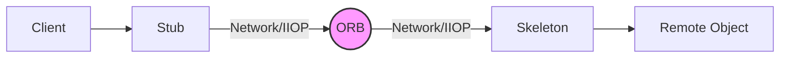
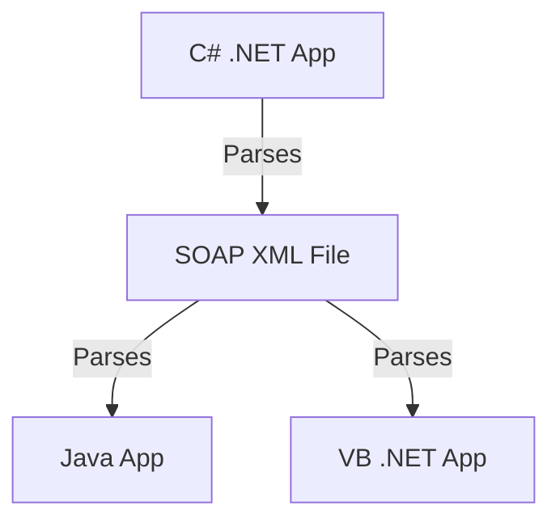

***

# 🌐 Chapter 13: Objects and the Internet

**Tags:** #OOP #DistributedComputing #CORBA #SOAP #JavaScript #WebServices 

---

## 1. Evolution of Distributed Computing
**Distributed Computing:** Sending objects/processes between applications residing on distributed physical platforms (networks/Internet).
*   **Benefits:** Load balancing, fault tolerance (if one server crashes, others take over), shared workloads.
*   **Technologies:** HTML, EDI, RPC, CORBA, DCOM, XML, SOAP, Web Services.

---

## 2. The Client-Server Model & Scripting
> [!info] Object-Based vs. Object-Oriented
> Languages like **JavaScript, VBScript, and C++** are considered **Object-Based** (they support objects but don't strictly enforce pure OOP principles). Java and C# are true OOP.

### Client-Side vs. Server-Side Validation
*   **Server:** Physical web server + Database.
*   **Client:** The user's browser.
*   **Security Rule:** Clients *never* access the database directly; they must request services from the server.

> [!check] Why prefer Client-Side Validation (via JavaScript)?
> 1. Takes less time (instant feedback).
> 2. Decreases network traffic.
> 3. Frees up server resources.
> 4. Reduces potential for data entry errors reaching the server.

### JavaScript Objects
*   JavaScript lives *inside* the HTML (unlike Java/C# which are independent).
*   UI elements (TextBox, Button, Form) are treated as **Objects** with *properties* and *methods*.
*   **The `this` pointer:** Refers to the current object (e.g., `this.form` passes the current form object to a function).
*   **Built-in Objects:** JS has built-in classes like `Date` and `Array`.

---

## 3. Objects Embedded in Web Pages
You can embed external objects (media players, Flash, sliders) directly into HTML using the `<object>` tag.

```html
<!-- Example: Embedding a Slider Object -->
<object classid="clsid:..." id="Slider1" width="100" height="50">
    <param name="Enabled" value="1" />
    <param name="Min" value="0" />
    <param name="Max" value="10" />
</object>
```
*   **Attributes/Behaviors:** Defined by `<param>` tags passed to the object.

---

## 4. CORBA (Common Object Request Broker Architecture)
> [!summary] What is CORBA?
> Middleware that allows programs from **different vendors, hardware, OS, and languages** (C++, Java, COBOL, etc.) to communicate using a standard protocol.

### Key CORBA Concepts
*   **Middleware:** Services that allow app processes to interact over a network (often creating a 3-tier system: Presentation $\rightarrow$ Allocation $\rightarrow$ Data).
*   **IDL (Interface Definition Language):** The strict **contract** both client and server must follow. It separates interface from implementation.
*   **Marshaling:** The act of taking an object, decomposing it to send over a network, and reconstituting it at the other end.
*   **IIOP (Internet Inter-ORB Protocol):** The protocol for distributed objects (similar to how HTTP is the protocol for web pages).

### How CORBA Routes Objects
When a client requests an object, it feels like a local call. It doesn't need to know where the object actually lives.


*   **Stub:** Connection between Client and ORB.
*   **Skeleton:** Connection between ORB and the Remote Object.
*   **ORB (Object Request Broker):** The "traffic cop" that routes requests and responses.

---

## 5. Web Services & SOAP
**Web Service:** A client and server communicating using **XML messages** via the **SOAP** standard.

> [!quote] SOAP (Simple Object Access Protocol)
> An XML-based communication protocol for sending messages over the internet. It operates over HTTP (bypassing firewall issues) and allows for Remote Procedure Calls (RPC).

### SOAP vs. CORBA/DCOM
*   **CORBA/DCOM:** Proprietary, use binary formats (harder to integrate if systems don't match exactly).
*   **SOAP:** Text-based (XML), platform-independent, language-independent. 
*   **Wrapper capability:** SOAP can act as a "wrapper" around legacy CORBA/DCOM systems to make them internet-friendly.
*   *Note:* SOAP is a stateless, one-way messaging system.

### XML Schemas vs. XML Data
1.  **The Schema (`.xsd`):** Acts as the **Contract/Interface**. Defines *how* the data must be structured (e.g., An Invoice MUST have an Address and a Package).
2.  **The Data (`.xml`):** The actual SOAP payload containing the specific values (e.g., Name="Jenny", Weight="22").

### Cross-Language Parsing (The Beauty of SOAP)
Because SOAP is just XML, **any programming language** (C#, Java, VB) can participate, as long as it has an XML parser.



### Code Example: Object Serialization in C#
Languages use specific tags/attributes to map Object properties directly to XML elements for easy marshaling/parsing over SOAP.

```csharp
// C# .NET Example of Mapping an Object to XML
[XmlRoot("invoice")]  // Maps class to <invoice>
public class Invoice 
{
    private String strName;
    
    [XmlAttribute("name")] // Maps property to <invoice name="...">
    public String Name { get; set; }

    [XmlElement("address")] // Maps property to nested <address> tag
    public Address Address { get; set; }
}
```