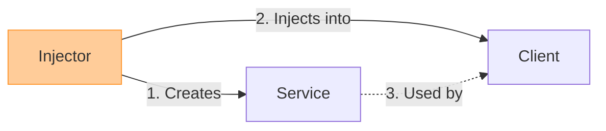

***

> [!danger] The 10-Second Summary
> **Dependency Injection (DI)** is a design pattern where an object's dependencies are **handed to it (injected) from the outside** rather than the object creating them itself. 
> **Goal:** Eliminate **tight coupling**, making code modular and testable.

### 1. The Core Problem vs. The Solution
*   ❌ **The Problem (Tight Coupling):** Class A says, `ClassB b = new ClassB();`. If `ClassB` changes, or we want to test Class A in isolation, we are stuck. 
*   ✅ **The Solution (Loose Coupling):** Class A says, *"Give me anything that behaves like ClassB."* The dependency is passed in as a parameter.

### 2. Inversion of Control (IoC)
> [!tip] Exam Buzzword Alert 🚨
> If the exam asks about **IoC**, say: *"IoC is the **principle**, DI is the **pattern** used to implement it."*

*   **Definition:** Control of object creation is *inverted*. Instead of the class controlling its dependencies, an external framework/class handles it.

---

### 3. The 3 Roles in DI
Remember the acronym **C.S.I.** to remember how DI is structured:
1.  **C**lient: The class that *needs* the dependency (consumes the service).
2.  **S**ervice: The dependency itself (the business logic being used).
3.  **I**njector: The middleman. It creates the Service and *injects* it into the Client.



---

### 4. The 3 Types of Injection (Highly likely exam question!)

| Type | How it works | When to use it (Exam Justification) |
| :--- | :--- | :--- |
| **1. Constructor** | Passed via the class constructor (`public Client(Service s)`). | **Mandatory Dependencies.** Use this when the class *cannot function* without it. Allows fields to be `final` (immutable). |
| **2. Setter / Property** | Passed via a setter method (`client.setService(s)`). | **Optional Dependencies.** Use when the dependency might change during runtime. *Exam tip: Mention you must provide a "do-nothing" default to avoid NullPointerExceptions!* |
| **3. Method** | Passed directly into the method that uses it (`public void doWork(Service s)`). | **Frequently Changing Dependencies.** Use when the dependency changes with every use. Prevents **Temporal Coupling** (forcing a specific order of execution). |

---

### 5. Why do we use DI? (Pros / Benefits)
*Memorize these 3 points for "Evaluate/Discuss" essay questions:*

1.  **Decoupling:** Classes don't depend on concrete implementations, only abstractions (interfaces). Changes in a service don't break the client.
2.  **Testability (Crucial!):** Because dependencies are injected, we can easily inject **Mock Objects** (fake versions of a database or network) to isolate and unit-test the Client class safely.
3.  **Maintainability & Reusability:** You can reuse the exact same Client class in different environments just by injecting a different Service configuration.

### 🧠 Quick Code Trigger for the Exam
If asked to write a quick code example, write this:

```java
// NO DI (Bad)
class Car {
    Engine e = new V8Engine(); // Tightly coupled!
}

// WITH DI (Good - Constructor Injection)
class Car {
    private final Engine e;
    public Car(Engine e) { this.e = e; } // Loosely coupled!
}
```