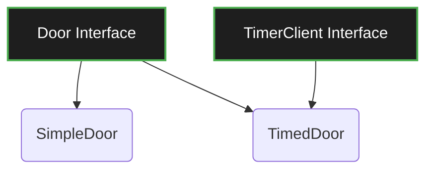

**Course:** SWE 4301 | **Topic:** ISP (The "I" in SOLID)

> [!quote] The Golden Rule (Memorize exactly)
> **"Clients should not be forced to depend upon interfaces that they do not use."**

---

## 🔑 Exam Buzzwords to Include in Your Answers
* **Fat/Bulky Interfaces:** Interfaces that lack cohesion and try to do too much.
* **Interface Pollution:** Adding methods to a base class/interface just to serve *one* specific subclass, polluting it for all others.
* **Refused Bequest (Code Smell):** When a subclass is forced to inherit a method it doesn't need, resulting in dummy/blank implementations (e.g., throwing `UnsupportedOperationException`).
* **Unintentional Coupling:** A change requested by Client A forces Client B to be updated/recompiled, even though Client B doesn't use the changed method.

---

## 🚨 The Problem: The Door & Timer Case Study (PDF)
* **Scenario:** You have a `Door` interface (`lock`, `unlock`, `isOpen`). You need a `TimedDoor` that uses a `TimerClient` (`timeOut`) to sound an alarm if left open.
* **Bad Design:** You make `Door` inherit from `TimerClient`.
* **Why it fails (The "Backwards Force"):** Now *every* door (e.g., `SimpleDoor`) must implement `timeOut()`. If `TimerClient` changes (e.g., adding `timeOutId`), **all** doors break or need updating. *This is Interface Pollution.*

---

## ✅ The Solutions (How to fix it in the exam)

If asked "How do you resolve ISP violations?", list these two approaches:

### 1. Delegation (The Adapter Pattern)
Instead of polluting the `Door` interface, create a separate **Adapter** class.
* `DoorTimerAdapter` implements `TimerClient`.
* It takes a `Door` object in its constructor.
* When `timeOut()` triggers on the adapter, it delegates the action to `door.lock()`.
* **Result:** `Door` stays pure. `TimerClient` stays pure.

### 2. Multiple Inheritance (of Interfaces)
Keep interfaces granular and let the concrete class implement only what it needs.
* `SimpleDoor implements Door`
* `TimedDoor implements Door, TimerClient`
* **Result:** `SimpleDoor` knows nothing about timers. No Refused Bequest.

---

## 🧠 Quick Mental Anchor (The Worker Example)
*If you blank on the Door example, use this universal internet example to explain the concept:*
* **Bad:** `Worker` interface has `work()` and `eat()`. A `RobotWorker` is forced to implement `eat()`, which makes no sense (Refused Bequest).
* **Good:** Segregate into `Workable` and `Eatable` interfaces. `RobotWorker` implements `Workable`. `HumanWorker` implements both.

---

### 📝 Exam Strategy Tip:
If asked to evaluate a design:
1. Identify if a class is implementing methods it leaves blank or throws errors for.
2. State: *"This violates the Interface Segregation Principle."*
3. Mention: *"It creates a Fat Interface and results in the Refused Bequest code smell."*
4. Propose the fix: *"Segregate the interface into smaller, cohesive, role-specific interfaces using multiple inheritance or delegation."*