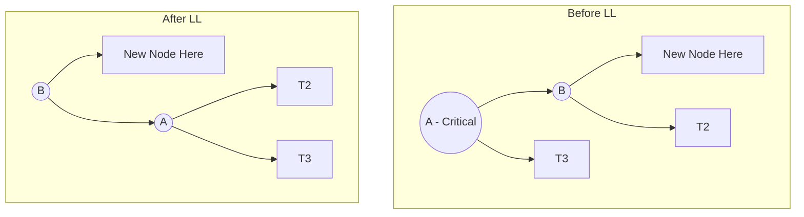

***

# 🌳 AVL Tree (Self-Balancing Binary Search Tree)
**Tags:** `#data-structures` `#avl-trees` `#exam-review`

> [!info] Core Concept
> An AVL tree is a height-balanced Binary Search Tree (BST). 
> **Rule:** The height difference between the left and right subtrees of ANY node must be **at most 1**.
> **Time Complexity:** $O(\log n)$ for Search, Insert, and Delete (because height is strictly controlled).

### ⚖️ Balance Factor (BF)
The extra variable stored in each node to maintain balance.
> **Formula:** `BF = Height(Left Sub-tree) - Height(Right Sub-tree)`
*   **+1 (Left-heavy):** Left subtree is 1 level taller.
*   **0 (Perfectly balanced):** Both subtrees are the same height.
*   **-1 (Right-heavy):** Right subtree is 1 level taller.
*   🚨 **Critical Node:** The first node (going bottom-up from the inserted/deleted node) where the BF becomes `> 1` or `< -1`.

---

### 🛠️ Operations Overview
1. **Search:** Exactly like a standard BST.
2. **Insert:** Insert as a leaf (like BST). Update BFs bottom-up. If a Critical Node is found, perform a **Rotation**.
3. **Delete:** Delete like a standard BST. Update BFs bottom-up. May require rotations. **Note:** Deletion rotations can cascade all the way up to the root.

---

### 🔄 Insertion Rotations
Determined by where the *new node* is inserted relative to the *Critical Node*.

#### 1. LL Rotation (Single Right Rotation)
*   **Cause:** Inserted in the **L**eft subtree of the **L**eft child of the Critical Node.
*   **Action:** The Left child (`B`) becomes the new root. The old root (`A`) becomes `B`'s right child. `B`'s old right child (`T2`) becomes `A`'s left child.

#### 2. RR Rotation (Single Left Rotation)
*   **Cause:** Inserted in the **R**ight subtree of the **R**ight child.
*   **Action:** The Right child (`B`) becomes the new root. Old root (`A`) becomes `B`'s left child. `B`'s old left child moves to `A`'s right.

#### 3. LR Rotation (Double Rotation: Left then Right)
*   **Cause:** Inserted in the **R**ight subtree of the **L**eft child.
*   **Action:** The grandchild (`C`) gets pulled all the way up to replace the Critical Node (`A`). `B` becomes `C`'s left child, `A` becomes `C`'s right child. Subtrees of `C` are split between `B` and `A`.

#### 4. RL Rotation (Double Rotation: Right then Left)
*   **Cause:** Inserted in the **L**eft subtree of the **R**ight child.
*   **Action:** The grandchild (`C`) gets pulled up to the root. `A` becomes the left child, `B` becomes the right child.

> [!tip] Rotation Cheat Sheet
> *   **Straight line** insertion (LL, RR) $\rightarrow$ **Single Rotation** (pull middle node up).
> *   **Zig-zag** insertion (LR, RL) $\rightarrow$ **Double Rotation** (pull bottom grandchild up to the top).

---

### 🗑️ Deletion Rotations (R0, R1, R-1)
When you delete a node, the tree might lose balance. Let the Critical Node be `A`, and its taller child (the sibling of the deleted node's subtree) be `B`. The rotation depends on the **Balance Factor of `B`**.

*   **R0 Rotation (BF of B is 0):** 
    *   Similar to a Single Rotation (LL or RR). 
    *   Occurs when the taller child is perfectly balanced.
*   **R1 Rotation (BF of B is 1 or same sign as heavy side):**
    *   Treated exactly like a Single Rotation (LL or RR).
*   **R-1 Rotation (BF of B is -1 or opposite sign to heavy side):**
    *   Treated exactly like a Double Rotation (LR or RL).

> [!warning] Exam Trap
> Insertion only requires **one** rotation to fix the whole tree. Deletion might require **multiple rotations** cascading up to the root to fully restore AVL properties!