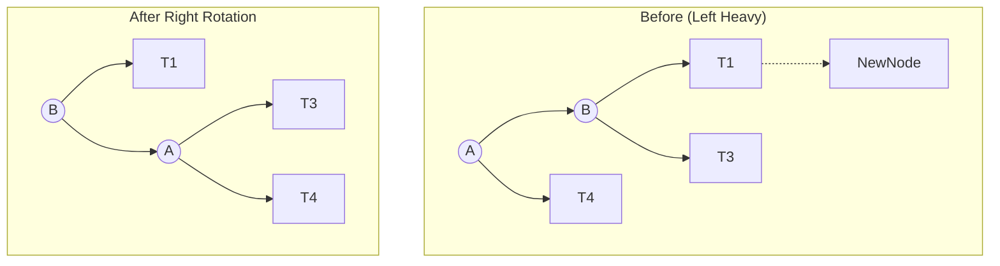

---
tags:
  - data-structures
  - algorithms
  - tree
  - binary-search-tree
  - AVL
  - cse-4303
course: CSE 4303 - Data Structures
instructor: Asaduzzaman Herok
date: 2023-11-06
source: PDF Slides, Reema Thareja (Textbook)
checked: No
---
![[Pasted image 20260224033024.png]]
# Self-Balancing Tree: AVL Tree

## 1. Introduction
The **AVL Tree** is a self-balancing Binary Search Tree (BST). It was the first such data structure to be invented.
- **Inventors:** G.M. **A**delson-**V**elsky and E.M. **L**andis.
- **Year:** 1962.
- **Key Property:** It is a **height-balanced** tree. The heights of the two sub-trees of any node may differ by at most one.

### Why AVL Trees?
In a standard BST, the worst-case time complexity for operations (Search, Insert, Delete) is $O(n)$ (when the tree is skewed/looks like a linked list). By strictly maintaining balance, AVL trees ensure the height is always logarithmic, guaranteeing **$O(\log n)$** for all operations.

---

## 2. Balance Factor (BF)
To maintain the height property, every node stores an additional variable called the **Balance Factor**.

### Formula
$$ \text{Balance Factor (BF)} = \text{Height(Left Sub-tree)} - \text{Height(Right Sub-tree)} $$

### Allowed Values
For an AVL tree to be valid, every node must have a Balance Factor of **-1, 0, or 1**.

| Balance Factor | Description | State |
| :---: | :--- | :--- |
| **1** | Left sub-tree is one level higher than right. | **Left-heavy** |
| **0** | Left and right sub-trees are equal height. | **Perfectly Balanced** |
| **-1** | Left sub-tree is one level lower than right. | **Right-heavy** |

> **Critical Node:** The unbalanced node discovered after an insertion or deletion (where $|BF| > 1$). This node requires rotation to re-balance.

---

## 3. Operations

### A. Searching
- **Method:** Exactly the same as a standard Binary Search Tree.
- **Complexity:** $O(\log n)$ because the tree height is strictly limited.

### B. Insertion
- **Method:**
    1. Perform standard BST insertion (new node is always inserted as a leaf).
    2. Newly inserted node has $BF = 0$.
    3. Backtrack up to the root, updating balance factors.
    4. If a node becomes unbalanced (BF is outside -1 to 1), perform **Rotation**.
- **Complexity:** $O(\log n)$.

### C. Deletion
- **Method:**
    1. Perform standard BST deletion.
    2. Deletion may disturb the balance.
    3. Backtrack and perform **Rotation** to restore "AVLness".
- **Complexity:** $O(\log n)$.

---

## 4. Rotations (Re-balancing)
Rotations are constant time $O(1)$ operations used to restore balance without violating the BST property (Left < Root < Right).

There are **4 categories** of rotations based on the location of the insertion relative to the Critical Node.

### Single Rotations

#### 1. LL Rotation (Left-Left Case)
- **Problem:** New node inserted in the **Left** sub-tree of the **Left** sub-tree of the critical node.
- **Solution:** Apply a **Right Rotation** on the critical node.
- **Visual Logic:**
    - Node `B` (left child) becomes the new root.
    - Node `A` (old root) becomes the right child of `B`.
    - `B`'s original right sub-tree ($T_3$) becomes `A`'s left sub-tree.

#### 2. RR Rotation (Right-Right Case)
- **Problem:** New node inserted in the **Right** sub-tree of the **Right** sub-tree of the critical node.
- **Solution:** Apply a **Left Rotation** on the critical node.
- **Visual Logic:**
    - Node `B` (right child) becomes the new root.
    - Node `A` (old root) becomes the left child of `B`.
    - `B`'s original left sub-tree ($T_1$) becomes `A`'s right sub-tree.

### Double Rotations

#### 3. LR Rotation (Left-Right Case)
- **Problem:** New node inserted in the **Right** sub-tree of the **Left** sub-tree of the critical node.
- **Solution:** Two steps.
    1. **Left Rotation** on the left child (converting it to LL case).
    2. **Right Rotation** on the critical node (solving the LL case).
- **Key movement:** The grandchild `C` (which is between `A` and `B` in value) moves up to become the new root.

#### 4. RL Rotation (Right-Left Case)
- **Problem:** New node inserted in the **Left** sub-tree of the **Right** sub-tree of the critical node.
- **Solution:** Two steps.
    1. **Right Rotation** on the right child (converting it to RR case).
    2. **Left Rotation** on the critical node (solving the RR case).
- **Key movement:** The grandchild `C` moves up to become the new root.

---

## 5. Deletion Specifics
Deletion is similar to insertion but slightly more complex because removing a node might require rotations at multiple levels up the tree (unlike insertion, which usually fixes the tree with one set of rotations).

The slides categorize deletion rotations based on the state of the sibling node (let's assume we deleted from the right side, so the Left side is now heavy).

### Case R0 Rotation
- **Scenario:** The Critical Node `A` is left-heavy ($BF=2$ generally, or just unbalanced). Its left child `B` has a balance factor of **0**.
- **Action:** Single Right Rotation.
- **Result:** The resulting tree is balanced, but the height usually remains the same as before the deletion.

### Case R1 Rotation
- **Scenario:** The Critical Node `A` is left-heavy. Its left child `B` has a balance factor of **1** (Left-Heavy). This is essentially the **LL Case**.
- **Action:** Single Right Rotation.
- **Result:** The tree becomes perfectly balanced.

### Case R-1 Rotation
- **Scenario:** The Critical Node `A` is left-heavy. Its left child `B` has a balance factor of **-1** (Right-Heavy). This is essentially the **LR Case**.
- **Action:** Double Rotation (Left Rotation on `B`, then Right Rotation on `A`).
- **Result:** The grandchild `C` becomes the new root of the subtree.

---

## 6. Summary of Complexity

| Operation | Average Case | Worst Case |
| :--- | :--- | :--- |
| **Space** | $O(n)$ | $O(n)$ |
| **Search** | $O(\log n)$ | $O(\log n)$ |
| **Insert** | $O(\log n)$ | $O(\log n)$ |
| **Delete** | $O(\log n)$ | $O(\log n)$ |

## 7. Example Workflow (Construction)
*Based on Slide 15 Example 10.6: Insert 63, 9, 19, 27, 18, 108, 99, 81.*

1. **Insert 63, 9:** No rotation.
2. **Insert 19:**
   - 63 becomes unbalanced (Left-Right Case).
   - **LR Rotation:** 19 becomes root, 9 left, 63 right.
3. **Insert 27:** No rotation.
4. **Insert 18:** No rotation.
5. **Insert 108:** No rotation.
6. **Insert 99:**
   - Subtree rooted at 63 becomes unbalanced (Right-Left Case).
   - **RL Rotation:** 99 moves up.
7. **Insert 81:**
   - Root (19) becomes unbalanced (Right-Left Case deep in tree triggering rotation at root).
   - *Note:* Often requires checking heights carefully. In the slide example, insertion of 81 triggers an **LL Rotation** at the node 108/99 level or higher depending on the exact BF updates.