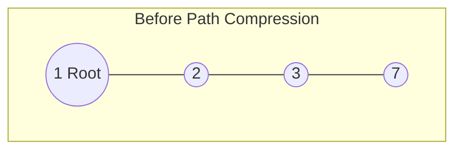

# Disjoint Set (Union-Find) Data Structure

## 📌 Introduction
A **Disjoint Set** (also known as **Union-Find**) is a data structure that maintains a collection of disjoint (non-overlapping) dynamic sets: $S = \{S_1, S_2, S_3, \dots, S_k\}$. 
It is primarily used in scenarios where we need to **dynamically group elements** and efficiently check their **connectivity** (i.e., whether two elements belong to the same group).

### Core Concepts
- **Clusters/Subgraphs:** Items that are connected belong to the same set. The number of disjoint sets represents the number of independent clusters.
- **Representative (Root):** Every disjoint set has a single "representative" element. 
- **Connectivity Check:** If two nodes have the *same* representative, they belong to the *same* set (i.e., they are connected either directly or indirectly).

---

## ⚙️ Core Operations

The Disjoint Set data structure supports three primary operations:

1. `makeSet(x)`: Creates a new set with a single member `x` and points to itself as the representative.
2. `find(x)`: Returns the representative (root) of the set containing `x`.
3. `union(u, v)`: Merges the subsets containing `u` and `v` into a single new set by connecting their representatives.

---

## 💻 1. Naive Implementation (Sub-optimal)

In the simplest form, we can represent sets using an array where `parent[i]` stores the parent of node `i`.

```cpp
int parent[N]; // Array to store the parent of each node

// 1. Initialization
void makeSet(int u) {
    parent[u] = u; // A node is its own parent initially
}

void init(int n) {
    for (int i = 1; i <= n; i++) {
        makeSet(i);
    }
}

// 2. Find (Recursive)
int find(int u) {
    if (parent[u] == u) 
        return u; // Root found
    else 
        return find(parent[u]);
}

// 3. Union (Naive)
void set_union(int u, int v) {
    int rootU = find(u);
    int rootV = find(v);
    
    if (rootU != rootV) {
        parent[rootV] = rootU; // Simply point one root to another
    }
}
```

> [!danger] The Problem with Naive Implementation
> If we simply connect trees without any logic, the tree can become highly skewed (like a linked list). In the worst-case scenario, the height of the tree becomes $O(N)$, meaning the `find()` operation will take **$O(N)$ time**.

---

## 🚀 Optimizations

To make the operations run in near-constant time, we apply two major optimizations: **Union by Rank/Size** and **Path Compression**.

### Optimization 1: Union by Rank / Size
To prevent the tree from becoming skewed, we ensure that the **smaller tree is always attached under the root of the larger tree**. 
- **By Size:** Track the number of nodes in each set.
- **By Rank:** Track the upper bound of the tree's height.

```cpp
int parent[N];
int rank_arr[N]; // stores the depth/rank of the trees

void set_union_optimized(int u, int v) {
    int rootU = find(u);
    int rootV = find(v);
    
    if (rootU != rootV) {
        // Attach the smaller rank tree under the larger rank tree
        if (rank_arr[rootU] < rank_arr[rootV]) {
            parent[rootU] = rootV;
        } else if (rank_arr[rootU] > rank_arr[rootV]) {
            parent[rootV] = rootU;
        } else {
            // If ranks are equal, pick one as root and increment its rank
            parent[rootV] = rootU;
            rank_arr[rootU]++;
        }
    }
}
```

### Optimization 2: Path Compression
When executing `find(x)`, we traverse from node `x` up to the root. **Path Compression** optimizes future queries by making every node on that path point *directly* to the root. 

```cpp
int find_optimized(int u) {
    if (parent[u] == u) return u;
    
    // While returning from recursion, update the parent of each node
    return parent[u] = find_optimized(parent[u]); 
}
```

#### Visualizing Path Compression
When you call `find(7)` on a deep tree, Path Compression flattens it:


```mermaid
graph TD
    subgraph After find(7) Path Compression
    1((1 Root)) --- 2((2))
    1 --- 3((3))
    1 --- 7((7))
    end
```
> [!success] The result reduces the depth of the tree, speeding up all future operations drastically.

---

## ⏱️ Time & Space Complexity

With **both** Path Compression and Union by Rank applied:
- **Time Complexity:** $O(\alpha(N))$ amortized per operation.
  - $\alpha(N)$ is the **Inverse Ackermann function**. 
  - It grows extremely slowly. For all practical values of $N$ (even up to the number of atoms in the universe), $\alpha(N) \le 4$.
  - Thus, operations run in **almost $O(1)$ constant time**.
- **Space Complexity:** $O(N)$ to store the `parent` and `rank`/`size` arrays.

---

## 🛠️ Real-World Applications

### 1. Finding Connected Components
In an undirected graph, DSU can determine the number of isolated subgraphs. 
- Initialize $N$ disjoint sets.
- For every edge $(u, v)$, perform `union(u, v)`.
- The number of unique roots remaining is the number of connected components.

### 2. Cycle Detection in Undirected Graphs
DSU is highly efficient at detecting cycles as a graph is being built.
- For every edge $(u, v)$ being added:
  - If `find(u) == find(v)`, it means $u$ and $v$ are already connected via another path. **Adding this edge creates a cycle.**
  - Else, `union(u, v)`.

### 3. Kruskal's Minimum Spanning Tree (MST) Algorithm
To find the MST of a weighted graph:
1. Sort all edges by weight in ascending order.
2. Iterate through the edges. If adding an edge doesn't form a cycle (checked via DSU), include it in the MST and `union` the endpoints.

### 4. Maze Generation
A standard algorithm to generate a "perfect maze" (where there is exactly one unique path between any two points and no loops) relies heavily on Disjoint Sets:
1. Start with an $N \times M$ grid subdivided into squares, isolated by walls.
2. Represent each square as a separate disjoint set (initially $N \times M$ sets).
3. Create a list of all internal walls and shuffle it (or pick randomly).
4. **Algorithm Loop:**
   - Pop a random wall.
   - If the wall separates two cells that belong to **disjoint sets** (i.e., `find(cell1) != find(cell2)`):
     - **Remove the wall**.
     - Perform `union(cell1, cell2)`.
   - If they are already in the same set, removing the wall would create a loop/cycle, so keep the wall.
5. Stop when all cells are in a single set. The result is a fully connected, cycle-free maze.

---

## 📝 Full C++ Template (Competitive Programming Ready)

```cpp
class DisjointSet {
    vector<int> parent, rank, size;
public:
    DisjointSet(int n) {
        parent.resize(n + 1);
        rank.resize(n + 1, 0); // Optional: if using rank
        size.resize(n + 1, 1); // Optional: if using size
        for (int i = 0; i <= n; i++) {
            parent[i] = i;
        }
    }

    int find(int node) {
        if (node == parent[node]) return node;
        return parent[node] = find(parent[node]); // Path compression
    }

    void unionBySize(int u, int v) {
        int rootU = find(u);
        int rootV = find(v);
        if (rootU == rootV) return;

        if (size[rootU] < size[rootV]) {
            parent[rootU] = rootV;
            size[rootV] += size[rootU];
        } else {
            parent[rootV] = rootU;
            size[rootU] += size[rootV];
        }
    }
};
```

---
## 📚 References & Resources
1. **CLRS (Cormen, Leiserson, Rivest, Stein):** *Introduction to Algorithms* - Chapter 21 (Data Structures for Disjoint Sets).
2. **GeeksforGeeks:**[Union by Rank and Path Compression in Union-Find Algorithm](https://www.geeksforgeeks.org/union-by-rank-and-path-compression-in-union-find-algorithm/).
3. **Shafaet's Planet:** [ডাটা স্ট্রাকচার: ডিসজয়েন্ট সেট (ইউনিয়ন ফাইন্ড)](https://www.shafaetsplanet.com/?p=763) (Bengali Blog on DSU).
4. **HackerEarth:**[Disjoint Set Union (Union Find)](https://www.hackerearth.com/practice/notes/disjoint-set-union-union-find/).