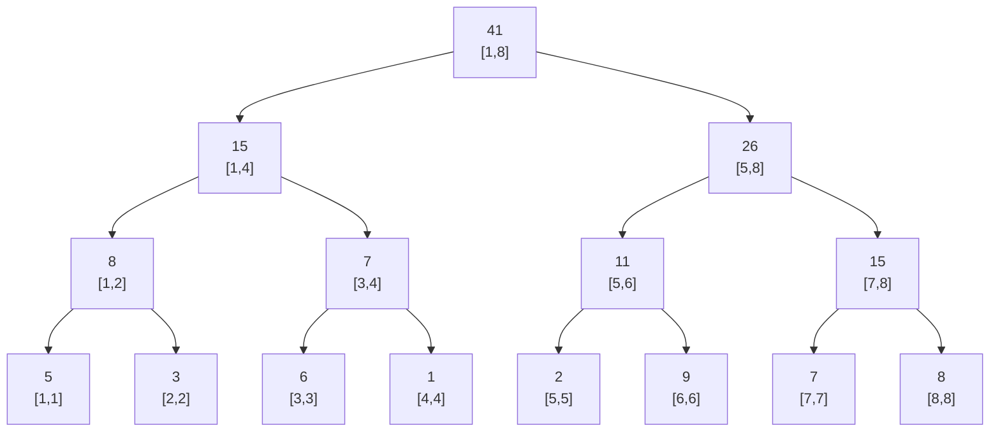
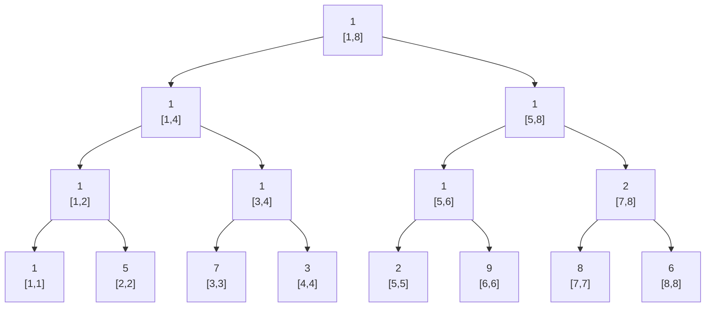

***

**Tags:** `#DSA` `#DataStructures` `#Trees` `#RangeQueries` `#ExamRevision`

> [!info] What is a Segment Tree?
> A Segment Tree is a binary tree used for storing information about intervals or segments. It allows answering range queries (like sum, min, max, GCD over an array range) and updating array elements (point updates) efficiently.
> *   **Build Time:** $O(N)$
> *   **Query Time:** $O(\log N)$
> *   **Update Time:** $O(\log N)$
> *   **Space Complexity:** $O(N)$ specifically array size of **$4N$**.

---

### 1. Structure & Array Representation

A Segment Tree is generally built on top of an array `Arr` of size $N$. 
*   **Root Node:** Represents the entire array range `[1, N]`.
*   **Leaf Nodes:** Represent single elements `[i, i]`.
*   **Internal Nodes:** Represent the merged result of their children (e.g., `mid = (l+r)/2`, left child is `[l, mid]`, right child is `[mid+1, r]`).

> [!warning] The $4N$ Rule
> If you are storing the tree in an array, the size of the tree array must be **$4 \times N$**. 
> **Why?** If the number of elements is not a perfect power of 2 (e.g., $N=7$), the tree will have dummy nodes/empty spaces to maintain the complete binary tree structure. Allocating $4N$ guarantees you will never hit an out-of-bounds error.

#### Child/Parent Relationships (1-based indexing)
For any node at index `node`:
*   `left_node = 2 * node`
*   `right_node = 2 * node + 1`

---

### 2. Visual Example: Sum Segment Tree
Given `Arr = {5, 3, 6, 1, 2, 9, 7, 8}` ($N=8$). 
We want to precompute the **Sum** for ranges. `Tree[node] = Tree[left] + Tree[right]`



---

### 3. Visual Example: GCD Segment Tree & Recursion Flow
Given `Arr = {1, 5, 7, 3, 2, 9, 8, 6}`. 
We want to precompute the **Greatest Common Divisor (GCD)**. `Tree[node] = GCD(Tree[left], Tree[right])`


*Notice how GCD(8,6) = 2, so the node for range [7,8] is 2.*

---

### 4. Core Operations (C++ Implementation)

Here is the exact logic from the notes, cleaned up for quick exam revision. This example uses **GCD**, but can be replaced with `+`, `min()`, or `max()`.

#### A. Build Tree
*Call from main:* `buildTree(1, 1, N);`
```cpp
// node: current tree index, l: starting index, r: ending index
void buildTree(int node, int l, int r) {
    // Base Case: Leaf node
    if (l == r) {
        Tree[node] = Arr[l];
        return;
    }
    
    int mid = (l + r) / 2;
    int leftNode = 2 * node;
    int rightNode = 2 * node + 1;
    
    // Recursion
    buildTree(leftNode, l, mid);
    buildTree(rightNode, mid + 1, r);
    
    // Combine step
    Tree[node] = gcd(Tree[leftNode], Tree[rightNode]); 
}
```

#### B. Range Query
*Call from main:* `query(1, 1, N, query_left, query_right);`
```cpp
// ql, qr: The range we want to query
int query(int node, int l, int r, int ql, int qr) {
    // 1. Complete Overlap
    if (l == ql && r == qr) {
        return Tree[node];
    }
    
    int mid = (l + r) / 2;
    int leftNode = 2 * node;
    int rightNode = 2 * node + 1;
    
    // Ranges for left and right children
    int ll = l, lr = mid;         // Range for left child
    int rl = mid + 1, rr = r;     // Range for right child
    
    // 2. Completely in Right Child
    if (lr < ql) {
        return query(rightNode, rl, rr, ql, qr);
    }
    // 3. Completely in Left Child
    if (qr < rl) {
        return query(leftNode, ll, lr, ql, qr);
    }
    
    // 4. Partial Overlap (Split the query)
    int lql = ql, lqr = lr;   // Left node sub-query
    int rql = rl, rqr = qr;   // Right node sub-query
    
    int lresult = query(leftNode, ll, lr, lql, lqr);
    int rresult = query(rightNode, rl, rr, rql, rqr);
    
    return gcd(lresult, rresult);
}
```

#### C. Point Update
Updates an element at index `idx` to value `key`.
*Call from main:* `update(1, 1, N, key, idx);`
```cpp
void update(int node, int l, int r, int key, int idx) {
    // Base case: Reached the exact element
    if (l == idx && r == idx) {
        Tree[node] = key; // Update tree
        Arr[idx] = key;   // Update original array (optional but good practice)
        return;
    }
    
    int mid = (l + r) / 2;
    int leftNode = 2 * node;
    int rightNode = 2 * node + 1;
    
    // Search left or right
    if (idx <= mid) {
        update(leftNode, l, mid, key, idx);
    } else {
        update(rightNode, mid + 1, r, key, idx);
    }
    
    // Backtrack and update current node
    Tree[node] = gcd(Tree[leftNode], Tree[rightNode]);
}
```

---

### 5. Advanced Variation: Range Max with Frequency
*From Page 5 of notes.*
**Question:** How to find the Maximum element in a range AND how many times it appears (its frequency)?

To do this, we can no longer just store an `int` in our Segment Tree. We must store a `struct`.

```cpp
// 1. Define the Node structure
struct Node {
    int max_val;
    int frequency;
};

Node Tree[4 * N];

// 2. The Combine Logic (Crucial for Build, Query, and Update)
Node combine(Node left, Node right) {
    Node res;
    // If maximums are equal, add their frequencies
    if (left.max_val == right.max_val) {
        res.max_val = left.max_val;
        res.frequency = left.frequency + right.frequency;
    } 
    // Otherwise, take the strictly greater max and its frequency
    else if (left.max_val > right.max_val) {
        res.max_val = left.max_val;
        res.frequency = left.frequency;
    } 
    else {
        res.max_val = right.max_val;
        res.frequency = right.frequency;
    }
    return res;
}
```
*Note: Whenever you do `Tree[node] = ...` in your build or update functions, or return a combined value in your query function, use this `combine()` function.*

---

### 📝 Exam Quick Revision Checklist

*   [ ] **Size of Array:** Always `4 * N`.
*   [ ] **Midpoint Calculation:** `mid = (l + r) / 2`.
*   [ ] **Children Indices:** Left is `2*node`, Right is `2*node + 1`.
*   [ ] **Base Cases:** 
    *   Build/Update: `l == r`
    *   Query: `l == query_l` AND `r == query_r`
*   [ ] **Backtracking:** Don't forget to update the parent node `Tree[node] = ...` at the very end of your `build` and `update` functions!
*   [ ] **Query Overlaps:** Always check if the query falls entirely left, entirely right, or partially in both.