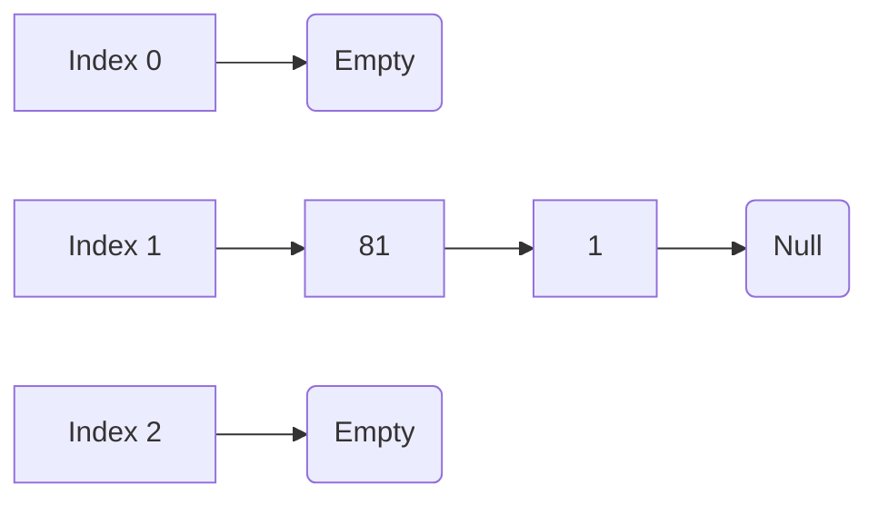

***

# ⚡ Exam Quick-Review: Hashing

> [!abstract] Core Concept
> A **Hash Table** stores Key-Value pairs in an array. A **Hash Function** translates a Key into an Array Index for $O(1)$ average-case retrieval.

### ⏱️ Big-O Complexities
*   **Average Case:** Insert, Search, Delete = **$O(1)$**
*   **Worst Case:** $O(N)$ (if too many collisions happen).
*   > [!warning] Exam Trap: When NOT to use a Hash Table?
>   Hash tables are **terrible for ordered data**. Operations like `findMax`, `findMin`, or printing in sorted order take $O(N)$. 

---

## 🔢 1. Hash Functions
**Requirements for a good hash function:**
1. Fast to compute ($O(1)$).
2. Distributes keys evenly (minimizes collisions).

**Integer Keys:** `Hash(key) = key % TableSize`
**String Keys:** Convert string to integer by multiplying ASCII values by powers of a prime number (usually **37**).
*   **Formula:** $\sum (key[i] \times 37^i)$
*   **Example ('ali'):** $(105 \times 37^0) + (108 \times 37^1) + (97 \times 37^2) = \text{Hash Value}$
*   *Why?* Simple ASCII addition creates collisions for anagrams (e.g., "ACT" and "CAT"). Powers of 37 make positional order matter.

---

## ⚖️ 2. The Load Factor ($\lambda$)
**Formula:** $\lambda = \frac{\text{Total Items (N)}}{\text{TableSize}}$
Represents how "full" the table is. Performance depends heavily on $\lambda$, *not* the raw number of elements ($N$).

---

## 💥 3. Collision Resolution Strategy 1: Separate Chaining
**How it works:** Array slots act as pointers to **Linked Lists**. When a collision occurs, insert the new item at the **FRONT** of the list (Inserting at front = $O(1)$).

**Key Exam Facts for Chaining:**
*   **Load Factor ($\lambda$):** Represents the *average length* of the lists. It **CAN be > 1**.
*   **Unsuccessful Search Cost:** $O(1 + \lambda)$ (Have to traverse the whole list).
*   **Successful Search Cost:** $O(1 + \lambda / 2)$ (Traverse half the list on average).
*   **Pros:** Never fills up (no strict size limit), simple to implement, less sensitive to high $\lambda$.
*   **Cons:** Wastes memory with pointers, search degrades to $O(N)$ if chains get too long.

---

## 🚗 4. Collision Resolution Strategy 2: Open Addressing
**How it works:** NO linked lists. All items go directly inside the array. If a spot is taken, use a mathematical rule to find an alternative empty cell.
*   **Rule:** Load Factor ($\lambda$) must **ALWAYS be $\le 0.5$** (Table must be $\le 50\%$ full).

**The Master Formula:** 
$$h_i(x) = (\text{OriginalHash}(x) + f(i)) \mod TableSize$$
*(Where $i$ is the attempt number: 0, 1, 2... and $f(i)$ is the step size).*

| Method | Step Formula $f(i)$ | Pros | Cons (Exam Keywords!) |
| :--- | :--- | :--- | :--- |
| **Linear Probing** | $f(i) = i$  *(Steps: 1, 2, 3...)* | Easiest to implement. | 🚨 **Primary Clustering:** Forms massive blocks of occupied cells. Finding a spot takes a long time. |
| **Quadratic Probing** | $f(i) = i^2$  *(Steps: 1, 4, 9...)* | Eliminates Primary Clustering! | 🚨 **Secondary Clustering:** Keys that hash to the same spot will follow the exact same jump pattern. |
| **Double Hashing** | $f(i) = i \times Hash_2(x)$ | Best distribution. Eliminates both clustering types. | Requires computing a second hash function. |

### 🚨 Crucial Open Addressing Rules to Memorize
1. **Quadratic Probing Guarantee:** If the TableSize is **Prime** and $\lambda < 0.5$, an item can *always* be successfully inserted. (If it's not prime, insertions might fail!).
2. **Double Hashing Requirement:** The second hash function $Hash_2(x)$ must **NEVER evaluate to 0**. (If it does, the step size is 0, causing an infinite loop).
    *   *Standard $Hash_2$ formula:* `R - (key % R)` where `R` is a prime number smaller than TableSize.

### Double Hashing Example (TableSize = 10, R = 7)
*   `Hash1(49)` = $49 \mod 10 = \mathbf{9}$. (Assume spot 9 is taken).
*   `Hash2(49)` = $7 - (49 \mod 7) = 7 - 0 = \mathbf{7}$. (This is the Jump Size).
*   **Attempt 1:** Original Spot (9) + Jump Size (7) = $16 \mod 10 =$ **Insert at Index 6**.

---

## 🔄 5. Re-Hashing
**When to do it?** 
When the table gets too full (For Open Addressing, when $\lambda > 0.5$).

**How to do it:**
1. Create a new table.
2. The new table size must be **double the old size, rounded up to the next PRIME number**.
3. **Re-calculate** the hash for every single item using the new TableSize and insert them into the new table. (You *cannot* just copy them directly over, because modulo math changes with a new size).