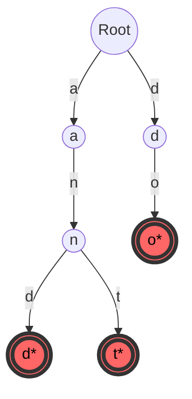

***

**Tags:** `#DSA` `#DataStructures` `#Trie` `#Strings` `#ExamRevision`

> [!info] What is a Trie?
> A **Trie** (derived from re**trie**val), also known as a **Prefix Tree**, is an efficient information retrieval data structure. It is a tree-like data structure used to store a dynamic set of strings where keys are usually strings.
> 
> **Key Properties:**
> - The root node represents an empty string.
> - Each node stores a character.
> - Paths from the root to a node represent a prefix of words in the Trie.
> - **Maximum depth** of the Trie is equal to the maximum length of a string in the set.

---

## 🧱 1. Structure of a Trie Node
Unlike binary trees, a Trie node can have multiple children (typically 26 for lowercase English letters). 

```cpp
struct TrieNode {
    // Array of pointers for 26 alphabets (or a Hash Map: unordered_map<char, TrieNode*>)
    TrieNode* children[26]; 
    
    // True if the node represents the end of a valid string
    bool isEndOfWord; 
    
    // Constructor
    TrieNode() {
        isEndOfWord = false;
        for (int i = 0; i < 26; i++) {
            children[i] = nullptr;
        }
    }
};
```

---

## ✍️ 2. Insertion
To insert a string, we start from the root and traverse character by character. 

**Algorithm:**
1. For each character in the string, calculate its index (e.g., `'a' - 'a' = 0`).
2. Check if the current node has a child at that index.
3. If **yes**, move to that child.
4. If **no**, create a new node, link it, and move to it.
5. After processing the last character, mark the current node's `isEndOfWord = true`.

### Visual Example: Inserting "and", "ant", "do"

*(Nodes with thick red borders and `*` represent `isEndOfWord = true`)*

---

## 🔍 3. Search
Searching is exactly like insertion, but if we hit a `nullptr` before finishing the word, the word doesn't exist.

**Algorithm:**
1. Traverse the tree character by character.
2. If at any point `children[char_index] == nullptr`, return `False` (word not found).
3. If we successfully traverse the entire string, return the `isEndOfWord` value of the final node. *(If it's false, the string only exists as a prefix, not as a full word).*

>[!tip] Code Snippet for Insert & Search (C++)
> ```cpp
> class Trie {
>     TrieNode* root;
> public:
>     Trie() { root = new TrieNode(); }
> 
>     void insert(string word) {
>         TrieNode* node = root;
>         for (char c : word) {
>             int idx = c - 'a';
>             if (!node->children[idx]) node->children[idx] = new TrieNode();
>             node = node->children[idx];
>         }
>         node->isEndOfWord = true;
>     }
> 
>     bool search(string word) {
>         TrieNode* node = root;
>         for (char c : word) {
>             int idx = c - 'a';
>             if (!node->children[idx]) return false;
>             node = node->children[idx];
>         }
>         return node->isEndOfWord;
>     }
> };
> ```

---

## 🗑️ 4. Deletion (The Tricky Part)
Deleting a string from a Trie requires recursion. We must process from the bottom up to ensure we don't accidentally delete nodes that belong to other words.

>[!warning] The 4 Cases of Deletion
> 1. **Word doesn't exist:** Do nothing.
> 2. **Word is unique (No shared prefix):** Delete all nodes of the word.
> 3. **Word is a prefix of another word:** (e.g., Trie has `apple` & `app`. Delete `app`). Just set `isEndOfWord = false` at the last node. **Do not delete any nodes.**
> 4. **Word shares a prefix with another word:** (e.g., Trie has `app` & `ape`. Delete `ape`). Delete only the nodes specific to `ape` (`e`), but leave `ap` alone.

### Deletion Helper Function (Bottom-Up)
```cpp
// Returns true if node has no children, false otherwise
bool isEmpty(TrieNode* root) {
    for (int i = 0; i < 26; i++)
        if (root->children[i]) return false;
    return true;
}

TrieNode* remove(TrieNode* root, string key, int depth = 0) {
    if (!root) return nullptr;

    // Base Case: We reached the end of the word being deleted
    if (depth == key.size()) {
        if (root->isEndOfWord) root->isEndOfWord = false; // Unmark end of word
        
        // If it has no other children, we can safely delete it
        if (isEmpty(root)) {
            delete (root);
            root = nullptr;
        }
        return root;
    }

    // Recursive Case: Traverse to the child node
    int index = key[depth] - 'a';
    root->children[index] = remove(root->children[index], key, depth + 1);

    // Backtracking: After returning from child, if current node is NOT an 
    // end of another word and has NO children left, delete it too.
    if (isEmpty(root) && root->isEndOfWord == false) {
        delete (root);
        root = nullptr;
    }
    return root;
}
```

---

## 🎯 Problem 1: Find Number of Strings with a Given Common Prefix
**The Problem:** Given a list of strings and multiple prefix queries, return how many strings in the Trie start with the given prefix.

**The Solution:** Augment the Trie Node! 
Instead of repeatedly traversing the Trie to count words, we add a `prefixCount` integer to the `TrieNode`.

### Modified Trie Node
```cpp
struct PrefixTrieNode {
    PrefixTrieNode* children[26];
    int prefixCount; // NEW: Tracks how many words pass through this node
    
    PrefixTrieNode() {
        prefixCount = 0;
        for(int i=0; i<26; i++) children[i] = nullptr;
    }
};
```

### Modified Insertion & Query Logic
1. **Insert:** Every time we visit a node while inserting a word, we **increment** `prefixCount`.
2. **Query:** Traverse the Trie matching the prefix. When we reach the end of the prefix, simply return that node's `prefixCount`. If we hit a `null` node before finishing the prefix, return `0`.

### Visual of `prefixCount`
Inserting "app", "apple", "ape", "bat"

```mermaid
graph TD
    R((Root: 4)) -->|a| A((a: 3))
    R -->|b| B((b: 1))
    
    A -->|p| P1((p: 2))
    A -->|e| E1((e: 1))
    
    P1 -->|p| P2((p: 2))
    P2 -->|l| L((l: 1))
    P2 -.->|*(end of 'app')| END1(( ))
    
    L -->|e| E2((e: 1))
```
*If we query the prefix `"ap"`, we traverse `Root -> a -> p`. At node `p`, `prefixCount = 2`. Result is 2.*

### Code for Prefix Count
```python
class PrefixTrie:
    def __init__(self):
        self.trie = {}

    def insert(self, word):
        node = self.trie
        for char in word:
            if char not in node:
                node[char] = {'count': 0}
            node = node[char]
            node['count'] += 1  # Increment count on every pass

    def count_prefix(self, prefix):
        node = self.trie
        for char in prefix:
            if char not in node:
                return 0 # Prefix doesn't exist
            node = node[char]
        return node['count'] # Return the count at the final prefix char
```

---

## ⏱️ Complexity Cheat Sheet

> [!summary] Time & Space Complexities
> Let **L** be the length of the string, and **N** be the number of strings.
> 
> | Operation | Time Complexity | Space Complexity | Notes |
> | :--- | :--- | :--- | :--- |
> | **Insertion** | $O(L)$ | $O(L)$ | Space is $O(L)$ worst case for a completely new word. |
> | **Search** | $O(L)$ | $O(1)$ | No extra space needed for searching. |
> | **Deletion** | $O(L)$ | $O(L)$ | Space is $O(L)$ due to the recursive call stack. |
> | **Prefix Count**| $O(L)$ | $O(1)$ | Assuming the Trie is already built (Modified Node). |
> | **Building Trie**| $O(N \times L)$ | $O(N \times L \times 26)$ | Worst case space: completely unique words. |

> [!tip] When to use a Trie over a Hash Map?
> - **Hash Maps** are great for exact matches ($O(1)$ on average, but $O(L)$ if you factor in string hashing). Hash maps **cannot** do prefix searches efficiently.
> - **Tries** naturally group strings by prefixes, making them the ultimate choice for *Auto-complete*, *Spell Checking*, *Longest Prefix Matching* (used in IP routing), and *Counting Prefix* problems.