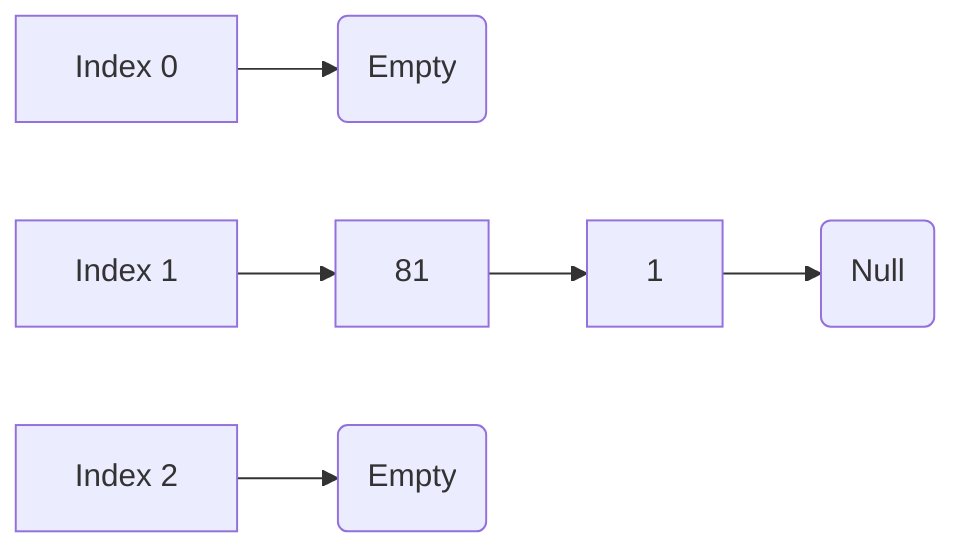
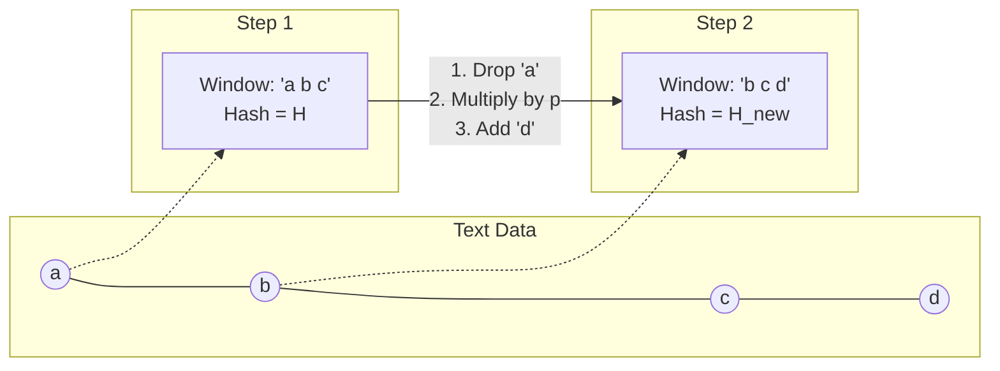

> [!abstract] Core Concept
> A **Hash Table** stores Key-Value pairs in an array. A **Hash Function** translates a Key into an Array Index for $O(1)$ average-case retrieval.

### ⏱️ Big-O Complexities
*   **Average Case:** Insert, Search, Delete = **$O(1)$**
*   **Worst Case:** $O(N)$ (if too many collisions happen).
*   > [!warning] Exam Trap: When NOT to use a Hash Table?
>   Hash tables are **terrible for ordered data**. Operations like `findMax`, `findMin`, or printing in sorted order take $O(N)$. 

---

## 🔢 1. Hash Functions
**Requirements for a good hash function:**
1. Fast to compute ($O(1)$).
2. Distributes keys evenly (minimizes collisions).

**Integer Keys:** `Hash(key) = key % TableSize`
**String Keys (Basic):** Convert strings to integers by multiplying ASCII values by powers of a prime number (usually **37**).
*   **Formula:** $\sum (key[i] \times 37^i)$
*   *Why?* Simple ASCII addition creates collisions for anagrams (e.g., "ACT" and "CAT"). Powers of 37 make positional order matter. *(See Section 6 for advanced String Hashing)*.

---

## ⚖️ 2. The Load Factor ($\lambda$)
**Formula:** $\lambda = \frac{\text{Total Items (N)}}{\text{TableSize}}$
Represents how "full" the table is. Performance depends heavily on $\lambda$, *not* the raw number of elements ($N$).

---

## 💥 3. Collision Resolution Strategy 1: Separate Chaining
**How it works:** Array slots act as pointers to **Linked Lists**. When a collision occurs, insert the new item at the **FRONT** of the list (Inserting at front = $O(1)$).

**Key Exam Facts for Chaining:**
*   **Load Factor ($\lambda$):** Represents the *average length* of the lists. It **CAN be > 1**.
*   **Unsuccessful Search Cost:** $O(1 + \lambda)$ (Have to traverse the whole list).
*   **Successful Search Cost:** $O(1 + \lambda / 2)$ (Traverse half the list on average).
*   **Pros:** Never fills up (no strict size limit), simple to implement.
*   **Cons:** Wastes memory with pointers, search degrades to $O(N)$ if chains get too long.

---

## 🚗 4. Collision Resolution Strategy 2: Open Addressing
**How it works:** NO linked lists. All items go directly inside the array. If a spot is taken, use a mathematical rule to find an alternative empty cell.
*   **Rule:** Load Factor ($\lambda$) must **ALWAYS be $\le 0.5$** (Table must be $\le 50\%$ full).

**The Master Formula:** 
$$h_i(x) = (\text{OriginalHash}(x) + f(i)) \mod TableSize$$

| Method | Step Formula $f(i)$ | Pros | Cons (Exam Keywords!) |
| :--- | :--- | :--- | :--- |
| **Linear Probing** | $f(i) = i$ | Easiest to implement. | 🚨 **Primary Clustering:** Forms massive blocks of occupied cells. |
| **Quadratic Probing** | $f(i) = i^2$ | Eliminates Primary Clustering! | 🚨 **Secondary Clustering:** Keys hashing to the same spot follow the exact same jump pattern. |
| **Double Hashing** | $f(i) = i \times Hash_2(x)$ | Eliminates both clustering types. | Requires computing a second hash function. |

### 🚨 Crucial Open Addressing Rules to Memorize
1. **Quadratic Probing Guarantee:** If TableSize is **Prime** and $\lambda < 0.5$, an item can *always* be successfully inserted. 
2. **Double Hashing Requirement:** $Hash_2(x)$ must **NEVER evaluate to 0**. (If it does, the jump size is 0 $\rightarrow$ infinite loop).

---

## 🔄 5. Re-Hashing
**When to do it?** 
When the table gets too full ($\lambda > 0.5$ for Open Addressing).

**How to do it:**
1. Create a new table **double the old size, rounded up to the next PRIME number**.
2. **Re-calculate** the hash for every single item using the new TableSize and insert them. (Modulo math changes, so you *cannot* just copy directly).

***

## 🧵 6. String Hashing (Polynomial Rolling Hash)
**Goal:** Compare huge strings in **$O(1)$** time instead of comparing them character-by-character $O(\min(N_1, N_2))$.
**Concept:** Map a string to a massive integer. If $Hash(S) == Hash(T)$, the strings are *highly likely* to be equal.

**The Polynomial Hash Formula:**
$$ Hash(s) = \left( \sum_{i=0}^{n-1} s[i] \cdot p^i \right) \mod m $$
*   **$p$ (Base):** A prime number close to the alphabet size (e.g., **31** for lowercase English, **53** for uppercase + lowercase).
*   **$m$ (Modulus):** A massive prime number (e.g., $10^9 + 9$) to prevent integer overflow and minimize collisions.

> [!warning] Exam Trap: Hash Collisions
> Since the hash space $[0, m)$ is smaller than the infinite number of string combinations, **collisions are inevitable**. The probability of a collision is $\approx \frac{1}{m}$.
> **Fix:** To improve safety, we calculate *two* distinct hashes for every string using different $(p, m)$ pairs. If both hashes match, the collision probability drops to practically zero. 

### ⚡ Prefix Hashing (Fast Substring Extraction)
If you precompute the hash of every prefix of a string, you can calculate the hash of **ANY substring $S[i \dots j]$ in $O(1)$ time**:
$$ Hash(S[i \dots j]) \cdot p^i = \big(Hash(S[0 \dots j]) - Hash(S[0 \dots i-1])\big) \mod m $$

---

## 🪟 7. Rolling Hash & Sliding Window
A **Rolling Hash** allows us to slide a fixed-size window over a text and update the hash value in **$O(1)$ time** instead of recalculating the whole window from scratch.

**How to slide the window right by 1 character:**
1. **Subtract** the mathematical value of the oldest character falling out of the window.
2. **Shift** the window left by multiplying the running hash by $p$.
3. **Add** the value of the new incoming character.

**The $O(1)$ Sliding Formula:**
$$ H_{new} = \Big( \big(H_{old} - (val(old\_char) \times p^{L-1})\big) \times p + val(new\_char) \Big) \mod m $$

> [!info] Common Applications
> *   **Plagiarism / Duplicate Detection:** Quickly identify matching sentences across millions of documents.
> *   **File Synchronization:** Comparing chunks of data to only upload the modified bytes (e.g., Adler-32 hash).

---

## 🔎 8. Rabin-Karp String Matching Algorithm
An algorithm that perfectly utilizes the Rolling Hash to find a **Pattern $P$** inside a **Text $T$**.

### ⏱️ Big-O Complexities
*   **Average / Best Case:** **$O(|T| + |P|)$**
*   **Worst Case:** **$O(|T| \times |P|)$** 
    *   *Why?* If the hash matches, we must do a secondary $O(|P|)$ character comparison to rule out hash collisions. If extreme hash collisions happen at every window (or if looking for `aaa` inside `aaaaa`), the time degrades entirely.

### The Algorithm Steps:
1.  **Precompute:** Hash the Pattern $P \rightarrow O(|P|)$.
2.  **Initial Window:** Hash the first window (length of $P$) in Text $T \rightarrow O(|P|)$.
3.  **Slide & Compare:** 
    *   Compare $Hash(Window) == Hash(P)$ in $O(1)$.
    *   **If Match:** Verify character-by-character to prevent collision errors.
    *   **If No Match:** Slide the window using the $O(1)$ Rolling Hash update formula.

>[!success] When to use Rabin-Karp over KMP?
> While KMP gives a strict $O(N)$ guarantee, Rabin-Karp is universally preferred for **Multi-Pattern Matching**. If you want to find *any* of 1,000 bad words in an article, you can hash all 1,000 words, put them in a Hash Set, and check sliding windows against the set in $O(1)$ time!