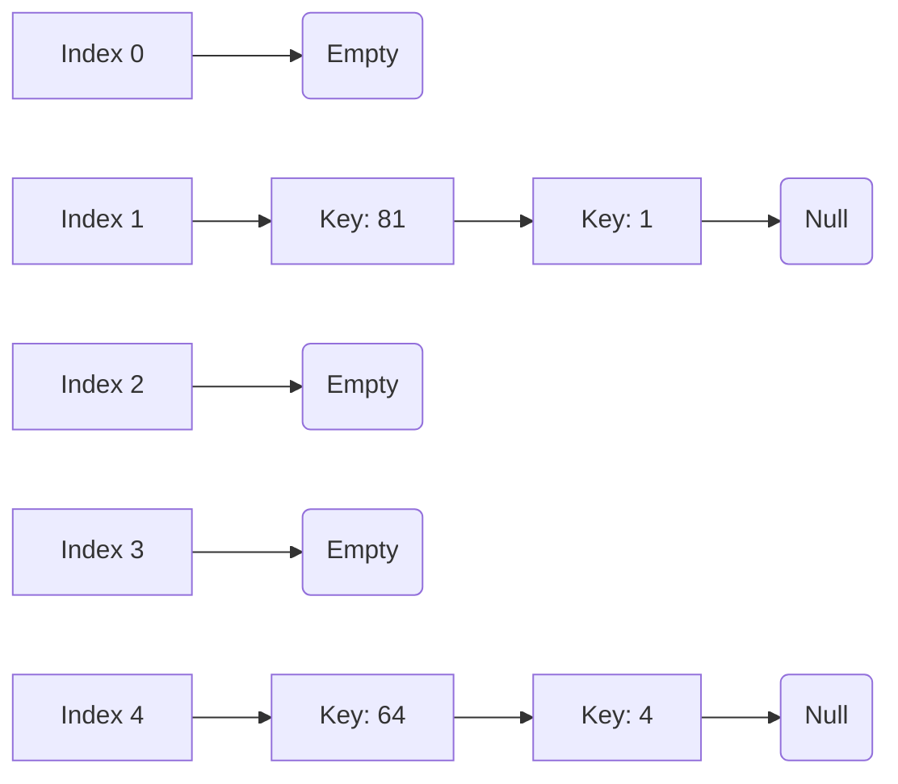

***

## 🧠 1. Introduction
A **Hash Table** (or Hash Map) is a data structure that stores **Key-Value pairs** in an array-like format. Its primary goal is **super fast data retrieval**. 

Think of it like a **coat check at a fancy restaurant**. You hand them your coat (the **data**), they give you a ticket with a specific number (the **hash/index**), and when you come back, they don't have to search through 1,000 coats—they just look at the exact hook number on your ticket and give it back instantly.

*   **The Dream:** Finding, inserting, or deleting an item in $O(1)$ time (instantaneous).
*   **The Reality:** We achieve $O(1)$ *on average*, but things can slow down if we don't design it well.
*   **The Weakness:** Hash tables are terrible if you need your data sorted. Operations like `findMax`, `findMin`, or "Print all in order" take $O(N)$ time. **Don't use a hash table if you care about order.**

---

## 🔑 2. How Does It Work? The Hash Function
You have a **Key** (like a student name or ID). You need to turn that Key into an **Array Index** (a number from $0$ to $TableSize - 1$). 

The machine that does this translation is called the **Hash Function**.

> [!important] Requirements of a Good Hash Function
> 1. **Fast to compute:** Must be $O(1)$.
> 2. **Distributes keys evenly:** Uses all array slots equally to avoid crowding.
> 3. **Consistent:** The same key must always output the same index.

### Example A: Integer Keys
If your keys are integers (e.g., Student ID `4023`), the easiest hash function is the **Modulo operator**:
`Hash(key) = key % TableSize`

### Example B: String Keys (Words/Names)
If your key is a word (like "ali"), you have to turn letters into numbers. You *could* just add up their ASCII values, but if the table is huge, that doesn't spread them out enough.
**A better formula (from your slides):**
Multiply each character by a power of 37!
$$Hash('ali') = (105 \times 37^0) + (108 \times 37^1) + (97 \times 37^2) = 136822$$
Then you just modulo that massive number by your `TableSize`.

---

## 💥 3. The Big Problem: Collisions
A **Collision** happens when the Hash Function maps **two different keys to the exact same index**. 
*Example: If TableSize is 10, both 19 and 29 map to index 9 (`19%10 = 9` and `29%10 = 9`). They can't both park in spot #9!*

To fix this, we have two main strategies:
1. **Separate Chaining (Open Hashing)**
2. **Open Addressing (Closed Hashing)**

---

## ⛓️ Strategy 1: Separate Chaining
**Analogy:** If your assigned parking spot is full, you just stack your car on top of the car already there.

Instead of storing actual data directly in the array slots, the array stores **pointers to Linked Lists**. If multiple keys map to index 5, you just attach them to the linked list at index 5.

### Visualization

### Operations in Separate Chaining
*   **Insert:** Calculate hash, go to that index, and insert the new item at the **FRONT** of the linked list. (Inserting at the front is fast: $O(1)$).
*   **Search:** Go to the index, then walk sequentially through the linked list until you find your key.
*   **Delete:** Go to the index, find the item in the list, and remove it.

### The "Load Factor" ($\lambda$)
> [!info] Formula
> $\lambda = \frac{\text{Total number of items}}{\text{TableSize}}$

*   $\lambda$ represents the **average length of the linked lists**.
*   In Separate Chaining, $\lambda$ can absolutely be **greater than 1** (you can store 100 items in a size 10 table; the lists will just average 10 items long).
*   **Pros:** Very simple to implement, the table *never* fills up, less sensitive to bad hash functions.
*   **Cons:** Wastes space (links take extra memory), and if a list gets too long, searching becomes $O(N)$ worst case.

---

## 🚗 Strategy 2: Open Addressing
**Analogy:** If your assigned parking spot is full, you drive down the lot and look for the next available empty spot. 

In Open Addressing, **NO linked lists are used**. Everything goes directly into the array. 
**Golden Rule:** $\lambda$ (Load factor) should **never exceed 0.5** (the table should never be more than half full), otherwise it gets too slow.

If a collision happens, we try alternative cells using this formula:
$$h_i(x) = (Hash(x) + f(i)) \mod TableSize$$
*(Where $i$ is the number of attempts: 0, 1, 2... and $f(i)$ is our collision resolution strategy/step size).*

There are 3 ways to define $f(i)$:

### A. Linear Probing ($f(i) = i$)
If the spot is taken, just check the very next spot. Step by 1.
*Attempt 0:* spot + 0
*Attempt 1:* spot + 1
*Attempt 2:* spot + 2

**Example from class (TableSize = 10, Hash = key % 10):**
Insert: 89, 18, 49, 58, 69
1. `89 % 10 = 9` (Index 9 is empty. Insert 89).
2. `18 % 10 = 8` (Index 8 is empty. Insert 18).
3. `49 % 10 = 9` (Uh oh, 89 is in spot 9. Try 9+1 = 10 -> `10%10 = 0`. Index 0 is empty. Insert 49).
4. `58 % 10 = 8` (Collision with 18. Try 8+1 = 9. Collision with 89. Try 8+2 = 10 -> `10%10 = 0`. Collision with 49. Try 8+3=11 -> `11%10=1`. Index 1 is empty. Insert 58).

> [!danger] The Problem with Linear Probing: Primary Clustering
> As you saw with inserting `58`, items start forming giant "blocks" or "traffic jams" of occupied cells. Any new key that hashes anywhere near this block will take a dozen attempts to find a spot, making the block even bigger. This ruins our $O(1)$ search time.

### B. Quadratic Probing ($f(i) = i^2$)
To stop traffic jams (Primary Clustering), we jump further away!
*Attempt 0:* spot + $0^2$ (spot + 0)
*Attempt 1:* spot + $1^2$ (spot + 1)
*Attempt 2:* spot + $2^2$ (spot + 4)
*Attempt 3:* spot + $3^2$ (spot + 9)

*   **Pros:** Completely eliminates Primary Clustering!
*   **Cons:** Introduces "Secondary clustering" (if two numbers hash to the exact same initial spot, they will follow the exact same jumping pattern).
*   **Strict Rule:** For this to work and guarantee finding an empty spot, the **TableSize MUST be a prime number**, and the table must be less than half full ($\lambda < 0.5$).

### C. Double Hashing ($f(i) = i \times Hash_2(x)$)
The ultimate solution. If there's a collision, we use a **second, completely different hash function** to determine our jump size!

Formula for the step size: $Hash_2(x) = R - (x \mod R)$
*(Where $R$ is a prime number smaller than TableSize).*

> [!warning] CRITICAL RULE
> $Hash_2(x)$ must **NEVER evaluate to 0**. If it equals 0, your step size is 0. You will endlessly check the exact same filled spot and your program will crash (infinite loop).

**Step-by-Step Example from Slides:**
*   `TableSize` = 10. 
*   `Hash1(x)` = $x \mod 10$
*   `Hash2(x)` = $7 - (x \mod 7)$
*   **Insert 49:**
    *   Attempt 0: `49 % 10 = 9`. (Assume index 9 is already full). **COLLISION!**
    *   Calculate Jump Size: `Hash2(49)` = $7 - (49 \mod 7) = 7 - 0 = \mathbf{7}$.
    *   Attempt 1: Original Hash (9) + (1 * Jump Size (7)) = $16 \mod 10 =$ **Index 6**.
    *   Insert at Index 6.

---

## 📈 4. Re-hashing (Dynamically Resizing)
What happens in Open Addressing if our table gets more than 50% full ($\lambda > 0.5$)? Performance tanks, and insertions might fail entirely in Quadratic Probing.

**The Solution: Re-hashing**
1. Create a brand new table that is roughly **double the size**, specifically picking the next **prime number**.
2. Go through the old table, and re-calculate the hash for every single item using the new TableSize.
3. Insert them into the new table.
*(Note: You cannot just copy-paste the array over. Because the TableSize changed, the modulo math changes! `x % 10` is very different from `x % 23`. Every item needs a new home).*

---

## 📝 5. Cheat Sheet / Quick Summary
*   **Goal:** $O(1)$ Insert, Delete, and Search.
*   **Dependent on:** The Load Factor ($\lambda$), *not* the total number of elements ($N$).
*   **Separate Chaining:** Uses linked lists. Good if you don't know how much data you'll have. Load factor $\lambda$ should be close to 1 (but can be $> 1$).
*   **Open Addressing:** Everything in the array. Load factor $\lambda$ MUST be $\le 0.5$.
    *   *Linear Probing:* Step by 1. Causes Primary Clustering (traffic jams).
    *   *Quadratic Probing:* Step by $1, 4, 9, 16$. Needs a Prime Table Size. Fixes primary clustering.
    *   *Double Hashing:* Step size is determined by a second hash function. Best collision resolution. Second hash function must *never* equal 0.
*   **Re-hashing:** Used to grow (or shrink) the table dynamically when it gets too full. Double the table size to the next prime number.

---
**Not included in Syllabus below this line**
***

## 🗑️ -1. Deletion in Open Addressing (The "Tombstone" Method)

> [!danger] The "Broken Chain" Problem
> Imagine you use Linear Probing. 
> 1. You insert **Car A** at Spot #5.
> 2. You insert **Car B**. It also wants Spot #5, so it collides and parks at **Spot #6**.
> 3. Now, you **delete Car A** and mark Spot #5 as "Empty".
> 4. Later, you search for **Car B**. The hash function checks Spot #5. It sees "Empty". The search immediately stops and incorrectly assumes Car B does not exist!

To fix this, we **cannot** mark a deleted cell as "Empty". Instead, we replace it with a special marker called a **Tombstone** (or a `DELETED` flag).

### How Tombstones Work:
Instead of 2 states (Empty, Taken), your array now has 3 states:
1. **Empty:** Has never held an item.
2. **Taken:** Currently holds an item.
3. **Tombstone (Deleted):** Used to hold an item, but it was deleted.

**How this changes our operations:**
*   **Search:** If you are searching for Car B and hit a Tombstone at Spot #5, the Tombstone tells the search: *"Keep looking! Someone collided here in the past and parked further down."* Search only stops when it hits a true "Empty" spot.
*   **Insert:** If you are inserting a new car and hit a Tombstone, you are allowed to overwrite the Tombstone with the new car. It acts as a valid empty parking spot for new data.

### The Downside of Deletion
If you do a lot of inserts and deletes, your table will become completely filled with Tombstones. Even though you technically have space, the search function will have to step over dozens of Tombstones every time it looks for something, ruining your $O(1)$ speed.

**The Fix:** When the table gets too clogged with Tombstones, you are forced to do a **Re-hash**. You create a new table, and when you move the items over, you simply leave the Tombstones behind.