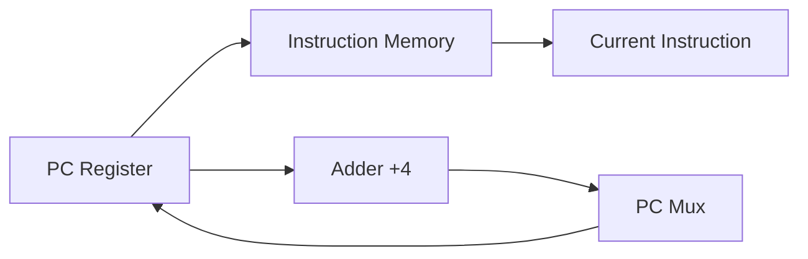

# CSE 4305: Lecture 4 - The Processor (Single Cycle Datapath)

**Tags:** #ComputerArchitecture #RISCV #Datapath #ControlUnit #LectureNotes
**Source:** Lecture Slides 4 (Sabrina Islam)
**Checked:** In Progress

---

## 1. The Big Picture: Performance
Before building the hardware, we need to know what determines performance.
$$ \text{CPU Time} = \text{Instruction Count} \times \text{CPI} \times \text{Clock Cycle Time} $$

*   **Instruction Count:** How many lines of code the program runs (determined by the ISA and Compiler).
*   **CPI (Cycles Per Instruction):** Average clock cycles needed for one instruction.
*   **Clock Cycle Time:** How long one "tick" of the clock takes (hardware speed).

> [!NOTE] The Goal of this Lecture
> We are building the **Implementation** of the processor. This implementation determines the **Clock Cycle Time** and **CPI**. We are building a **Single Cycle Datapath**, meaning every instruction takes exactly **1 Clock Cycle** (CPI = 1).

---

## 2. The RISC-V Subset
We are not building the *entire* RISC-V architecture (that's too complex). We are building a processor that supports just enough to run a basic program.

**The instructions we support:**
1.  **Memory Access:** `ld` (Load Doubleword), `sd` (Store Doubleword).
2.  **Arithmetic/Logic (R-Format):** `add`, `sub`, `and`, `or`.
3.  **Branching:** `beq` (Branch if Equal).

---

## 3. Logic Design Basics (The "Lego Bricks")

To build a CPU, we use two types of logic elements:

### A. Combinational Elements
*   **Definition:** Outputs depend *only* on current inputs. No "memory".
*   **Examples:**
    *   **ALU (Arithmetic Logic Unit):** The calculator. Input: 2+2, Output: 4.
    *   **Multiplexer (Mux):** A railroad switch. It takes multiple inputs and selects **one** based on a control signal.
    *   **AND Gate:** Outputs 1 only if both inputs are 1.

### B. Sequential Elements (State)
*   **Definition:** These store data. Output depends on stored values.
*   **Examples:** Registers, Data Memory, Instruction Memory.
*   **Clocking:** We use **Edge-Triggered Clocking**. Data is only written/updated on the "rising edge" (tick) of the clock. This prevents chaos where reading and writing happen simultaneously.

---

## 4. Building the Datapath (Step-by-Step)

The "Datapath" is the road network data travels on. We build it piece by piece based on what the instructions need.

### Step 1: Instruction Fetch (The beginning of all instructions)
Every instruction needs to be fetched from memory.
1.  **PC (Program Counter):** Holds the address of the current instruction.
2.  **Instruction Memory:** We give it the address (from PC), it gives us the Instruction.
3.  **Adder:** We need to calculate the *next* address. Since instructions are 4 bytes long, we do $PC + 4$.

### Step 2: R-Format Instructions (`add`, `sub`, etc.)
*Format:* `add rd, rs1, rs2`
1.  **Register File:** We need to read two registers (`rs1`, `rs2`).
2.  **ALU:** Performs the math (e.g., `rs1` + `rs2`).
3.  **Write Back:** The result goes *back* into the Register File (into `rd`).

### Step 3: Load/Store Instructions (`ld`, `sd`)
*Format:* `ld x1, offset(x2)`
1.  **Read Register:** Read base address (`x2`).
2.  **Immediate Gen (ImmGen):** The "offset" is inside the instruction bits. It's only 12 bits. We need to make it 64 bits to do math with it. This unit does **Sign Extension** (fills the empty bits with the sign bit).
3.  **ALU:** Adds `x2` + `extended offset` to get the target Memory Address.
4.  **Data Memory:**
    *   **Load:** Read from that address, write result to register `x1`.
    *   **Store:** Write value of `x1` into that address.

### Step 4: Branch Instruction (`beq`)
*Format:* `beq x1, x2, offset`
*Logic:* If `x1 == x2`, jump to `PC + offset`.
1.  **Compare:** Read `x1` and `x2`. Subtract them in the ALU. If result is **Zero**, then they are equal.
2.  **Calculate Target:** Take current `PC` + `offset` (sign extended).
    *   *Note:* The offset is shifted left by 1 bit (hardware optimization for alignment).
3.  **Decision:** A Mux chooses the next PC:
    *   If `Zero == 1` (Equal): Next PC = Target Address.
    *   If `Zero == 0` (Not Equal): Next PC = PC + 4.

---

## 5. The Full Datapath & Control Unit

We combine all the steps above into one big diagram. But wires can't just connect everywhere; we need **Multiplexers (Mux)** to choose paths, and a **Control Unit** to flip the switches.

### The Critical Control Signals (The Switches)
The **Main Control Unit** looks at the **Opcode** (bits 6:0) and sets these lines:

| Signal Name | Effect when **0** | Effect when **1** |
| :--- | :--- | :--- |
| **RegWrite** | Do nothing. | Write data into a Register (used for `add`, `ld`). |
| **ALUSrc** | 2nd ALU input is Register 2. | 2nd ALU input is the **Immediate** (used for `ld`, `sd`). |
| **MemRead** | Do nothing. | Read from Data Memory (used for `ld`). |
| **MemWrite** | Do nothing. | Write to Data Memory (used for `sd`). |
| **MemtoReg** | Result comes from ALU. | Result comes from Memory (used for `ld`). |
| **PCSrc** | Next PC is PC+4. | Next PC is Branch Target (used for `beq`). |

> [!TIP] How PCSrc is calculated
> `PCSrc` isn't just a switch from the controller. It is logic:
> `PCSrc = Branch (from Controller) AND Zero (from ALU)`
> The jump only happens if it is a Branch instruction AND the subtraction result was zero.

### ALU Control (The "Sub-Brain")
The Main Control unit is too busy to manage the details of the ALU. It sends a 2-bit signal called **ALUOp** to the ALU Control unit.

*   **ALUOp = 00:** Load/Store (Force ALU to ADD to calculate address).
*   **ALUOp = 01:** Branch (Force ALU to SUBTRACT to compare).
*   **ALUOp = 10:** R-Type (Look at the instruction's `funct7` and `funct3` fields to decide: ADD, SUB, AND, or OR).

---

## 6. Execution Traces (Visualizing the Flow)

Here is what happens "electrically" for specific instructions.

### Trace 1: `add x22, x23, x15`
1.  **Fetch:** Instruction fetched.
2.  **Registers:** Read `x23` and `x15`.
3.  **Control:** `RegWrite=1`, `ALUSrc=0` (use reg), `ALUOp=10` (look at funct).
4.  **ALU:** Adds values.
5.  **Write Back:** Result goes to `x22` via Mux (`MemtoReg=0`).

### Trace 2: `ld x22, 8(x23)`
1.  **Fetch:** Instruction fetched.
2.  **Registers:** Read `x23`.
3.  **ImmGen:** Turns "8" into 64-bit 8.
4.  **Control:** `ALUSrc=1` (use Imm), `MemRead=1`, `MemtoReg=1`.
5.  **ALU:** Adds `x23 + 8` = Address.
6.  **Memory:** Reads data at Address.
7.  **Write Back:** Data from memory goes to `x22`.

### Trace 3: `beq x22, x23, offset`
1.  **Fetch:** Instruction fetched.
2.  **Registers:** Read `x22` and `x23`.
3.  **ALU:** Subtracts `x22 - x23`. Sets **Zero** flag if result is 0.
4.  **Adder:** Calculates `PC + offset`.
5.  **Control:** `Branch=1`.
6.  **PCSrc:** Logic checks `Branch & Zero`. If true, Mux updates PC to the Adder result.

---

## 7. Limitations of Single Cycle

Why don't we use this in modern computers?
*   **The "Weakest Link" Problem:** The Clock Cycle time must be long enough for the **slowest** instruction to finish.
*   **The Slowest Instruction:** usually `ld` (Load) because it has to go through the whole path: Reg -> ALU -> Data Memory -> Reg.
*   **Inefficiency:** Fast instructions (like `add`) have to wait for the clock cycle to finish, wasting time.

**Solution:** Pipelining (covered in future lectures).