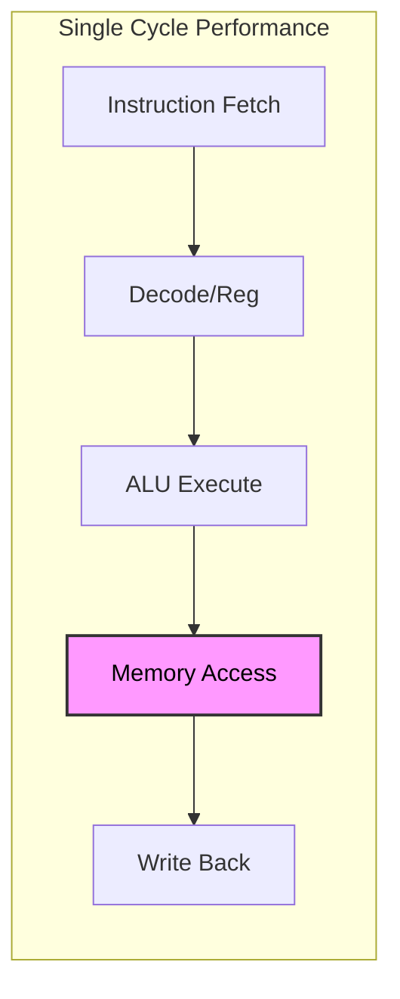

# 🚀 Exam Revision: RISC-V Single Cycle Datapath

**Tags:** #CheatSheet #CSE4305 #RISCV #Architecture
**Summary:** One instruction executes in exactly one clock cycle ($CPI = 1$).

---

## 1. The Golden Formula
$$ \text{CPU Time} = \text{Instruction Count} \times \text{CPI} \times \text{Clock Cycle Time} $$
*   **Instruction Count:** determined by ISA & Compiler.
*   **CPI:** determined by Hardware Implementation (Here, CPI = 1). (Cycle Per Instruction)
*   **Cycle Time:** determined by the critical path (slowest instruction).

---

## 2. The Datapath Components (Hardware)
> [!NOTE] Clocking Methodology
> **Edge-Triggered:** State elements (Registers, Memory) update *only* on the clock edge. Reading/Writing happens in one cycle.

| Component           | Function                               | Inputs/Outputs                                                  |
| :------------------ | :------------------------------------- | :-------------------------------------------------------------- |
| **PC**              | Holds address of current instruction.  | Input: Next Address, Output: Current Address.                   |
| **Instruction Mem** | Stores code.                           | Input: Address, Output: Instruction (32-bit).                   |
| **Register File**   | Fast storage (32 regs).                | **Read:** 2 ports. **Write:** 1 port (needs `RegWrite` signal). |
| **ALU**             | Math/Logic operations.                 | Input: 2 operands. Output: Result + `Zero` flag.                |
| **Data Memory**     | RAM for variables.                     | **Read:** needs `MemRead`. **Write:** needs `MemWrite`.         |
| **ImmGen**          | Sign-extends 12-bit offsets to 64-bit. | Used for `ld`, `sd`, `beq`.                                     |

![[DataPath.png]]

---

## 3. The Control Unit (The "Brain")
The Control Unit takes the **Opcode (7 bits)** and sets the signal lines.

### A. The 7 Critical Control Signals (MEMORIZE THIS)
| Signal | If Asserted (1) | If Deasserted (0) | Used In |
| :--- | :--- | :--- | :--- |
| **RegWrite** | Write data to `rd`. | Do not write to register. | R-Type, Load |
| **ALUSrc** | 2nd ALU input is **Immediate** (ImmGen). | 2nd ALU input is **Register** (`rs2`). | Load, Store |
| **MemRead** | Read from Data Memory. | Do not read. | Load |
| **MemWrite** | Write to Data Memory. | Do not write. | Store |
| **MemtoReg** | Value to Reg comes from **Memory**. | Value to Reg comes from **ALU**. | Load |
| **Branch** | Indicates a branch instruction. | Normal instruction. | `beq` |
| **PCSrc** | **Next PC = Target** (Jump). | **Next PC = PC + 4** (Normal). | `beq` (Logic) |

> [!WARNING] PCSrc Logic
> `PCSrc` is **not** a direct output from the controller. It is derived:
> $$ \text{PCSrc} = \text{Branch (Controller)} \ AND \ \text{Zero (ALU)} $$
> You only jump if it is a Branch Opcode **AND** the subtraction result is Zero.

### B. ALU Control (2-Level Logic)
1.  **Main Control** sends 2 bits (`ALUOp`) to ALU Control.
2.  **ALU Control** looks at `funct7` & `funct3` to generate the specific 4-bit signal.

*   `ALUOp = 00` (Add) $\to$ Used for `ld`/`sd`.
*   `ALUOp = 01` (Sub) $\to$ Used for `beq`.
*   `ALUOp = 10` (R-Type) $\to$ Look at funct fields (Add/Sub/And/Or).

---

## 4. Datapath Visualized (The Flows)

### A. R-Type (`add rd, rs1, rs2`)
*   **Flow:** PC $\to$ Inst Mem $\to$ Reg File $\to$ ALU $\to$ Reg File.
*   **Key Signals:**
    *   `RegWrite = 1` (Save result)
    *   `ALUSrc = 0` (Use 2 registers)
    *   `MemRead/Write = 0` (No memory access)
    *   `MemtoReg = 0` (Data comes from ALU)

### B. Load (`ld rd, offset(rs1)`)
*   **Flow:** PC $\to$ Inst Mem $\to$ Reg File + ImmGen $\to$ ALU (Add) $\to$ Data Mem $\to$ Reg File.
*   **Key Signals:**
    *   `RegWrite = 1` (Save loaded value)
    *   `ALUSrc = 1` (Add register + offset)
    *   `MemRead = 1` (Active)
    *   `MemtoReg = 1` (Data comes from Memory, not ALU)

### C. Store (`sd rs2, offset(rs1)`)
*   **Flow:** PC $\to$ Inst Mem $\to$ Reg File + ImmGen $\to$ ALU (Add) $\to$ Data Mem.
*   **Key Signals:**
    *   `RegWrite = 0` (We don't change registers!)
    *   `MemWrite = 1` (Write to RAM)
    *   `ALUSrc = 1` (Add register + offset)

### D. Branch (`beq rs1, rs2, offset`)
*   **Flow:**
    1.  **Compare:** Reg File $\to$ ALU (Sub) $\to$ Check Zero Flag.
    2.  **Target:** PC + ImmGen (Shifted) $\to$ Adder.
*   **Key Signals:**
    *   `Branch = 1`
    *   `ALUOp = 01` (Force subtract)
    *   `RegWrite = 0`, `MemRead/Write = 0`.

---

## 5. Summary Control Table (The Cheat Sheet)

| Instruction | RegWrite | ALUSrc | MemRead | MemWrite | MemtoReg | Branch | ALUOp |
| :--- | :---: | :---: | :---: | :---: | :---: | :---: | :---: |
| **R-Format** | **1** | 0 | 0 | 0 | 0 | 0 | 10 |
| **ld** (Load) | **1** | **1** | **1** | 0 | **1** | 0 | 00 |
| **sd** (Store) | 0 | **1** | 0 | **1** | X | 0 | 00 |
| **beq** (Branch)| 0 | 0 | 0 | 0 | X | **1** | 01 |

*(Note: 'X' means Don't Care - value doesn't matter because it isn't used)*

---

## 6. Pros & Cons
> [!FAIL] Disadvantage
> The clock cycle is limited by the **longest path** (Load Instruction).
> Fast instructions (`add`) must wait for slow instructions (`ld`) to finish.
> **Solution:** Pipelining (Next Lecture).

*The "Memory Access" stage makes the cycle long.*